# LLM 代理规划的自演进世界模型

> 原文：[Self-Evolving World Models for LLM Agent Planning](http://arxiv.org/abs/2606.30639v1) · arxiv-api · 2026-06-29
> 抓取：2026-07-01T19:17:18+08:00 · 翻译：Haiku · 1616 字

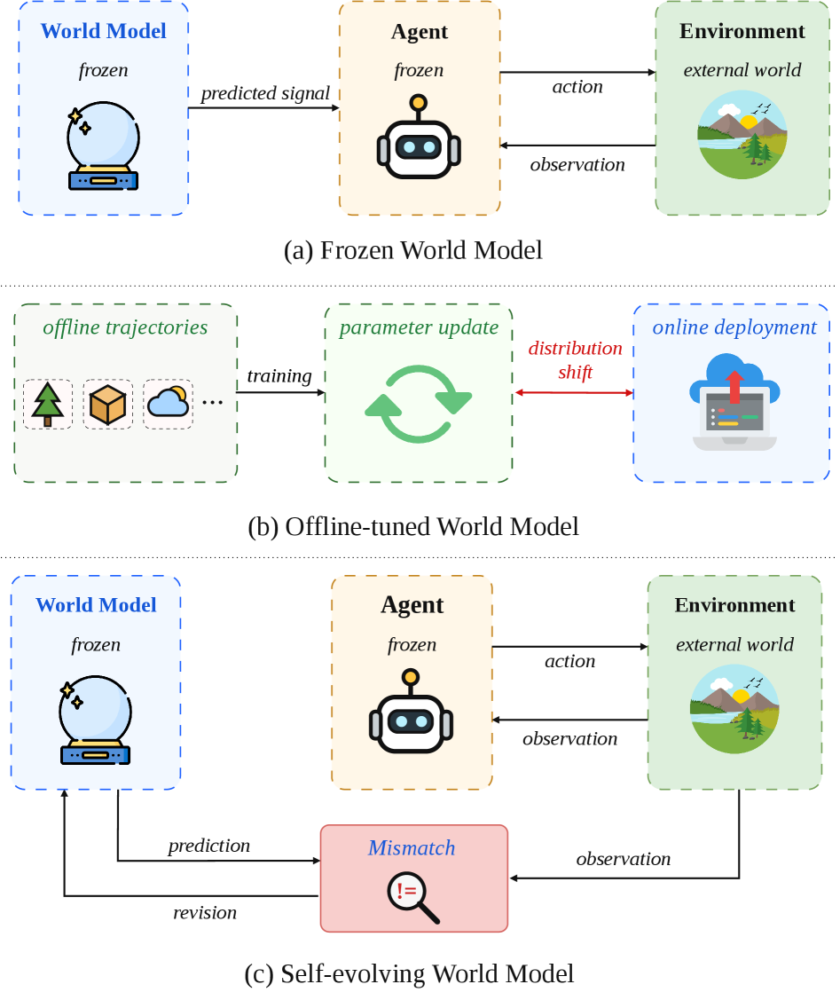

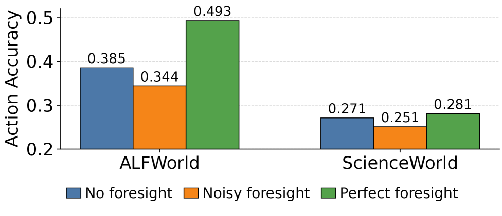

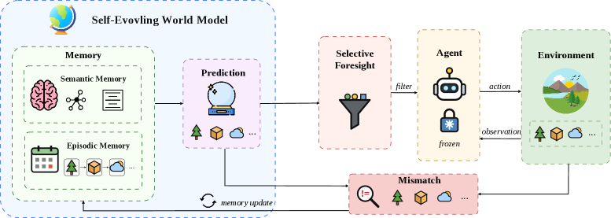

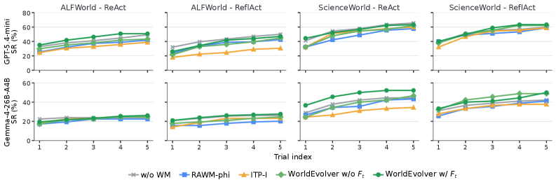

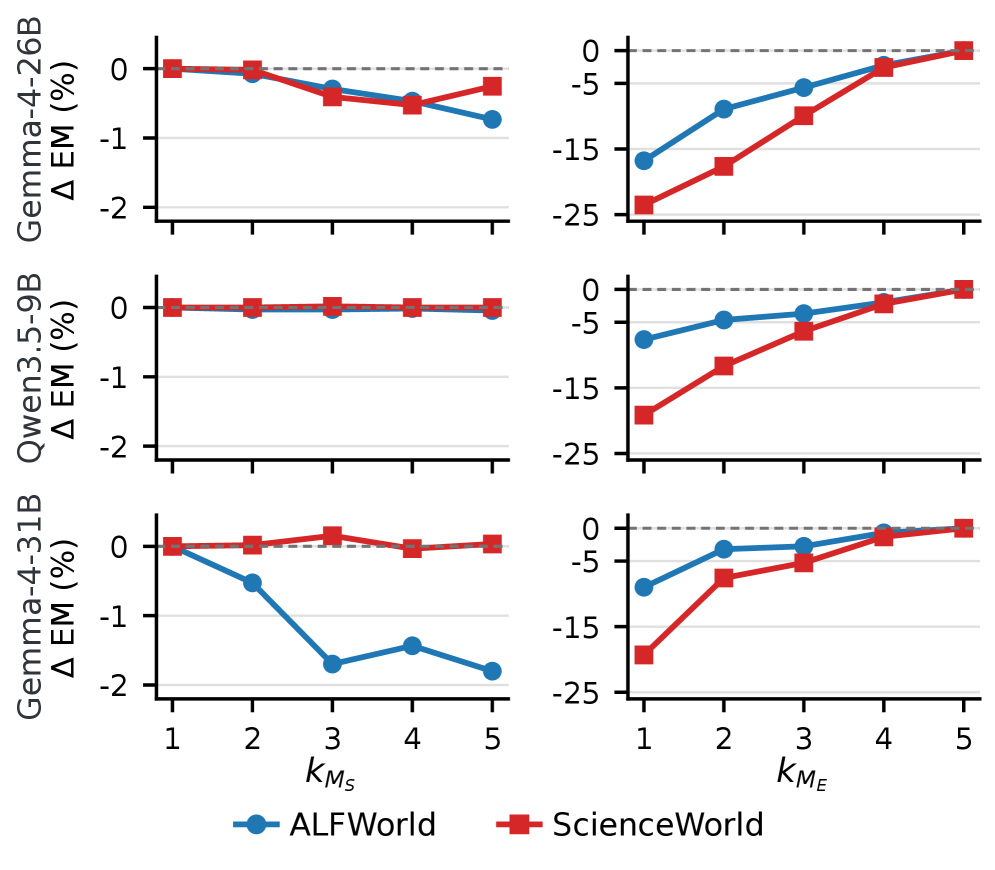

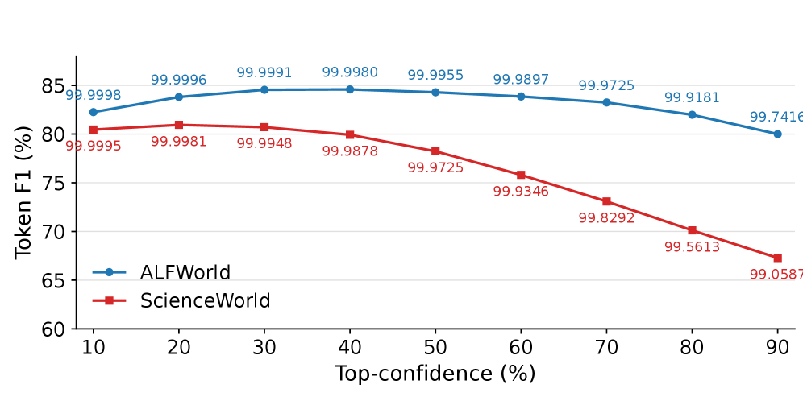

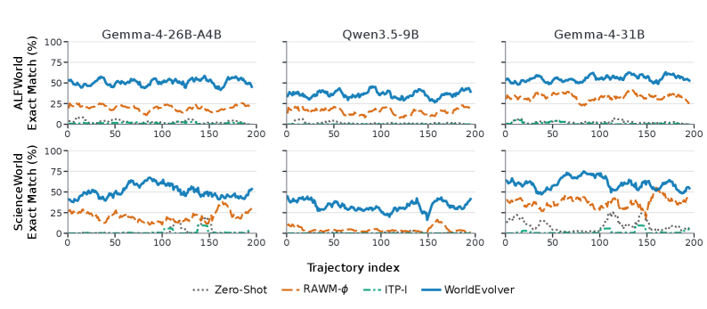

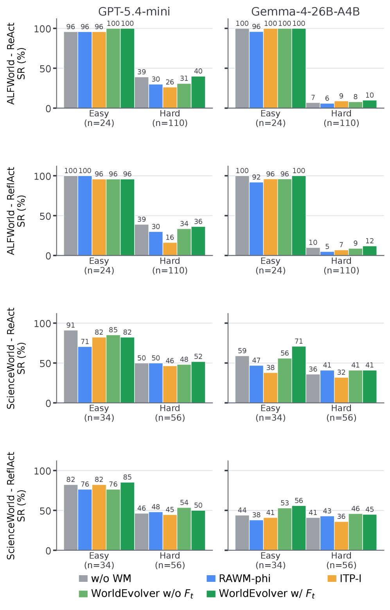

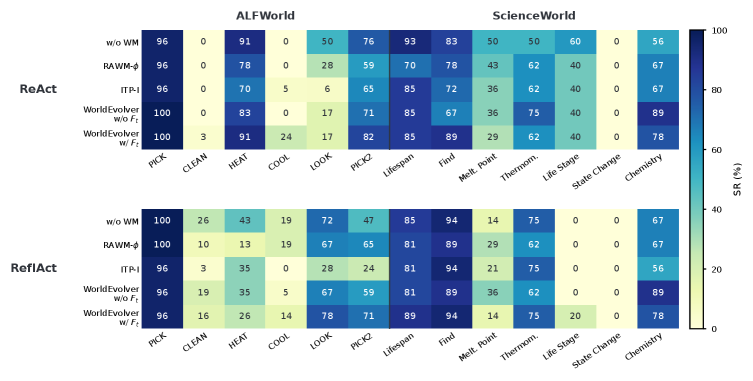

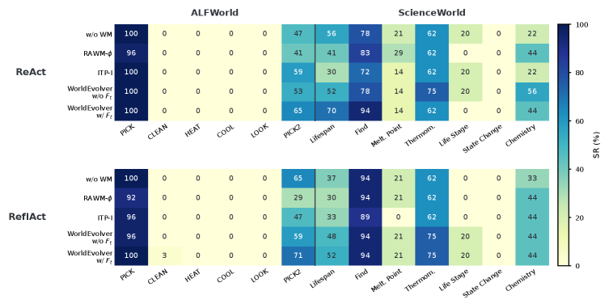

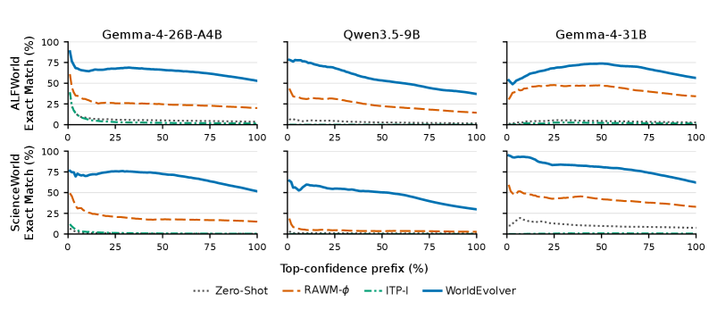

# LLM 代理规划的自演进世界模型

Xuan Zhang1     Wenxuan Zhang2     See-Kiong Ng1     Yang Deng3 
1National University of Singapore 
2Singapore University of Technology and Design    
3Singapore Management University 
xuanzhang@u.nus.edu 

###### 摘要
世界模型 offer a principled way to equip 长水平线 LLM 代理 with *前景*: 动作后果的预测 before execution. However, unreliable 前景 can be ignored, misused, or even degrade 下游决策制定. In this paper, we introduce WorldEvolver, a self-evolving 世界模型 framework that revises its 部署时上下文 while keeping the downstream agent and all 模型参数 冻结. WorldEvolver integrates three modules: (i) 情景记忆, which exploits real 动作 transitions through 基于检索的模拟; (ii) 语义记忆, which extracts persistent 启发式规则 from 预测-观察不匹配; and (iii) 选择性前景, which filters 低置信度预测 before integrating them into agent reasoning context. We evaluate WorldEvolver on ALFWorld and ScienceWorld, measuring 世界模型 预测精度 on Word2World and downstream agent 成功率 on AgentBoard. Extensive 实验 show that WorldEvolver achieves the highest 预测精度 across three backbones and leads other 世界模型 baselines on downstream agent 成功率, demonstrating that 测试时内存修订 enhances both 预测保真度 and 规划性能.

LLM 代理规划的自演进世界模型

Xuan Zhang1     Wenxuan Zhang2     See-Kiong Ng1     Yang Deng3

1National University of Singapore

2Singapore University of Technology and Design    
3Singapore Management University

xuanzhang@u.nus.edu

## 
1 引言

LLM 代理 are typically improved through 记忆: reusing verbal feedback, retrieved experiences, skill libraries, or persistent context across interactions (Shinn 等., 2023; Wang 等., 2024a; Packer 等., 2023). A complementary paradigm is emerging through 世界模型 (Li 等., 2025a; Ding 等., 2025; Maes 等., 2026), where agents improve not only by recalling past 交互 experience, but also by anticipating future outcomes under candidate actions, analogous to learned 环境 models in model-based reinforcement learning (Ha and Schmidhuber, 2018; Hafner 等., 2025). Recent LLM-agent work follows this intuition through next-state prediction for web navigation (Chae 等., 2025), one-step visual web lookahead (Gu 等., 2025), explicit prediction before ReAct-style 动作 (Fu 等., 2025), and task knowledge models for text-game 规划 (Qiao 等., 2024). These works suggest that world-model 前景 can serve as a useful complement to 记忆-based adaptation, particularly for 规划 and decision making in 长水平线 tasks.

Figure 1: Contrast of different 世界模型. 冻结 (a) and offline-tuned (b) 世界模型 supply predictions to the agent without revising from deployment-time 交互; self-evolving (c) 世界模型 accumulate realized transitions and evolve through mismatches between predicted and observed outcomes.

However, the reliability of 前景 is not static. Deployed agents continually face evolving environments and new task instances, creating 分布偏移 analogous to the 模拟到现实的间隙 in robotics (Tobin 等., 2017).
As a result, a 冻结 世界模型 (Figure 1(a)) suffers from such 分布偏移 and can mispredict future transitions. At the same time, absorbing each mismatch through 基于梯度的 参数更新 (Figure 1(b)) is a poor fit for 在线部署: such updates incur high computation costs at LLM scale and can introduce side effects such as over-editing or 灾难性遗忘 (Zheng 等., 2023; Yao 等., 2023b; Hartvigsen 等., 2023).

This makes self-evolution (Qiu 等., 2026; Chu 等., 2026) a fundamental requirement for deployed 世界模型 (Figure 1(c)): they should detect mismatches between predicted and observed outcomes and adapt accordingly.
Meanwhile, the agent-环境 loop already exposes reusable evidence: realized transitions record what actually happened, while 预测-观察不匹配 indicate what the 世界模型 misunderstood. Retaining these signals as explicit context offers an auditable alternative to repeated 参数更新, so later predictions can condition on deployment-time evidence to generate more reliable 前景 without changing model weights.

Even once such evidence is retained, 前景 remains an 动作-conditioning signal: once rendered to the agent, it can change the next 动作. Prior work shows that current agents can ignore, misuse, or even be harmed by world-model simulations (Qian 等., 2026), echoing model-based RL evidence that learned rollouts should be trusted selectively under model error (Janner 等., 2019). Similarly, recent adaptive-lookahead work further suggests that useful imagination depends on when and how far the agent should simulate, rather than on fixed-horizon rollouts (Liu 等., 2026).
The controlled oracle diagnostic in Figure 2 provides supporting evidence under a fixed agent and backbone: noisy 前景 hurts 动作 精度, while oracle 前景 improves it.

Figure 2: Preliminary oracle study with Gemma-4-26B-A4B on the Word2World 评估 set (Li 等., 2025b). The ReAct agent receives no 前景, noisy 前景, or perfect 前景, and generated actions are scored against teacher actions by exact 动作 精度.

These observations motivate WorldEvolver: a standalone self-evolving 世界模型 that continuously revises the 部署时上下文 while the downstream agent and all 模型参数 remain 冻结. The key design choice is to revise external 记忆 content rather than weights: realized transitions are appended as concrete cases, and mismatch-derived rules are accumulated as reusable heuristics, so sparse step-level feedback can be incorporated as prompt-level evidence without online 参数更新 to a large 世界模型 or changes to the downstream agent.

Concretely, our proposed WorldEvolver couples three complementary mechanisms. 情景记忆 serves as the exploitation component that reuses accumulated 动作-转移 experience through 基于检索的模拟, while 语义记忆 acts as the exploration component that turns 预测-观察不匹配 into persistent heuristic knowledge. To mitigate the risk of unreliable 前景, 选择性前景 filters 低置信度预测 before exposing them to the 冻结 agent.
In summary, our contributions are as follows:

• 

We introduce WorldEvolver, a standalone self-evolving 世界模型 for LLM 代理 that revises the deployment-time world-model context while the agent and all 模型参数 remain 冻结 during environmental 交互.

• 

We instantiate this 记忆-centric 前景 framework through three mechanisms: 情景记忆 retrieves realized transitions, 语义记忆 accumulates mismatch-derived rules, and 选择性前景 filters unreliable predictions before they reach the agent.

• 

We benchmark the WorldEvolver framework against RAWM-ϕ\phi and ITP-I on Word2World (Li 等., 2025b), ALFWorld (Shridhar 等., 2021), and ScienceWorld (Wang 等., 2022), evaluating both world-model prediction alignment with future observations and downstream 规划 improvements from the generated 前景.

## 
2 相关工作

世界模型 For LLM 代理. 
World-model 前景 extends the model-based reinforcement learning lineage (Ha and Schmidhuber, 2018; Hafner 等., 2025) to language agents. Existing systems instantiate this idea by using an LLM as both planner and simulator (Hao 等., 2023), training next-state predictors for web navigation (Chae 等., 2025), adding explicit prediction before 动作 (Fu 等., 2025), or learning task-level world knowledge for text-game 规划 (Qiao 等., 2024).
Other work improves 前景 through offline training or joint optimization, such as co-training agents and 世界模型 (Fang 等., 2025), retrieval-augmented 世界模型 learning (Yang 等., 2025), and synthetic-环境 training (Ding 等., 2026). While effective, these approaches typically rely on 参数更新, offline adaptation, or coupled agent-世界模型 training, limiting their flexibility under evolving deployment environments. Closer to our setting, training-free world alignment (Zhou 等., 2025) and online manual construction (Chen 等., 2024) both distill symbolic knowledge and rules from 交互 trajectories without weight updates. A complementary lesson from episodic-control and language-agent 记忆 systems is that accumulated 交互 experience can ground later decisions through retrieved histories (Blundell 等., 2016; Pritzel 等., 2017; Deng 等., 2024; Zheng 等., 2024; Zhong 等., 2024; Zhou 等., 2024; Liu 等., 2025). WorldEvolver applies this idea to world modeling through online 记忆 of executed transitions and mismatch-derived rules.

Self-Evolution. 
Recent work increasingly studies self-evolving agents, where 交互 improves behavior through verbal feedback, skill libraries, distilled experience, or persistent context (Wang 等., 2024a; Packer 等., 2023; Zhao 等., 2024).
A growing line of *fully* autonomous approaches removes human supervision, bootstrapping agents from zero or minimal data via self-play, challenger-solver curricula, or experience synthesis (Huang 等., 2025; Yu 等., 2025; Xia 等., 2025; Qi 等., 2025; Zhang 等., 2025a; Chen 等., 2025; Jung 等., 2025; Wang 等., 2025; Yue 等., 2026), and several works couple this with co-evolving task generators or 环境 simulators that adapt to the agent’s frontier (Guo 等., 2025). Closer to our setting, a few recent efforts begin to evolve a learned
世界模型 alongside the agent, either by retraining it on 环境
rollouts via self-supervised RL (Yu 等., 2026; Ding 等., 2026),
dynamically updating an abstracted state model during
exploration (Kim and Hwang, 2025), or alternating updates between neural and
symbolic components (Zhao 等., 2026). However, most existing methods evolve the 代理策略 or external context, rather than the 世界模型 that supports future prediction. As a result, they do not directly address how predictive models should adapt under changing environments or unreliable 前景.

## 
3 方法论

### 
3.1 Problem Formulation

We formulate each task as a partially observed 交互 process (𝒮,𝒜,𝒪,𝒯)(\mathcal{S},\mathcal{A},\mathcal{O},\mathcal{T}), where 𝒮\mathcal{S} is the 环境 state space, 𝒜\mathcal{A} is the 动作 space, 𝒪\mathcal{O} is the 观察 space, and 𝒯:𝒮×𝒜→𝒮\mathcal{T}:\mathcal{S}\times\mathcal{A}\rightarrow\mathcal{S} is the 转移 function. At time step tt, the agent cannot directly access the hidden 环境 state. Instead, it observes a textual 交互 state:

st=(o1,a1,…,ot−1,at−1,ot),s_{t}=(o_{1},a_{1},\ldots,o_{t-1},a_{t-1},o_{t}),

where oi∈𝒪o_{i}\in\mathcal{O} and ai∈𝒜a_{i}\in\mathcal{A} denote observations and actions respectively. Given the current state sts_{t}, the 代理策略 generates an 动作:

at∼πθ(⋅∣st).a_{t}\sim\pi_{\theta}(\cdot\mid s_{t}).

A 世界模型 predicts future KK-step observations from the current state and a candidate 动作:

(o^t+1,…,o^t+K)∼Wθ(⋅∣st,at).(\hat{o}_{t+1},\ldots,\hat{o}_{t+K})\sim W_{\theta}(\cdot\mid s_{t},a_{t}).

We mainly focus on one-step 前景 because the next predicted 观察 o^t+1\hat{o}_{t+1} from the 世界模型 directly influences the current 动作 decision of the agent, while the realized 观察 ot+1o_{t+1} immediately provides supervision on whether the prediction was reliable.
The goal is therefore to select and improve o^t+1\hat{o}_{t+1} through deployment-time continual evolution, while keeping both the 代理策略 πθ\pi_{\theta} and 世界模型 WθW_{\theta} 冻结.

### 
3.2 WorldEvolver

Figure 3: Overview of WorldEvolver. A 冻结 世界模型 produces 动作-conditioned predictions using 情景记忆 for exploitation through 基于检索的模拟 over previous 动作 transitions and 语义记忆 for exploration through persistent heuristic-rule discovery from 预测-观察不匹配. 选择性前景 filters the prediction before it conditions the 冻结 agent. 

WorldEvolver addresses a central challenge in world-model-based agents: predicted futures can improve decision making, but unreliable 前景 may also mislead the agent. As illustrated in Figure 3, rather than updating 模型参数, WorldEvolver evolves the evidence provided to the 冻结 世界模型 at inference time.

At step tt, the 冻结 世界模型 WθW_{\theta} is augmented with a non-parametric 记忆 store:

Mt=(MEt,MSt),M_{t}=(M_{E}^{t},M_{S}^{t}),

where MEtM_{E}^{t} denotes 情景记忆 and MStM_{S}^{t} denotes 语义记忆. The 世界模型 conditions on the current task context, 观察, candidate 动作, and retrieved 记忆 to generate predictions that are gated by confidence.

Following the classical distinction between episodic and 语义记忆 (Tulving, 1972), 情景记忆 stores concrete 交互 experiences, while 语义记忆 stores 摘要 reusable knowledge. In WorldEvolver, 情景记忆 supports exploitation by recalling relevant transitions, whereas 语义记忆 supports exploration by extracting reusable heuristics from prediction failures.

#### 情景记忆

情景记忆 stores concrete 交互 experiences. The key intuition is that previous transitions can provide useful grounding for predicting what may happen after a similar 动作 in the current 环境 state. Prior work on language-agent 记忆 shows that retrieved trajectories and replayed experiences can improve decision making by grounding new actions in previous interactions rather than relying only on 摘要 instructions.
The 情景记忆 contains realized transitions MEt={(oi,ai,oi+1)}i<tM_{E}^{t}=\{(o_{i},a_{i},o_{i+1})\}_{i<t}. Given a candidate 动作 ata_{t} and retrieval size kMEk_{M_{E}}, it retrieves the kMEk_{M_{E}} most similar past transitions:

ME,kMEt​(at)=TopK(oi,ai,oi+1)∈MEtkME⁡sim⁡(at,ai).M_{E,k_{M_{E}}}^{t}(a_{t})=\operatorname{TopK}^{k_{M_{E}}}_{(o_{i},a_{i},o_{i+1})\in M_{E}^{t}}\operatorname{sim}(a_{t},a_{i}).

and renders each selected item as raw text containing the previous 观察, 动作, and next 观察 in the context. The similarity function sim\operatorname{sim} is defined as the Jaccard score over the open-vocabulary 动作 token set. Since new 记忆 records are appended only after execution, retrieval at step tt only relies on previously accumulated experience, with the 情景记忆 updated as

MEt+1=MEt∪{(ot,at,ot+1)}.M_{E}^{t+1}=M_{E}^{t}\cup\{(o_{t},a_{t},o_{t+1})\}.

#### 语义记忆

The 语义记忆 converts 预测-观察不匹配 into persistent textual heuristics without updating 模型参数. Instead of treating mismatches as failures of the 世界模型 weights, we interpret them as feedback on the contextual 记忆.
Such mismatches provide correction evidence for improving future simulations. We store these corrections as MSt={(ri,ei)}i=1|MSt|M_{S}^{t}=\{(r_{i},e_{i})\}_{i=1}^{|M_{S}^{t}|}, where each rir_{i} is a heuristic rule with evidence score ei∈ℝe_{i}\in\mathbb{R}.

Before applying the textual revision, we first compare predictions and observations in a factorized state space. The key comparison is therefore not whether two observations share the same surface wording, but whether they describe the same objects, relations, and actions. For example, the 观察 “The fridge 1 is open. In the fridge 1, you see an apple 1.” can be factorized into tuples such as (‘fridge 1’, ‘is’, ‘open’) and (‘apple 1’, ‘in’, ‘fridge 1’). Following Hao 等. (2023) and  Shen 等. (2026), we use a mapping function gg to transform raw 观察 text into factorized tuples, producing z^t+1=g​(o^t+1)\hat{z}_{t+1}=g(\hat{o}_{t+1}) and zt+1=g​(ot+1)z_{t+1}=g(o_{t+1}).
The revision process therefore follows the pipeline

(st,at)→Wθo^t+1,(o^t+1,ot+1)→𝑔(z^t+1,zt+1)→LLM criticri,\begin{split}&(s_{t},a_{t})\xrightarrow{W_{\theta}}\hat{o}_{t+1},\\
&(\hat{o}_{t+1},o_{t+1})\xrightarrow{g}(\hat{z}_{t+1},z_{t+1})\xrightarrow{\text{LLM critic}}r_{i},\end{split}

where the final stage produces textual feedback on the contextual 记忆 rather than updating the world 模型参数. When z^t+1≠zt+1\hat{z}_{t+1}\neq z_{t+1}, the mismatch is treated as a failure case, and the LLM critic transforms it into candidate textual rules rir_{i}. Each rule is associated with an evidence score eie_{i}, initialized to 11, which is updated by ±1/|MS|\pm 1/|M_{S}| depending on whether the rule is supported or contradicted by the factorized-tuple comparison on subsequent observations. Only rules with ei>0e_{i}>0 are added in the context. The resulting rule-evidence pairs are collected as Δ​MSt\Delta M_{S}^{t}, and the 语义记忆 is updated incrementally as

MSt+1=MSt∪Δ​MSt.M_{S}^{t+1}=M_{S}^{t}\cup\Delta M_{S}^{t}.

Following batch semantic-gradient updates for language-based agent systems (Wang 等., 2024b), 语义记忆 can accumulate a mini-batch of kMSk_{M_{S}} mismatch cases before revising the rendered rule set. In this variant, the LLM critic produces Δ​MSt\Delta M_{S}^{t} as the aggregated rule-evidence updates over the mini-batch of mismatches.
Thus 语义记忆 is the exploration branch: it turns failures into inspectable prompt-level knowledge without gradient updates to WθW_{\theta}.

#### 选择性前景

Although 记忆 can improve prediction quality, unreliable 前景 may still mislead the downstream agent. As shown in Figure 2, noisy predictions can degrade decision making more than providing no 前景 at all (Janner 等., 2019; Qian 等., 2026). This raises a practical question: should the agent always trust the predicted future, or should unreliable predictions be filtered before they influence 动作 selection?

选择性前景 addresses this problem by exposing only sufficiently confident predictions to the 代理策略. Suppose the 世界模型 generates a predicted 观察 sequence tokenized as y1:ny_{1:n}.
When token probabilities are available from the backend model, we first compute the average token-level log probability from language models:

ℓt=1n​∑i=1nlog⁡pθ​(yi∣y<i,st,at,Mt),\ell_{t}=\frac{1}{n}\sum\nolimits_{i=1}^{n}\log p_{\theta}(y_{i}\mid y_{<i},s_{t},a_{t},M_{t}),

and convert it into a normalized confidence score: qt=exp⁡(ℓt)∈(0,1]q_{t}=\exp(\ell_{t})\in(0,1].
This score corresponds to the geometric mean token probability of the output. The final agent-visible 前景 is defined as

Ft={o^t+1,qt≥τ,∅,qt<τ,F_{t}=\begin{cases}\hat{o}_{t+1},&q_{t}\geq\tau,\\
\varnothing,&q_{t}<\tau,\end{cases}

where τ\tau denotes the confidence threshold.

选择性前景 therefore acts as an abstention mechanism based on the confidence, reducing the risk that unreliable simulations negatively influence downstream decision making.

### 
3.3 Agent 规划 with 世界模型

Algorithm 1 WorldEvolver Update
 
Input: agent-visible state sts_{t}, 观察 oto_{t}, policy πθ\pi_{\theta}, 世界模型 WθW_{\theta},
memories MEt,MStM_{E}^{t},M_{S}^{t}, retrieval size kMEk_{M_{E}}, semantic batch size kMSk_{M_{S}}, threshold τ\tau.
Output: executed 动作 ata_{t} and updated memories MEt+1,MSt+1M_{E}^{t+1},M_{S}^{t+1}.

// Draft and predict

1:

Sample draft 动作 at(0)∼πθ(⋅∣st)a_{t}^{(0)}\sim\pi_{\theta}(\cdot\mid s_{t}).

2:

Retrieve ME,kMEt​(at(0))M_{E,k_{M_{E}}}^{t}(a_{t}^{(0)}) from MEtM_{E}^{t} by 动作-token Jaccard score.

3:

Query WθW_{\theta} on (st,at(0),ME,kMEt​(at(0)),MSt)(s_{t},a_{t}^{(0)},M_{E,k_{M_{E}}}^{t}(a_{t}^{(0)}),M_{S}^{t}) to obtain (o^t+1,qt)(\hat{o}_{t+1},q_{t}).

// 选择性前景

4:

Set Ft←o^t+1F_{t}\leftarrow\hat{o}_{t+1} if qt≥τq_{t}\geq\tau; otherwise Ft←∅F_{t}\leftarrow\varnothing.

5:

Sample at(1)∼πθ(⋅∣st,Ft)a_{t}^{(1)}\sim\pi_{\theta}(\cdot\mid s_{t},F_{t}).

6:

Set executed 动作 at←at(1)a_{t}\leftarrow a_{t}^{(1)}.

// Align prediction with executed 动作

7:

If at≠at(0)a_{t}\neq a_{t}^{(0)}, obtain new o^t+1\hat{o}_{t+1} by querying WθW_{\theta} on (st,at,ME,kMEt​(at),MSt)(s_{t},a_{t},M_{E,k_{M_{E}}}^{t}(a_{t}),M_{S}^{t}).

// Execute and update 记忆

8:

Execute ata_{t} in the 环境 and observe ot+1o_{t+1}.

9:

Set MEt+1←MEt∪{(ot,at,ot+1)}M_{E}^{t+1}\leftarrow M_{E}^{t}\cup\{(o_{t},a_{t},o_{t+1})\}.

10:

Compute or accumulate Δ​MSt\Delta M_{S}^{t} of size kMSk_{M_{S}} from (o^t+1,ot+1)(\hat{o}_{t+1},o_{t+1}) and update MSt+1M_{S}^{t+1}.

11:

Return at,MEt+1,MSt+1a_{t},M_{E}^{t+1},M_{S}^{t+1}.

Algorithm 3.3 shows one closed-loop 规划 step. The agent (1) samples a draft 动作 at(0)a_{t}^{(0)} from the 冻结 policy, (2) retrieves kMEk_{M_{E}} episodic transitions for this 动作, and (3) asks the 冻结 世界模型 to predict the consequence of at(0)a_{t}^{(0)} under the current 记忆 context. 选择性前景 then (4) converts the prediction into an agent-visible signal: the predicted 观察 is passed to the policy only when its confidence qtq_{t} exceeds the threshold τ\tau; otherwise no 前景 for the policy. The 代理策略 subsequently (5-6) samples the executed 动作 at=at(1)a_{t}=a_{t}^{(1)} conditioned on (st,Ft)(s_{t},F_{t}).

Because the final 动作 may differ from the draft 动作 used for the initial prediction, WorldEvolver aligns the learning signal with the 动作 actually executed in the 环境. When at≠at(0)a_{t}\neq a_{t}^{(0)}, the 世界模型 (7) is queried once more with ata_{t} to obtain o^t+1\hat{o}_{t+1}.
This second query ensures that 语义记忆 is updated from the mismatch between the prediction for the executed 动作 and the realized 观察. After (8) executing ata_{t}, WorldEvolver (9) appends the realized 转移 (ot,at,ot+1)(o_{t},a_{t},o_{t+1}) to 情景记忆. It then compares the executed-动作 prediction o^t+1\hat{o}_{t+1} with the realized 观察 ot+1o_{t+1}; if they differ after factorization, the LLM critic (10) produces rule updates Δ​MSt\Delta M_{S}^{t}. Finally, the algorithm (11) returns the 动作 with non-parametric 记忆.

Setting
ALFWorld
ScienceWorld

Exact Match
Token F1
Cosine Similarity
Exact Match
Token F1
Cosine Similarity

Gemma-4-26B-A4B

Zero-Shot
3.60
35.48
67.91
0.41
16.42
52.45

RAWM-ϕ\phi Yang 等. (2025)

20.06
48.13
71.30
14.93
27.31
56.50

ITP-I Liu 等. (2026)

1.46
32.48
66.10
0.39
11.50
47.69

WorldEvolver (w/o MEM_{E})
7.53
38.08
69.06
2.71
19.29
55.04

WorldEvolver (w/o MSM_{S})
47.16
72.61
78.88
34.65
46.93
66.51

WorldEvolver
52.88
76.75
80.13
51.55
62.43
73.85

Qwen3.5-9B

Zero-Shot
1.58
34.06
66.39
0.59
12.72
49.27

RAWM-ϕ\phi Yang 等. (2025)

14.41
38.63
66.31
2.76
16.53
49.76

ITP-I Liu 等. (2026)

0.00
11.22
52.88
0.00
6.68
41.94

WorldEvolver (w/o MEM_{E})
2.04
33.80
65.81
0.90
13.98
50.40

WorldEvolver (w/o MSM_{S})
34.86
61.56
74.34
28.92
44.84
65.08

WorldEvolver
37.04
62.38
74.64
29.82
44.88
65.15

Gemma-4-31B

Zero-Shot
2.71
38.42
69.90
7.58
25.28
58.55

RAWM-ϕ\phi Yang 等. (2025)

34.33
57.49
72.66
32.84
42.38
64.84

ITP-I Liu 等. (2026)

1.36
33.61
67.64
0.56
11.91
49.63

WorldEvolver (w/o MEM_{E})
6.73
41.30
71.72
13.34
30.90
61.32

WorldEvolver (w/o MSM_{S})
56.27
80.02
81.21
56.74
66.50
76.00

WorldEvolver
56.41
80.87
81.39
62.03
71.60
78.42

Table 1: 世界模型 预测精度 on Word2World; higher is better for all metrics. w/o MEM_{E} removes 情景记忆, while w/o MSM_{S} removes 语义记忆. All memories MtM_{t} are initialized empty and updated online during 交互. Unless otherwise specified, WorldEvolver here uses kME=5k_{M_{E}}{=}5 and kMS=1k_{M_{S}}{=}1.

## 
4 实验

We evaluate WorldEvolver along two complementary axes. First, 世界模型 Prediction (Section 4.2) measures how accurately the model predicts future observations relative to real 环境 transitions. Second, Agent 规划 (Section 4.3) evaluates whether these 世界模型 improve closed-loop task performance for agents. Finally, Section 4.4 discusses the effects of 记忆 hyperparameters and online continual learning, with additional analyses provided in Appendix C.

Agent
Setting
ALFWorld
ScienceWorld

Gemma-4-26B-A4B
GPT-5.4-mini
Gemma-4-26B-A4B
GPT-5.4-mini

ReAct
w/o 世界模型
23.88
49.25
44.44
65.56

RAWM-ϕ\phi Yang 等. (2025)

22.39
41.79
43.33
57.78

ITP-I Liu 等. (2026)

25.37
38.81
34.44
60.00

WorldEvolver w/o FtF_{t}

24.63
43.28
46.67
62.22

WorldEvolver w/ FtF_{t}

26.12
50.75
52.22
63.33

ReflAct
w/o 世界模型
26.12
50.00
42.22
60.00

RAWM-ϕ\phi Yang 等. (2025)

20.15
42.54
41.11
58.89

ITP-I Liu 等. (2026)

23.13
30.60
37.78
58.89

WorldEvolver w/o FtF_{t}

24.63
44.78
48.89
62.22

WorldEvolver w/ FtF_{t}

27.61
47.01
50.00
63.33

Table 2: Agent 规划 成功率; higher is better. w/ and w/o FtF_{t} denote with and without 选择性前景. Underlines denote the best overall setting, and bold denotes the best setting among world-model-based methods.

### 
4.1 Setups

This subsection summarizes the experimental setup, and additional details are provided in Appendix A.

#### Datasets

We conduct evaluations on both 世界模型 prediction and agent 规划. To evaluate the alignment between prediction and groundtruth, we adopt the Word2World Benchmark (Li 等., 2025b), which provides 转移 datasets for ALFWorld (Shridhar 等., 2021) and ScienceWorld (Wang 等., 2022). The test split contains 195 trajectories for each 环境.In agent 规划, we use AgentBoard (Ma 等., 2024), with 134 ALFWorld tasks and 90 ScienceWorld tasks. Each configuration runs L=5L{=}5 trials per task, with a maximum of 30 steps per trial.

#### Baselines

We define each comparison by the 前景 provided by the 世界模型 while keeping both the agent and backbone model fixed. We consider the following baselines: Zero-Shot, RAWM-ϕ\phi (Yang 等., 2025), and ITP-I (Liu 等., 2026).

#### Agents

We apply two agent types with distinct 规划 styles to test whether the 世界模型 generalizes across reasoning paradigms: ReAct (Yao 等., 2023a) and ReflAct (Kim 等., 2025).

#### 评估 Metrics

Prediction metrics measure whether the 世界模型 matches the next 观察; 规划 metrics measure whether the exposed signal helps the agent complete tasks.

• 

世界模型 prediction: (1) Exact Match uses normalized string matching between predicted and reference observations. (2) Token F1 measures lexical overlap after tokenization, micro-averaged across all examples. (3) Cosine Similarity measures semantic similarity using Qwen3-Embedding-8B (Zhang 等., 2025b) embeddings in the same retrieval space.

• 

Agent 规划:
We report 成功率, defined as whether the agent completes the task within the allowed 交互 budget, and aggregate results using best-of-LL across trials.

#### 实现 Details

世界模型 prediction uses Qwen3.5-9B (Qwen Team, 2026), Gemma-4-26B-A4B, and Gemma-4-31B (Google DeepMind, 2026). Agent 规划 评估 uses Gemma-4-26B-A4B and GPT-5.4-mini (OpenAI, 2026), with the agent and 世界模型 sharing the same model. Additional 实现 details and prompts are shown in Appendix B and D.

### 
4.2 实验 on 世界模型 Prediction

Table 1 evaluates next-观察 prediction: (1) Among the baselines, RAWM-ϕ\phi is strongest across Gemma-4-26B, Qwen3.5-9B, and Gemma-4-31B, showing that retrieval from collected trajectories provides useful 转移 evidence for next-观察 prediction. By contrast, ITP-I consistently underperforms Zero-Shot, due to over-generation of imagined future details. (2) The 记忆 ablations of WorldEvolver show complementary roles: 语义记忆 alone gives modest gains over Zero-Shot, whereas the 情景记忆 variant provides substantially larger improvements and outperforms RAWM-ϕ\phi, even though RAWM-ϕ\phi retrieves from the full deployment trajectory set in advance while 情景记忆 accumulates strictly online. This gap suggests that retrieval quality depends on the retrieval key. RAWM-ϕ\phi retrieves from full state-动作 text, where long and repetitive state descriptions can dilute the 动作 signal, whereas 情景记忆 retrieval more directly matches the target 转移 being simulated. The three metrics yield consistent rankings across backbones and environments, capturing correlated aspects of prediction quality.

Overall, accurate 世界模型 prediction benefits most from combining episodic retrieval with semantic rules. The full WorldEvolver achieves the highest completion rates across both environments and all three backbones. Gains over 情景记忆 alone are particularly pronounced on ScienceWorld for the Gemma models, while Qwen3.5-9B shows smaller but consistent improvements from integrating 语义记忆.

Figure 4: Cumulative best-of-LL Agent 规划 成功率 on ALFWorld and ScienceWorld.

Figure 5: Relative gains from 记忆 hyperparameters for 世界模型 prediction, reported as Δ​EM\Delta\text{EM}. kMSk_{M_{S}} varies semantic-记忆 batch size relative to 11, while kMEk_{M_{E}} varies episodic-记忆 retrieval size relative to 55.

### 
4.3 实验 on Agent 规划

Table 2 evaluates agent 规划 by 成功率: (1) Compared with world-model prediction results in Section 4.2, improving 规划 success is substantially more challenging. RAWM-ϕ\phi and ITP-I often underperform the no-world-model 基线, further confirming that misaligned 前景 can degrade 动作 selection. (2) WorldEvolver is the strongest world-model 方法 across all eight settings; 选择性前景 further improves or ties the no-前景 variant in every setting. Relative to RAWM-ϕ\phi, WorldEvolver w/o FtF_{t} improves average 成功率 by 3.67 points, showing the advantage of continual episodic retrieval and mismatch-derived heuristic rule generation over static offline retrieval. (3) Improvements over the no-world-model 基线 span both agent types and both model backbones. WorldEvolver w/o FtF_{t} exceeds the no-world-model 基线 in four settings: Gemma-4-26B-A4B with ReAct on ALFWorld (23.88 to 24.63), Gemma-4-26B-A4B on ScienceWorld for both ReAct and ReflAct (44.44 to 46.67; 42.22 to 48.89), and GPT-5.4-mini with ReflAct on ScienceWorld (60.00 to 62.22).

WorldEvolver w/ FtF_{t} beats the no-world-model 基线 across all four Gemma-4-26B-A4B cells, averaging +2.24+2.24 成功率 points on ALFWorld and +3.33+3.33 on ScienceWorld over the no-前景 variant; even ReflAct on ALFWorld lifts WorldEvolver from 24.6324.63 to 27.6127.61, above the 26.1226.12 基线. GPT-5.4-mini gains are more mixed: WorldEvolver w/ FtF_{t} tops the no-world-model 基线 in only two of four cells, winning by +1.50+1.50 on ReAct/ALFWorld and +3.33+3.33 on ReflAct/ScienceWorld but losing by −2.99-2.99 on ReflAct/ALFWorld and −2.23-2.23 on ReAct/ScienceWorld. Confidence-gated abstention is therefore more beneficial for the weaker backbone, where the agent leaves more room for useful 世界模型 guidance.

### 
4.4 讨论

#### 记忆 Hyperparameters

Figure 5 evaluates 记忆 hyperparameters on the same setting as Table 1. Episodic retrieval is the dominant factor: increasing kMEk_{M_{E}} from 1 to 5 improves Exact Match by 16.8/23.5 points on ALFWorld and ScienceWorld for Gemma-4-26B-A4B, 7.6/19.2 for Qwen3.5-9B, and 9.0/19.3 for Gemma-4-31B. Semantic batch size is much less sensitive: most kMSk_{M_{S}} choices differ by within two points, except Gemma-4-31B on ALFWorld. We therefore use kME=5k_{M_{E}}=5 and kMS=1k_{M_{S}}=1 in Section 4.2, combining the strongest episodic retrieval with a semantic update size that is competitive across backbones and environments.

#### Online Continual Learning

Figure 4 analyzes cumulative best-of-LL 成功率 from trial L=1L{=}1 to L=5L{=}5. The slope of each curve reflects the benefit of additional successful attempts beyond the first trial. This analysis is particularly relevant for WorldEvolver, since 情景记忆 MEM_{E} and 语义记忆 MSM_{S} accumulate across trials and tasks within the same 环境, allowing later agent replanning to exploit refined world-model 前景. The clearest separation appears on ScienceWorld with Gemma-4-26B-A4B, where WorldEvolver variants increasingly outperforms RAWM-ϕ\phi and ITP-I as the trial index grows, demonstrating that deployment-time 记忆 is most effective when agents can iteratively replan. Gains are smaller for GPT-5.4-mini because its stronger 规划 ability leaves less room for improvement from 世界模型 前景.

## 
5 结论

We presented WorldEvolver, a training-free framework for self-evolving 世界模型 in LLM 代理 规划. Rather than updating 模型参数, WorldEvolver revises 世界模型 context at test time through 情景记忆, 语义记忆, and 选择性前景. 实验 on ALFWorld and ScienceWorld show that these mechanisms improve both 世界模型 fidelity and downstream 规划性能. WorldEvolver achieves the strongest 预测精度 on Word2World across three backbones and improves downstream agent success rates, suggesting that reliable 前景 depends on how environmental signals are processed and presented to the agent, motivating future work on agentic world modeling.

## 局限性

#### 评估 Scope

To simplify 评估 and isolate the effects of deployment-time world-model revision from downstream agent behavior, we conduct 实验 in two controlled 长水平线 text environments, ALFWorld and ScienceWorld. This setting allows us to focus specifically on world-model 前景 and online adaptation, but does not cover broader domains such as web navigation, code generation, robotics, or multimodal 交互. Extending WorldEvolver to these settings is a natural direction for future work.

#### Confidence Estimation

Our 前景 filtering mechanism relies on prediction confidence signals derived from token-level probabilities, which may not be available in some closed-model APIs. In such settings, alternative confidence estimators, such as self-consistency or learned calibration models, would be required. In addition, the current dynamic filtering strategy assumes that prediction confidence correlates with 预测精度, as supported by Figure 11, but this relationship can vary across environments and backbone models. We leave more robust confidence estimation and adaptive filtering mechanisms to future work.

## 伦理考量

ALFWorld (Shridhar 等., 2021), ScienceWorld (Wang 等., 2022), and the Word2World benchmark (Li 等., 2025b) are publicly available for research use. AI assistance are used as auxiliary support for coding and paper writing; all research decisions and claims are the authors’ own.

## 参考文献

C. Blundell, B. Uria, A. Pritzel, Y. Li, A. Ruderman, J. Z. Leibo, J. Rae, D. Wierstra, and D. Hassabis (2016)
Model-free episodic control.

arXiv preprint arXiv:1606.04460.

External Links: Link

Cited by: §2.

H. Chae, N. Kim, K. T. Ong, M. Gwak, G. Song, J. Kim, S. Kim, D. Lee, and J. Yeo (2025)
Web agents with 世界模型: learning and leveraging 环境 dynamics in web navigation.

In The Thirteenth International Conference on Learning Representations (ICLR),

External Links: Link

Cited by: §1,
§2.

M. Chen, Y. Li, Y. Yang, S. Yu, B. Lin, and X. He (2024)
AutoManual: constructing instruction manuals by LLM 代理 via interactive environmental learning.

In Advances in Neural Information Processing Systems (NeurIPS),

External Links: Link

Cited by: §2.

Z. Chen, Z. Zhao, K. Zhang, B. Liu, Q. Qi, Y. Wu, T. Kalluri, S. Cao, Y. Xiong, H. Tong, H. Yao, H. Li, J. Zhu, X. Li, D. Song, B. Li, J. Weston, and D. Huynh (2025)
Scaling agent learning via experience synthesis.

arXiv preprint arXiv:2511.03773.

Cited by: §2.

M. Chu, X. B. Zhang, K. Q. Lin, L. Kong, J. Zhang, T. Tu, W. Ma, Z. Huang, S. Yang, W. Huang, Y. Jin, Z. Rao, J. Ye, X. Lin, X. Zhang, Q. Hu, S. Yang, L. Shen, W. Chow, Y. Dong, F. Wu, Q. Long, B. Xia, S. Yu, M. Zhu, W. Zhang, J. Huang, H. Gui, H. Che, L. Chen, Q. Chen, W. Zhang, W. Wang, X. Qi, Y. Deng, Y. Li, M. Z. Shou, Z. Cheng, S. Ng, Z. Liu, P. Torr, and J. Jia (2026)
Agentic world modeling: foundations, capabilities, laws, and beyond.

arXiv preprint arXiv:2604.22748.

External Links: Link

Cited by: §1.

Y. Deng, X. Zhang, W. Zhang, Y. Yuan, S. K. Ng, and T. Chua (2024)
On the Multi-turn instruction following for conversational web agents.

In Proceedings of the 62nd Annual Meeting of the Association for Computational Linguistics (Volume 1: Long Papers),

 pp. 8795–8812.

External Links: Document,
Link

Cited by: §2.

H. Ding, P. Liu, J. Wang, Z. Ji, M. Cao, R. Zhang, L. Ai, E. Yang, T. Shi, and L. Yu (2026)
DynaWeb: model-based reinforcement learning of web agents.

arXiv preprint arXiv:2601.22149.

External Links: Link

Cited by: §2,
§2.

J. Ding, Y. Zhang, Y. Shang, Y. Zhang, Z. Zong, J. Feng, Y. Yuan, H. Su, N. Li, N. Sukiennik, F. Xu, and Y. Li (2025)
Understanding world or predicting future? a comprehensive survey of 世界模型.

ACM Computing Surveys 58 (3), pp. 1–38.

External Links: Document,
Link

Cited by: §1.

T. Fang, H. Zhang, Z. Zhang, K. Ma, W. Yu, H. Mi, and D. Yu (2025)
WebEvolver: enhancing web agent self-improvement with coevolving 世界模型.

In Proceedings of the 2025 Conference on Empirical Methods in Natural Language Processing (EMNLP),

External Links: Link

Cited by: §2.

D. Fu, J. Huang, S. Lu, G. Dong, Y. Wang, K. He, and W. Xu (2025)
PreAct: prediction enhances agent’s 规划 ability.

In Proceedings of the 31st International Conference on Computational Linguistics (COLING),

External Links: Link

Cited by: §1,
§2.

Google DeepMind (2026)
Gemma 4.

External Links: Link

Cited by: §4.1.

Y. Gu, K. Zhang, Y. Ning, B. Zheng, B. Gou, T. Xue, C. Chang, S. Srivastava, Y. Xie, P. Qi, H. Sun, and Y. Su (2025)
Is your LLM secretly a 世界模型 of the internet? model-based 规划 for web agents.

arXiv preprint arXiv:2411.06559.

External Links: Link

Cited by: §1.

J. Guo, L. Yang, P. Chen, Q. Xiao, Y. Wang, X. Juan, J. Qiu, K. Shen, and M. Wang (2025)
GenEnv: difficulty-aligned co-evolution between LLM 代理 and 环境 simulators.

arXiv preprint arXiv:2512.19682.

Cited by: §2.

D. Ha and J. Schmidhuber (2018)
世界模型.

arXiv preprint arXiv:1803.10122.

External Links: Link

Cited by: §1,
§2.

D. Hafner, J. Pasukonis, J. Ba, and T. Lillicrap (2025)
Mastering diverse control tasks through 世界模型.

Nature 640, pp. 647–653.

Note: Preprint at arXiv:2301.04104

External Links: Document,
Link

Cited by: §1,
§2.

S. Hao, Y. Gu, H. Ma, J. J. Hong, Z. Wang, D. Z. Wang, and Z. Hu (2023)
Reasoning with language model is 规划 with 世界模型.

In Proceedings of the 2023 Conference on Empirical Methods in Natural Language Processing (EMNLP),

 pp. 8154–8173.

External Links: Link

Cited by: §2,
§3.2.

T. Hartvigsen, S. Sankaranarayanan, H. Palangi, Y. Kim, and M. Ghassemi (2023)
Aging with GRACE: lifelong model editing with discrete key-value adaptors.

In Advances in Neural Information Processing Systems (NeurIPS),

External Links: Link

Cited by: §1.

C. Huang, W. Yu, X. Wang, H. Zhang, Z. Li, R. Li, J. Huang, H. Mi, and D. Yu (2025)
R-Zero: self-evolving reasoning LLM from zero data.

arXiv preprint arXiv:2508.05004.

Cited by: §2.

M. Janner, J. Fu, M. Zhang, and S. Levine (2019)
When to trust your model: model-based policy optimization.

In Advances in Neural Information Processing Systems (NeurIPS),

Cited by: §1,
§3.2.

Y. Jung, T. Padhi, S. Shaham, D. Khullar, J. Jeong, N. Mehrabi, and E. Yang (2025)
Co-evolving agents: learning from failures as hard negatives.

arXiv preprint arXiv:2511.22254.

Cited by: §2.

J. Kim, S. Rhee, M. Kim, D. Kim, S. Lee, Y. Sung, and K. Jung (2025)
ReflAct: world-grounded decision making in LLM 代理 via goal-state reflection.

In Proceedings of the 2025 Conference on Empirical Methods in Natural Language Processing (EMNLP),

External Links: Link

Cited by: 2nd item,
§4.1.

M. Kim and S. Hwang (2025)
CoEx – co-evolving world-model and exploration.

In Findings of the Association for Computational Linguistics: EMNLP 2025,

External Links: Link

Cited by: §2.

X. Li, X. He, L. Zhang, M. Wu, X. Li, and Y. Liu (2025a)
A comprehensive survey on 世界模型 for embodied ai.

arXiv preprint arXiv:2510.16732.

Cited by: §1.

Y. Li, H. Wang, J. Qiu, Z. Yin, D. Zhang, C. Qian, Z. Li, P. Ma, G. Chen, H. Ji, and M. Wang (2025b)
From word to world: can large language models be implicit text-based 世界模型?.

arXiv preprint arXiv:2512.18832.

Cited by: 2nd item,
Figure 2,
3rd item,
§4.1,
伦理考量.

Y. Liu, C. Si, K. R. Narasimhan, and S. Yao (2025)
Contextual experience replay for self-improvement of language agents.

In Proceedings of the 63rd Annual Meeting of the Association for Computational Linguistics (Volume 1: Long Papers),

 pp. 14179–14198.

External Links: Document,
Link

Cited by: §2.

Y. Liu, J. Wang, H. Wang, B. Guo, and W. Li (2026)
Imagine-then-plan: agent learning from adaptive lookahead with 世界模型.

arXiv preprint arXiv:2601.08955.

External Links: Link

Cited by: 3rd item,
Figure 18,
§1,
Table 1,
Table 1,
Table 1,
§4.1,
Table 2,
Table 2.

C. Ma, J. Zhang, Z. Zhu, C. Yang, Y. Yang, Y. Jin, Z. Lan, L. Kong, and J. He (2024)
AgentBoard: an analytical 评估 board of multi-turn LLM 代理.

In Advances in Neural Information Processing Systems (NeurIPS), Datasets and Benchmarks Track,

Vol. 37.

External Links: Document,
Link

Cited by: §4.1.

L. Maes, Q. L. Lidec, D. Scieur, Y. LeCun, and R. Balestriero (2026)
LeWorldModel: stable end-to-end joint-embedding predictive architecture from pixels.

arXiv preprint arXiv:2603.19312.

Cited by: §1.

OpenAI (2026)
Introducing GPT-5.4 mini and nano.

External Links: Link

Cited by: §4.1.

C. Packer, S. Wooders, K. Lin, V. Fang, S. G. Patil, I. Stoica, and J. E. Gonzalez (2023)
MemGPT: towards LLMs as operating systems.

arXiv preprint arXiv:2310.08560.

External Links: Link

Cited by: §1,
§2.

A. Pritzel, B. Uria, S. Srinivasan, A. Puigdomènech Badia, O. Vinyals, D. Hassabis, D. Wierstra, and C. Blundell (2017)
Neural episodic control.

In Proceedings of the 34th International Conference on Machine Learning (ICML),

External Links: Link

Cited by: §2.

Z. Qi, X. Liu, I. L. Iong, H. Lai, X. Sun, W. Zhao, Y. Yang, X. Yang, J. Sun, S. Yao, T. Zhang, W. Xu, J. Tang, and Y. Dong (2025)
WebRL: training LLM web agents via self-evolving online curriculum reinforcement learning.

In The Thirteenth International Conference on Learning Representations (ICLR),

External Links: Link

Cited by: §2.

C. Qian, E. C. Acikgoz, B. Li, X. Chen, Y. Zhang, B. He, Q. Luo, D. Hakkani-Tür, G. Tur, Y. Li, and H. Ji (2026)
Current agents fail to leverage 世界模型 as tool for 前景.

arXiv preprint arXiv:2601.03905.

External Links: Link

Cited by: §1,
§3.2.

S. Qiao, R. Fang, N. Zhang, Y. Zhu, X. Chen, S. Deng, Y. Jiang, P. Xie, F. Huang, and H. Chen (2024)
Agent 规划 with world knowledge model.

In Advances in Neural Information Processing Systems (NeurIPS),

External Links: Link

Cited by: §1,
§2.

Y. Qiu, Z. Zhao, W. Li, Y. Ziser, A. Korhonen, S. B. Cohen, and E. M. Ponti (2026)
Self-improving world modelling with latent actions.

arXiv preprint arXiv:2602.06130.

Cited by: §1.

Qwen Team (2026)
Qwen3.5: towards native multimodal agents.

External Links: Link

Cited by: §4.1.

A. Radford, J. Wu, R. Child, D. Luan, D. Amodei, and I. Sutskever (2019)
Language models are unsupervised multitask learners.

OpenAI Blog.

External Links: Link

Cited by: 1st item.

Y. Shen, D. Chen, X. Hu, J. Mi, H. Zhao, K. Zhang, and P. Fung (2026)
Reward prediction with factorized world states.

arXiv preprint arXiv:2603.09400.

External Links: Document,
2603.09400,
Link

Cited by: §3.2.

N. Shinn, F. Cassano, E. Berman, A. Gopinath, K. Narasimhan, and S. Yao (2023)
Reflexion: language agents with verbal reinforcement learning.

In Advances in Neural Information Processing Systems (NeurIPS),

External Links: Link

Cited by: §1.

M. Shridhar, X. Yuan, M. Côté, Y. Bisk, A. Trischler, and M. Hausknecht (2021)
ALFWorld: aligning text and embodied environments for interactive learning.

In The Ninth International Conference on Learning Representations (ICLR),

External Links: Link

Cited by: 3rd item,
§4.1,
伦理考量.

J. Tobin, R. Fong, A. Ray, J. Schneider, W. Zaremba, and P. Abbeel (2017)
Domain randomization for transferring deep neural networks from simulation to the real world.

In 2017 IEEE/RSJ International Conference on Intelligent Robots and Systems (IROS),

 pp. 23–30.

External Links: Document

Cited by: §1.

E. Tulving (1972)
Episodic and 语义记忆.

In Organization of 记忆, E. Tulving and W. Donaldson (Eds.),

 pp. 381–403.

Cited by: §3.2.

G. Wang, Y. Xie, Y. Jiang, A. Mandlekar, C. Xiao, Y. Zhu, L. Fan, and A. Anandkumar (2024a)
Voyager: an open-ended embodied agent with large language models.

Transactions on Machine Learning Research (TMLR).

Note: Published in TMLR, March 2024

External Links: Link

Cited by: §1,
§2.

R. Wang, P. Jansen, M. Côté, and P. Ammanabrolu (2022)
ScienceWorld: is your agent smarter than a 5th grader?.

In Proceedings of the 2022 Conference on Empirical Methods in Natural Language Processing (EMNLP),

 pp. 11279–11298.

External Links: Link

Cited by: 3rd item,
§4.1,
伦理考量.

W. Wang, H. A. Alyahya, D. R. Ashley, O. Serikov, D. Khizbullin, F. Faccio, and J. Schmidhuber (2024b)
How to correctly do semantic backpropagation on language-based agentic systems.

arXiv preprint arXiv:2412.03624.

Cited by: §3.2.

Y. Wang, L. Yang, Y. Tian, K. Shen, and M. Wang (2025)
Co-evolving LLM coder and unit tester via reinforcement learning.

In Advances in Neural Information Processing Systems (NeurIPS),

Note: Spotlight

External Links: Link

Cited by: §2.

P. Xia, K. Zeng, J. Liu, C. Qin, F. Wu, Y. Zhou, C. Xiong, and H. Yao (2025)
Agent0: unleashing self-evolving agents from zero data via tool-integrated reasoning.

arXiv preprint arXiv:2511.16043.

Cited by: §2.

C. Yang, X. Wang, Q. Zhang, Q. Jiang, and X. Huang (2025)
Efficient integration of external knowledge to LLM-based 世界模型 via retrieval-augmented generation and reinforcement learning.

In Findings of the Association for Computational Linguistics: EMNLP 2025,

 pp. 9484–9501.

External Links: Link

Cited by: 2nd item,
Figure 17,
§2,
Table 1,
Table 1,
Table 1,
§4.1,
Table 2,
Table 2.

S. Yao, J. Zhao, D. Yu, N. Du, I. Shafran, K. Narasimhan, and Y. Cao (2023a)
ReAct: synergizing reasoning and acting in language models.

In The Eleventh International Conference on Learning Representations (ICLR),

External Links: Link

Cited by: 1st item,
§4.1.

Y. Yao, P. Wang, B. Tian, S. Cheng, Z. Li, S. Deng, H. Chen, and N. Zhang (2023b)
Editing large language models: problems, methods, and opportunities.

In Proceedings of the 2023 Conference on Empirical Methods in Natural Language Processing,

Singapore, pp. 10222–10240.

External Links: Document,
Link

Cited by: §1.

W. Yu, Z. Liang, C. Huang, K. Panaganti, T. Fang, H. Mi, and D. Yu (2025)
Guided self-evolving llms with minimal human supervision.

arXiv preprint arXiv:2512.02472.

Cited by: §2.

X. Yu, B. Peng, R. Xu, Y. Shen, P. He, S. Nath, N. Singh, J. Gao, and Z. Yu (2026)
Reinforcement 世界模型 learning for LLM-based agents.

arXiv preprint arXiv:2602.05842.

Cited by: §2.

Z. Yue, K. Upasani, X. Yang, S. Ge, S. Nie, Y. Mao, Z. Liu, and D. Wang (2026)
Dr. zero: self-evolving search agents without training data.

arXiv preprint arXiv:2601.07055.

External Links: Link

Cited by: §2.

K. Zhang, X. Chen, B. Liu, T. Xue, Z. Liao, Z. Liu, X. Wang, Y. Ning, Z. Chen, X. Fu, J. Xie, Y. Sun, B. Gou, Q. Qi, Z. Meng, J. Yang, N. Zhang, X. Li, A. Shah, D. Huynh, H. Li, Z. Yang, S. Cao, L. Jang, S. Zhou, J. Zhu, H. Sun, J. Weston, Y. Su, and Y. Wu (2025a)
Agent learning via early experience.

arXiv preprint arXiv:2510.08558.

Cited by: §2.

Y. Zhang, M. Li, D. Long, X. Zhang, H. Lin, B. Yang, P. Xie, A. Yang, D. Liu, J. Lin, F. Huang, and J. Zhou (2025b)
Qwen3 Embedding: advancing text embedding and reranking through foundation models.

arXiv preprint arXiv:2506.05176.

External Links: Document,
Link

Cited by: 1st item.

A. Zhao, D. Huang, Q. Xu, M. Lin, Y. Liu, and G. Huang (2024)
ExpeL: LLM 代理 are experiential learners.

In Proceedings of the AAAI Conference on Artificial Intelligence,

Vol. 38, pp. 19632–19642.

External Links: Document

Cited by: §2.

H. Zhao, S. Zhou, H. Yang, Z. Qin, and T. Zhou (2026)
Neuro-symbolic synergy for interactive world modeling.

arXiv preprint arXiv:2602.10480.

Cited by: §2.

C. Zheng, L. Li, Q. Dong, Y. Fan, Z. Wu, J. Xu, and B. Chang (2023)
Can we edit factual knowledge by in-context learning?.

In Proceedings of the 2023 Conference on Empirical Methods in Natural Language Processing,

 pp. 4862–4876.

External Links: Document,
Link

Cited by: §1.

L. Zheng, R. Wang, X. Wang, and B. An (2024)
Synapse: trajectory-as-exemplar prompting with 记忆 for computer control.

In The Twelfth International Conference on Learning Representations (ICLR),

External Links: Link

Cited by: §2.

W. Zhong, L. Guo, Q. Gao, H. Ye, and Y. Wang (2024)
MemoryBank: enhancing large language models with long-term 记忆.

In Proceedings of the AAAI Conference on Artificial Intelligence,

External Links: Link

Cited by: §2.

R. Zhou, Y. Yang, M. Wen, Y. Wen, W. Wang, C. Xi, G. Xu, Y. Yu, and W. Zhang (2024)
TRAD: enhancing LLM 代理 with step-wise thought retrieval and aligned decision.

In Proceedings of the 47th International ACM SIGIR Conference on Research and Development in Information Retrieval (SIGIR),

External Links: Link

Cited by: §2.

S. Zhou, T. Zhou, Y. Yang, G. Long, D. Ye, J. Jiang, and C. Zhang (2025)
WALL-E 2.0: world alignment by neurosymbolic learning improves 世界模型-based LLM 代理.

arXiv preprint arXiv:2504.15785.

External Links: Link

Cited by: §2.

## 
Appendix A Experimental Setups

#### 世界模型 Baselines

We consider three inference-only baselines without gradient updates:

• 

Zero-Shot follows the standard zero-shot prompting paradigm for large language models (Radford 等., 2019). The task description, current state, and proposed 动作 are rendered directly as a next-观察 prediction query.

• 

RAWM-ϕ\phi (Yang 等., 2025) reimplements RAWM as an offline retrieval 基线 using only the retrieval encoder; ϕ\phi denotes the absence of RAWM’s PPO-trained MLP head, isolating the in-context retrieval contribution from the trained scoring component. It embeds the current query (st,at)(s_{t},a_{t}) and stored transitions (si,ai,oi+1)(s_{i},a_{i},o_{i+1}), retrieves the most similar top-1 转移 by cosine similarity from a fixed retrieval library, and formats them as in-context examples for prediction. We use trajectories from the Word2World (Li 等., 2025b) test split as the retrieval source for both world-model prediction and agent 规划. Retrieval is implemented with Qwen3-Embedding-8B.

• 

ITP-I (Liu 等., 2026) is the training-free variant of Imagine-then-Plan. In the original framework, adaptive lookahead operates within the agent 规划 loop, where the agent selects an imagination horizon and conditions 动作 selection on the generated 前景. To isolate the effects of the 世界模型 while keeping the agent fixed, we move horizon selection and imagination into the 世界模型 itself. The 世界模型 selects k∈{0,…,kmax}k\in\{0,\ldots,k_{\max}\} with kmax=5k_{\max}{=}5 and returns the corresponding imagined future. For prediction 评估, ITP-I is restricted to one-step imagination so that all methods share the same next-观察 mismatch target. Multi-step imagination is used only in agent 规划 评估, where the downstream agent can consume longer horizon 前景.

#### Agent Policies

We evaluate two representative agent policies to test whether world-model signals transfer across different agent types.

• 

ReAct follows the standard thought-动作 交互 format (Yao 等., 2023a), using in-context examples from the AgentBoard prompt.

• 

ReflAct augments ReAct with goal-state reflection before 动作 selection (Kim 等., 2025). This setting tests whether world-model predictions remain beneficial when the downstream agent already performs explicit reflection.

## 
Appendix B 实现 Details

All generations use temperature 0, top-pp sampling with p=0.5p{=}0.5, random seed 4242, and a 32,76832{,}768-token context window. The mismatch critic and factorized-tuple mapping function gg share the same backbone as WθW_{\theta}. To support deployment-time continual learning, 情景记忆 MEM_{E} and 语义记忆 MSM_{S} persist across tasks within each 环境. 选择性前景 is applied when the geometric-mean token probability qtq_{t} exceeds threshold τ\tau. Figures 6 and 11 show that confidence scores correlate with both Exact Match and Token F1 on Gemma-4-26B-A4B. Per-cell thresholds (Table 3) are selected from these calibration curves, with values near 1−10−51{-}10^{-5} performing well; GPT-5.4-mini follows the same procedure.

Figure 6: 选择性前景 confidence calibration on Token F1 (%) for Gemma-4-26B-A4B under the WorldEvolver configuration.

Agent
Gemma-4-26B-A4B
GPT-5.4-mini

ALFWorld
ScienceWorld
ALFWorld
ScienceWorld

ReAct
1−10−41-10^{-4}
1−10−41-10^{-4}
1−10−61-10^{-6}
1−10−41-10^{-4}

ReflAct
1−10−51-10^{-5}
1−10−41-10^{-4}
1−10−61-10^{-6}
1−10−31-10^{-3}

Table 3: Values of τ\tau used for 选择性前景 filtering in the w/ FtF_{t} agent-规划 settings.

方法
Runtime (s/转移)

ALFWorld
ScienceWorld
Average
GPU/h

Gemma-4-26B-A4B

Zero-Shot
1.04
1.06
1.05
3.72

RAWM-ϕ\phi

0.63
0.89
0.75
2.65

ITP-I
1.26
1.61
1.42
5.03

WorldEvolver
1.44
1.53
1.48
5.24

Qwen3.5-9B

Zero-Shot
0.53
0.80
0.66
2.32

RAWM-ϕ\phi

0.56
0.91
0.72
2.55

ITP-I
1.15
1.33
1.23
4.36

WorldEvolver
0.69
1.27
0.96
3.38

Gemma-4-31B

Zero-Shot
0.70
0.82
0.75
2.66

RAWM-ϕ\phi

0.51
0.53
0.52
1.84

ITP-I
0.97
1.45
1.19
4.21

WorldEvolver
1.25
1.45
1.34
4.73

Table 4: 世界模型 prediction runtime, reported as seconds per evaluated 转移 and total GPU hours across both environments on a single Nvidia H200 GPU.

## 
Appendix C 评估 and Analysis

#### Runtime

The 精度 gains of WorldEvolver come from episodic and 语义记忆 modules, raising the question of whether these improvements justify the added inference cost. Table 4 shows that WorldEvolver introduces only moderate runtime overhead relative to Zero-Shot and ITP-I. For example, on Gemma-4-26B-A4B, runtime increases from 1.051.05s to 1.481.48s per 转移 for WorldEvolver, compared to 1.421.42s for ITP-I, while achieving substantially stronger Exact Match performance in Table 1. This suggests that the additional computation is effectively utilized for retrieval and mismatch-driven rule conditioning rather than longer imagination rollouts alone. RAWM-ϕ\phi is the cheapest among most world-model approaches because retrieval embeddings are precomputed offline and excluded from runtime measurement. Despite this advantage, its 预测精度 remains consistently below WorldEvolver. Overall, WorldEvolver provides the best trade-off between runtime and prediction performance across the evaluated backbones.

#### 记忆 Evolution

Figure 7 plots trajectory-macro Exact Match in deployment order. WorldEvolver consistently stays in a higher 精度 band than Zero-Shot, RAWM-ϕ\phi, and ITP-I across environments and backbones, indicating that online memories provide reusable context beyond the current trajectory. The separation is most pronounced for the Gemma family models. On ScienceWorld, WorldEvolver shows a clear mid-deployment lift, while on ALFWorld it remains high and stable throughout, suggesting that ALFWorld’s more regular 转移 structure enables earlier reuse of accumulated evidence. Qwen3.5-9B exhibits lower and noisier local Exact Match, implying that 记忆 evidence is less effective when the backbone model is less reliable at predicting next observations.

Figure 7: Trajectory-level 世界模型 prediction Exact Match (%) along the Word2World deployment order. We report macro Exact Match averaged over the prediction steps within each trajectory.

Figure 8: Agent 规划 成功率 (%) by AgentBoard easy/hard split, reported as best-of-5.

#### Difficulty Breakdown

Figure 8 reports 成功率 by task difficulty. ALFWorld easy tasks are nearly saturated for both backbones, making the hard split more informative. On the hard version of ALFWorld, GPT-5.4-mini already achieves substantially higher success than Gemma-4-26B-A4B, leaving limited room for additional 前景 gains; for Gemma-4-26B-A4B, WorldEvolver yields small improvements mainly when 选择性前景 is enabled. ScienceWorld is less saturated, especially for Gemma-4-26B-A4B, so differences among world-model methods are more visible. In this setting, WorldEvolver improves Gemma-4-26B-A4B across both agent types and gives the clearest GPT-5.4-mini gain on ReflAct hard tasks, increasing success from 46.0046.00 to 54.0054.00 without FtF_{t} and 50.0050.00 with FtF_{t}. Overall, 世界模型 前景 is most useful when tasks are not saturated and 转移 uncertainty remains.

#### Task Type Breakdown

Figures 9 and 10 depict 成功率 of GPT-5.4-mini and Gemma-4-26B-A4B by task type. The heatmaps show a consistent pattern across backbones. On ALFWorld, PICK is nearly saturated, while CLEAN, COOL, and LOOK remain difficult, especially for Gemma-4-26B-A4B. The clearest gains appear on 转移-sensitive types such as PICK2, where WorldEvolver improves both backbones and both agent policies, suggesting that weaker planners leave more room for useful 前景. On ScienceWorld, gains concentrate on task families that require tracking 环境 dynamics, including Lifespan, Thermom., and Chemistry, while State Change remains near zero across all methods and backbones. This suggests that 世界模型 前景 captures reusable task-family dynamics, but remains limited when relevant transitions are too sparse to be reliably accumulated by MEM_{E} or abstracted into MSM_{S}.

Figure 9: Heatmap of agent 规划 success rates (%) for GPT-5.4-mini across different 世界模型, reported as best-of-5 performance on ALFWorld and ScienceWorld task types.

Figure 10: Heatmap of agent 规划 success rates (%) for Gemma-4-26B-A4B across different 世界模型, reported as best-of-5 performance on ALFWorld and ScienceWorld task types.

#### 前景 Confidence

Figure 11 reports Exact Match over predictions ranked by WorldEvolver’s confidence across quantiles. In most settings, Exact Match decreases as confidence coverage expands, indicating that higher-confidence predictions are generally more reliable and can support 选择性前景. Across all retention percentages, WorldEvolver remains well above Zero-Shot, RAWM-ϕ\phi, and ITP-I, suggesting that the confidence gate filters a stronger predictive signal rather than merely selecting examples that are easy for all methods. This aligns with Table 2, where adding FtF_{t} consistently matches or improves over removing FtF_{t} across 规划 settings.

Figure 11: 选择性前景 confidence calibration, measured as Exact Match on the top-confidence prefix.

## 
Appendix D Prompts

The ReAct and ReflAct prompts for ALFWorld are shown in Figures 12 and 13, with ScienceWorld counterparts in Figures 14 and 15. World-model prompts are provided in Figures 16–21. The two 记忆-update prompts used in WorldEvolver are shown in Figures 22 and 23.

For each of your turns, you will be given the 观察 of the last turn. You should first think about what to do, and then output the 动作 for this turn.
Response format:

Return exactly one line. Do not begin with a newline, blank line, space, markdown, or any text before “Thought:” or “动作:”.

Figure 12: ReAct agent prompt for ALFWorld, with placeholders for available actions and the response format.

Return exactly one line. Do not begin with a newline, blank line, space, markdown, or any text before “Reflection:” or “动作:”.

Figure 13: ReflAct agent prompt for ALFWorld, replacing the ReAct Thought with Reflection.

where {OBJ} is an object, {LOC} a location, and [DURATION] a specified time.
For each of your turns, you will be given the 观察 of the last turn. You should first think about what to do, and then output the 动作 for this turn.
Response format:

Figure 14: ReAct agent prompt for ScienceWorld, enumerating six command groups (Manipulation, Inspection, Device Operations, Movement, Miscellaneous, Information) and a per-turn Thought/动作 response format.

Figure 15: ReflAct agent prompt for ScienceWorld, inheriting the six ScienceWorld command groups.

Figure 16: Zero-Shot 世界模型 prompt.

Figure 17: RAWM-ϕ\phi Yang 等. (2025) 世界模型 prompt, augmented with top-kk transitions retrieved by cosine similarity over Qwen3-Embedding-8B embeddings of the live (st,at)(s_{t},a_{t}) query against the fixed Word2World corpus.

Prediction-评估 cells restrict ITP-I to a single imagined step so all methods share the next-观察 target. Agent-规划 cells let the 世界模型 select k∈{0,…,5}k\in\{0,\ldots,5\} and return the corresponding kk-step imagined future enclosed by <前景>…</前景>.

Figure 18: ITP-I 世界模型 prompt following the Imagine-then-Plan Liu 等. (2026) inference, with horizon kk fixed at 11 for 世界模型 Prediction 评估 and selected by the model during Agent 规划.

Figure 19: 情景记忆 世界模型 prompt, augmented with top-kMEk_{M_{E}} 动作-keyed transitions retrieved from MEM_{E} via Jaccard similarity over actions and prepended as a grounding block.

Figure 20: 语义记忆 世界模型 prompt, grounded by mismatch-derived persistence rules from MSM_{S} rendered as frame axioms and ranked by accumulated evidence score.

Figure 21: WorldEvolver 世界模型 prompt combining Episodic and 语义记忆 grounding blocks, with 前景-based confidence filtering applied post-generation without modifying the prompt.

User message:

Figure 22: 观察 factorizer prompt, converting predicted and gold observations into factorized triples whose set difference determines whether 语义记忆 identifies a mismatch.

User message (rendered over a mismatch batch of size kMSk_{M_{S}}):

Figure 23: Preservation-rule extractor prompt, processing a batch of kMSk_{M_{S}} mismatches per 语义记忆 update and returning a JSON rule list appended to MSM_{S} for use in WorldEvolver grounding.