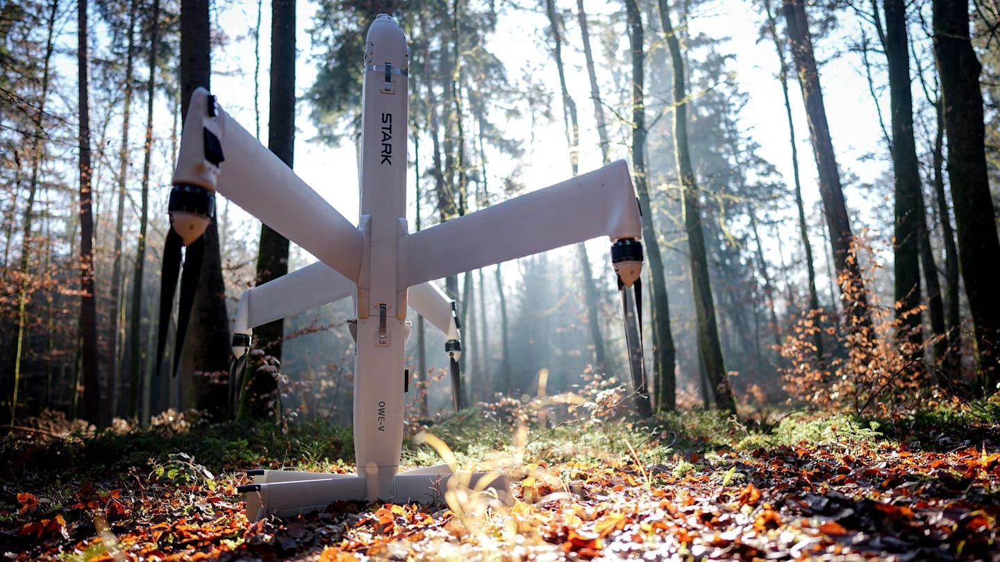
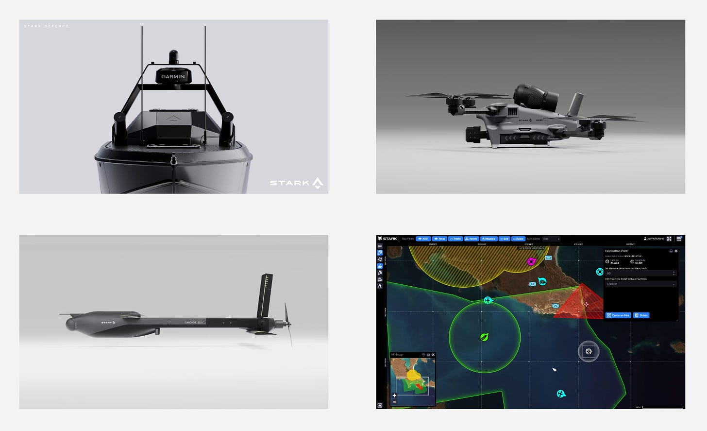
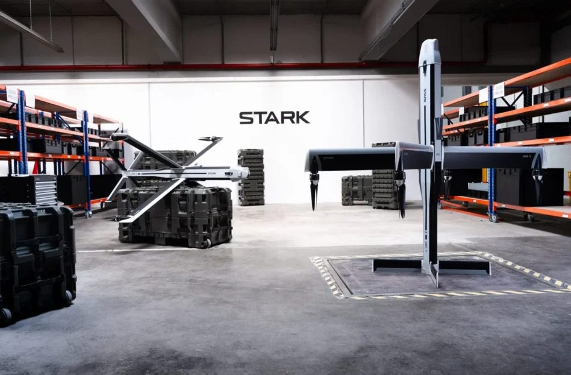

# STARK筹资5亿欧元打造欧洲下一代防务主承包商

> 原文：[STARK raises €500M to build Europe's next defense prime](https://press.airstreet.com/p/stark-500m) · air-street-press · 2026-06-30
> 抓取：2026-07-01T19:17:00+08:00 · 翻译：haiku · 1295 字

> 下一场战争将由能够以最快速度制造廉价软件定义无人系统的一方赢得。

## 序言

一辆现代主战坦克的成本为数百万美元。摧毁它的无人机可能只需花费数千美元，并且可以在大约十分钟内组装完成。这种交换关系——廉价机器以大规模数量摧毁昂贵设备——是乌克兰战争最具有决定性的教训，它现在正从空中扩展到海上。

本周，德国防务公司STARK（正在构建这些系统）完成了由Sequoia（红杉资本）和Founders Fund（创始人基金）领投的**5亿欧元融资**。我早在2016年于Project A项目中首次见到STARK的CEO兼创始人Uwe Horstmann，那时还没有任何相关的这一切。Air Street Capital进行投资是因为我们相信STARK正在成长为一个德国新的防务主承包商：一个为无人打击系统而生的新型主承包商，采用软件优先战略，并能够以真正战争所需的规模进行制造。

## STARK构建自主平台，快速迭代

STARK的旗舰平台**Virtus**是一种游弋弹药（loitering munition）：一架无人机飞向争夺区域、等待、寻找目标并打击它。它不是侦察无人机，尽管它可以像无人机一样返回和着陆，也不是巡航导弹。它介于两者之间：廉价到可以消耗，自主到可以独立寻找目标，简单到可以大规模生产。在此基础之上，STARK正在构建一系列效应器产品——**Gambit**（人可携带的短程弹药）和**Cascade**（管道发射型）——同时还有**Vanta**（无人水面舰艇，将同样的理念扩展到海上）。

## 你负担得起的大规模制造

数十年来，西方火力意味着数量较少的精良平台，每个成本数百万美元，太珍贵以至于不能丧失。乌克兰颠覆了这一点。决定性武器原来是你能以数千计的规模投入并心甘情愿消耗的廉价武器。一台Virtus大约在十分钟内组装完成，德国已经将STARK纳入一项价值高达28亿欧元的框架协议来为德国联邦国防军供应武器，这对于一家新防务公司是一个里程碑式的协议。

一旦武器变得廉价，制约就转移到制造和稳健的供应链。这一轮融资的80%以上用于制造和研发，STARK正在德国、英国和乌克兰建立生产线。在消耗战中，吞吐量就是护城河：能够以最快速度替换所失物资的一方掌握节奏。STARK建立在民用供应链和可以在几周内建立并从城市到城市复制的简单生产线之上，这既是一种扩展方式，也是一种在被瞄准时生存的方式。这十年赢得胜利的防务公司将把生产线视为产品。

最后，随着自主产品组合的增长，STARK需要软件将它们全部整合在一起：**Minerva**。同样用于在空中群发Virtus的软件协调海上的无人舰艇，在GPS被干扰时导航，并接入北约战场管理系统。每个平台通过软件更新而不是新机体而得到改进，每次部署都教会整个舰队。

## 为什么选择STARK

Uwe在Project A担任普通合伙人十年，该公司是欧洲最活跃的防务投资者之一，也是Quantum Systems的早期投资者，之后离职运营STARK。他同时组建了该公司需要的四个分支。为了大规模构建：Martin Rost，在Zalando担任16年，运营过一个约100亿欧元的业务单位；以及Johannes Schaback，多次创业者，是SumUp的首席技术官。要进入防务领域销售：Jan-Patrick Helmsen，Rheinmetall武器和弹药业务的前CEO。要赢得政治支持：Johannes Arlt，今年之前是德国联邦议院防御委员会成员。要从正在进行的战争中学习：一支乌克兰团队在基辅运营研发和生产中心，将前线反馈转化为设计变更。

定期的读者会熟悉Air Street Capital的防务论点。我们最近领投了**Alta Ares**的A轮融资，因为欧洲必须构建自己的防空盾。在我们今年慕尼黑安全会议的信函中，我们论证欧洲必须从紧急购买转向结构性生产能力，当政府与国内公司签订合同时，它赋予了工业引力，吸引私人资本并使供应链本地化。STARK就是回应这一呼声的样子：主权制造、软件定义系统，以及一位为实际正在进行的战争而构建的创始人。赢得下一场冲突的大规模力量将是廉价的、在国内制造的，并通过软件改进的，我们在这里支持制造它们的人们。

