# 开始使用 Nano Banana 2 Lite 和 Gemini Omni Flash 构建应用

> 原文：[Start building with Nano Banana 2 Lite and Gemini Omni Flash](https://deepmind.google/blog/start-building-with-nano-banana-2-lite-and-gemini-omni-flash/) · deepmind-rss · 2026-06-30
> 抓取：2026-07-01T19:16:55+08:00 · 翻译：haiku · 1877 字

## 正文

今天，我们推出两项重大发布，让实验、优化和扩展你的想法变得更加快速和简便：

- **推出 Nano Banana 2 Lite：** 我们最快、成本效率最高的 Gemini Image 模型，为高吞吐量、速度和规模而构建。Nano Banana 2 Lite 现已在 Google AI Studio、Gemini API 和 Gemini Enterprise Agent Platform 中推出。它也正在 Google 消费级产品（包括搜索中的 AI 模式、Gemini 应用和许多其他产品）中推广。

- **为开发者推出 Gemini Omni Flash：** 我们用于视频生成和对话式编辑的高质量、成本高效的模型，首次在 Google AI Studio、Gemini API 和 Gemini Enterprise Agent Platform 中提供给开发者使用。Omni Flash 也在 Gemini 应用和 Google Flow 中推出。

使用生成式媒体构建通常围绕创意迭代展开。通过这两个模型，开发者可以构建全面的端到端多媒体体验，将快速图像生成与视频创建和编辑相结合。无论你的工作流是生成数千张图像还是编辑多轮视频序列，你现在都有两个新模型可用，以更快的速度迭代、无缝地实现创意愿景。

## Nano Banana 2 Lite：我们最快、成本效率最高的 Gemini Image 模型

> 📷 **图1**：观看 Nano Banana 2 Lite 和 Nano Banana 2 之间的图像生成速度和质量的并排比较，使用简单提示。
> 原图链接：https://storage.googleapis.com/gweb-uniblog-publish-prod/original_videos/animalcounting_nanobanana2lite_small.mp4

Nano Banana 2 Lite（gemini-3.1-flash-lite-image）专为快速构思和高速开发者管道而设计，其中速度和成本是主要制约因素。它是我们对当前使用 Nano Banana 第一版本（gemini-2.5-flash-image）的开发者推荐的替换品，你现在可以替换它以在关键性能指标上获得即时效益。

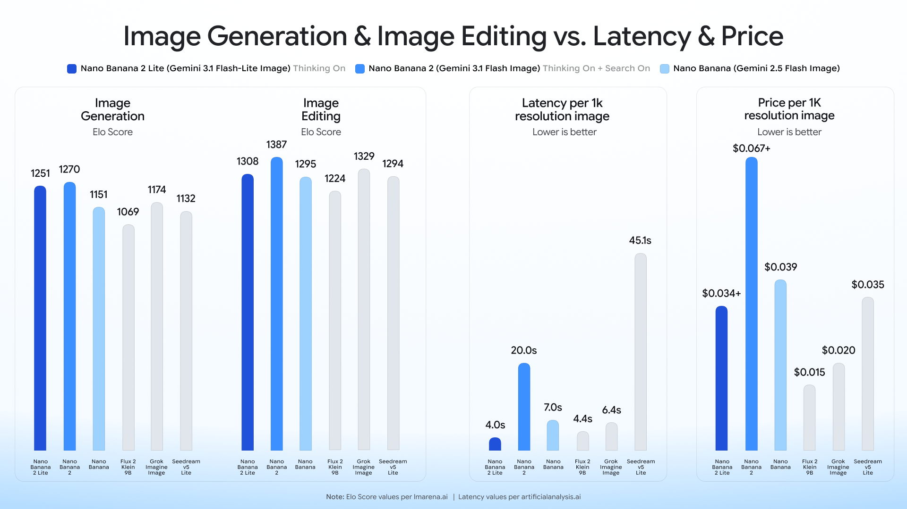
> 📷 **图2**：Nano Banana 2 和 2 Lite 与竞争对手 AI 图像模型的性能基准，评估生成/编辑质量（Elo 分数）、处理延迟和每 1K 分辨率图像的成本之间的权衡。
> 原图链接：https://storage.googleapis.com/gweb-uniblog-publish-prod/original_images/nb2-lite__benchmark_blog.gif

### Nano Banana 2 Lite 的优势：

- **延迟：** 4 秒内交付文本到图像的输出。这使其非常适合交互式原型制作和快速视觉草稿。
- **成本效率（每 1K 图像 0.034 美元）：** 对于专注于草稿、构思、管理运营预算或低带宽使用的开发者来说，这是一个成本高效的选择。

尽管优先考虑速度，Nano Banana 2 Lite 仍保持可靠的提示遵循、强大的角色一致性和清晰的图像内文本渲染。

### 了解 Nano Banana 系列

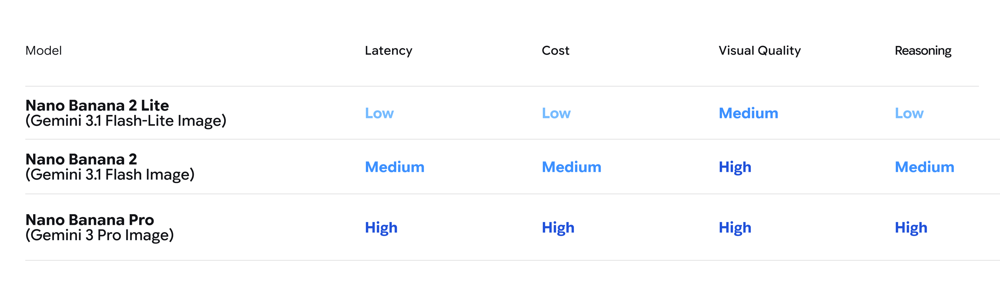
> 📷 **图3**：显示 Nano Banana 2 Lite、Nano Banana 2 和 Nano Banana Pro 之间比较的模型表格
> 原图链接：https://storage.googleapis.com/gweb-uniblog-publish-prod/original_images/Copy_of_nb2-lite__model_table_light_V2.gif

- **Nano Banana 2 Lite（Gemini 3.1 Flash Lite Image）：** 为速度而构建。针对超低延迟至关重要的近实时、高容量工作流进行优化。
- **Nano Banana 2（Gemini 3.1 Flash Image）：** 通用工作马。以更低的延迟提供高质量，提供性能和成本的最佳平衡。
- **Nano Banana Pro（Gemini 3 Pro Image）：** 为复杂、专业使用案例优化。它为需要精度优于速度的任务提供最强大的控制和高级推理。
- **Nano Banana（Gemini 2.5 Flash Image）：** 我们的旧版模型。我们建议升级到 Nano Banana 2 Lite 以获得更好的质量、更快的速度和更低的成本。

要查看完整的模型功能列表和如何集成，请查看开发者[文档](https://ai.google.dev/gemini-api/docs/omni)。

除了在开发者平台上的发布，Nano Banana 2 Lite 也将登陆 Google 消费级产品，包括搜索中的 AI 模式、Gemini 应用、NotebookLM、Google Photos、Stitch、Google Flow 和 Google Ads。

## 通过 Gemini Omni Flash 体验高质量、成本高效的视频编辑和生成

> 📷 **图4**：观看某人使用 Gemini Omni 执行四个数字魔术技巧，如从她的手机中拉出一个 3D 气球单词并将水从屏幕倒入玻璃杯。角落里有一个小的"原始"视频，显示她实际上是如何在添加 Omni 生成的特殊效果之前拍摄这些技巧的。
> 原图链接：https://storage.googleapis.com/gweb-uniblog-publish-prod/original_videos/Omni_1.mp4

在 Google I/O 上，我们推出了[Gemini Omni Flash](https://blog.google/innovation-and-ai/models-and-research/gemini-models/gemini-omni/)，这是一个将 Gemini 的多模态推理与视频生成和编辑相结合的模型。今天，Gemini Omni Flash（gemini-omni-flash-preview）正向开发者通过 Gemini API 和 Google AI Studio 推出，本地支持来自文本、图像和视频输入的组合的高质量视频生成和对话式编辑。该模型的定价极具竞争力，为每秒视频输出 0.10 美元，与 Veo 3.1 Fast 相同。

Omni Flash 的优势在于：

- **对话式视频编辑：** 使用自然语言细化和编辑视频。
- **多模态参考：** 组合图像、文本和视频等输入以维持对你的场景的控制和一致性。
- **真实世界知识：** Omni 利用 Gemini 的知识，如历史、生物学和叙事逻辑来构建引人注目的视频。
- **文本和动作同步：** 通过简单的提示，将文本和图形直接连接到视频操作。

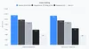
> 📷 **图5**：关于视频编辑的基准图表
> 原图链接：https://storage.googleapis.com/gweb-uniblog-publish-prod/images/Video_Editing__-_Descending_-_Cha.width-100.format-webp.webp

### 限制：

- Omni 目前提供 10 秒视频生成，更长的持续时间即将推出。
- 在 Gemini API 中，上传音频参考和场景扩展尚不支持该模型。
- 视频参考（长度最多 3 秒）被 API 模式接受，但目前模型无法正确处理。
- 在改变场景或平移运动时角色一致性有一些限制，但我们正在努力改进这一点。

Gemini Omni 从今天开始在 Google AI Studio 和 Gemini API 中提供公开预览。要查看完整的模型功能列表和特定地区的限制，请查看开发者[文档](https://ai.google.dev/gemini-api/docs/omni)。

## 立即开始使用两个模型进行构建

真正的魔力发生在你将这些模型串联在一起时。使用 Nano Banana 2 Lite 作为高速图像生成模型，然后将该图像作为参考传递给 Gemini Omni Flash 将其动画化为高质量视频。另外，通过对这些多轮体验使用[Interactions API](https://ai.google.dev/api/interactions-api)，你可以维持会话历史和上下文，使用户可以堆叠最多三个连续编辑。

为帮助你入门，我们创建了几个演示应用程序，你可以重新混合，让你体验如何将 Nano Banana 2 Lite 和 Gemini Omni Flash 都配对到一个工作流中。

> 📷 **图6**：anywhere 演示
> 原图链接：https://storage.googleapis.com/gweb-uniblog-publish-prod/original_videos/anywhere-final-nb2l-omni-music.mp4

[Anywhere](https://aistudio.google.com/apps/bundled/anywhere)是一个演示应用程序，展示了两个模型的强大功能。拍一张自拍照或上传一张照片，该应用程序使用 Nano Banana 2 Lite 将你瞬间传送到数十个标志性地标。然后，当点击图像时，Omni Flash 被用来将生成的图像转变为位置的动画片段。

> 📷 **图7**：spacelift 演示
> 原图链接：https://storage.googleapis.com/gweb-uniblog-publish-prod/original_videos/spacelift_buildwithomni_small_xqZkO1t.mp4

[Space Lift](https://aistudio.google.com/apps/bundled/space-lift)是一个由 Nano Banana 2 Lite 和 Gemini Omni 提供支持的演示室内设计应用程序，可让你通过上传照片来即时重新想象任何房间。该应用程序自动在各种设计美学中生成充分实现的概念。一旦你找到喜欢的外观，点击视频按钮观看 Omni 带着电影般的展示将设计栩栩如生，让你在现实前体验你的新空间的运动。

> 📷 **图8**：omniproduct 演示
> 原图链接：https://storage.googleapis.com/gweb-uniblog-publish-prod/original_videos/OmniProductStudio_BlogAsset_V3_Jvpnh4Z.mp4

[Omni Product Studio](https://aistudio.google.com/apps/bundled/omni-product-studio)是一个演示应用程序，将由 Nano Banana 2 Lite 创建的静态图像转换为由 Gemini Omni 创建的电影级电子商务视频。这个演示说明了通过快速交互合并多模态输入，构建交互式媒体以实现图像到视频输出。

### 开发者推荐

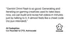

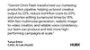

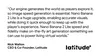

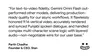

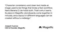

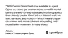

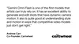

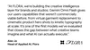

## 安全透明地构建

在 Google 的安全基础设施上构建，Gemini Omni 和 Nano Banana 2 Lite 使用[SynthID](https://deepmind.google/blog/identifying-ai-generated-images-with-synthid/)水印。你可以通过 Gemini 应用、Chrome 中的 Gemini 或搜索来验证 AI 内容。[详细了解](https://blog.google/innovation-and-ai/products/identifying-ai-generated-media-online)我们如何在网络上扩展验证工具，以帮助你了解内容是如何创建和编辑的。

## 立即开始你的项目

Nano Banana 2 Lite 资源：

- 前往[Google AI Studio](https://aistudio.google.com/prompts/new_chat?model=gemini-3.1-flash-lite-image)在操场上尝试该模型。
- 深入了解我们的[Gemini API 文档](https://ai.google.dev/gemini-api/docs/image-generation)。
- 查看我们的 Nano Banana[提示指南](https://ai.google.dev/gemini-api/docs/image-generation#prompt-guide)，充满最佳实践和示例提示。

Gemini Omni Flash 资源：

- 前往[Google AI Studio](https://aistudio.google.com/prompts/new_chat?model=gemini-omni-flash-preview&utm_source=deepmind.google&utm_medium=referral&utm_campaign=gdm&utm_content=)在操场上尝试该模型。
- 深入了解我们的[Gemini API 文档](https://ai.google.dev/gemini-api/docs/omni)。
- 查看我们的 Gemini Omni Flash[提示指南](https://ai.google.dev/gemini-api/docs/omni#prom)，充满最佳实践和示例提示。
