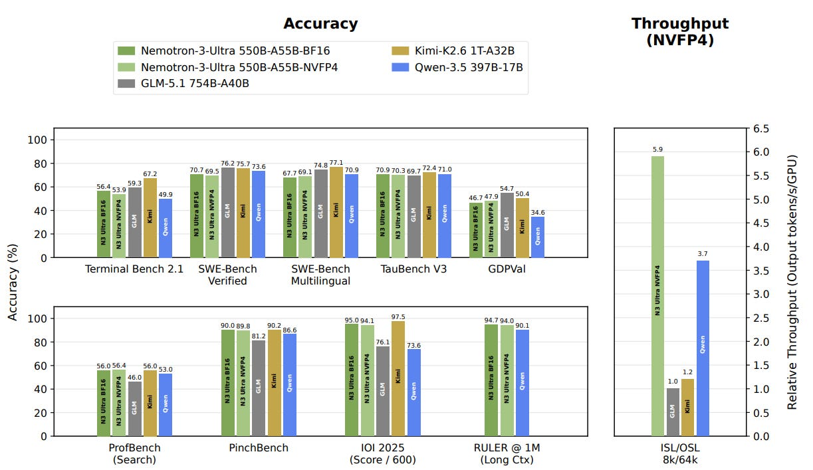
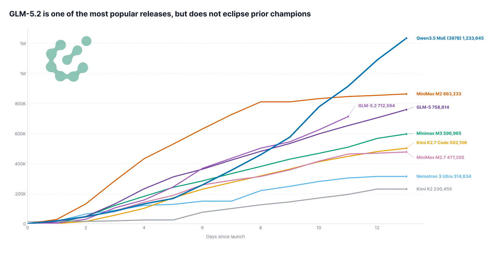
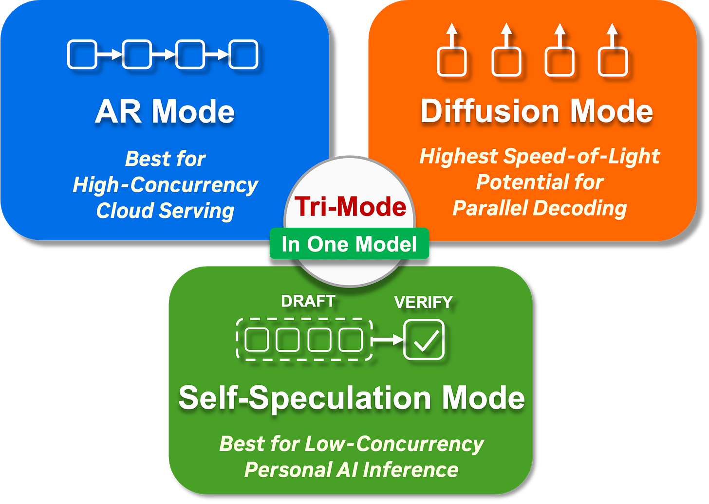

## 开源生态的多元化趋势

我们在开源模型发布中持续看到的一个趋势是，生态系统变得日益多元化，越来越多的组织正在发布各种各样的模型。一年前，开源成果和更广泛的开源模型格局主要由少数（中国）企业主导。这种局面已经改变，我们正越来越多地展现来自世界各地的小众公司。

## 模型发布背后的动机

虽然很难确切了解这些公司自身的确切动机，但我们可以大体观察到以下几类：

### "纯粹"的模型开发者

这些是其既定目标是训练处于前沿或至少接近前沿的模型的公司。这包括许多中国公司，如 DeepSeek、Zhipu 和 Minimax，但也包括像 Poolside、Arcee 和 Zyphra 这样的西方公司。它也日益包括主权 AI 参与者，如 Cohere、Sovereign、Mistral 和 Trillion Labs。最近的 Mythos 事件唤醒了一些政策制定者，这可能导致对主权模型训练的兴趣增加。

### 大科技公司

对于包括阿里巴巴的 Qwen、谷歌的 Gemma 以及某种程度上的 NVIDIA 等大科技公司而言，动机更加多元。阿里巴巴使用模型发布来追加销售其闭源模型，而 NVIDIA 则从繁荣的开源模型生态中受益，因为这增加了对其 GPU 的兴趣和使用。这种既得利益不同于 Llama 时代的开放式西方模型，当时开源发布的动机并不清楚（最终也没有坚持下来）。

### 产品公司

一些公司，如 JetBrains、Zed、Krea 和 Photoroom，主要销售以 AI 为核心组件的产品。由于他们不想被切断访问闭源模型的权限，或者想提供独特的东西，他们可以训练高度专门化、规模较小的模型，以满足其产品需求。因此，开源这些模型权重不会损害其底线。

## 多样性的优势

这种开发者和模型的多样性符合我们的假设，即更多公司将开发模型的长尾，而追求绝对开源前沿的公司数量将减少。

虽然不是每一个模型发布都完全适合这些类别之一，但更广泛的观点是，开源模型开发不是由单一类型的参与者或动机驱动的。这种多样性是开源生态的优势之一，可以在模型发布的技术报告中看出，这些报告重复使用其他开源模型发布中的训练方法、架构选择和数据。

试图减缓或禁止这个生态系统不仅是徒劳的，正如技术相关禁令的历史所表明的那样，而且也是不安全的和反自由的。这样的限制将把 AI 开发和使用集中在少数人手中，这最终会危害局外人自由采用我们有生之年最重要的技术之一的能力。

## 精选模型

### NVIDIA-Nemotron-3-Ultra-550B-A55B-BF16（NVIDIA）

Nemotron 系列的大版本，使用 LatentMoE（隐向量混合专家）使其比可比模型更快。就像其他 Nemotron 模型一样，绝大多数数据都是开源的。而且，作为锦上添花的是：NVIDIA 承诺使用 OpenMDW 许可证，这是专门为模型权重（和数据）量身定制的，并放弃了其自定义许可证。虽然 MIT 和 Apache 的精神与 OpenMDW 相同，但只有后者真正涵盖模型权重，而前者是不太适用于模型权重的软件许可证。

### command-a-plus-05-2026-bf16（CohereLabs）

Cohere 最近成为 Artifacts 的常客，在 Apache 2.0 许可证下发布了其旗舰产品 Command A+。该系列的前几个版本是在非商业许可证下发布的，所以这个改变非常值得欢迎！Command A+ 作为 218B-A25B 混合专家模型将多模态、多语言和代理能力结合在一起，使其可以与单个 B200 配合使用（使用 4 位量化时）。

### GLM-5.2（zai-org）

这一期 Artifacts 中最大的新闻是 GLM-5.2，我们也在一篇单独的博客中报道过。该模型继续给人留下深刻印象，并且对日常工作真正可用，与目前最好的闭源模型相比没有巨大回退。有趣的是，自发布以来的原始下载数量与其他模型发布更加一致，GLM-5.2 大致与 GLM-5 发布后相当。

### ZAYA1-74B-preview（Zyphra）

Zyphra 在 AMD GPU 上训练，因其包含有趣的架构选择的技术报告在研究社区中被视为某种内幕消息来源，发布了一些新模型，其中 74B-A4B 混合专家和 8B-A0.6B 混合专家（技术报告）是其当前的旗舰发布。

### Laguna-M.1（poolside）

Poolside，我们在上一期 Artifacts 中介绍过，也在 Apache 2.0 许可证下发布了其旗舰模型！他们也承诺了将来的开源发布：

> 开源权重现在是我们的默认选项。我们将继续朝着前沿迈进，在开源中发布越来越强大的模型。

## 模型

### 通用用途

#### Kimi-K2.7-Code（moonshotai）

Kimi 的更新，着重于令牌效率。

#### Step-3.7-Flash（stepfun-ai）

Step-Flash 的更新，在数学方面表现特别强大。

#### Nemotron-Labs-Diffusion-14B（nvidia）

一个可以以三种不同模式使用的实验模型：自回归、扩散和自推测。这些模式中的每一个都适合不同的使用场景。

