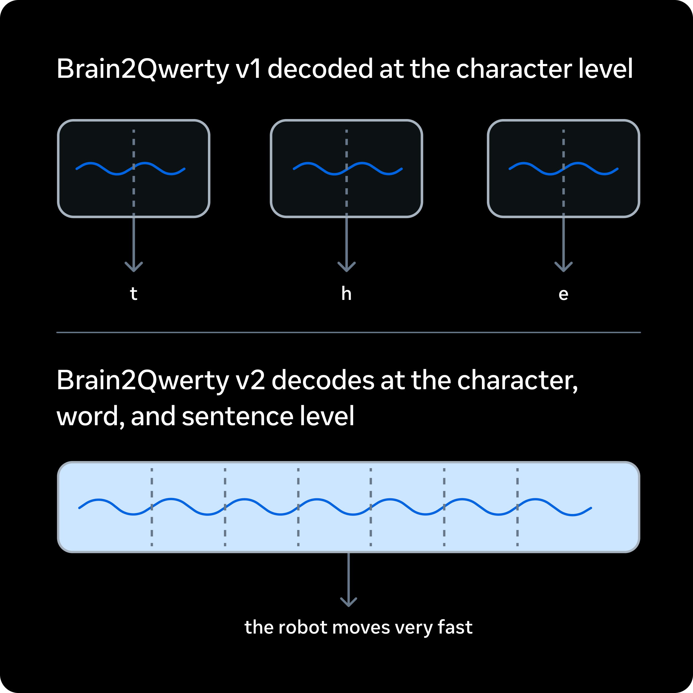
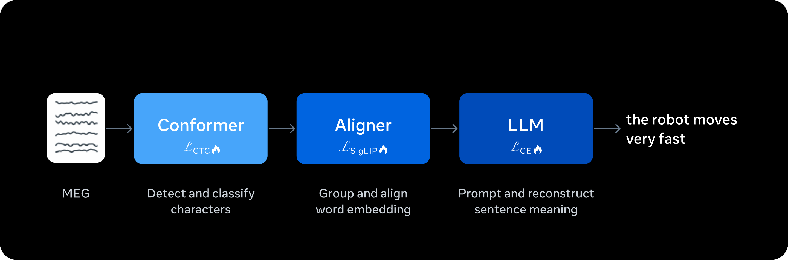
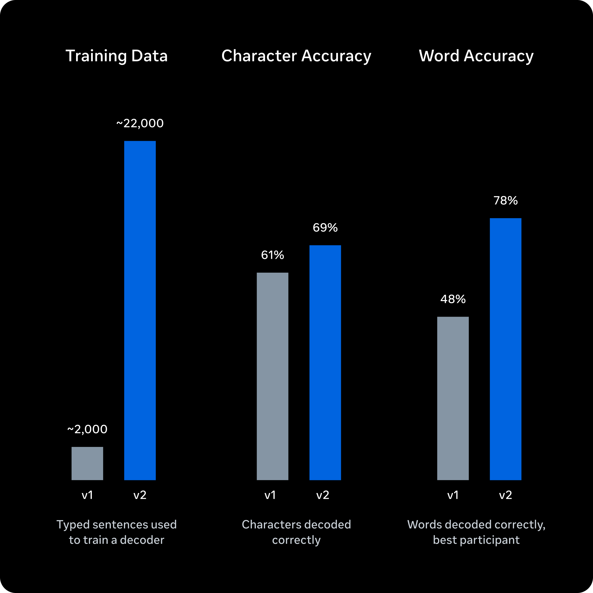

去年，我们推出了 Brain2Qwerty v1，这项研究利用人工智能从脑电活动中解码出文本，无需任何手术植入。现在我们分享下一步成果：Brain2Qwerty v2，这是目前性能最强的端到端管道，能够从非侵入式脑电记录中进行实时句子解码，其准确度水平达到了之前只有需要脑部手术的技术才能实现的程度。

为了加速神经科学突破，我们正在发布 Brain2Qwerty v1 和 v2 的完整训练代码，我们的合作伙伴——巴斯克认知、脑与语言中心（BCBL，Basque Center on Cognition, Brain, and Language）——正在发布 v1 数据集。我们相信这项研究有潜力为数百万患有脑损伤而无法沟通的人们带来真实的改变。脑立体定向脑电图（stereotactic electroencephalography）和皮层脑电图（electrocorticography）等侵入性手术已证明，将信号反馈给人工智能解码器的神经义肢可以恢复沟通能力，但这些方法难以规模化。我们的非侵入式方法可以帮助弥补这一差距。

我们在约 22,000 个句子上训练了 Brain2Qwerty v2，这些数据来自 9 名志愿者，每人戴着脑磁图仪（MEG，magnetoencephalography）设备录制了 10 小时的主动打字数据。我们不依赖手工设计的管道来检测神经事件，而是使用端到端深度学习直接从原始脑信号进行解码。

在神经数据上微调大型语言模型使系统能够利用语义上下文，弥合嘈杂的脑电记录与连贯语言之间的鸿沟。我们还部署了人工智能代理来探索解码管道的优化方案，最终的训练配置由工程师手动选择。

结果是：Brain2Qwerty v2 从嘈杂的神经输入中连贯地恢复句子，实现了 61% 的单词准确率，相比其他非侵入式方法的 8% 单词准确率有显著改进。对于我们表现最好的志愿者，我们达到了 78% 的单词准确率，其中超过一半的句子的解码错误在一个单词以内。

我们还发现，解码准确度与数据量呈对数线性关系，这表明与手术方法之间的剩余性能差距可能仅通过数据扩展就能进一步缩小。这项工作为我们建立开放脑科学基础模型的努力做出了贡献，包括用于感知编码的 Tribev2 模型、用于规模化处理脑数据的 NeuralSet，以及用于系统评估模型的 NeuralBench。我们与社区密切合作开展这项工作，通过最近的 500 万美元基金来促进我们数字脑计划（Digital Brain Project）中的开放数据集发展。我们的希望是，这项公开进行的工作能够加速神经科学在识别、诊断和治疗神经系统疾病方面的进展，而不是各自为政。
