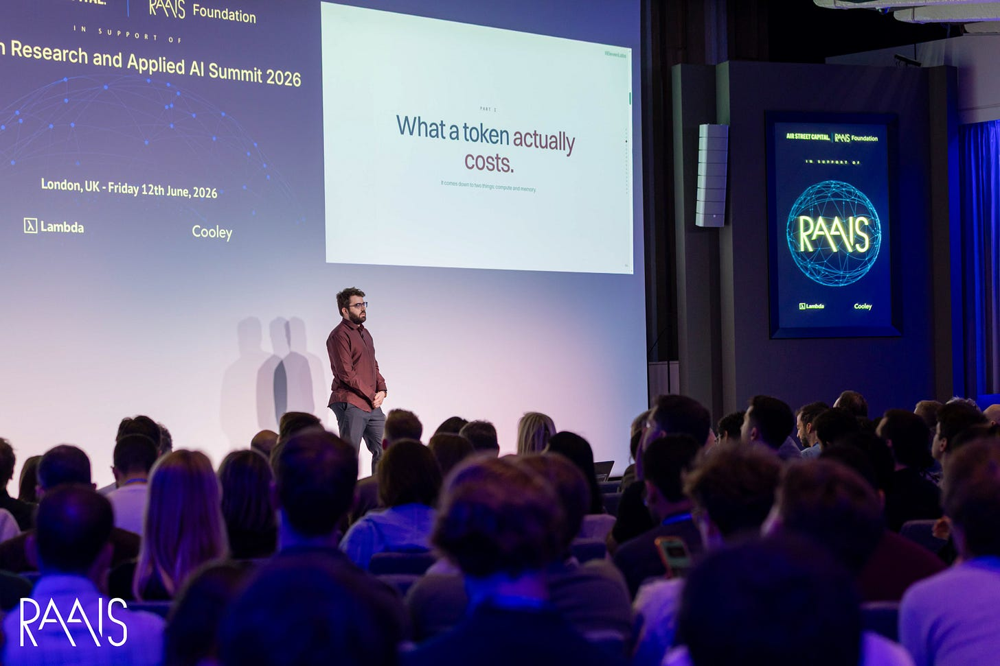
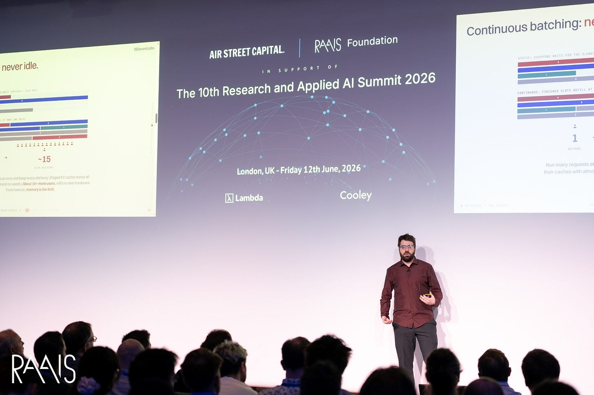
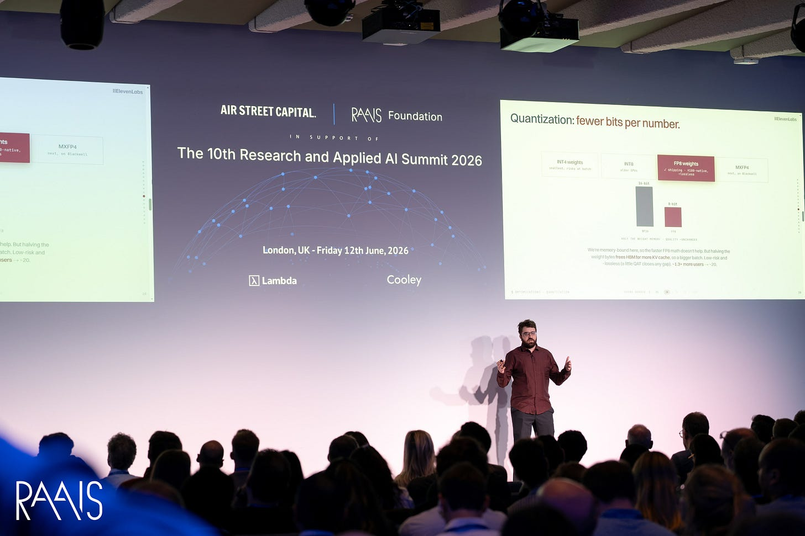

# 计算资源稀缺是一个工程问题

> 原文：[Compute scarcity is an engineering problem](https://press.airstreet.com/p/angelos-perivolaropoulos-elevenlabs) · air-street-press · 2026-06-30
> 抓取：2026-07-02T09:12:25+08:00 · 翻译：haiku · 2847 字

## 背景

GPU 严重不足，且没有近期解决方案。它们很难找到，即使找到了，采购流程也可能需要数月才能投入服务。与此同时，需求呈指数级增长。Angelos Perivolaropoulos 在 RAAIS 2026 大会上的演讲围绕这种失配展开，并提出唯一诚实的应对方式：如果无法增加硬件，就"最大化利用现有设备"。对于他讲述的语音推理工作负载，演讲衡量了这一方案能取得多大成效，从每 GPU 服务一个用户，通过标准工程优化达到 70 个用户，再到前沿水平的 140 个用户。

**Angelos** 领导 **ElevenLabs** 的语音转文本和文本转语音团队，构建了公司的 Scribe 和 Scribe Real-time 转录系统。他去年发布的 Scribe V2 模型在大多数主流基准上获得最准确的转录成绩。这给了他独特的视角来审视这个问题，因为语音模型的成败取决于大规模部署中的延迟和成本。这也是 ElevenLabs 连续第二年在 RAAIS 舞台上亮相；2025 年，其 CEO **Mati Staniszewski** 讨论了语音技术前沿。今年，我们深入探讨了引擎内部。

## 一个 Token 的实际成本

每项优化都从理解成本从何而来开始。对于大多数流行大语言模型背后的自回归 Transformer，一个 token 的成本归结为两个瓶颈：计算（GPU 执行矩阵乘法的速度）和内存带宽（GPU VRAM 加载模型权重和 KV 缓存的速度）。生成过程分两个阶段。预填充阶段读入整个提示词并填充 KV 缓存（模型的工作状态），计算密集。解码阶段随后逐个生成 token，每个都以前一个为条件，内存密集。KV 缓存允许模型重用预填充结果而无需为每个新 token 重新计算，但在规模化时成了瓶颈：100 个并发请求需要 100 个独立缓存驻留在内存中。大小并非决定性因素。Angelos 指出，Qwen 3 的缓存成本比 Qwen 2.5 高三倍，尽管参数数量几乎相同，说明相同大小的模型运行成本可能有巨大差异。

## 停止让 GPU 闲置

第一个也是最大的单项优化是批处理。GPU 擅长并行工作而不擅长顺序工作，解码的主要成本是加载模型权重，而这可以在批次中各请求间共享，而非为每个单独重新加载。朴素批处理将请求分组一次，然后等待最慢的完成，期间 GPU 处于空闲。连续批处理解决了这个问题：在每个解码或预填充步骤级别进行批处理，所以新请求可以加入已在处理其他请求的 GPU。

## 压缩权重，然后压缩缓存

GPU 保持忙碌后，约束变成内存，所以接下来的所有举措都是为了降低内存需求。量化是第一步。模型通常以 BF16（16 位精度）训练，这比实际需要的精度更高；将权重降至 FP8 可以大约减半占用空间，在 H100 级硬件上基本无损，结合量化感知训练（向梯度注入噪声使模型适应低精度），这为更多缓存腾出空间，吞吐量提升到每 GPU 20 个用户。更激进的选项也存在：int4 有损但适合设备端，MXFP4 能达到 4 位但仅限 Blackwell 及更新架构。

推测解码接下来。廉价的草稿模型提议 token，大模型在单一前向传播中验证它们，持续接受直到两者不同意。这仅在模型经常同意时才能获利，但实际中它们常常不同意，所以实际使用少于其名声所示；应用到这里时，它将吞吐量从 20 提升到每 GPU 28 个用户。更流行的变体是多 token 预测，同一模型带上额外预测头并自我生成多个 token，无需托管第二个模型。用两个或更多头时才值得，并同时充当训练信号：教模型提前预测多步（如下国际象棋）倾向于增强稳定性，有时还能加快学习。大多数大实验室都用它，效果在同一水平，约每 GPU 28 个用户。

最大的收益也最危险。KV 缓存的冗余容量远少于权重，所以压缩它必然有损。Angelos 对此坦诚：谷歌的讨论甚广的 TurboQuant 方法宣称无损，但根据他的实测，实际有损，因为对缓存的任何改变模型都很难恢复。解决方案再次在训练端：蒸馏模型使其适应低精度 FP8 缓存，保留大部分准确度同时将缓存缩小 2.5 倍。仅这一步就将吞吐量从 28 提升到每 GPU 70 个用户——相同硬件在起点的 70 倍。

## 前沿实验室的探索方向

70 是有纪律工程的成果。进一步意味着改变架构本身，各大实验室在此采取不同策略。DeepSeek 的多头潜在注意力将每 token 的键值对压缩成小潜在向量而非完整存储，既加快推理又延伸上下文至百万 token；这是 DeepSeek-R1 之后最被广泛复制的想法。Qwen 用线性网络替换每隔一层的标准二次注意力，更便宜且上下文更长，但质量有所牺牲。NVIDIA 走得最远，在部分层用状态空间模型替换 Transformer，实现线性扩展和更快计算，保留足够的 Transformer 层维持准确度。通过这些架构级改进，吞吐量达到约每 GPU 140 个用户。

## 没有免费的午餐

Angelos 谨慎地避免过度宣传这些技术。阶梯上的每项技术都有代价。批处理增加延迟并触及内存天花板。FP8 量化在没有额外训练下会有小精度损失。推测解码需要权重访问权和训练流水线才能良好运作。KV 缓存压缩最可能降低输出质量，所以真正的问题是你能容忍多少降级而非能否完全避免。他对论文和生产差距的看法更为直率：许多声称无精度损失的压缩方法只在少数基准上调优，扩展到数百万用户时往往崩溃。你通常得等到它们足够流行被大规模实际验证才知道哪些真正有效。哪种技术值得取决于具体工作负载。

这个问题为何重要超越工程本身，体现在现场观众的一个问题上：根据观众估计，今天的 token 价格被补贴，系数达 10 到 40 倍。Angelos 的希望是优化而非补贴最终填补这个差距。他说最大的模型必须靠补贴才能有经济意义，但他预期 Sonnet 级别的小模型会变得足够好，能满足几乎所有日常需求，同时保持可盈利的利润率。他已在代理系统中看到这种架构萌芽：将每个请求路由到能处理它的最小模型，为规划预留昂贵的大模型。
