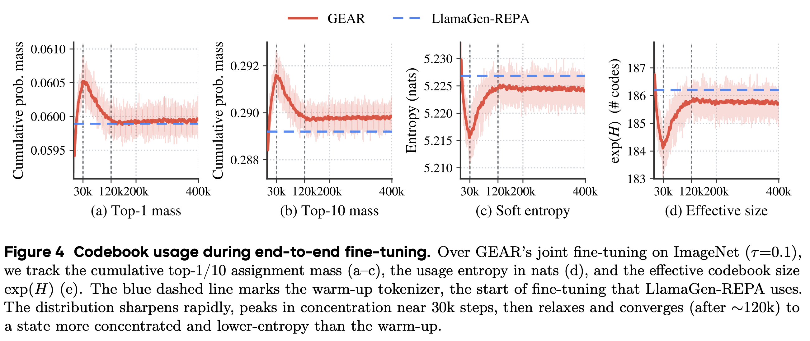
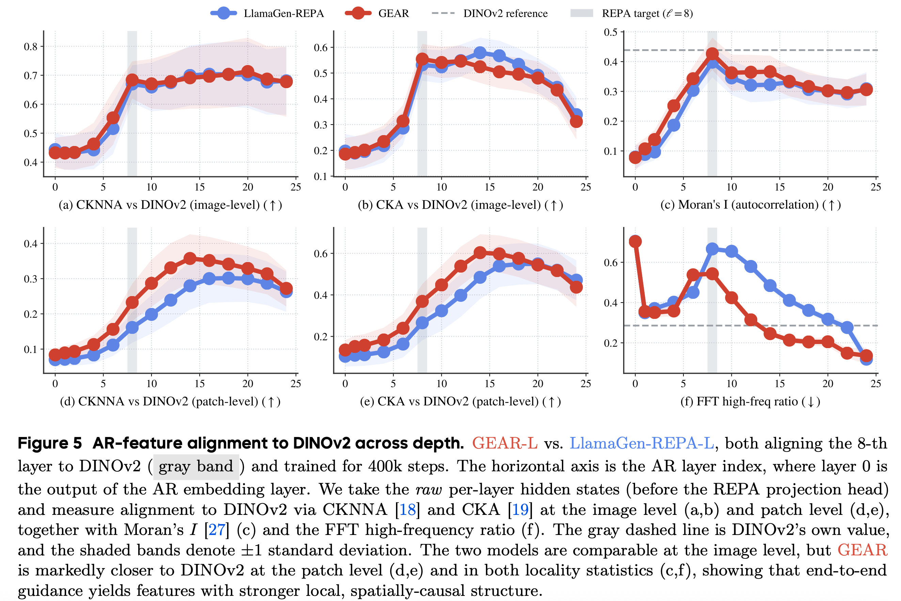
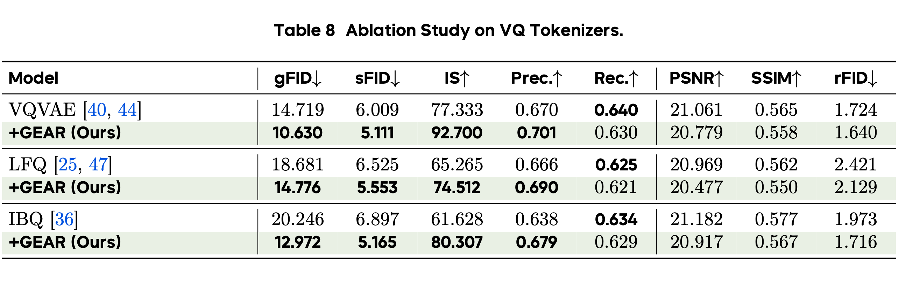

# GEAR：图像合成的引导端到端自回归模型

> 原文：[GEAR: Guided End-to-End AutoRegression for Image Synthesis](https://huggingface.co/papers/2606.32039) · huggingface-daily-papers · 2026-06-30
> 抓取：2026-07-02T09:12:33+08:00 · 翻译：haiku · 717 字

## 资源链接

📄 论文：https://arxiv.org/abs/2606.32039
💻 代码：https://github.com/Tencent-Hunyuan/GEAR
🤗 模型：https://huggingface.co/collections/BinLin203
🏠 主页：https://linb203.github.io/gear

## 核心贡献

### [1/6] 停止冻结你的分词器

🚨 停止冻结你的分词器！视觉自回归 (AR) 模型仍停留在二阶段时代。我们提出 GEAR ⚙️（引导端到端自回归）。通过联合训练 VQ 分词器和 AR 生成器，相比 LlamaGen-REPA 等强大基准，我们实现了高达 10 倍的收敛速度加快！🧵👇

### [2/6] 瓶颈与解决方案

🧠 瓶颈与解决方案 为什么端到端离散 AR 如此困难？不可微的 argmax！朴素的直通估计器 (STE) 导致码本崩溃。💥 GEAR 用巧妙的双读出机制解决了这个问题：1️⃣ 硬分支：使用下一个标记预测来训练 AR。2️⃣ 软分支：一条可微路径将对齐损失反向传回，仅指导分词器。

### [3/6] 惊人的发现（表示转变）

🤯 最令人惊讶的部分是：与扩散模型不同（扩散模型中端到端训练使潜在变量更语义化），GEAR 恰恰相反！分词器变得不那么像 DINOv2，重新组织以实现纯粹可预测性（熵更低）。语义对齐的负担完全转移到 AR 模型的隐藏状态！

### [4/6] 结果：更快和更好

🚀 数字会说话。在 ImageNet 256x256 上，GEAR 在 B/L/XL 规模上一致优于基准（gFID 降至 2.52）。在文生图 (GPIC) 上，它以 11.1 倍更快的速度达到基准的最终 REPA 对齐损失，NTP 损失快 2.5 倍！⚡️

### [5/6] 跨量化器的通用性

🔧 GEAR 不仅仅是 VQ-VAE 的一招鲜。软指导机制具有高度通用性！它能无缝地与不同的量化器配合使用：VQVAE、LFQ 和 IBQ。在每一种情况下，GEAR 都能同时改进生成质量和重建保真度。📈

### [6/6] 视觉 AR 的未来

🔮 尽管离散标记有重建天花板，端到端 VQ-AR 是实现统一、长上下文生成的关键。GEAR 为应用 LLM 风格的对齐（RLHF、DPO）直接应用于视觉标记铺平了道路！查看下面的论文和代码：👇

## 详细总结

视觉生成模型通常遭受解耦的两阶段训练。GEAR 通过启用分词器和 AR 生成器的端到端联合训练来解决这个问题。它通过双读出机制克服了离散标记的不可微性：一个用于 AR 预测的硬分支，以及一个软分支，将梯度反向传播回分词器。这将语义对齐的负担转移到 AR 模型，引导分词器生成易于预测的指标。

因此，GEAR 将收敛速度加快高达 10 倍，改进了空间特征一致性，并展示了跨不同量化器（VQVAE、LFQ、IBQ）和文生图 (T2I) 生成的强大泛化能力。

## 资源

📄 论文：https://arxiv.org/abs/2606.32039
💻 代码：https://github.com/Tencent-Hunyuan/GEAR
🤗 模型：https://huggingface.co/collections/BinLin203
