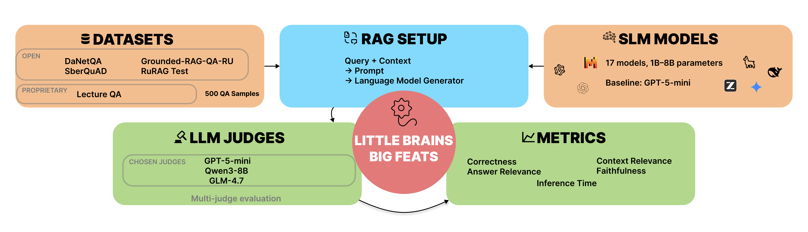

# 小脑高成就：探索紧凑型语言模型

> 原文：[Little Brains, Big Feats: Exploring Compact Language Models](https://huggingface.co/papers/2606.30062) · huggingface-daily-papers · 2026-07-01
> 抓取：2026-07-02T09:12:08+08:00 · 翻译：haiku · 1870 字

## 摘要

小型语言模型可以有效地在不需要 GPU 加速的情况下，直接在设备上执行检索增强生成任务。

## 导言

虽然大型语言模型最近在研究领域占主导地位，但小型语言模型在各个领域仍然高度相关，然而它们获得的关注远少于大模型。在这项研究中，我们调查了较小的语言模型在检索增强生成（RAG）系统的生成阶段中的性能表现。为了有效地对这些模型进行基准测试，我们利用开源和专有数据集，涵盖多样化的主题领域和问题类型。我们的研究结果表明，具有小型语言模型的 RAG 系统可以在不需要任何 GPU 硬件的情况下直接在设备上执行，并在合理的时间内完成。实验代码和补充材料的链接可以通过 GitHub 仓库访问：https://github.com/SibNN/SLM-RAG-EVAL。

## 核心评估内容

### 研究问题

小型语言模型是否足够强大，可以在没有 GPU 的情况下进行实际的 RAG 生成？

### 方法

我们对 17 个参数量从 1B 到 8B 的紧凑型语言模型进行了基准测试，作为俄语检索增强生成系统中的生成器。所有候选模型都被评估为本地 GGUF 变体，包括 Q4_K_M 和 Q5_K_M 量化模型，在仅 CPU 推理的约束下进行。

评估使用了从五个俄语问答数据集构建的 500 个样本基准，包括开源和专有的特定领域数据。使用多评判 LLM-as-a-Judge 设置对响应进行评估，涵盖正确性、答案相关性、忠实性、上下文相关性和延迟等方面。

### 主要发现

一个明确的模式出现了：在这种设置中，Qwen 系列模型在表现最好的小型语言模型层中占据主导地位。Qwen3-8B-Q4_K_M 实现了最强的整体小型语言模型质量，达到 0.72 的正确性和 0.83 的忠实性，在正确性上接近 GPT-5-mini 基准。与此同时，Qwen3-4B-Instruct-2507-Q5_K_M 提供了最佳的质量-延迟权衡，正确性为 0.71、答案相关性为 0.89、忠实性为 0.80，且 CPU 延迟明显低于 8B 模型。Qwen2.5-7B-Instruct-Q4_K_M 也是一个强有力的候选者，表现出高答案相关性和忠实性，延迟适中。

## 结论与意义

我们的研究结果表明，精心选择的量化小型语言模型，特别是来自 Qwen 系列的模型，可以成为具有竞争力的 RAG 生成器，同时能够实现本地、隐私友好和无 GPU 的部署。这项工作特别适用于设备端 AI、隐私敏感的应用、边缘计算部署和计算预算有限的生产 RAG 系统。

本研究已被接纳参加 ECML PKDD 2026 应用数据科学专题。作者预印本版本。

## 附图

