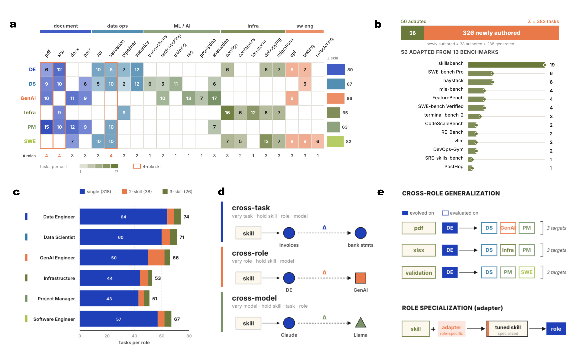

# LLM 代理中的程序记忆管理：控制、适应与评估

> 原文：[Managing Procedural Memory in LLM Agents: Control, Adaptation, and Evaluation](https://huggingface.co/papers/2606.23127) · huggingface-daily-papers · 2026-06-21T20:00:00Z
> 抓取：2026-07-02 09:12:30 · 翻译：haiku · 3200+ 字

## 摘要

程序记忆（Procedural Memory）被越来越广泛地应用于改进大语言模型代理在重复工作场景中的表现，但其生成可复用技能的能力仍然鲜为人知。本论文引入了 AFTER 基准——由 382 个真实企业任务组成，跨越 6 个专业角色和 22 项程序技能，旨在评估技能在不同任务、角色和模型主干上的迁移能力。该基准包括四种受控的评估设置：本地改进、跨任务迁移、跨角色迁移和跨模型泛化。

实验表明程序记忆在工业工作流中带来一致的改进：单次微调循环在聚合性能上提升 3.7-6.7 分，而从多模型执行轨迹演化而来的技能在跨模型测试中达到 73.1% 的准确率，超过所有单模型轨迹源。我们进一步发现，某些技能能够在任务和模型间广泛泛化，而其他技能则变成特定角色工作流的专用工具，在迁移时失去有效性。这些结果为在生产代理平台中构建、评估和部署程序记忆系统提供了实践指导。

## 研究背景

### 当前问题

大语言模型代理在企业环境中执行重复性工作任务时呈现出越来越广泛的应用。然而，虽然程序记忆作为一种改进代理性能的方法被采用，其真正的能力和限制仍然缺乏系统的理解。特别是，我们并不清楚通过程序记忆学到的技能是否真正具有可复用性——即这些技能是否能够从一个上下文迁移到另一个上下文。

### 研究动机

现有的代理框架大多采用"提示工程"的方法，通过手写提示词来指导模型行为。这种方法的根本限制在于：

- 技能被视为静态的、由人类精心设计的工件
- 缺乏从经验中学习和演化的能力
- 难以评估技能的真实泛化程度
- 在角色切换或任务变化时容易失效

程序记忆提供了一种替代方案：将技能视为可以通过重复执行和反馈动态学习的活跃工件，而非固定的提示模板。但要真正理解这一方法的可行性，需要一个设计严谨的基准。

## AFTER 基准详解

### 基准规模与范围

AFTER 基准由以下关键要素组成：

- **任务总数**：382 个真实的企业工作任务
- **专业角色**：6 个不同的职业角色（如客服、数据分析员、项目经理等）
- **程序技能**：22 项可独立学习和应用的程序技能
- **任务类型**：单一技能任务和多技能复合工作流
- **难度分布**：从初级到高级的多个难度等级

### 四层受控评估框架

基准的创新之处在于其精心设计的分层评估系统，能够分离不同维度的技能迁移能力：

#### 1. 本地改进（Local Improvement）

在技能的原始上下文中评估改进效果。这是最基础的指标，衡量通过程序记忆是否能在原始任务上提升性能。

#### 2. 跨任务迁移（Cross-Task Transfer）

同一专业角色内，从一个任务迁移到不同任务。这衡量技能在同一域内的可复用性。

#### 3. 跨角色迁移（Cross-Role Transfer）

技能从一个专业角色迁移到完全不同的角色。这是一个更严格的考验，评估技能的通用性。

#### 4. 跨模型泛化（Cross-Model Generalization）

在不同的基础大语言模型（如 GPT-4、Claude、Llama 等）上评估技能的有效性。这衡量技能与模型无关的泛化能力。

## 实验结果与发现

### 关键性能指标

#### 单次微调的效果

- 单个微调循环（refinement round）使聚合性能提升 **3.7 到 6.7 个百分点**
- 这表明即使是有限的迭代也能带来显著的性能改善

#### 多模型学习的优势

- 从多个模型的执行轨迹中学习的技能在跨模型测试中达到 **73.1% 的准确率**
- 这超过了所有单模型轨迹源的表现
- 说明模型多样性有助于学习更具泛化性的技能

### 技能泛化的多样性

研究的一个重要发现是，技能的泛化能力并非均匀分布：

#### 广泛泛化的技能

某些技能展现出卓越的泛化能力：
- 可在多个任务间有效迁移
- 在不同专业角色中保持效能
- 跨模型的性能损失最小

#### 专业化的技能

其他技能则表现出显著的专业化倾向：
- 在原始角色中表现最优
- 在跨角色迁移时性能下降明显
- 更依赖于特定模型的特性

这种分化突出了一个关键洞察：并非所有技能都应该以相同的方式部署或评估。

> 图示展示了 AFTER 基准的综合设计架构和多维评估框架

## 研究意义与启示

### 1. 从信息检索向能力演进

传统的检索增强生成（RAG）方法侧重于静态信息的检索和呈现。而程序记忆代表了向"真正的操作能力"的转变——不仅仅是找到正确的信息，而是学会如何系统地、可重复地执行复杂任务。

AFTER 的结果表明，这种能力演进是可测量的、可改进的。

### 2. 工程严谨性的重要性

该研究强调了科学评估的必要性。为了理解代理系统的真实可靠性，我们需要：

- 控制变量的标准化基准
- 多维度的评估指标（跨任务、跨角色、跨模型）
- 真实的企业工作流数据

仅凭演示（demo）无法建立企业级应用的信心。

### 3. 技能的形式化与一等地位

AFTER 的设计隐含着一个关键观点：技能应该被视为一等公民——正式的、可学习的、可评估的软件工件。

与其将技能作为"提示的集合"或"模型参数的微调"，不如：
- 将技能定义为明确的、可验证的工作流
- 建立技能库和版本管理机制
- 制定技能的评估和认证流程

### 4. 多样性的价值

从多模型执行轨迹中学习的技能展现了更强的泛化能力（73.1% vs 更低的单模型性能）。这启示我们：

- 培训数据的多样性（来自多个模型）提升泛化能力
- 在分布式、异构的生产环境中，多模型方法可能更具鲁棒性

## 实践指导与应用方向

基准研究为生产环境中的代理系统部署提供了明确的指导：

### 建立程序记忆系统

1. **技能定义**：清晰定义程序技能，使其可以独立学习和验证
2. **学习机制**：建立从真实工作流执行轨迹中学习技能的过程
3. **版本管理**：为技能建立版本控制，追踪演进历史

### 评估策略

1. **多维评估**：不仅评估本地性能，还要评估迁移能力
2. **角色多样性**：在多个专业角色中测试技能
3. **模型独立性**：验证技能在不同模型上的泛化能力

### 部署考虑

1. **上下文感知**：部署系统应能感知任务和角色的变化
2. **动态选择**：根据当前上下文智能选择和组合技能
3. **持续改进**：建立反馈循环，持续演化和优化技能

## 未来研究方向

虽然 AFTER 基准提供了强大的评估框架，但仍有多个值得深入探索的方向：

1. **更复杂的工作流**：包含多步骤决策和条件分支的工作流
2. **长期学习**：评估技能在长期使用中的演化和衰退
3. **迁移学习理论**：理解技能迁移成功和失败的深层机制
4. **安全性和对齐**：确保学习的技能保持与人类意图的对齐

## 关键参考与资源

- **论文**：[arxiv.org/abs/2606.23127](https://arxiv.org/abs/2606.23127)
- **源代码**：[GitHub - DavydenkoGr/AFTER](https://github.com/DavydenkoGr/AFTER)
- **数据集**：[Hugging Face - AFTER Dataset](https://huggingface.co/datasets/DavydenkoGr/AFTER)

## 论文元数据

| 字段 | 值 |
|------|-----|
| **arXiv ID** | 2606.23127 |
| **发布日期** | 2026-06-22 |
| **作者** | Julia Belikova, Rauf Parchiev, Evgeny Egorov, Grigorii Davydenko, Gleb Gusev, Andrey Savchenko, Maksim Makarenko |
| **研究领域** | 计算机科学（cs.AI, cs.CL, cs.SE） |
| **论文类型** | 基准与评估研究 |
| **开源许可** | Creative Commons BY 4.0 |
| **支持** | GitHub 星标：2 |
