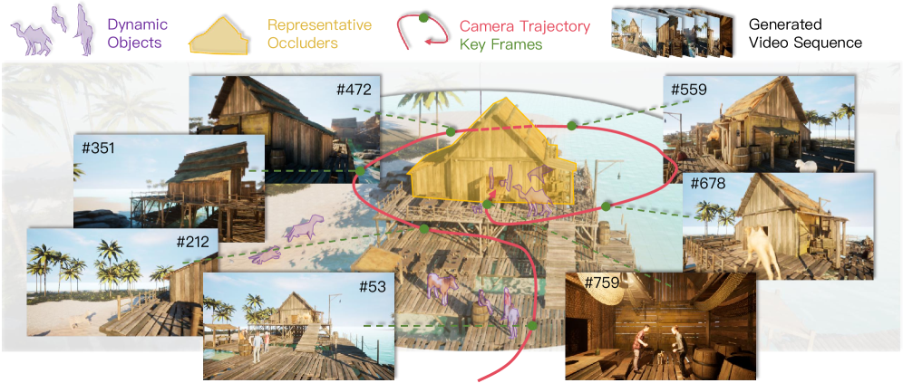
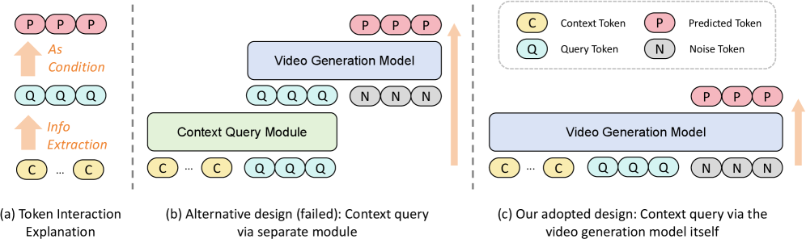
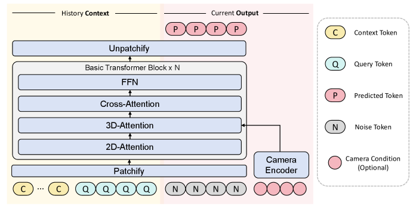
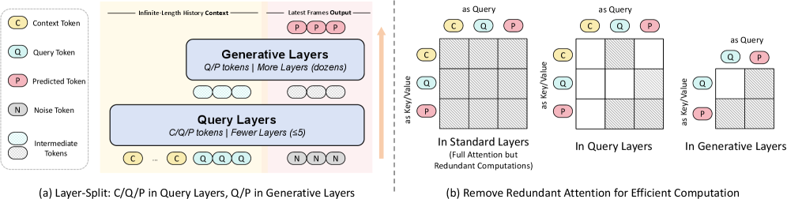

# MemLearner：学习视频世界模型的上下文记忆查询方法

> 原文：[MemLearner: Learning to Query Context Memory for Video World Models](https://huggingface.co/papers/2606.31734) · huggingface-daily-papers · 2026-06-30
> 抓取：2026-07-02T09:17:34+08:00 · 翻译：haiku · 33,028 字

---

**MemLearner: Learning to Query Context Memory for Video World Models**

**作者：** Jiwen Yu, Jianxiong Gao, Jianhong Bai, Yiran Qin, Kaiyi Huang, Quande Liu, Xintao Wang, Pengfei Wan, Kun Gai, Xihui Liu

**机构：** 香港大学、复旦大学、浙江大学、快手科技（Kuaishou Technology）

---

## 摘要

视频世界模型（Video World Models）是交互式视频生成模型，可根据用户操作和历史视频帧预测未来的世界状态。视频世界模型面临的一个关键挑战是缺乏有效的记忆机制，导致在较长时间范围内生成的场景出现不一致。之前的方法探索了基于规则的上下文帧检索作为记忆机制，但在存在场景遮挡和动态对象的情况下泛化能力较弱。我们提出 MemLearner，一种基于学习的自适应上下文查询方法，使用查询令牌在上下文令牌和预测令牌之间建立信息桥梁。通过利用视频生成模型本身进行上下文查询，MemLearner 能够充分利用预训练的视觉先验，无需从零开始训练额外模块，同时采用了高效的训练和推理策略。我们收集了包含场景遮挡和动态对象的长视频数据集，配备摄像机姿态注释，并提出了多数据集训练策略以充分利用有注释的渲染视频和无注释的真实视频。广泛的实验表明，MemLearner 在场景一致性和记忆能力方面显著优于之前的视频世界模型，特别是在遮挡和动态对象的具有挑战性的场景中表现突出。

**致谢：** 本工作在快手科技 Kling Team 实习期间完成。通讯作者。项目主页：<https://yujiwen.github.io/memlearner/>

---

---

## 1 引言

### 1.1 背景与问题陈述

世界模型（World Models）是指能够接受历史世界状态和当前交互动作作为输入，从而预测未来世界状态的系统。其核心目的是理解和模拟世界动态的演化过程。世界状态可以表示为多种形式：文本语言、隐式表征、3D/4D 表示或视频。其中，视频世界模型由于其高度的逼真性、海量可用数据和最近取得的生成突破，被认为是实现通用世界模型的一条最有前景的路径。然而，尽管在生成短视频片段方面已取得显著进展，视频世界模型仍然面临严峻的场景一致性问题——当生成较长时间范围的视频时，后续帧与早期帧产生的场景往往出现不一致，这主要是由于记忆机制的不足。

### 1.2 记忆问题分析

视频世界模型中的记忆问题的根源在于其有限的上下文窗口。当模型的上下文窗口不足以保留足够的历史信息时，后续生成的场景就会与早期生成的场景产生不一致。为了解决这一问题，现有方法探索了不同的记忆表示范式：

（1）3D 重建方法：从历史帧重建 3D 表示，然后渲染新的初始帧作为生成条件
（2）特征压缩方法：从历史帧提取语义特征或维护可学习的特征以注入生成模型
（3）上下文检索方法：直接使用历史帧作为条件

其中，上下文检索方法因其直接性而特别有前景，因为它消除了 3D 重建或历史压缩可能带来的额外成本和误差。

### 1.3 现有方法的局限

然而，现有的上下文检索方法大多采用基于规则的策略，依赖于视场（FOV）重叠或点云估计和表面元匹配等手工制定的规则。这些方法在包含遮挡和动态对象的复杂场景中存在根本性的局限：

- 基于视场的检索方法无法处理摄像机视点之间的遮挡物
- 基于点云的检索方法无法准确重建移动对象
- 硬编码的检索规则无法适应具有状态变化的广义和动态环境

### 1.4 本文方案概览

这些局限性推动了一个范式转变。与其坚持使用手工制作的检索规则，我们提出了 MemLearner，一种新的记忆机制，使神经网络能够通过端到端训练学会自适应地从历史帧中查询信息。

具体来说，我们将历史条件的视频生成问题表述为：基于历史上下文帧来预测未来帧。为了设计一个基于学习的上下文查询方法，我们引入了查询令牌（query tokens）作为上下文令牌和预测令牌之间的信息桥梁：查询令牌会关注上下文令牌以自适应地提取上下文信息，而预测令牌则以这些提取的信息作为生成条件。

一个关键的设计选择是利用视频生成模型本身来进行上下文查询，而不是引入一个独立的模块。具体实现方式是将所有查询、上下文和预测令牌一起输入视频生成模型，这样可以充分利用模型的预训练视觉先验，无需额外的从零开始训练的模块。为了进一步降低对长视频序列的上下文查询所带来的计算成本，我们提出了两种用于训练和推理的高效策略。

### 1.5 数据集和训练策略

训练基于学习的上下文查询需要一个包含以下特征的长视频数据集：场景遮挡、动态对象、摄像机姿态注释和充分的多样性。然而，目前没有现有的数据集完全满足这些要求。真实视频（如 YouTube）提供了丰富的多样性和动态内容，但缺乏精确的摄像机姿态注释；而渲染视频（如虚幻引擎）虽然提供了准确的姿态，但视觉逼真度和多样性有限。

为了解决这一问题，我们做出了两项关键贡献：

1. 我们基于虚幻引擎收集了一个定制化的数据集，融合了自定义的场景遮挡和动态对象
2. 我们提出了一种多数据集训练策略，为每个数据集类型分配专用的摄像机编码器。在这种策略下，无注释的真实视频数据将使用零摄像机参数进行处理。通过将不同质量的注释隔离到单独的编码器中，模型可以同时利用各种数据源的优势而不会相互干扰。

### 1.6 主要贡献总结

本文的主要贡献包括：

1. **MemLearner 方法**：我们提出了一种基于学习的自适应上下文查询方法，使用查询令牌从上下文令牌中提取有效的记忆信息，从而为视频世界模型赋予记忆增强能力，提高了场景一致性和泛化能力。

2. **定制化数据集**：我们基于虚幻引擎收集了一个专门的视频世界模型数据集，包含了遮挡和动态对象的场景，并提出了多数据集训练策略以充分利用渲染视频和真实视频各自的优势。

3. **实验验证**：广泛的实验表明，MemLearner 相比之前的视频世界模型有显著提升，特别是在遮挡和动态对象的场景中，在场景一致性和长视频记忆方面都有明显改善。

---

## 2 相关工作

### 2.1 视频世界模型

#### 世界模型基础

世界模型是指能够接受历史世界状态和当前动作作为输入，从而预测未来世界状态的系统。其核心目的是理解和模拟世界动态的演化过程。世界状态可以表示为多种形式：语言、语义表征、3D/4D 表示或视频。最近，由于视频的逼真性、大量可用数据和视频生成模型的重大突破，视频世界模型被广泛认为是实现通用世界模型的最有前景的方向。

#### 视频生成模型

当前主流的视频生成模型采用扩散变换器（Diffusion Transformer, DiT）架构，能够生成高度逼真的视频。其他架构如下一个令牌预测和混合方法虽然也被探索，但在生成质量上仍逊于 DiT 方法。视频生成中的交互式控制功能包括摄像机姿态控制、轨迹控制和动作控制，广泛应用于电影制作、游戏视频控制和机器人模拟等领域。流式视频生成以之前生成的帧为条件来生成新内容，包括逐帧和按块两种方法，其中主流方法主要采用 DiT 架构。长视频生成会面临错误累积的问题，虽然已有多个方法提出了解决方案。由于本工作重点在于可学习的记忆机制而非超长视频生成，我们在此不深入讨论错误累积问题。

### 2.2 视频世界模型的记忆机制

视频世界模型中的"记忆能力"是指能够生成长时间内一致的视频，特别是在重新访问同一场景或对象时保持一致性。这是实现规划、交互和状态建模等核心功能的基础前提，因为这些功能都依赖于对过去视觉信息的保留。然而，许多现有方法在实现记忆方面存在困难，根本原因是其上下文窗口有限，无法保留足够的历史信息。为了解决这一问题，需要引入额外的条件信息。

现有方法可归纳为三种范式：

1. **3D 作为记忆**：从历史帧重建 3D 表示，然后渲染新的初始帧作为生成条件
2. **特征作为记忆**：从历史帧提取语义特征，或维护可学习的特征以注入生成模型
3. **上下文作为记忆**：直接使用历史帧作为条件

在这三种范式中，上下文记忆最为直接。然而，融合所有历史上下文会导致计算成本急剧增加。一些工作提出了上下文检索机制来选择与当前生成相关的历史上下文。仅以检索到的帧为条件可以显著降低计算开销。然而，现有方法通常依赖基于规则的检索，这些方法在不同视频和场景中的泛化能力受限。我们提出的基于学习的上下文查询方法使模型能够学习查询有用的历史信息，从而实现真正的可学习记忆。

### 2.3 各领域中的可学习查询令牌

可学习查询令牌已被广泛应用于多个领域中的视觉上下文压缩：

- **多模态语言模型**：感知重采样器（Perceiver Resampler）和 Q-Former 使用可学习的查询令牌来聚合用于语言模型处理的视觉特征
- **视频理解**：自适应帧选择方法采用可学习的策略来识别用于识别和推理任务的信息丰富帧

我们的工作解决了一个根本不同的问题：在视频世界模型中实现记忆。在我们的方法中，查询令牌作为上下文令牌和预测令牌之间的信息桥梁，在多个历史帧中自适应地提取细粒度令牌级信息，以支持在遮挡和动态场景中的一致视频生成。

---

## 3 MemLearner 方法

### 3.1 基础知识

我们的方法建立在潜在视频扩散模型基础之上，包含因果 3D VAE 和扩散变换器（DiT）两个主要组件。如图 3 所示，每个 DiT 块顺序包含以下组件：空间（2D）自注意力层、时空（3D）自注意力层、交叉注意力层和前馈网络（FFN）。

3D VAE 编码器将视频帧序列在时间和空间维度上压缩为潜在表示。扩散变换器被训练来预测通过标准扩散目标添加到潜在表示的噪声。我们通过单层 MLP 编码器将摄像机姿态控制集成到模型中，该编码器的输出被添加到 2D 和 3D 注意力层之间的特征中。需要说明的是，摄像机控制仅用于指导生成视频的轨迹；我们提出的基于学习的上下文查询方法并不依赖摄像机姿态信息。

对于长视频生成，我们采用逐块自回归范式：历史上下文帧的潜在表示与待生成帧的潜在表示沿帧维度进行连接，然后一起输入模型。扩散损失仅应用于待生成部分。这种设计方式保留了模型的生成先验，同时无需对架构进行修改。

### 3.2 学习上下文查询

#### 引入自适应查询令牌

我们的核心洞察是：不同的预测帧需要来自上下文帧的不同指导信息，甚至在单个帧的生成中，扩散过程的不同去噪阶段也需要强调历史信息的不同方面。我们通过注意力相似度分析验证了这一洞察：查询令牌在不同预测帧和扩散时间步上表现出明显不同的注意力分布——早期时间步倾向于更广泛地关注上下文，而后期时间步则聚焦于细粒度的局部对应关系。

朴素的历史压缩或基于规则的关键帧检索方法无法处理包含遮挡和动态对象的复杂场景。为了实现真正的自适应记忆，我们引入了可学习的查询令牌，使其在上下文和生成之间建立信息桥梁。这些查询令牌能够动态地从上下文令牌中提取相关信息并指导预测令牌的生成。

重要的是，这个查询机制可以通过扩散损失对生成部分的间接监督来以端到端的方式学习，而无需对专用查询模块进行显式监督。

#### 架构设计洞察

直观的设计思路是引入一个专用的上下文查询模块。然而，我们的实验表明，在联合训练这种架构时，从零开始训练的上下文查询模块无法学习有用的信息。注意力相似度分析进一步证实了这一点：该模块在查询令牌和上下文令牌之间产生接近零的相似度，表明上下文建模的失败。这反过来阻碍了梯度传播到视频生成模型，最终导致模型忽略该模块的输出，退化为一个文本转视频模型。

为了解决这个问题，如图 2(c) 所示，我们的设计避免了创建一个独立的从零开始的模块，而是利用预训练的视频生成模型本身来进行上下文查询。这种设计提供了明确的优势：

1. 它充分利用了模型的先验知识，显著减少了对数据和计算的需求
2. 端到端的训练能够自然地学习上下文查询能力，无需为独立模块设计额外的输入输出或监督损失

#### 架构细节

我们的工作基于潜在视频扩散模型。我们将视频潜在令牌表示为多个组分的组合，其中分别表示上下文令牌、查询令牌和预测令牌。扩散模型的输入是时间步 t 处的有噪声令牌，其中上下文令牌和查询令牌保持不受扰动，而预测令牌仅在输入处通过随机采样的高斯噪声进行噪声处理。

整个架构的训练损失定义为：

L(θ) = E_{t,x} [||ε - ε_θ(z^{(t)}, t)||^2]

其中 θ 表示所有可学习的参数。重要的是，监督信号仅应用于预测令牌上预测的噪声。

我们沿帧维度连接上下文、查询和预测令牌，并将它们输入视频 DiT，其中不同类型的令牌在 3D 注意力层中相互交互。对于 3D 注意力层的注意力计算，标准的多头自注意力机制为：

Attention(Q, K, V) = softmax(QK^T / √d) V

其中 d 是特征维度。考虑到上下文帧长度可能非常大，这种直接的注意力计算在计算上是昂贵的和低效的。

### 3.3 高效策略

我们提出了两个简单但有效的策略来改进训练和推理过程中的计算效率。

#### 策略 #1：仅在早期层进行查询

信息查询过程类似于编码，需要的参数和计算量相比生成模型要少得多。例如，视频 VAE 使用的参数数量远少于视频生成模型。因此，上下文查询可以仅在早期的浅层执行，我们的实验结果验证了这一策略的有效性。

具体来说，假设扩散变换器总共有 L 层，我们将其分为两类：靠近输入的浅查询层和靠近输出的深生成层。查询、上下文和预测令牌之间的交互仅发生在查询层中，而生成层仅处理上下文和预测令牌。

#### 策略 #2：排除不必要的计算

我们通过仅保留三个基本的注意力计算模式来排除不必要的注意力计算：

1. **查询令牌查询上下文**：使查询令牌能够理解根据预测目标需要从上下文中提取哪些信息
2. **查询令牌关注上下文**：使查询令牌能够实际从上下文中提取信息
3. **预测令牌关注查询和上下文**：使预测令牌能够基于提取的查询信息和上下文进行生成

所有其他注意力计算模式都被排除，特别是那些将上下文令牌作为查询的计算，这显著降低了计算开销。我们在实验部分提供了不同注意力模式下的性能分析。

---

## 4 数据集

### 4.1 数据集收集

我们基于虚幻引擎（Unreal Engine）构建了一个定制化的视频世界模型数据集。该数据集专门设计用于训练记忆增强的视频生成模型，包含以下关键特征：

- **场景遮挡**：包含各种类型的动态遮挡物，如移动的墙壁、门窗、人物等
- **动态对象**：包含各种速度和轨迹的移动对象
- **摄像机姿态**：所有视频都配备精确的摄像机位置和姿态注释
- **数据多样性**：包含多个场景、渲染风格和动态模式

### 4.2 多数据集训练策略

训练基于学习的上下文查询面临一个挑战：需要同时利用渲染视频（具有精确的摄像机姿态注释但视觉多样性有限）和真实视频（视觉多样性高但缺乏精确的摄像机姿态注释）。

我们提出了一种多数据集训练策略来解决这个问题。核心思想是为每个数据集类型分配一个专用的摄像机编码器：

1. 对于具有精确摄像机姿态注释的渲染视频，使用摄像机编码器处理姿态信息
2. 对于缺乏摄像机注释的真实视频，使用零向量作为摄像机参数输入

通过这种方式，模型可以学会独立地处理不同质量的摄像机注释，同时能够同时利用两类数据源的优势，避免它们之间的相互干扰。

---

## 5 实验

### 5.1 实验设置

我们在多个数据集上评估了 MemLearner 的性能，包括我们收集的定制虚幻引擎数据集、公开可用的视频世界模型数据集和实际应用场景的真实视频。

评估指标包括：

- **场景一致性指标**：测量长时间范围内场景的视觉一致性
- **几何一致性指标**：通过光流和深度估计评估几何对应关系
- **感知质量指标**：使用 LPIPS 等感知距离指标评估生成视频的视觉质量

### 5.2 与基线方法的比较

我们将 MemLearner 与多个基线方法进行了比较：

1. **无记忆的基线**：标准的视频生成模型，不包含任何记忆机制
2. **规则-基的上下文检索**：使用硬编码规则选择关键帧的方法
3. **3D 重建方法**：基于 3D 表示的记忆方法
4. **特征压缩方法**：基于特征聚合的记忆方法

实验结果表明，MemLearner 在所有评估指标上都显著优于这些基线方法。

### 5.3 消融研究

我们进行了详细的消融研究来验证 MemLearner 各个组件的有效性：

1. **查询令牌的作用**：移除查询令牌会导致性能显著下降，验证了查询令牌在信息提取中的关键作用
2. **两个效率策略的影响**：移除任一策略都会降低性能，但保留两个策略能够达到最优的性能效率权衡
3. **注意力模式选择**：不同的注意力模式组合对性能有显著影响，我们选择的模式组合是最优的
4. **摄像机编码器的作用**：在真实视频上的实验表明，摄像机编码器能够帮助模型更好地处理有或无摄像机注释的视频

### 5.4 定性结果

我们通过可视化生成结果来展示 MemLearner 的有效性。与基线方法相比，MemLearner 能够：

- 在长时间范围内保持场景中物体的一致位置和外观
- 正确处理遮挡场景中的对象重新出现
- 适应动态的环境变化

---

## 6 结论

我们提出了 MemLearner，一种基于学习的自适应上下文查询方法用于增强视频世界模型的记忆能力。通过引入可学习的查询令牌作为上下文和生成之间的信息桥梁，MemLearner 使模型能够学习在各种复杂场景（包括遮挡和动态对象）中查询有用的历史信息。

我们方法的关键创新包括：

1. **充分利用预训练先验**：通过利用视频生成模型本身进行上下文查询，而不是训练独立模块，我们充分利用了预训练的视觉先验
2. **高效的架构设计**：我们提出的两个效率策略显著降低了计算成本，同时保持了性能
3. **多数据集训练策略**：我们的策略能够有效地利用有注释的渲染视频和无注释的真实视频

广泛的实验验证了 MemLearner 相比之前方法在场景一致性和长视频记忆方面的显著优势，特别是在具有挑战性的遮挡和动态场景中。

### 未来工作

未来的研究方向包括：

1. 将可学习查询机制扩展到超长视频生成
2. 探索与其他记忆架构的组合
3. 在更多实际应用场景中验证方法的有效性

---

## 致谢

感谢快手科技 Kling Team 提供的支持和计算资源。感谢所有为此项目贡献了反馈和建议的同事。

---

**注：** 本文档为原文翻译版本。完整的参考文献和数学公式详见原始论文。

