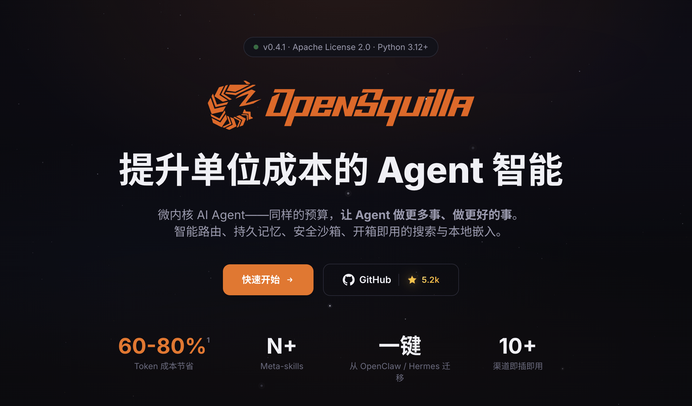

# OpenSquilla 发布 0.4.0：AI 写代码首次能「自我验证」

> 原文：[OpenSquilla 发布 0.4.0：AI 写代码首次能"自我验证"](https://www.qbitai.com/2026/07/441240.html) · qbitai · 2026-07-01
> 抓取：2026-07-02T09:12:11+08:00 · 翻译：无（中文原文） · 3486 字

OpenSquilla 上线后数周内 GitHub star 增至数千量级

开源 AI Agent 项目 OpenSquilla 近日发布 0.4.0 版本，核心更新是推出编码工作流 coding 模式，并首次为 AI 编码引入"**自我验证**"机制：AI 不再止步于"我改好了"的口头交付，而是在交回结果前，先用测试为自己跑出一份可复核的、证明"改对了"的证据。

这一机制指向 AI Coding 当前最棘手的瓶颈——信任。过去一年 AI 写代码能力突飞猛进，但"能写"不等于"能信"：多数编码 Agent 改完即交，对错仍要人逐行复核，这也是 AI 编码难以真正无人值守、规模化进入生产环境的关键障碍。把验证内化进 Agent 自身，意味着行业评判 AI 编码的标准，正从"它声称改对了"转向"它能否自证改对了"。

其做法是一条独立的"**红绿回归证据链**"：先写一个注定失败的测试给问题定性、证明它真能抓住 bug，再把功能做好让测试由红转绿，最后跑一遍项目原有测试确认没弄坏别处；三关全过才算交付，任一不过直接打回。配套还有默认的自动修复闭环——不通过就自动重改到通过为止，以及隔离施工——改动只在隔离副本里进行、验收合格才落回源码。

在官方的案例演示中，Coding 模式为知名开源项目 micrograd（Anthropic 研究员 Andrej Karpathy 的极简自动微分库），新增了"计算正确梯度"的功能——而梯度一旦算错，模型不报错也不崩溃，只会悄悄越学越偏，是最难靠肉眼发现的 bug。演示分两步：先由 AI 走完上述"红→绿→回归"三关、自交证据；再由人把 micrograd 的新功能与行业标准工具 PyTorch 在同一道题上并排比对，前向值与每一个梯度小数点后 10 位完全一致。换言之，不是"AI 自己说对"，而是"它和官方标准答案分毫不差"。这也是在 Coding 赛道上，团队继新一代基准 claw-swe-bench 之后，落地 agent runtime 的最新实践。

同期，OpenSquilla 还推出首个签名并公证的桌面安装包，macOS 与 Windows 均可双击安装、无需命令行。

OpenSquilla 主打"提升单位成本的 Agent 智能"，以 Learnable Harness 为切入点，目标打造性价比最高的 Agent 产品。在主流 Agent 框架普遍推高模型调用、token 成本攀升的背景下，它通过本地智能路由，按任务复杂度自动选模型、技能按需加载、记忆按需检索、工具结果预处理等方式，在"调用前"就压降成本。**据硅星人此前报道**，提供的数据显示，其智能路由相比通用网关 OpenRouter，路由精度高约 4.4 个百分点、成本低约 75%；与旗舰模型跑同类任务质量基本持平、成本相差约 9 倍。OpenSquilla 官网则称，常规场景内测综合成本可下降约 60–80%。

基元律动创始人王云鹤曾负责头部科技公司大模型研发，CTO 为韩凯。OpenSquilla 上线后数周内 GitHub star 增至数千量级；据公开报道，公司成立仅数月即完成首轮融资，是 Harness 和 Agent 原生模型方向上为数不多的代表性玩家。

*本文由 OpenSquilla 提供，量子位获授权转载，观点归原作者所有。
