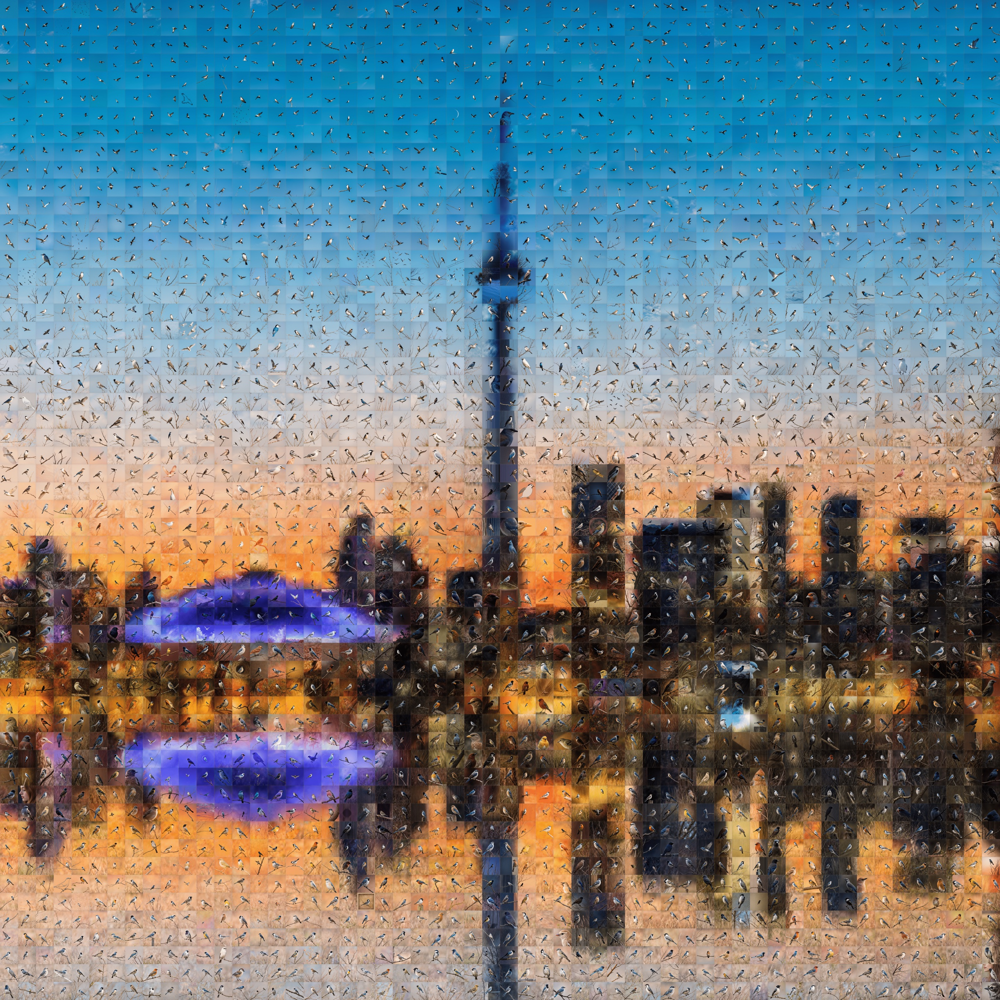

# PhotoQuilt：免训练任意分辨率光相马赛克生成框架

> 原文：[PhotoQuilt: Training-Free Arbitrary-Resolution Photomosaics via Bootstrapped Tiled Denoising](https://huggingface.co/papers/2606.30968) · huggingface-daily-papers · 2026-06-28
> 抓取：2026-07-02T09:15:16+08:00 · 翻译：haiku · 466 字

## 概述

PhotoQuilt 是一个新颖的框架，用于生成光相马赛克——大型合成图像，其中单个图块可读为不同的照片，而整体形成连贯的场景。该方法无需训练，可适应各种扩散模型架构。

## 核心创新

该方法采用"引导式分块去噪"，将全局构图与局部图块生成解耦。如作者所述："我们首先生成低分辨率全局构图以固定布局，然后在潜在空间中放大并重新注入噪声。"

该过程分三个阶段：
1. 生成或编码低分辨率基础图像
2. 放大至目标分辨率并添加受控噪声
3. 独立去噪每个图块，同时维持共享的结构基础

## 关键优势

**可扩展性**：该方法通过在单个图块内限制注意力，相对于画布大小实现线性复杂度，避免直接高分辨率生成的二次方成本。

**质量权衡解决**：与以往在全局一致性或局部细节间做取舍的方法不同，PhotoQuilt 通过重噪强度参数（s）平衡两者，该参数充当"准则间的拨号盘"。

**灵活性**：框架支持多种条件模式，包括共享全局提示、单个图块文本提示，以及图像库条件用于具有生成细化的经典检索式马赛克。

## 实验结果

在 Stable Diffusion 2.1、FLUX.1 和 FLUX.2 骨架上的测试显示，PhotoQuilt 在全局结构指标（PSNR、SSIM、LPIPS）和局部图块质量测度（CLIP、BLIP 得分）上都优于六个基准方法。

人类偏好得分（HPSv2、Image Reward）确认该方法生成的光相马赛克"既是自包含的图像，又是对全局构图的空间一致的贡献者"。

