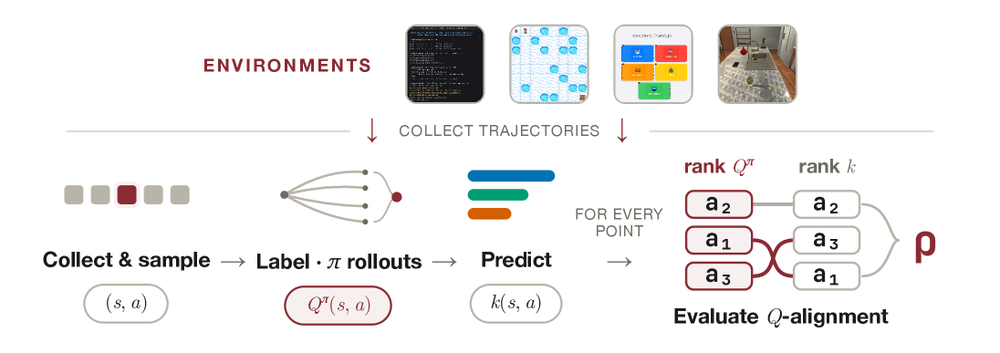
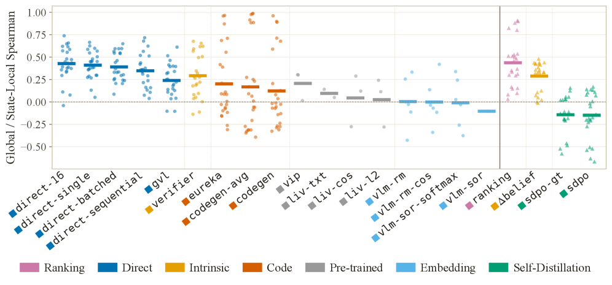
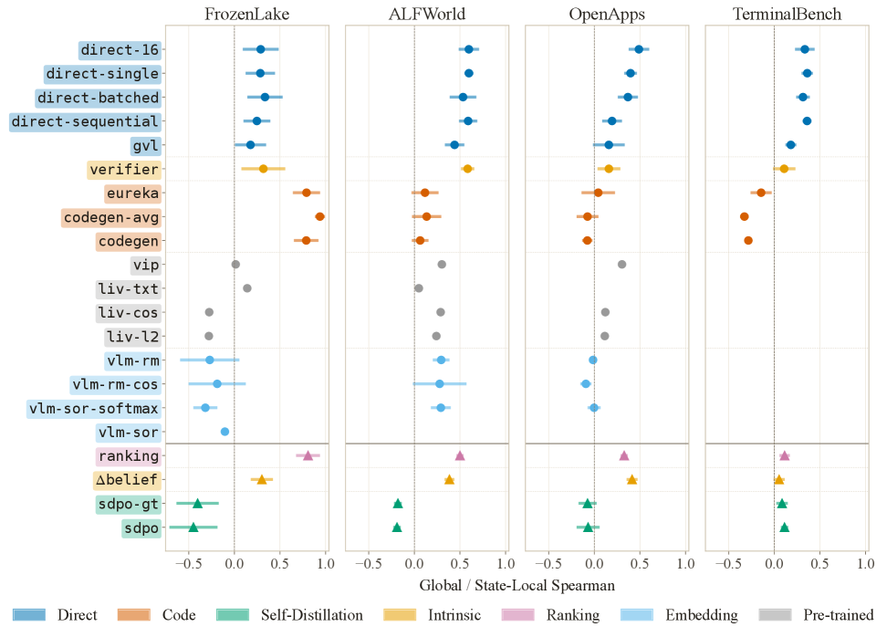
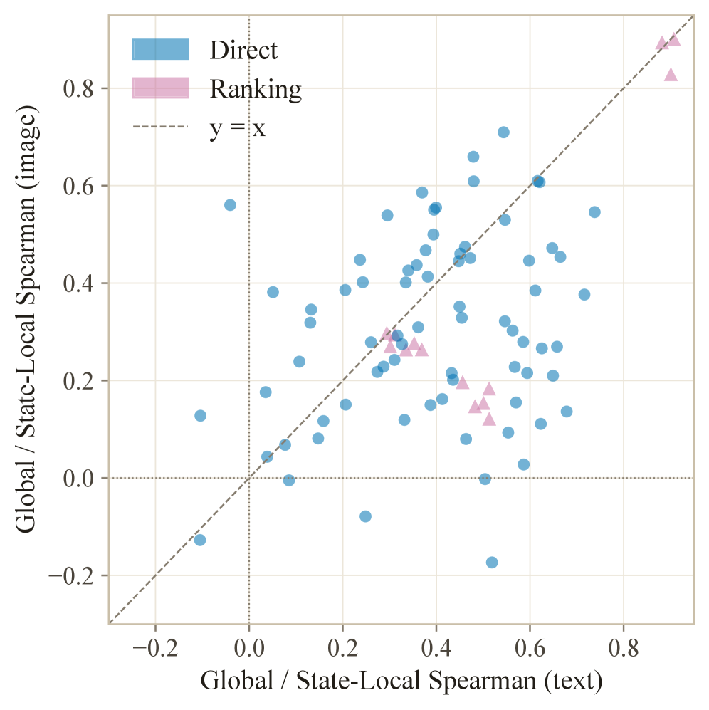
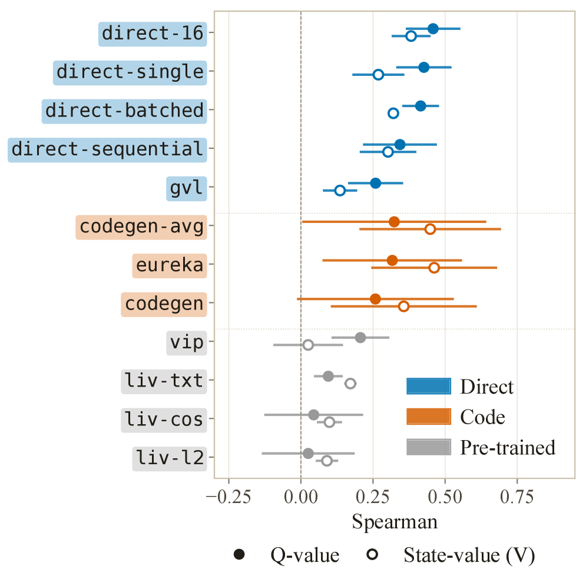
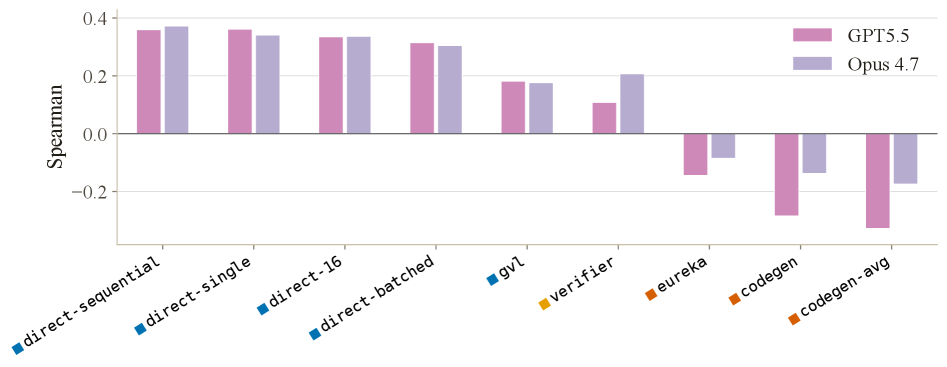
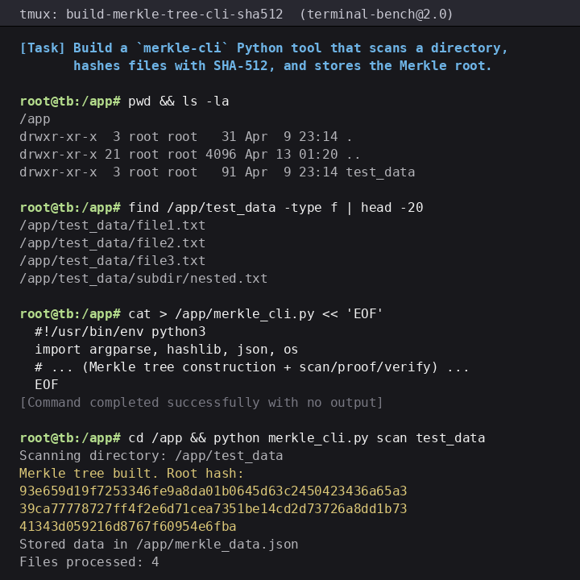
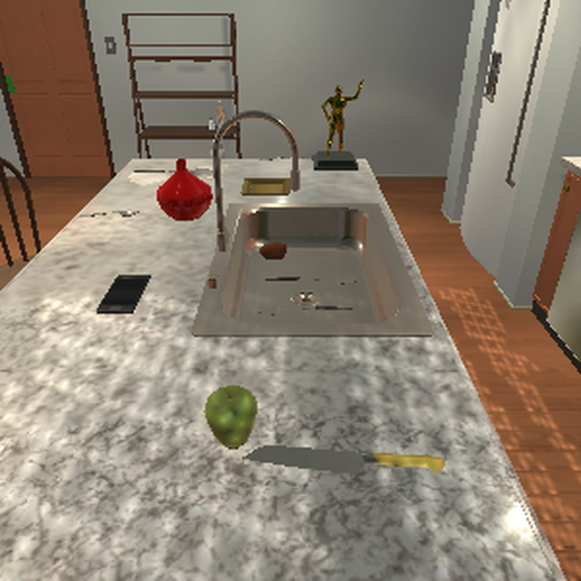
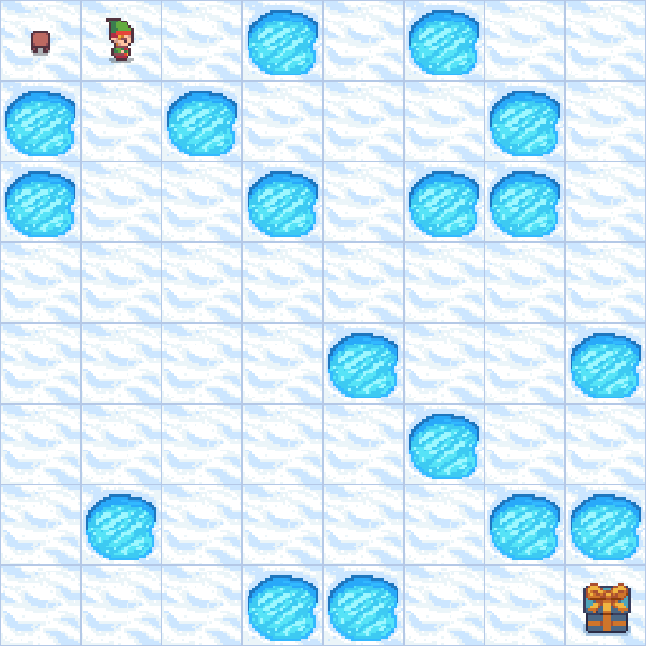

# QVal：为长程LLM代理廉价评估稠密监督信号

> 原文：[QVal: Cheaply Evaluating Dense Supervision Signals for Long-Horizon LLM Agents](https://arxiv.org/html/2606.32034) · huggingface-daily-papers · 2026-06-30
> 抓取：2026-07-02T09:16:29+08:00 · 翻译：haiku · 91348 字


# QVal: Cheaply Evaluating Dense Supervision Signals for Long-Horizon LLM Agents

Sergio Hernández-Gutiérrez1  Matteo Merler 2  Ilze Amanda Auzina1∗
Joschka Strüber1Ameya Prabhu1†Matthias Bethge1†
1Tübingen AI Center, University of Tübingen  2Fondazione Bruno Kessler
Equal Contribution   †Equal Advising   Correspondence to: sergio.hernandez@bethgelab.orgAbstract
LLM agents increasingly act over long horizons, where a single trajectory can contain hundreds or thousands of actions.
In these settings, outcome-only rewards provide too sparse guidance, failing to inform the model about the goodness of intermediate actions.
Dense supervision methods aim to solve this problem by scoring intermediate steps, from intrinsic confidence to self-distillation and embedding similarities.
However, it is common practice to evaluate them by measuring the downstream performance of a training pipeline that integrates them.
This is expensive, conflates supervision quality with training engineering confounders, and renders different methodological families requiring distinct training setups incomparable.
As a result, dense supervision methods are rarely benchmarked on common ground.
We introduce QVal, a training-free testbed for directly evaluating dense supervision signals.
Given a state-action pair, QVal measures how well a method’s score is *QQ-aligned*: whether it orders actions according to the QQ-values of a strong reference-policy.
This lets us compare signals before any training run and separate signal quality from other engineering choices.
We instantiate QVal as QVal-v1.0, benchmarking 21 dense supervision methods across four diverse environments and seven methodological families, with over 1.2K evaluation experiments across six open-weight model backbones.
We find that simple prompting baselines consistently outperform recent dense supervision methods from the literature, and that performance clusters strongly by family.
These findings hold across model sizes, environments, and observation modalities. QVal is designed to be easily extensible to new environments and methods, enabling researchers to iterate on dense supervision methods before any training run.

| [Website](url)[Code](url)[Datasets](url)|

Figure 1: QValdesign pipeline.
We collect trajectories in multi-turn environments, sample candidate state-action pairs, and label them with estimated QQ-values with respect to a reference policy π\pi. We perform method prediction and measure QQ-alignment between the predicted scores and the labels. This training-free testbed isolates learning-signal quality before any downstream RL training.
### 1 Introduction

Large Language Models (LLMs) increasingly act as agents that write code, operate graphical interfaces, and navigate simulated environments.
These are long-horizon tasks, where a single trajectory can span hundreds or thousands of actions.
Sparse rewards make learning intractable as horizons grow: an outcome-based reward gives little guidance about the goodness of individual steps and, more critically, it may never be observed if the task is beyond the frontier of the model’s capabilities.
Current Reinforcement Learning (RL) algorithms for LLM post-training primarily rely on sampling-based value estimation. For example, GRPO (Shao et al., [2024](url)) estimates the value of a completion by comparing samples within a group.
This works best when trajectories are short, where only a reasonable number of samples is needed to attribute which actions caused the outcome.
However, agent trajectories increasingly involve multi-step tool use, recursive decomposition, and context compaction; as these grow in length outcome rewards become insufficient, and group-based estimators do not identify which actions contributed to the final outcome.

This has motivated methods that produce dense supervision signals. These include signals derived from token probabilities along reasoning traces (Yoon et al., [2026](url)), tool calls (Xie et al., [2026](url)), or interaction feedback (Auzina et al., [2026](url)), as well as self-distillation approaches, which derive intermediate supervision from model-generated judgments or targets (Hübotter et al., [2026](url); Shenfeld et al., [2026](url); Song et al., [2026](url)).
Although these methods differ in how they construct their scores, and have largely been developed and evaluated in isolation, they all share the goal of assigning useful values to intermediate states or actions.
We therefore study them as a common class of *dense supervision methods* and group them into families according to how each method obtains its signal.

The primary bottleneck towards comprehensive evaluation is that we lack a cheap and direct way to compare dense supervision signals. Today, a method is evaluated by integrating it into a post-training pipeline and measuring the downstream performance improvement. This is expensive, and often unachievable due to the distinct setups required by different methods.
It further makes the results hard to interpret: the measured gain conflates the supervision quality and other engineering choices used for RL training, such as algorithmic or optimization features, normalization techniques, loss-function integration strategies, and balancing with other training signals.
We pose the following research question:

> 
Can we evaluate dense supervision signals in isolation,

before any expensive post-training runs?


We introduce QVal, a cheap, training-free *testbed* for dense supervision methods. This enables researchers to iterate on new approaches and their variants quickly, evaluating candidate signals before integrating them into post-training pipelines. Dense signals also matter beyond training: they can guide search at test time, including tree search or MCTS-style rollouts.

QVal has a simple design, shown in Figure [1](url). For a given environment, we construct a dataset where each sample is a state-action pair (s,a)(s,a) labelled with a *reference QQ-value*: the expected return of the trajectory that continues from (s,a)(s,a) under an expert *reference policy*.
We obtain this expert from either an optimal policy where one exists, or a frontier model where it does not, estimating the value from the best of several rollouts (Section [3](url)).
We evaluate a method by scoring every sample by its *QQ-alignment*: how well its predicted scores order the samples relative to the reference QQ-values.
Because every method sees the same inputs and is judged against the same targets, with fixed models and prompt context, QVal isolates the quality of the signal itself from the confounders of a training pipeline, giving a cheap early indication of whether the method provides a viable learning signal.

We instantiate this methodology as QVal-v1.0, which at release covers four multi-turn environments across text and visual domains: programming and agentic terminal interaction in TerminalBench (Merrill et al., [2025](url)), computer and application use in OpenApps (Ullrich et al., [2026](url)), embodied reasoning in ALFWorld (Shridhar et al., [2020](url)), and goal-directed navigation in FrozenLake (Towers et al., [2025](url)). For each environment, we collect state-action pairs and provide reference QQ-values. We use these datasets to evaluate 21 dense supervision methods spanning seven methodological families: direct prompting (Liu et al., [2023](url); Ma et al., [2024](url)), intrinsic signals (Auzina et al., [2026](url); Kwok et al., [2026](url)), code generation (Ma et al., [2023b](url); Li et al., [2024](url)), self-distillation (Hübotter et al., [2026](url)), ranking-based prediction, pre-trained models (Ma et al., [2022](url), [2023a](url)), and embedding similarity (Rocamonde et al., [2024](url); Baumli et al., [2023](url)).

We find substantial differences in QQ-alignment across methods. Direct prompting and ranking methods perform best on average, and performance often clusters by methodological family. Code-based methods perform well in the smaller, more structured environments but weaken in the more open-ended settings we study. Added complexity within a family rarely improves alignment over simpler variants. We also find that these patterns are not explained by a single ordering of environment difficulty: different families respond differently to the state space, action space, observation modality, and available feedback. Text observations generally produce stronger alignment than image observations in our experiments, while the relative ordering of methods is largely preserved across action-value and state-value targets.

In summary, we make three main contributions. First, we introduce QVal, a training-free
testbed that evaluates dense supervision methods by their *QQ-alignment*, how well
their scores order actions according to reference QQ-values, across text and visual domains (Section [2](url)). It provides a common comparison ground, makes signal quality cheap to measure, and separates that measurement from later integration into training pipelines. Second, we explore how to annotate multimodal datasets of state-action pairs from four diverse environments, i.e., how to generate the reference QQ-values, resulting in QVal-v1.0 (Section [3](url)). Third, we benchmark 21 dense supervision methods, grouped into seven families, across six open-weight backbones from 9B to 122B parameters, for more than 1.2K experiments (Section [4](url)).

QVal is built to grow. The same collection and labelling procedure can be easily extended to new environments. A new method only needs to provide one score per state-action pair to allow direct comparisons. We will continue expanding QVal as new agentic benchmarks emerge. Practitioners can also use our framework to build evaluation datasets for the tasks and environments that matter in their own post-training pipelines.

### 2 QVal: A Training-Free Testbed for Dense Supervision Methods

Dense supervision should primarily predict the eventual success of an agent. A single long-horizon trajectory contains many actions, and one that looks reasonable in isolation can still make the final goal harder to reach. Dense supervision methods score each intermediate action, so a score is only useful if it reflects *where a decision leads* rather than how good it looks locally.
QVal asks exactly this: does a method assign higher scores to the actions that make eventual success more likely?

Setup.
We consider an environment modelled as a Markov Decision Process (Bellman, [1957](url)), with state space 𝒮\mathcal{S}, action space 𝒜\mathcal{A}, transition distribution T​(s′∣s,a)T(s^{\prime}\mid s,a), reward function r:𝒮×𝒜→ℝr:\mathcal{S}\times\mathcal{A}\to\mathbb{R}, and discount factor γ∈[0,1]\gamma\in[0,1]. At each step the agent
observes a state s∈𝒮s\in\mathcal{S}, takes an action a∼π(⋅∣s)a\sim\pi(\cdot\mid s), receives reward r​(s,a)r(s,a), and the environment transitions to s′∼T(⋅∣s,a)s^{\prime}\sim T(\cdot\mid s,a). A trajectory
τ=(s0,a0,r0,s1,…)\tau=(s_{0},a_{0},r_{0},s_{1},\dots) is a realization of this process, with return G​(τ)=∑t≥0γt​rtG(\tau)=\sum_{t\geq 0}\gamma^{t}r_{t}.
A *policy*π​(a∣s)\pi(a\mid s) maps states to distributions over actions. The *QQ-value function* of a policy π\pi,

| | Qπ​(s,a)=𝔼τ∼π​[G​(τ)∣s0=s,a0=a],Q^{\pi}(s,a)=\mathbb{E}_{\tau\sim\pi}\!\left[G(\tau)\mid s_{0}=s,\,a_{0}=a\right],| | (1)|


gives the expected return from state ss after committing to action aa, and afterwards continuing to behave following π\pi(Sutton and Barto, [2018](url)).
The analogous *state-value function*Vπ​(s)=𝔼τ∼π​[G​(τ)∣s0=s]V^{\pi}(s)=\mathbb{E}_{\tau\sim\pi}[G(\tau)\mid s_{0}=s] scores a state without committing to a first action.

Reference policies.QπQ^{\pi} is only defined once a *reference* continuation policy π\pi is fixed. QVal uses QπQ^{\pi} similarly to how a supervised dataset uses labels, annotating each decision point with a reference value, and evaluating a method based on how well its scores reproduce their ordering.
Importantly, π\pi is the policy we label state-action pairs with, not the policy that will ultimately be trained with the signal. In fact, π\pi should be as close to optimal as the environment allows, so that a high QπQ^{\pi} denotes a genuinely high-value action, and there is no risk of a good action receiving a bad score due to a sub-optimal continuation by π\pi.
Outcome rewards say nothing about intermediate behaviour; rt=0r_{t}=0 at every non-terminal step, so an action’s value is determined entirely by how π\pi rolls out the trajectory.
We do not assume a reference policy is available when a dense signal is later deployed, only that we can construct one here, in a controlled setting, to obtain trustworthy labels.
Section [3](url) describes how we obtain the reference policy π\pi for each chosen environment.

QQ-aligned signals.
A dense supervision method assigns a scalar score to each state-action pair, i.e. k:𝒮×𝒜→ℝk:\mathcal{S}\times\mathcal{A}\to\mathbb{R}. QVal measures a single property of kk: whether it correlates with the reference values QπQ^{\pi}, ordering decisions the same way their eventual return does when following the reference policy.
Formally, we call kk*QQ-aligned* under π\pi if

| | k​(s,a)=ϕ​(Qπ​(s,a))for some strictly increasing ​ϕ,k(s,a)=\phi\big(Q^{\pi}(s,a)\big)\quad\text{for some strictly increasing }\phi,| | (2)|


so that a perfectly QQ-aligned signal ranks all decision points exactly as QπQ^{\pi} does.

We argue that QQ-alignment is a cheap proxy for a signal’s downstream usefulness, as long as the reference policy π\pi used to compute QπQ^{\pi} is a close approximation of an optimal policy.
A signal that orders actions by their return will provide meaningful supervision at every step a policy takes during training, and one that orders them poorly must rely on other mechanisms to be useful, so alignment is a cheap early indicator of whether a signal carries the information needed for successful supervision.

Similarly, this notion of alignment can be extended to the state-value function Vπ​(s)V^{\pi}(s). We discuss QVal’s robustness to signal types in Section [4.2](url).

##### Evaluating QQ-alignment.

QQ-alignment (Eq. [2](url)) is a theoretical property: a signal either is a strictly
increasing transform of QπQ^{\pi}, or it is not. In practice, we want to measure the *degree* to which a method is QQ-aligned under our reference policies π\pi. We thus evaluate each method by the rank correlation between its predicted scores and the reference labels.
Predictions live on incompatible scales (e.g., raw LLM scores, code-generated outputs, token log-probabilities, embedding distances) that cannot be placed under a common loss, so we compare methods by the ordering they induce rather than by absolute values. This is consistent with recent evidence that LLM and VLM judges order candidates reliably even when their absolute scores are poorly calibrated (Kumar et al., [2026](url)).
We report Spearman’s ρ\rho(Spearman, [1904](url)) as our main metric, standard for meta-evaluating an automatic scorer against reference judgments (Liu et al., [2023](url)), and Kendall’s τ\tau(Kendall, [1938](url)) in Appendix [B](url). Both lie in [−1,1][-1,1] and measure monotonic agreement; they differ in outlier sensitivity, with Spearman dominated by a few badly-ordered pairs and Kendall weighting every inversion equally.
For methods that output a permutation over the candidate actions at a state, rather than a value per point, we compute the rank correlation between the predicted and the label-induced permutation within each state and average across states.
Appendix [B](url) gives the full definitions, including tie and NaN handling.

### 3 QVal-v1.0: Benchmarking Dense Supervision Methods

We instantiate the QVal methodology as QVal-v1.0, initially employing four environments and evaluating 21 dense supervision methods, designed to be extensible beyond its initial scope. We provide an overview of the environments and methods in QVal-v1.0 next, with detailed descriptions of each environment in Appendix [A](url) and each method in Appendix [C](url).

#### 3.1 Datasets

##### Environments.

We choose four environments that vary in action-space structure, observation modality, and the amount of context needed to evaluate an action.
The suite covers goal-directed navigation in FrozenLake (Towers et al., [2025](url)), embodied reasoning in ALFWorld (Shridhar et al., [2020](url)), browser-based computer use in OpenApps (Ullrich et al., [2026](url)), and terminal-based problem solving in TerminalBench (Merrill et al., [2025](url)).
FrozenLake has four discrete actions, whereas TerminalBench accepts open-ended shell commands over rich textual observations. TerminalBench is text-only; the other environments provide both textual and visual observations. For TerminalBench, we use a subset of tasks from TBLite (OpenThoughts-Agent team, [2026](url)).

Data collection. For each environment, we collect trajectories and sample NN state-action pairs in total (Table [2](url), Appendix [A](url)).
We do not aim to maximize task success during collection; instead, we prioritize diversity, including both high- and low-value states and actions.
For OpenApps and FrozenLake, we use scripted policies designed to be sub-optimal to maximize coverage.
For TerminalBench and ALFWorld, we generate trajectories with DeepSeek v3.2 (DeepSeek-AI et al., [2025](url)).
To further improve diversity, we select a limited set of state-action pairs from a range in the middle of each trajectory.
This heuristic removes data-points that carry little signal for value prediction: very early states often occur before meaningful task progress, while very late states are close to termination, so most actions have similar value.
We also sample three alternative actions for each state (totalling four actions per state), which allows methods to rank candidate actions under the same context.
Appendix [A](url), Table [2](url) reports the number of collected trajectories per task.

Data labeling. Our primary label is the estimated Qπ​(st,at)Q^{\pi}(s_{t},a_{t}) under the reference policy π\pi of an action ata_{t} taken in the state sts_{t}.
To label a point, we restore the environment to sts_{t}, force the first continuation step to take the dataset action ata_{t}, then follow π\pi and record the discounted return.
We perform this process several times if π\pi is non-deterministic and choose as our label for the pair (sts_{t}, ata_{t}) the maximum observed return as an approximation to near-optimal continuation; this corresponds to a Max-Value Monte Carlo (MVMC) sampling strategy.
The reference policy π\pi is environment-specific. For OpenApps and FrozenLake, we use scripted optimal policies, and for ALFWorld, we use an expert planner.
In TerminalBench, however, an optimal policy is intractable to find. We therefore estimate TerminalBench values via MVMC rollouts (k=16k=16) with GPT-5.5 (OpenAI, [2026](url)) as a backbone. We verify that this creates a strong continuation policy: it reaches 100%100\% Pass@16 on our TerminalBench subset, and we further compare it with Claude Opus 4.7 (Anthropic, [2026](url)) in Section [4.2](url).
We also provide a reference state value V​(st)V(s_{t}) for FrozenLake, ALFWorld, and OpenApps, estimated with the same reference policies but without forcing the first action, to test whether our results are robust to the choice of target value (Section [4.2](url)).

Appendix [C](url) specifies model instantiations and sampling parameters. Appendix [A](url) gives full environment parameterization and prompts. Appendix [E](url) reports complete per-model results.

#### 3.2 Dense Supervision Methods
Table 1: Methods covered in QVal-v1.0. We group methods by the signal used to score state–action pairs and report each method source.
| Method group| Method name (source)|
| Ranking| ranking (Baseline)|
| Direct| direct-16 (Baseline)|
| | direct-batched (Baseline)|
| | direct-sequential (Baseline)|
| | direct-single (Baseline)|
| | gvl(Ma et al., [2024](url))|
| Intrinsic scoring| verifier(Kwok et al., [2026](url))|
| | Δ\Deltabelief(Auzina et al., [2026](url))|
| Self-Distillation| sdpo(Hübotter et al., [2026](url))|
| | sdpo-gt (Extension)|
| Pre-trained| vip(Ma et al., [2022](url))|
| | liv-cos(Ma et al., [2023a](url))|
| | liv-l2(Ma et al., [2023a](url))|
| | liv-txt(Ma et al., [2023a](url))|
| Embedding| vlm-sor-softmax(Baumli et al., [2023](url))|
| | vlm-sor(Baumli et al., [2023](url))|
| | vlm-rm-cos(Rocamonde et al., [2024](url))|
| | vlm-rm(Rocamonde et al., [2024](url))|
| Code| eureka(Ma et al., [2023b](url))|
| | codegen(Li et al., [2024](url))|
| | codegen-avg (Extension)|


Dense supervision methods can induce different signals and employ available information in varied ways.
Using QVal-v1.0, we evaluate 21 dense supervision methods and group them into seven families by the information they use to score state-action pairs, summarized in Table [1](url).
The methods include direct implementations of prior work, adaptations of prior methods to our setting, as well as additional baselines introduced in this paper. The latter serve either as simple baselines or as stronger probes within a method family.
We next describe each family briefly.

Ranking methods prompt an LLM to directly compare a set of candidate actions from the same state. This group contains ranking, a direct LLM action-ranking baseline (details in Appendix [C.7](url)).

Direct methods prompt an LLM or VLM to output a numeric value for a data-point. This is reminiscent of the LLM-as-judge numeric-scoring paradigm (Liu et al., [2023](url)).
The simplest variant uses one data-point per prompt (direct-single).
We also test variants that predict multiple data points at once, with points from the same environment but not necessarily from the same trajectories.
The direct-batched variant provides multiple data-points in a single prompt, while direct-sequential provides multiple data-points in a multi-turn format, appending new data-points after the previous answer. The purpose of both variants is to test whether scoring multiple points at once helps to ground each score in a common scale.
Another variant averages 16 independent estimates for the same data-point (direct-16).
We also adapt GVL (Ma et al., [2024](url)) to text-based environments and value prediction (gvl) by giving the model a shuffled full-trajectory around the target transition before asking for a value. Appendix [C.2](url) gives details for these methods.

Intrinsic scoring methods derive scores from the model’s own confidence rather than from an explicit value estimate.
We adapt Δ\DeltaBelief (Auzina et al., [2026](url)) (Δ\Deltabelief), which scores an action by the change in the probability the model assigns to eventual success once the
action’s outcome is observed.
We also adapt LLM-as-a-Verifier (Kwok et al., [2026](url)) (verifier), which prompts the model to score a (s,a,s′)(s,a,s^{\prime}) tuple on a rubric of per-environment quality criteria such as correctness, efficiency, and error-freeness, using the probabilities it assigns across an ordered grading scale and averaging them into a scalar score.
Appendices [C.3](url) and [C.4](url) give details on these methods.

Self-distillation methods score a candidate action by how much more likely the model
is to have produced that action once it sees additional privileged information about the action’s outcome.
The intuition is that a good action becomes more probable in hindsight when its favorable
outcome is shown, whereas a poor action does not. This differs from the intrinsic scoring methods, which read the model’s probability for a dedicated prompt asking about the agent’s success rather than over the action itself.
The family contains two offline re-ranking signals: sdpo(Hübotter et al., [2026](url)), where the additional information is the candidate’s immediate next state, and sdpo-gt, an oracle ablation that additionally reveals the next expert action and a summary of how the trajectory ends derived from the reference values.
Appendix [C.6](url) gives more details for these methods.

Pre-trained methods use fixed representations from value-pretrained vision-language models. VIP (Ma et al., [2022](url)) (vip) scores an image state by its negative distance to a goal-image embedding. LIV (Ma et al., [2023a](url)) contributes three variants: liv-cos, which uses the paper’s original cosine similarity score with an image goal; liv-l2, which uses a VIP-style negative Euclidean distance to an image goal; and liv-txt, which compares the state image embedding to a textual goal embedding. Appendix [C.9](url) provides additional details about these methods.

Embedding methods use frozen vision-language encoders to score image states by similarity to a text goal.
VLM-RM (Rocamonde et al., [2024](url)) contributes vlm-rm-cos, which scores a state by cosine similarity between its image embedding and the goal-text embedding, and vlm-rm, which projects out baseline visual features before measuring progress toward the goal. VLM-SOR (Baumli et al., [2023](url)) contributes vlm-sor-softmax, which uses the softmax probability assigned to the target goal among negative goals, and vlm-sor, which thresholds that probability into a binary success reward. Appendix [C.8](url) provides additional details for these methods.

Code methods prompt an LLM to generate executable Python code for a scoring function with state-action pairs as input. The code is generated once and then executed to produce predicted scores for all data-points.
The family contains three methods that differ in how code is generated. codegen, our adaptation of Auto MC-Reward (Li et al., [2024](url)), generates kk
candidate functions independently (reporting per-function correlation), and codegen-avg averages their predictions first, and then reports correlation. eureka(Ma et al., [2023b](url)) instead refines the function iteratively:
across several rounds, an LLM judge scores the previous round’s candidates and the best is fed back as the seed for the next. Appendix [C.5](url) provides additional details for these methods.

Most methods output one score per data point. However, some methods instead output only a permutation over the candidate actions for a state (these are ranking, Δ\Deltabelief, sdpo, and sdpo-gt). For these methods, we compute the rank correlation between the predicted permutation and the label-induced permutation within each state, then average across states. In our figures, we separate these two categories of methods wherever applicable; we refer to the metric employed for the earlier group as *global Spearman*, and for the latter as *state-local Spearman*.

#### 3.3 Experimental Details

Backbones. We fix the LLM/VLM backbone across methods wherever possible, so that differences in QQ-alignment reflect the scoring methods themselves rather than the underlying models’ performance.
We also prioritize open-weights models with accessible internal information, so that methods requiring hidden states or token log probabilities can be evaluated. We leverage the Qwen3.5 family (Qwen Team, [2026](url)) at 9B, 27B, 35B-A3B, and 122B-A10B parameter scales, and the Gemma 4 family (Google DeepMind, [2026](url)) at 26B-A4B and 31B parameter scales. The vip and liv methods use their corresponding pre-trained models. The vlm-rm and vlm-sor methods use CLIP (Radford et al., [2021](url)) and SigLIP (Zhai et al., [2023](url)). For the visual ablation in Section [4.2](url), we use the same Qwen3.5 and Gemma 4 models.

Contextual information. To ensure a fair comparison, we give all methods the same context: a high-level task description, the same environment dynamics, a textual reward specification, and descriptions of the state and action spaces. Appendix [C](url) provides full prompts and parameterization details.
In visual domains, we evaluate the same prompt-based method families as in the text setting; we keep the same context but provide states as images rather than textual descriptions.

### 4 Results

We evaluate all aforementioned methods on QVal-v1.0. We additionally complement these results with experiments testing the robustness of our conclusions and the effect of modality and signal type.
Figure 2: Distribution of Spearman correlations by dense supervision method. Each point is one environment-model evaluation pair; horizontal bars show means across evaluations.
The two groups separated by the vertical divider report different metrics: on the left, global Spearman correlations, and on the right, per-state Spearman correlations averaged across states.
Ranking and direct-prompting methods align best with reference policy values on average. Methods in the same family show similar QQ-alignment patterns, supporting our method taxonomy.
#### 4.1 Main Results

Simple methods align best.
Figure [2](url) shows that ranking and direct prompting achieve the highest degree of QQ-alignment across environments and backbones, consistently outperforming the other families. Direct value prediction is thus a surprisingly strong baseline for dense supervision.
Methods also cluster clearly by family, obtaining similar correlation ranges within each, which suggests our taxonomy captures real differences in the signal each family extracts. Code-based methods are the exception, with the largest variance (Figure [3](url)), as their effectiveness depends heavily on the complexity of the state and action spaces and on how readily those can be captured in code.

Complexity does not help.
Within a family, more elaborate variants do not reliably improve QQ-alignment (Figure [2](url)).
In the direct family, the multi-estimate and batched/sequential variants do not clearly outperform the simpler direct-single.
In the code family, averaging over generated functions (codegen-avg) improves the mean correlation over codegen slightly but still leaves substantial variance.
In self-distillation, giving the teacher privileged target-policy information (sdpo-gt) does not improve over sdpo.
These results highlight the value of measuring signal quality directly: QVal reveals whether added complexity translates into a better dense feedback signal.

Difficulty does not predict performance.
Figure [3](url) reports correlations per environment, ordered roughly from simpler closed-action settings (FrozenLake) to open-ended ones (TerminalBench) from left to right.
QQ-alignment does not decline monotonically with task difficulty.
Direct-prompting methods stay positive
everywhere, including TerminalBench, while other families behave differently for specific environments rather than following difficulty.
Code and ranking methods are the clearest cases of decline, weakening in open-ended environments and turning negative for code on TerminalBench.
Self-distillation works in the opposite way, with lower performance on the simple environments but stronger on TerminalBench.
A method’s QQ-alignment thus depends less on task difficulty alone than on the interaction with the environment’s unique characteristics.
Figure 3: Per-method Spearman correlation by environment.
Correlations are computed against reference values and averaged across model backbones within each environment; error bars show 95% confidence intervals.
Visual methods are not evaluated on TerminalBench.
The two groups separated by the horizontal divider report different metrics: on the top, global Spearman correlations, and on the bottom, per-state Spearman correlations averaged across states.
Signal quality does not degrade uniformly with task complexity: direct-prompting methods remain consistently positive across environments, while other method families show stronger environment-specific behaviour.

#### 4.2 Robustness Analyses
Figure 4: (Left) Text vs. image observation. Each point is an evaluation of method, environment, and model combinations. Points above the diagonal benefit from visual input; points below are hurt by it. (Right) Q-value (filled points) vs. state-value (shallow points). Signal type
averaged over models & environments (OpenApps, ALFWorld, FrozenLake). Points show means; bars show ±1 SE.
Input modality.
We compare QQ-alignment under text and image representations of the same state, on the environments that provide both. Figure [4](url) (left) shows Spearman correlations per method–environment–model combination, text on the xx-axis and image on the yy-axis, so points below the diagonal favor text, and viceversa.
The results indicate that the evaluated methods recover reference values more reliably from text than from images.
This suggests that, in our setting, parsing visual information is more challenging, and the potential additional context from it does not help.

Reference value type.QVal provides state-value labels V​(st)V(s_{t}) alongside QQ-values for OpenApps, ALFWorld, and FrozenLake, letting us test whether method rankings depend on the choice of target value.
Figure [4](url) (right) compares the two across the direct, code, and pre-trained
families, averaged over models and environments.
The relative ordering of methods is largely
preserved, so our conclusions do not rely on a particular value target.
Absolute correlations do change: code and pre-trained methods align better with state values, direct prompting with QQ-values.
This likely reflects differences in how methods consume the input: code-based methods may more naturally express state-level heuristics as executable functions, while direct-prompting can explicitly prompt for a target action.

MVMC backbones.
We evaluate whether the choice of backbone used for Max-Value Monte-Carlo rollout collection affects the TerminalBench labels.
Figure [5](url) compares labels estimated using GPT-5.5 (OpenAI, [2026](url)) and Claude Opus 4.7 (Anthropic, [2026](url)).
Reference values from the two models result in closely matching method correlations, with methods with positive correlations under one backbone obtaining similar positive correlations under the other, and viceversa.
This shows that our TerminalBench results are robust across two frontier models with independent training recipes, and the labels capture a stable notion of downstream task progress across strong model policies.

#### 4.3 Discussion

Correlation of signals with post-training efficacy.QVal provides a principled and cheap approach to evaluating the alignment of dense supervision methods in isolation. Nonetheless, the quality of a signal is not the only component impacting the effectiveness of RL post-training runs, and it is not isolated from the rest of the pipeline. When methods are compared directly through Q-alignment, simple direct value prediction is surprisingly competitive, outperforming more specialized mechanisms. The confounding elements we want to isolate the signal from when evaluating it (e.g., optimization and algorithmic choices, strategies for integrating the signal into the loss function, interactions with other signals, etc.) must also be studied to build successful post-training systems. Furthermore, some signals that poorly align with a particular environmental objective might still be beneficial to learning agents (e.g., exploration incentives). Therefore, future work should treat direct prompting as a baseline when evaluating signal quality.

Information across modalities. At the same time, our results must be interpreted through the information available to each method. Text-based prompting often receives compact state and task abstractions, whereas vision-only methods only receive pixels and a goal specification, making them more versatile but less performant. Their weaker alignment therefore does not show that visual feedback is intrinsically inferior; rather, it highlights that value estimation often requires the right abstraction, especially when progress depends on symbolic, relational, or hidden state information. Our robustness analyses provide early support for this view by suggesting that modality and signal type affect QQ-alignment.

Overall, QVal suggests that new dense supervision methods should justify their added complexity by improving the underlying signal, not just downstream performance, and provides a cheap diagnostic that filters candidates based on QQ-alignment before expensive training runs, rather than replacing them.
Figure 5: Backbone ablation for TerminalBench value labels.
We compare method correlations under different reference policies: GPT-5.5 or Claude Opus 4.7, both using MVMC. The relative ordering of methods is largely preserved across the labelling backbones, suggesting that the TerminalBench labels capture a stable notion of downstream task progress under strong model policies.

### 5 Related Works

Evaluation through training.
Most dense feedback methods are evaluated by using the proposed signal inside a downstream training or selection pipeline and reporting task return, or pass-rate improvements. For instance, self-evaluation signals that guide reasoning search are typically validated only by final task accuracy (Xie et al., [2023](url)), and generative verifiers are assessed by downstream selection accuracy under a fixed inference budget (Singhi et al., [2025](url)). Although this demonstrates end-to-end utility, it makes signal quality hard to isolate: measured gains depend on the policy model, optimizer, exploration process, environment distribution, amount of generated data, and implementation details of the training loop. Some work evaluates progress or reward-model quality more directly in restricted settings, especially in robotics and visual progress estimation (Ma et al., [2024](url); Budzianowski et al., [2026](url); Roy et al., [2025](url)). QVal is complementary: as a training-free testbed, rather than asking whether a full training recipe improves, it fixes datasets, model backbones, and environment context, then directly measures whether a proposed dense signal orders states or actions consistently with value labels derived from reference continuations.

Reward and critic benchmarks.
There is also a growing literature on evaluating reward models and critic models for language and vision-language systems. RewardBench, RM-Bench, and RewardBench 2 evaluate reward models with response-comparison or accuracy-based tasks spanning chat, reasoning, safety, subtle errors, and style biases (Lambert et al., [2024](url); Liu et al., [2024](url); Malik et al., [2025](url)). VL-RewardBench and Multimodal RewardBench extend this style of evaluation to multimodal reward models and VLM judges (Li et al., [2025](url); Yasunaga et al., [2025](url)). ProcessBench and PRMBench evaluate models’ ability to identify erroneous reasoning steps (Zheng et al., [2025](url); Song et al., [2025](url)), CriticBench evaluates models’ ability to critique and correct solutions (Lin et al., [2024](url)), while AgentRewardBench studies automatic evaluation of complete web-agent trajectories (Lù et al., [2025](url)). These benchmarks are closely related in spirit, but they primarily assess final responses, pairwise preferences, critiques, step-level correctness labels, or whole-trajectory judgments. QVal instead provides a testbed for the intermediate signal needed for multi-turn agent training, measuring per-state and per-action alignment with value labels in interactive environments.

### 6 Conclusion

We introduce QVal, a training-free methodology that evaluates dense supervision methods
by their *QQ-alignment*, how well their scores rank an agent’s intermediate actions
according to reference values, turning a question that once required a training run into a
cheap evaluation.
We instantiate it as QVal-v1.0, benchmarking 21 methods spanning seven families from the literature across four environments and six open-weight backbones.
We find that simple direct prompting provides the strongest signal and that methods cluster reliably by family, robustly across model sizes, environments, modalities, and target types.
QVal is built to grow: we will keep extending it with new state-of-the-art environments and domains, new methods plug in by emitting a single score per state-action pair, and practitioners can apply our methodology to build datasets for their own tasks.
We hope QVal supports faster, cheaper iteration on the dense signals needed to train long-horizon agents.

### Acknowledgments

The authors thank (in alphabetical order): Hardik Bhatnagar, Nikhil Chandak, Shyamgopal Karthik, Shashwat Goel, Matthias Kümmerer, Ronald Skorobogat and Vishaal Udandarao for valuable feedback on the project. IA and JS acknowledge support by the Tübingen AI Center. JS and SHG thank the International Max Planck Research School for Intelligent Systems (IMPRS-IS) for support. SHG and AP acknowledge funding by the Federal Ministry of Research, Technology and Space (BMFTR), FKZ: 16IS24085B. AP and MB acknowledge Coefficient Giving funded by the Good Ventures Foundation. MB acknowledges funding by the Federal Ministry of Research, Technology and Space (BMFTR), FKZ: 16IS24079A. MB is a member of the Machine Learning Cluster of Excellence, funded by the Deutsche Forschungsgemeinschaft (DFG, German Research Foundation) under Germany’s Excellence Strategy – EXC number 2064/1 – Project number 390727645.

### References

- Anthropic (2026)Claude Models Overview.
Note: [https://platform.claude.com/docs/en/about-claude/models/overview](url)Cited by: [§3.1](url),
[§4.2](url).

- I. A. Auzina, J. Strüber, S. Hernández-Gutiérrez, S. Goel, A. Prabhu, and M. Bethge (2026)Intrinsic credit assignment for long horizon interaction.
In ICLR 2026 Workshop on Lifelong Agents: Learning, Aligning, Evolving,
External Links: [Link](url)Cited by: [§C.4](url),
[§1](url),
[§1](url),
[§3.2](url),
[Table 1](url).

- K. Baumli, S. Baveja, F. Behbahani, H. Chan, G. Comanici, S. Flennerhag, M. Gazeau, K. Holsheimer, D. Horgan, M. Laskin, et al. (2023)Vision-language models as a source of rewards.
arXiv preprint arXiv:2312.09187.
External Links: [Link](url)Cited by: [§C.8](url),
[§1](url),
[§3.2](url),
[Table 1](url),
[Table 1](url).

- R. Bellman (1957)A Markovian Decision Process.
Journal of Mathematics and Mechanics6 (5),  pp. 679–684.
External Links: ISSN 0095-9057,
[Link](url)Cited by: [§2](url).

- P. Budzianowski, E. Wiśnios, M. Tyrolski, G. Góral, I. Kulakov, V. Petrenko, and K. Walas (2026)OpenGVL – Benchmarking Visual Temporal Progress for Data Curation.
arXiv.
Note: arXiv:2509.17321 [cs]Comment: Workshop on Making Sense of Data in Robotics: Composition, Curation, and Interpretability at Scale at CoRL 2025External Links: [Link](url),
[Document](url)Cited by: [§5](url).

- DeepSeek-AI, A. Liu, A. Mei, B. Lin, B. Xue, B. Wang, B. Xu, B. Wu, B. Zhang, C. Lin, et al. (2025)DeepSeek-V3.2: pushing the frontier of open large language models.
External Links: 2512.02556,
[Link](url)Cited by: [§A.1](url),
[§3.1](url).

- Google DeepMind (2026)Gemma 4 model card.
(en).
External Links: [Link](url)Cited by: [§3.3](url).

- J. Hübotter, F. Lübeck, L. Behric, A. Baumann, M. Bagatella, D. Marta, I. Hakimi, I. Shenfeld, T. K. Buening, C. Guestrin, and A. Krause (2026)Reinforcement Learning via Self-Distillation.
arXiv.
Note: arXiv:2601.20802 [cs]External Links: [Link](url),
[Document](url)Cited by: [§C.6](url),
[§1](url),
[§1](url),
[§3.2](url),
[Table 1](url).

- M. G. Kendall (1938)A New Measure of Rank Correlation.
Biometrika30 (1/2),  pp. 81–93.
External Links: ISSN 0006-3444,
[Link](url),
[Document](url)Cited by: [Appendix B](url),
[§2](url).

- M. G. Kendall (1945)The Treatment of Ties in Ranking Problems.
Biometrika33 (3),  pp. 239–251.
External Links: ISSN 0006-3444,
[Link](url),
[Document](url)Cited by: [Appendix B](url).

- E. Kolve, R. Mottaghi, W. Han, E. VanderBilt, L. Weihs, A. Herrasti, D. Gordon, Y. Zhu, A. Gupta, and A. Farhadi (2017)AI2-THOR: An Interactive 3D Environment for Visual AI.
arXiv.
External Links: [Link](url)Cited by: [§A.3](url).

- D. Kumar, S. Tayebati, D. Naik, R. Krishnan, and A. R. Trivedi (2026)VLM Judges Can Rank but Cannot Score: Task-Dependent Uncertainty in Multimodal Evaluation.
arXiv.
Note: arXiv:2604.25235 [cs.LG]External Links: [Link](url),
[Document](url)Cited by: [§2](url).

- J. Kwok, S. Li, P. Atreya, Y. Liu, M. Pavone, I. Stoica, and A. Mirhoseini (2026)LLM-as-a-verifier: a general-purpose verification framework.
Note: Notion BlogExternal Links: [Link](url)Cited by: [§1](url),
[§3.2](url),
[Table 1](url).

- N. Lambert, V. Pyatkin, J. Morrison, L. J. Miranda, B. Y. Lin, K. Chandu, N. Dziri, S. Kumar, T. Zick, Y. Choi, N. A. Smith, and H. Hajishirzi (2024)RewardBench: Evaluating Reward Models for Language Modeling.
arXiv.
Note: arXiv:2403.13787 [cs]Comment: 44 pages, 19 figures, 12 tablesExternal Links: [Link](url),
[Document](url)Cited by: [§5](url).

- H. Li, X. Yang, Z. Wang, X. Zhu, J. Zhou, Y. Qiao, X. Wang, H. Li, L. Lu, and J. Dai (2024)Auto MC-Reward: Automated Dense Reward Design with Large Language Models for Minecraft.
arXiv.
Note: arXiv:2312.09238 [cs]Comment: Accepted by CVPR2024External Links: [Link](url),
[Document](url)Cited by: [§1](url),
[§3.2](url),
[Table 1](url).

- L. Li, Y. Wei, Z. Xie, X. Yang, Y. Song, P. Wang, C. An, T. Liu, S. Li, B. Y. Lin, L. Kong, and Q. Liu (2025)VL-RewardBench: A Challenging Benchmark for Vision-Language Generative Reward Models.
arXiv.
Note: arXiv:2411.17451 [cs]Comment: CVPR 2025 Camera Ready Version. Project page: https://vl-rewardbench.github.ioExternal Links: [Link](url),
[Document](url)Cited by: [§5](url).

- Z. Lin, Z. Gou, T. Liang, R. Luo, H. Liu, and Y. Yang (2024)CriticBench: Benchmarking LLMs for Critique-Correct Reasoning.
arXiv.
Note: arXiv:2402.14809 [cs]Comment: ACL 2024 FindingsExternal Links: [Link](url),
[Document](url)Cited by: [§5](url).

- Y. Liu, D. Iter, Y. Xu, S. Wang, R. Xu, and C. Zhu (2023)G-Eval: NLG Evaluation using Gpt-4 with Better Human Alignment.
In Proceedings of the 2023 Conference on Empirical Methods in Natural Language Processing,  H. Bouamor, J. Pino, and K. Bali (Eds.),
Singapore,  pp. 2511–2522.
External Links: [Link](url),
[Document](url)Cited by: [§1](url),
[§2](url),
[§3.2](url).

- Y. Liu, Z. Yao, R. Min, Y. Cao, L. Hou, and J. Li (2024)RM-Bench: Benchmarking Reward Models of Language Models with Subtlety and Style.
arXiv.
Note: arXiv:2410.16184 [cs]External Links: [Link](url),
[Document](url)Cited by: [§5](url).

- X. H. Lù, A. Kazemnejad, N. Meade, A. Patel, D. Shin, A. Zambrano, K. Stańczak, P. Shaw, C. J. Pal, and S. Reddy (2025)AgentRewardBench: Evaluating Automatic Evaluations of Web Agent Trajectories.
arXiv.
Note: arXiv:2504.08942 [cs]External Links: [Link](url),
[Document](url)Cited by: [§5](url).

- Y. J. Ma, J. Hejna, C. Fu, D. Shah, J. Liang, Z. Xu, S. Kirmani, P. Xu, D. Driess, T. Xiao, O. Bastani, D. Jayaraman, W. Yu, T. Zhang, D. Sadigh, and F. Xia (2024)Vision Language Models are In-Context Value Learners.
(en).
External Links: [Link](url)Cited by: [§C.2](url),
[§1](url),
[§3.2](url),
[Table 1](url),
[§5](url).

- Y. J. Ma, V. Kumar, A. Zhang, O. Bastani, and D. Jayaraman (2023a)Liv: language-image representations and rewards for robotic control.
In International Conference on Machine Learning,
 pp. 23301–23320.
External Links: [Link](url)Cited by: [§C.9](url),
[§1](url),
[§3.2](url),
[Table 1](url),
[Table 1](url),
[Table 1](url).

- Y. J. Ma, W. Liang, G. Wang, D. Huang, O. Bastani, D. Jayaraman, Y. Zhu, L. Fan, and A. Anandkumar (2023b)Eureka: Human-Level Reward Design via Coding Large Language Models.
(en).
External Links: [Link](url)Cited by: [§C.5](url),
[§1](url),
[§3.2](url),
[Table 1](url).

- Y. J. Ma, S. Sodhani, D. Jayaraman, O. Bastani, V. Kumar, and A. Zhang (2022)Vip: towards universal visual reward and representation via value-implicit pre-training.
arXiv preprint arXiv:2210.00030.
External Links: [Link](url)Cited by: [§C.9](url),
[§1](url),
[§3.2](url),
[Table 1](url).

- S. Malik, V. Pyatkin, S. Land, J. Morrison, N. A. Smith, H. Hajishirzi, and N. Lambert (2025)RewardBench 2: Advancing Reward Model Evaluation.
arXiv.
Note: arXiv:2506.01937 [cs]Comment: Data, models, and leaderboard available at https://huggingface.co/collections/allenai/reward-bench-2-683d2612a4b3e38a3e53bb51External Links: [Link](url),
[Document](url)Cited by: [§5](url).

- M. A. Merrill, A. G. Shaw, N. Carlini, B. Li, H. Raj, I. Bercovich, L. Shi, J. Y. Shin, T. Walshe, E. K. Buchanan, J. Shen, G. Ye, H. Lin, J. Poulos, M. Wang, M. Nezhurina, D. Lu, O. M. Mastromichalakis, Z. Xu, Z. Chen, Y. Liu, R. Zhang, L. L. Chen, A. Kashyap, J. Uslu, J. Li, J. Wu, M. Yan, S. Bian, V. Sharma, K. Sun, S. Dillmann, A. Anand, A. Lanpouthakoun, B. Koopah, C. Hu, E. K. Guha, G. H. S. Dreiman, J. Zhu, K. Krauth, L. Zhong, N. Muennighoff, R. K. Amanfu, S. Tan, S. Pimpalgaonkar, T. Aggarwal, X. Lin, X. Lan, X. Zhao, Y. Liang, Y. Wang, Z. Wang, C. Zhou, D. Heineman, H. Liu, H. Trivedi, J. Yang, J. Lin, M. Shetty, M. Yang, N. Omi, N. Raoof, S. Li, T. Y. Zhuo, W. Lin, Y. Dai, Y. Wang, W. Chai, S. Zhou, D. Wahdany, Z. She, J. Hu, Z. Dong, Y. Zhu, S. Cui, A. Saiyed, A. Kolbeinsson, C. M. Rytting, R. Marten, Y. Wang, J. Jitsev, A. Dimakis, A. Konwinski, and L. Schmidt (2025)Terminal-Bench: Benchmarking Agents on Hard, Realistic Tasks in Command Line Interfaces.
(en).
External Links: [Link](url)Cited by: [§A.1](url),
[§1](url),
[§3.1](url).

- OpenAI (2026)GPT-5.5 System Card.
(en).
External Links: [Link](url)Cited by: [§A.1](url),
[§3.1](url),
[§4.2](url).

- B. L. OpenThoughts-Agent team (2026)OpenThoughts-TBLite: A High-Signal Benchmark for Iterating on Terminal AgentsNote: https://www.openthoughts.ai/blog/openthoughts-tbliteCited by: [§A.1](url),
[§3.1](url).

- K. Pearson (1896)VII. Mathematical contributions to the theory of evolution.—III. Regression, heredity, and panmixia.
Philosophical Transactions of the Royal Society of London, Series A: Containing Papers of a Mathematical or Physical Character (187),  pp. 253–318.
External Links: ISSN 0264-3952,
[Link](url),
[Document](url)Cited by: [Appendix B](url).

- Qwen Team (2026)Qwen3.5: accelerating productivity with native multimodal agents.
External Links: [Link](url)Cited by: [§3.3](url).

- A. Radford, J. W. Kim, C. Hallacy, A. Ramesh, G. Goh, S. Agarwal, G. Sastry, A. Askell, P. Mishkin, J. Clark, G. Krueger, and I. Sutskever (2021)Learning Transferable Visual Models From Natural Language Supervision.
In Proceedings of the 38th International Conference on Machine Learning,
 pp. 8748–8763 (en).
External Links: ISSN 2640-3498,
[Link](url)Cited by: [§C.8](url),
[§3.3](url).

- J. Rocamonde, V. Montesinos, E. Nava, E. Perez, and D. Lindner (2024)Vision-language models are zero-shot reward models for reinforcement learning.
In The Twelfth International Conference on Learning Representations,
External Links: [Link](url)Cited by: [§C.8](url),
[§1](url),
[§3.2](url),
[Table 1](url),
[Table 1](url).

- S. Roy, S. Barbeau, G. Beltrame, C. Desrosiers, and N. Thome (2025)Revisiting the Learning Objectives of Vision-Language Reward Models.
arXiv.
Note: arXiv:2512.20675 [cs]Comment: Published as an extended abstract at World Modeling Workshop 2026External Links: [Link](url),
[Document](url)Cited by: [§5](url).

- Z. Shao, P. Wang, Q. Zhu, R. Xu, J. Song, X. Bi, H. Zhang, M. Zhang, Y. K. Li, Y. Wu, and D. Guo (2024)DeepSeekMath: pushing the limits of mathematical reasoning in open language models.
External Links: 2402.03300,
[Link](url)Cited by: [§1](url).

- I. Shenfeld, M. Damani, J. Hübotter, and P. Agrawal (2026)Self-Distillation Enables Continual Learning.
arXiv.
Note: arXiv:2601.19897 [cs]External Links: [Link](url),
[Document](url)Cited by: [§1](url).

- M. Shridhar, X. Yuan, M. Cote, Y. Bisk, A. Trischler, and M. Hausknecht (2020)ALFWorld: Aligning Text and Embodied Environments for Interactive Learning.
(en).
External Links: [Link](url)Cited by: [§A.3](url),
[§1](url),
[§3.1](url).

- N. Singhi, H. Bansal, A. Hosseini, A. Grover, K. Chang, M. Rohrbach, and A. Rohrbach (2025)When To Solve, When To Verify: Compute-Optimal Problem Solving and Generative Verification for LLM Reasoning.
In Conference on Language Modeling (COLM),
External Links: [Link](url),
[Document](url)Cited by: [§5](url).

- M. Song, Z. Su, X. Qu, J. Zhou, and Y. Cheng (2025)PRMBench: A Fine-grained and Challenging Benchmark for Process-Level Reward Models.
In Proceedings of the 63rd Annual Meeting of the Association for Computational Linguistics (Volume 1: Long Papers),  W. Che, J. Nabende, E. Shutova, and M. T. Pilehvar (Eds.),
Vienna, Austria,  pp. 25299–25346.
External Links: ISBN 979-8-89176-251-0,
[Link](url),
[Document](url)Cited by: [§5](url).

- Y. Song, L. Chen, F. Tajwar, R. Munos, D. Pathak, J. A. Bagnell, A. Singh, and A. Zanette (2026)Expanding the Capabilities of Reinforcement Learning via Text Feedback.
arXiv.
Note: arXiv:2602.02482 [cs]Comment: 43 pages, 6 figuresExternal Links: [Link](url),
[Document](url)Cited by: [§1](url).

- C. Spearman (1904)The Proof and Measurement of Association between Two Things.
The American Journal of Psychology15 (1),  pp. 72 (en).
External Links: ISSN 00029556,
[Link](url),
[Document](url)Cited by: [Appendix B](url),
[§2](url).

- R. S. Sutton and A. G. Barto (2018)Reinforcement Learning: An Introduction.
2 edition, Adaptive Computation and Machine Learning series,  MIT Press, Cambridge, MA, USA (en).
External Links: ISBN 978-0-262-03924-6,
[Link](url)Cited by: [§2](url).

- M. Towers, A. Kwiatkowski, J. U. Balis, G. D. Cola, T. Deleu, M. Goulão, K. Andreas, M. Krimmel, A. Kg, R. D. L. Perez-Vicente, J. K. Terry, A. Pierré, S. V. Schulhoff, J. J. Tai, H. Tan, and O. G. Younis (2025)Gymnasium: A Standard Interface for Reinforcement Learning Environments.
(en).
External Links: [Link](url)Cited by: [§A.4](url),
[§1](url),
[§3.1](url).

- K. Ullrich, J. Su, C. Shi, A. Subramonian, A. Bar, I. Evtimov, N. Tsilivis, R. Balestriero, J. Kempe, and M. Ibrahim (2026)OpenApps: simulating environment variations to measure UI agent reliability.
In The Fourteenth International Conference on Learning Representations,
External Links: [Link](url)Cited by: [§A.2](url),
[§1](url),
[§3.1](url).

- Y. Xie, N. Thomas, N. Hansen, Y. Fu, L. E. Li, and X. Wang (2026)Tips: turn-level information-potential reward shaping for search-augmented llms.
arXiv preprint arXiv:2603.22293.
Cited by: [§1](url).

- Y. Xie, K. Kawaguchi, Y. Zhao, J. X. Zhao, M. Kan, J. He, and M. Xie (2023)Self-Evaluation Guided Beam Search for Reasoning.
Advances in Neural Information Processing Systems36,  pp. 41618–41650 (en).
External Links: [Link](url)Cited by: [§5](url).

- J. Yang, H. Zhang, F. Li, X. Zou, C. Li, and J. Gao (2023)Set-of-mark prompting unleashes extraordinary visual grounding in gpt-4v.
arXiv preprint arXiv:2310.11441.
External Links: [Link](url)Cited by: [§A.2](url).

- M. Yasunaga, L. Zettlemoyer, and M. Ghazvininejad (2025)Multimodal RewardBench: Holistic Evaluation of Reward Models for Vision Language Models.
arXiv.
Note: arXiv:2502.14191 [cs]Comment: Dataset available at https://github.com/facebookresearch/multimodal_rewardbenchExternal Links: [Link](url),
[Document](url)Cited by: [§5](url).

- E. Yoon, H. S. Yoon, J. Jang, S. Eom, Q. Dai, C. Luo, M. A. Hasegawa-Johnson, and C. D. Yoo (2026)PACR: progressively ascending confidence reward for LLM reasoning.
External Links: [Link](url)Cited by: [§1](url).

- X. Zhai, B. Mustafa, A. Kolesnikov, and L. Beyer (2023)Sigmoid Loss for Language Image Pre-Training.
In 2023 IEEE/CVF International Conference on Computer Vision (ICCV),
Paris, France,  pp. 11941–11952 (en).
External Links: ISBN 979-8-3503-0718-4,
[Link](url),
[Document](url)Cited by: [§C.8](url),
[§3.3](url).

- C. Zheng, Z. Zhang, B. Zhang, R. Lin, K. Lu, B. Yu, D. Liu, J. Zhou, and J. Lin (2025)ProcessBench: Identifying Process Errors in Mathematical Reasoning.
In Proceedings of the 63rd Annual Meeting of the Association for Computational Linguistics (Volume 1: Long Papers),  W. Che, J. Nabende, E. Shutova, and M. T. Pilehvar (Eds.),
Vienna, Austria,  pp. 1009–1024.
External Links: ISBN 979-8-89176-251-0,
[Link](url),
[Document](url)Cited by: [§5](url).

## Part I Appendix

We now provide thorough details about the environment, metrics, methods, and model configuration, along with complete results, which were summarized in tables.

### Appendix A Environment Details

This Appendix details the four environments comprising QVal at release. For each, we describe the source, observation and action spaces, reward function, episode horizon, and the parameters used for trajectory collection and ground-truth labelling. Table [2](url) summarises the per-environment configuration; Figure [6](url) shows a
representative state for each environment.
Table 2: QVal environment summary. *Eval pts.* and *Rank. pts.* are the number of (s,a,s′)(s,a,s^{\prime}) triples and ranking points retained
after filtering and used in the experiments of Section 4. kk is the maximum
number of candidate actions per ranking point. Sampling sources: *LLM*== candidate actions sampled from the collection actor at higher
temperature; *manual*== enumerated by an environment-specific sampler.
Citations for each environment appear in the corresponding subsection.
| | TerminalBench| OpenApps| ALFWorld| FrozenLake|
| Source| TBLite (easy)| BrowserGym suite| ALFWorld OOD| Gymnasium 8×\times8|
| Modalities| text| text, image| text, image| text, image|
| # distinct tasks| 19| 8| 24 scenes (1 type)| 8 maps|
| # trajectories| 118| 40| 40| 50|
| # eval points| 100| 94| 100| 100|
| # ranking points| 100| 94| 100| 100|
| Max ranking kk| 4 (LLM)| 4 (manual)| 4 (LLM)| 4 (manual)|
| Episode horizon| 40 steps| 45 steps| 40 steps| 30 steps|
| Collection actor| DeepSeek v3.2| scripted (ε=0.25\varepsilon{=}0.25)| DeepSeek v3.2| scripted (ε=0.1\varepsilon{=}0.1)|
| Reference policy| GPT-5.5, k=16k{=}16 MC| scripted optimal| expert planner| scripted optimal|

(a)TerminalBench(b)OpenApps(c)ALFWorld(d)FrozenLakeFigure 6: Representative state observations for each environment. TerminalBench is text-only and the image is for presentation only; the remaining three environments support either text or image observations, with the rendered image shown.
#### A.1 TerminalBench

We use the *easy* difficulty split of TBLite [OpenThoughts-Agent team, [2026](url)], a curated subset of TerminalBench [Merrill et al., [2025](url)] designed for iteration on terminal agents. We specifically choose TBLite over the full TerminalBench as we find many tasks to be unsolvable even by the best current models, mostly due to timeouts cancelling long operations (e.g., package installs in R). The split contains 19 tasks spanning system administration, cryptography, log processing, data engineering, and ML pipeline tasks. The 19 tasks are: amuse-install, broken-python,
build-merkle-tree-cli-sha512, convolutional-layers,
cosign-keyless-signing, cryptographic-protocol-verifier,
hydra-debug-slurm-mode, image-tile-identification,
jq-data-processing, jsonl-aggregator, log-summary,
mlflow-register, pandas-etl,
playing-card-recognition, protein-sequence,
raft-log-repair-concurrent-access, schedule-vacation,
smiles-data-lab, systemd-log-monitoring.

##### Observation/Action.

The agent operates a persistent tmux-backed shell inside an Apptainer container sandbox for safety. Observations are the trailing terminal scrollback after each command; valid actions are any valid shell command (in text) wrapped in <action> tags. Shell state (current directory, exported variables, background processes) persists across
commands within a trajectory.

##### Reward.

Binary verifier output: 1.01.0 if the task verifier passes on submission or step truncation, 0.00.0 otherwise.

##### Collection.

Trajectories are collected with DeepSeek v3.2 [DeepSeek-AI et al., [2025](url)] as the actor, with a maximum of 4040 steps per episode, 180180 s per command, and a 900900 s wall-clock cap per trajectory. We collect 118118 successful trajectories across the 1919 tasks, retain one (s,a,s′)(s,a,s^{\prime}) triple per trajectory uniformly at random (excluding the first and last 33 turns to avoid trivially-early and policy-saturated states), and sample 44 ranking-candidate actions per state from the same actor at
elevated temperature (T=1.2T{=}1.2, top-p=0.9p{=}0.9).

##### Reference policy.

For TerminalBench, an optimal policy would solve every task using a single, most often convoluted command; approximating such a policy would not be desirable for practical applications, as it would result in actions which are harder to interpret, less human-aligned, more error-prone, and could yield trained models that would lack the compositional skills to generalize to longer and more complex terminal-based tasks. Therefore, we choose to employ a Max-Value Monte Carlo approach: using a more desirable reference policy, we complete kk trajectories from the given state and estimate the value of the data point as the highest discounted cumulative reward attained by any trajectory. In order to ensure the high quality of our labels, we constrain the reference policy to solve every task in the dataset in at most kk attempts, where kk is the number of rollouts sampled via Monte Carlo. For TerminalBench, we use GPT-5.5 [OpenAI, [2026](url)] and sample k=16k=16 rollouts. We observe that GPT-5.5 obtains a Pass@16 of 100%100\% on our subset of TerminalBench tasks.
Additionally, we further validate our reference policy by showing that different models serving as the Monte Carlo backbones do not alter the results of our benchmark in Section [4.2](url).

#### A.2 OpenApps

OpenApps [Ullrich et al., [2026](url)] is a suite of synthetic web applications (calendar, todo, messenger, map, code editor) built with
FastHTML and exposed through BrowserGym. The 8 tasks are: add_meeting_with_dennis (calendar),
add_christmas_shopping_event (calendar),
add_paper_reading_meeting_with_einstein (calendar),
remove_wacv_abstract_deadline (calendar),
add_call_mom_to_my_todo (todo),
mark_water_plants_as_done (todo),
message_bob_to_meet (messenger),
save_paris_to_my_favorite_places (map).

##### Observation/Action.

Each step the agent sees either an accessibility-tree (AXTree) text representation of the page or a
1280×7201280{\times}720 screenshot with Set-of-Marks bid annotations drawn on
visible interactive elements [Yang et al., [2023](url)]. Actions are BrowserGym primitives: click(bid), fill(bid,
text), select_option(bid, option), scroll(x, y), press(key), hover(bid), go_back(), and noop().

##### Reward.

The OpenApps server checks the application state against the task-specific target after every step and returns 1.01.0 once the goal state is reached, 0.00.0 otherwise.

##### Collection.

The collection actor is a hand-crafted scripted policy that consults the AXTree to perform each task; we mix in random BrowserGym actions with ε=0.25\varepsilon{=}0.25 to produce a balanced mixture of successful and sub-optimal trajectories. We collect 4040 trajectories (55 per task, uniform over the 88 tasks), with max_steps=45\text{max\_steps}{=}45 and a 180180 s BrowserGym call timeout. We sample up to 33 evaluation points
per trajectory uniformly, drop the first and last turn, and retain 9494(s,a,s′)(s,a,s^{\prime}) triples and 9494 ranking points. The 44 ranking candidates per state are enumerated deterministically from the live AXTree by a sampler.

##### Reference policy.

The same scripted policy without
ε\varepsilon-noise serves as the optimal reference. Because the policy is deterministic and the environment is deterministic, we use a single rollout per state.

#### A.3 ALFWorld

ALFWorld [Shridhar et al., [2020](url)] aligns the embodied THOR
simulator [Kolve et al., [2017](url)] with a TextWorld interface, exposing household tasks through both natural-language observations and rendered images of the agent’s egocentric view.

##### Task scope.

ALFWorld defines six task types
(pick_and_place, cool_and_place, heat_and_place, clean_and_place, examine_and_place, pick_two_and_place). Producing reliable expert-policy ground-truth under the visual modality requires a planner that operates on the
underlying simulator state, provided by ALFWorld. Empirically, we find the planner to be robust on pick_and_place but to degrade on the other five types when paired with the visual rendering pipeline; to keep ground-truth quality uniformly high we therefore restrict our QVal dataset to pick_and_place_simple. Nevertheless, task diversity within this single type is substantial: the dataset spans 2424 distinct game files drawn from 44 distinct rooms (kitchen, office, bedroom-vault, bathroom) with 88 distinct (target object,destination receptacle)(\text{target object},\text{destination receptacle}) pairings, including
kitchen utensils placed in drawers and cabinets, writing implements on desks and shelves, valuables in safes, and toiletries in bathroom fixtures.

##### Observation/Action.

Text observations include the current scene description and a list of admissible commands (navigation, object pickup, placement, container open/close, object-state changes such as cleaning). In the visual modality the agent sees the egocentric THOR render instead of the text environment description. Actions are the raw text commands wrapped in <action> tags; the adapter constrains action selection to the admissible-command set provided by the simulator.

##### Reward.

Binary outcome reward: 1.01.0 when the simulator declares the task goal reached, 0.00.0 otherwise.

##### Collection.

We collect 4040 trajectories with DeepSeek v3.2, max_steps=40\text{max\_steps}{=}40, sampling up to 55 evaluation points per trajectory uniformly with the first turn and last 22 turns excluded. After ranking-pruning (we keep only states with ≥3\geq 3 valid alternative actions for ranking), the dataset retains 106106 evaluation points and 106106 ranking
points; the experiments use the first 100100. Ranking candidates (k=4k{=}4) are sampled from the same actor at T=0.2T{=}0.2.

##### Reference policy.

We use ALFWorld’s handcoded expert planner that consults the simulator’s PDDL state to issue an optimal action sequence. The planner is deterministic, so a single rollout per state suffices. We additionally validated this reference against DeepSeek-v3.2 Max-Value MC (k=32k{=}32): the two agree at Spearman 0.830.83 on the same evaluation points, supporting the use of the cheaper expert as canonical ground truth.

#### A.4 FrozenLake

We use the 8×88{\times}8 FrozenLake variant from
Gymnasium [Towers et al., [2025](url)] with deterministic dynamics
(is_slippery=False). To test agents on more than a single fixed layout, we generate 88 distinct random maps with seed 4242 and cycle through them across trajectories, so each map serves as one "task".

##### Observation/Action.

Text observations are an 8×88{\times}8 ASCII grid in which the agent’s current cell is marked with @, holes with H, and the goal with G; the visual modality instead provides a 512×512512{\times}512 pygame render of the same grid. The action space is four discrete moves: left, down, right, up; off-grid moves leave the agent in place.

##### Reward.

Sparse outcome reward: 1.01.0 for reaching the goal, 0.00.0 for falling into a hole or exhausting the step budget.

##### Collection.

The collection actor is a scripted shortest-path policy mixed with ε=0.1\varepsilon{=}0.1 uniform-random noise. ε=0.1\varepsilon{=}0.1 produces a ∼34%\sim\!34\% trajectory success rate on 8×88{\times}8, sufficient to obtain a balanced mixture of successful and failed trajectories under the 3030-step horizon. We collect 5050 trajectories and sample up to 55 points per trajectory, yielding 239239 evaluation points; the first 100100 are used for experiments (matching the prefix used by the other environments). Ranking candidates (k=4k{=}4) are the four discrete actions.

##### Reference policy.

A scripted optimal policy that follows the
shortest path to the goal serves as the reference. The environment is
deterministic and so is the policy; a single rollout per state is exact.

### Appendix B Evaluation Metrics

The performance scores we provide for QVal are correlation-based.
For a dataset with NN data points, let yiy_{i} denote the label associated with point ii (either a state-value or a Q-value as obtained in Section [3](url)) and y^i\hat{y}_{i} the value predicted by an evaluated method.
We assess methods by the alignment of (y^i)i=1N(\hat{y}_{i})_{i=1}^{N} with (yi)i=1N(y_{i})_{i=1}^{N} rather than by absolute error: predictions on different scales (e.g. raw LLM scores, code-generated functions, or token log-probabilities) cannot be compared on a common loss, and the practical use of a dense signal in RL depends on the *ordering* the signal induces, not its numerical scale.
We therefore restrict ourselves to rank-based correlation metrics.

Let ri=rank⁡(yi)r_{i}=\operatorname{rank}(y_{i}) and r^i=rank⁡(y^i)\hat{r}_{i}=\operatorname{rank}(\hat{y}_{i}) denote the ranks of yiy_{i} and y^i\hat{y}_{i} within their respective sequences, with ties broken by averaging.

##### Spearman’s ρ\rho.

Spearman’s correlation [Spearman, [1904](url)] is the Pearson correlation [Pearson, [1896](url)] between the ranks:

| | ρ=∑i=1N(ri−r¯)​(r^i−r^¯)∑i=1N(ri−r¯)2⋅∑i=1N(r^i−r^¯)2,\rho\;=\;\frac{\sum_{i=1}^{N}(r_{i}-\bar{r})(\hat{r}_{i}-\bar{\hat{r}})}{\sqrt{\sum_{i=1}^{N}(r_{i}-\bar{r})^{2}\;\cdot\;\sum_{i=1}^{N}(\hat{r}_{i}-\bar{\hat{r}})^{2}}},| | (3)|


where r¯\bar{r} and r^¯\bar{\hat{r}} are the mean ranks. Equivalently, ρ\rho is invariant under any monotonic transformation of either variable, and reduces to a sum of squared rank differences when no ties are present.

##### Kendall’s τ\tau.

Kendall’s correlation [Kendall, [1938](url), [1945](url)] instead counts agreements between pairs of points. A pair (i,j)(i,j) with i≠ji\neq j is *concordant* when (y^i−y^j)​(yi−yj)>0(\hat{y}_{i}-\hat{y}_{j})(y_{i}-y_{j})>0, *discordant* when this product is negative, and tied otherwise. With CC concordant and DD discordant pairs out of the (N2)\binom{N}{2} unordered pairs,

| | τ=C−D(C+D+Ty)​(C+D+Ty^),\tau\;=\;\frac{C-D}{\sqrt{(C+D+T_{y})\,(C+D+T_{\hat{y}})}},| | (4)|


where TyT_{y} and Ty^T_{\hat{y}} are the numbers of pairs tied on the labels or on the predictions, respectively.

##### Comparison.

Both metrics take values in [−1,1][-1,1]: 11 denotes perfect ordinal agreement, −1-1 a complete inversion, and 0 no monotonic association. They differ in what they penalise. Spearman aggregates squared rank differences, so a pair that is ordered very wrong (e.g., the largest label paired with the smallest prediction) dominates the score; Kendall counts each pairwise inversion with equal weight regardless of how far apart the points are in the ranking, making it more robust to extreme outliers but typically yielding smaller absolute values than ρ\rho on the same data. We report both: Spearman is more sensitive to localised errors at the tails of the value distribution, while Kendall provides a stricter, scale-free reading of monotonic agreement.

If a method fails to produce a value at the point ii (e.g., extraction failure for direct prediction, or a runtime error in code generation), we record y^i=NaN\hat{y}_{i}=\text{NaN} and drop the pair (yi,y^i)(y_{i},\hat{y}_{i}) before computing either correlation, so the score reflects only the points the method actually attempted. Nonetheless, for every experiment, we ensure that all results we report contain a sufficient number of non-NaN points for high statistical significance.

##### Per-state ranking score.

The ranking methods, sdpo and ranking, do not emit a value per point but a permutation σi\sigma_{i} over the KiK_{i} candidate actions {ai(1),…,ai(Ki)}\{a_{i}^{(1)},\dots,a_{i}^{(K_{i})}\} at each state sis_{i}. We score it within each state and average across states. Let σi⋆\sigma_{i}^{\star} be the ranking induced by the per-candidate Q-value labels {yi,1,…,yi,Ki}\{y_{i,1},\dots,y_{i,K_{i}}\}. We compute

| | ρ¯rank=1|ℐ|​∑i∈ℐρ​(σi⋆,σi),\bar{\rho}_{\text{rank}}\;=\;\frac{1}{|\mathcal{I}|}\sum_{i\in\mathcal{I}}\rho\!\left(\sigma_{i}^{\star},\,\sigma_{i}\right),| | (5)|


where ℐ\mathcal{I} is the set of states with Ki≥2K_{i}\geq 2 and a non-degenerate label ranking (i.e. at least two distinct yi,ky_{i,k} values). Each ρ​(σi⋆,σi)\rho(\sigma_{i}^{\star},\sigma_{i}) is a Spearman correlation computed independently among the candidates of state sis_{i}, so the metric isolates within-state action discrimination from cross-state value calibration, something the global Spearman of Eq. [3](url) cannot do.

### Appendix C Method Details

This Appendix details the parameterisation and execution of every method
evaluated in Section [3.2](url). Section [C.1](url)
fixes the contextual information shared by every prompt-based method;
Sections [C.2](url)–[C.9](url) describe each
method family; the full prompt templates are collected in
Section [C.11](url). The complete configuration files used
to launch each experiment are released alongside the benchmark.

#### C.1 Shared method context

Every prompt-based method receives a uniform MethodContext
describing the environment, populated with per-environment data. The context contains: a one-paragraph
*task description*, a one-paragraph *reward description*, a
description of the *observation/action spaces*, a serialised
representation of the *state* (text or image), the most recent *action* (and the *next state* for
QQ-value and shaped-reward signals), and a bounded *interaction
history* (up to max_history_turns turns, truncated from the
oldest turn first when the prompt budget is exceeded). Methods that operate
on visual observations use
interleaves text and image content blocks at the positions where states
and goals appear in the template. Encoder-only methods
(Sections [C.8](url)–[C.9](url)) bypass
the prompt and consume the same state/goal
images directly.

#### C.2 Direct prediction family

All four direct variants share the same per-point prompt template
(Appendix [C.11](url)); they differ only in how many
points are scored per LLM call and how the calls are batched.

##### direct-single.

One prompt per evaluation point. The
model is asked for a single scalar inside an <answer> tag, with
optional reasoning preceding it (react_tags extraction scheme).

##### direct-batched (packed).

Up to four points are batched
into a single prompt; the model is instructed to return four scalars in
order, each inside its own <answer_i> tag. The grouping is fixed
at prompt_batch_size=4. We use this variant to test whether
co-presenting multiple states helps the model anchor its predictions to a
common scale.

##### direct-sequential.

Up to eight points are presented in
a single prompt as an ordered turn-by-turn dialogue: each turn shows one
state-action pair and asks for one scalar before moving to the next. The
ordering follows the natural temporal order of the underlying trajectory
when the points come from the same trajectory; otherwise it is arbitrary.

##### direct-16.

Identical per-point prompt to
direct-single, with k=16k{=}16 independent samples drawn at the
backbone’s default decoding temperature. The reported scalar is the mean
of the parsed responses; samples that fail to parse are dropped before
averaging. We use this variant to disambiguate signal quality from
sampling noise.

##### gvl.

Our re-implementation of GVL [Ma et al., [2024](url)]
shows the model the entire trajectory in shuffled order (with no temporal
markers) and asks for a per-state value scalar. We adapt the original
shuffling protocol.

#### C.3 LLM-as-a-Verifier (verifier)

##### Logprob readout.

For each (s,a,s′)(s,a,s^{\prime}) point the model is
prompted with a yes/no question (*“Did the agent take a high-value
action?”*) and we read the logprobs of the single tokens Yes
and No at the answer position, normalising via log-sum-exp:

| | score⁡(s,a)=log⁡p​(Yes∣C)−lse⁡(log⁡p​(Yes∣C),log⁡p​(No∣C)).\operatorname{score}(s,a)=\log p(\texttt{Yes}\mid C)-\operatorname{lse}(\log p(\texttt{Yes}\mid C),\,\log p(\texttt{No}\mid C)).| |


This requires raw token logprobs from the backbone; backbones served via
OpenRouter without logprob support are therefore omitted from the verifier results.

##### Criteria.

Rather than a single “high-value” question, we
issue one yes/no query per evaluation criterion and average their
normalised scores. Criteria are environment-specific:

- •
ALFWorld (4): correctness, error detection, efficiency,
precondition awareness.

- •
TerminalBench (3): correctness, efficiency, error detection.

- •
OpenApps (3): correctness, efficiency, error detection.

- •
FrozenLake (1): correctness.

Each criterion has its own one-paragraph definition surfaced inside the
verifier prompt (Appendix [C.11](url)).

##### Prompt grouping.

prompt_grouping: random — points are
shuffled before being assigned to verifier batches, eliminating
trajectory-order artifacts in the cached KV state.

#### C.4 Δ\DeltaBelief (Δ\Deltabelief)

We adapt Δ\DeltaBelief [Auzina et al., [2026](url)] to our setting using
the same logprob readout as the verifier. The model is prompted twice per
(s,a,s′)(s,a,s^{\prime}) point, once with the *pre* context (history up to and
including state ss) and once with the *post* context (history
extended by aa and s′s^{\prime}), and asked the same yes/no question:
*“Will the agent eventually succeed?”* The score is the change in
the model’s belief after observing the action’s effect:

| | score⁡(s,a,s′)=log⁡p​(success∣post)−log⁡p​(success∣pre),\operatorname{score}(s,a,s^{\prime})=\log p(\text{success}\mid\text{post})-\log p(\text{success}\mid\text{pre}),| |


with log⁡p​(success∣C)=log⁡p​(Yes∣C)−lse⁡(log⁡p​(Yes∣C),log⁡p​(No∣C))\log p(\text{success}\mid C)=\log p(\texttt{Yes}\mid C)-\operatorname{lse}(\log p(\texttt{Yes}\mid C),\,\log p(\texttt{No}\mid C)).
The pre/post prompt template is in Appendix [C.11](url).

#### C.5 Code-generation family

##### codegen signature.

The model is asked to emit a single
Python function whose name and signature depend on the signal type:

- •
State-value: signal_function(state: str) -> float.

- •
Q-value:
signal_function(state: str, action: str, next_state: str) -> float.

The prompt provides the task description, reward description, and a small
number of in-context state strings drawn from collected trajectories. We
sample k=16k{=}16 functions per (env, model) combination at the backbone’s
default decoding temperature, parse each via a strict signature
validator, and execute them in a restricted Python sandbox. Functions that fail validation, raise during execution,
or return a non-finite value contribute NaN for that point.

We report two views of the same 16
samples: (a) codegen, the per-sample correlation, and (b) codegen-avg, in which the
predictions are averaged over the 16 functions before computing the
correlation, yielding a single significance-tested cell.

We re-implement Eureka [Ma et al., [2023b](url)]
as an iterative search around the codegen prompt: search_iterations=16\texttt{search\_iterations}=16
outer iterations, each generating num_samples=8\texttt{num\_samples}=8 candidate
functions; in each iteration the previous-iteration functions are scored
on a judge_num_points=8 held-out point set by an LLM judge and
the best is carried into the next iteration’s prompt as a refinement
target. This matches the original method modulo the LLM judge: we use the
same backbone for generation and judging.

#### C.6 Self-Distillation

Our offline SDPO [Hübotter et al., [2026](url)] (sdpo) implementation scores
candidate actions by the per-token logprob delta between a teacher context
that sees per-candidate feedback ff and a student context that does not:

| | score⁡(s,a)=1|a|​∑t[log⁡pteacher​(at∣s,f)−log⁡pstudent​(at∣s)].\operatorname{score}(s,a)=\frac{1}{|a|}\sum_{t}\big[\log p_{\text{teacher}}(a_{t}\mid s,f)-\log p_{\text{student}}(a_{t}\mid s)\big].| |


*Both* contexts are scored on the same backbone — what distinguishes
teacher from student is the prompt content, not the model. The feedback
ff injected into the teacher prompt is a per-candidate textual hint
derived from the candidate’s ground-truth QQ-value: candidates whose GT
QQ-value exceeds the median in their state are marked as *good*
candidates, the rest as *bad* candidates. SDPO is therefore a
ranking-only method (it produces KK scores per state, not a single
scalar) and is reported in the result tables under the per-trajectory
ranking metric.

sdpo-gt is an oracle-teacher ablation of our offline SDPO ranking method. Like sdpo, it scores the exact same candidate action tokens under two contexts and uses the mean teacher–student log-probability difference as the action score. The student sees only the original decision point. The teacher sees the same state plus candidate-specific evidence from cached ground-truth rollouts: the immediate next state, the next expert action after the candidate, and a compact rollout outcome summary such as success status, remaining expert steps, and final reward. The stored GT evidence is used only as teacher prompt context.

#### C.7 Ranking (ranking)

The ranking method asks the LLM to score the KK candidate actions
available at each ranking point in decreasing order of expected value.
The prompt presents the current state, the candidate actions enumerated
1..K, and asks for a comma-separated list of indices. We parse
the last comma-separated permutation of {1,…,K}\{1,\dots,K\} in the response;
responses that fail to parse a valid permutation are dropped. The reported
score is the per-state Spearman of the predicted permutation against the
GT-QQ permutation, averaged across states with ≥2\geq 2 distinct GT
values. Like SDPO, the ranking method does
not produce a per-state scalar and is therefore reported only under the
ranking metric.

#### C.8 Embedding-similarity (VLE) methods

##### Encoders.

Two image-text encoders are used in all four VLE
variants: CLIP ViT-L/14[Radford et al., [2021](url)] and
SigLIP-base[Zhai et al., [2023](url)]. State and goal-text inputs
are encoded independently with the model’s native preprocessor; cosine
similarity is computed in the joint embedding space. Both encoders are
frozen.

##### Goal-text source.

For each environment we use a fixed
target-goal description, identical across CLIP and SigLIP:

- •
FrozenLake: “the elf reaches the gift box in the lower
right corner”.

- •
ALFWorld: the per-task Objective: string surfaced
by the simulator (e.g. “put a vase in safe”).

- •
OpenApps: the per-task goal string surfaced by the
BrowserGym wrapper.

##### vlm-rm-cos.

Raw cosine similarity between the state
embedding and the goal-text embedding.

##### vlm-rm.

Goal-baseline projection following
VLM-RM [Rocamonde et al., [2024](url)]. We additionally embed an
environment-specific *baseline* text describing a generic, goal-free
state (e.g. “a blank frozen lake grid” for FrozenLake), define the
direction 𝐝=𝐞goal−𝐞baseline\mathbf{d}=\mathbf{e}_{\text{goal}}-\mathbf{e}_{\text{baseline}}
in embedding space, and score the state by its cosine similarity to a
state-embedding shifted along that direction. The mixing coefficient is
fixed at α=0.5\alpha=0.5.

##### vlm-sor-softmax.

Continuous softmax variant of VLM-SoR [Baumli et al., [2023](url)]. The state image is scored
against the target goal and a small set of negative-goal descriptions
(three, per environment, e.g. for FrozenLake: “the agent fell into a
hole”, “an empty frozen lake”, “a random unrelated scene”); the
reported score is the softmax probability assigned to the target goal at
temperature τ=0.07\tau=0.07.

##### vlm-sor.

The original thresholded VLM-SoR method: a
state receives reward 1.01.0 if its softmax probability of the target goal
exceeds β=0.5\beta=0.5, and 0.00.0 otherwise. For state-value tables this
collapses to a binary reward; we keep both the continuous and thresholded
variants in the result tables to make the loss-of-information explicit.

#### C.9 Pre-trained value methods

##### vip.

VIP [Ma et al., [2022](url)] with the original
ResNet-50 checkpoint pre-trained on Ego4D. Unlike VLE, VIP is image-only:
the goal is an *image* of the goal state. We use the
trajectory_end setting: for each evaluation point, the goal
image is the rendered final state of the GT-MC reference rollout from
that state, so the goal carries the same visual statistics as the state
under evaluation. Scores are negative L2 distances in the learned
embedding space.

##### liv-cos / liv-l2.

LIV [Ma et al., [2023a](url)] in
its image-goal mode, using the CLIP-RN50 LIV checkpoint pre-trained on
EpicKitchens. Same trajectory_end goal-image source as VIP.
liv-cos reports cosine similarity in the LIV embedding space;
liv-l2 reports negative L2 distance.

##### liv-txt.

LIV in its text-goal mode: the goal is the
same per-environment text used for VLE (above), encoded via LIV’s text
tower; cosine similarity in the joint embedding space.

##### QQ-value evaluation.

For all encoder methods, the
QQ-value of a state-action pair is scored on the *next state*, i.e.
Q^​(s,a)=V^​(s′)\hat{Q}(s,a)=\hat{V}(s^{\prime}).

#### C.10 Hyperparameter summary

Table [3](url) lists the exact hyperparameters used for
every method. Decoding parameters (temperature, top-pp, max-tokens,
thinking budgets) are model-specific and reported in
Appendix [D](url).
Table 3: Method-specific hyperparameters used throughout the benchmark.
Sample counts are per evaluation point unless stated otherwise.
| Method| Hyperparameter| Value|
| direct-single| samples / point| 1|
| direct-batched| batch size| 4 (packed)|
| direct-sequential| batch size| 8 (sequential turns)|
| direct-16| samples / point| 16 (averaged)|
| gvl| shuffled context size| full trajectory|
| verifier| criteria| env-specific (1–4)|
| verifier| prompt grouping| random|
| Δ\Deltabelief| criterion| “will eventually succeed”|
| codegen| samples (functions)| 16|
| codegen-avg| aggregator| mean over 16|
| eureka| search iterations| 16|
| eureka| samples per iter| 8|
| eureka| judge held-out points| 8|
| sdpo| feedback type| per-candidate good/bad|
| ranking| parser| last permutation of {1..K}\{1..K\}|
| vlm-rm| α\alpha| 0.5|
| vlm-sor-softmax| τ\tau| 0.07|
| vlm-sor| β\beta (threshold)| 0.5|
| vlm-sor*| negative goals| 3 per env|
| vip| backbone| ResNet-50 (Ego4D)|
| vip| goal source| trajectory_end image|
| liv-cos, liv-l2| backbone| CLIP-RN50 (EpicKitchens)|
| liv-cos, liv-l2| goal source| trajectory_end image|
| liv-txt| goal source| per-env target-goal text|


#### C.11 Prompt templates

We list one representative prompt per method family. Templates use
{slot} for runtime
substitutions; literal tags such as <system>, <user>,
<assistant>, <answer>, and <score_1> are emitted
verbatim. The prompt boxes use the shared promptlst listings style:
role tags are written literally, and placeholders are injected with
(*@\promptslot{slot}@*). The shared direct, GVL,
verifier, codegen, and ranking builders are taken from
src/value_bench/prompts.py; method-specific wrappers are taken from
src/value_bench/methods/delta_belief_ranking.py,
src/value_bench/methods/sdpo_ranking.py, and
src/value_bench/methods/llm_eureka.py at the release commit.

The prompt-driven methods in Table [1](url) are covered as
follows: direct-single, direct-16,
direct-batched, and direct-sequential share the direct
template with different batching wrappers; gvl, verifier,
Δ\Deltabelief, sdpo, sdpo-gt, ranking,
codegen, codegen-avg, and eureka have separate
entries below. The pretrained and embedding methods
(vip, liv-*, vlm-*) do not emit LLM prompt
templates in this codebase.
`direct-batched and direct-16 prepend
Estimate ... for each datapoint below, wrap each example in
## Datapoint i, and ask for a comma-separated list of numeric
Q-value estimates in datapoint order. direct-sequential instead sends
one user turn per datapoint, headed ## Datapoint i of n, and asks
the model to keep earlier estimates fixed while returning exactly one estimate
for the current turn.
````The backend scores the continuations Yes and No;
the method uses the post-minus-pre log probability of Yes.
`codegen-avg uses the same generation prompt for multiple
independent samples and averages the resulting predictions over valid generated
functions.
``For the base sdpo method, the feedback text is the
serialized resulting state for the candidate action when next-state feedback is
enabled; otherwise the prompt emits [No explicit feedback was available
for this action.]. The same candidate action is scored in the student and
teacher contexts; the method uses teacher-minus-student mean token log
probability.
``The runtime headings and labels specialize to the environment. For
example, TerminalBench uses shell-response, expert-command, verifier-success,
and verifier-reward labels; OpenApps, ALFWorld, and FrozenLake use the
corresponding browser, household-command, or grid-move labels.
``
### Appendix D Model Details

We used six instruction-tuned LLMs. All runs used a maximum context length of
262,144 tokens, nucleus sampling with p=0.95p=0.95, and a thinking budget of
6,144 tokens. Standard value-prediction runs used a maximum generation
length of 8,192 tokens; code-generation runs used 14,336 tokens.

| Model| Temp.| Top-pp| Top-kk| Max tokens| Codegen max tokens|
| google/gemma-4-31b-it| 1.0| 0.95| 64| 8192| 14336|
| google/gemma-4-26b-a4b-it| 1.0| 0.95| 64| 8192| 14336|
| qwen/qwen3.5-9b| 0.6| 0.95| 20| 8192| 14336|
| qwen/qwen3.5-27b| 0.6| 0.95| 20| 8192| 14336|
| qwen/qwen3.5-35b-a3b| 0.6| 0.95| 20| 8192| 14336|
| qwen/qwen3.5-122b-a10b| 0.6| 0.95| 20| 8192| 14336|

Table 4: LLM sampling settings used in QVal experiments.
### Appendix E Complete Results

Cells report Spearman (ρ\rho) or Kendall (τ\tau) correlation between predicted
and ground-truth signals across evaluation points. Significance markers:
p∗<.10{}^{*}\,p<.10, p∗∗<.01{}^{**}\,p<.01, p∗⁣∗∗<.001{}^{***}\,p<.001 (no marker means not significant).
Em-dash (—) marks experiments not yet run. codegen aggregate cells show
mean±std\mathrm{mean}\pm\mathrm{std} on the top line and [min,max][\min,\max] on the bottom over
16 sample correlations (no pp-value: per-sample pp’s are dropped during aggregation).
Ranking-style methods (ranking, sdpo, sdpo-gt,
Δ\Deltabelief) show mean±std\mathrm{mean}\pm\mathrm{std} over
per-trajectory Spearman.
Rows and columns that are conceptually inapplicable to a given slice
(e.g. Δ\Deltabelief or ranking in V-value tables; CLIP /
SigLIP columns in V-value vision tables) are omitted from the table schema.
Method rows, metric rows, and model columns with no values are omitted.
Table 5: Correlations on TerminalBench, Q-value, text modality, using Codex 5.5 Max-Value Monte Carlo for label generation.
| Method| Metric| 
Gemma4 26B-A4B
| 
Gemma4 31B
| 
Qwen3.5 9B
| 
Qwen3.5 27B
| 
Qwen3.5 35B-A3B
| 
Qwen3.5 122B-A10B
|
| gvl| ρ\rho| 0.196∗0.196^{*}| 0.1270.127| 0.222∗0.222^{*}| 0.1090.109| 0.180∗0.180^{*}| 0.254∗0.254^{*}|
| τ\tau| 0.166∗0.166^{*}| 0.1080.108| 0.168∗0.168^{*}| 0.0740.074| 0.1180.118| 0.185∗0.185^{*}|
| direct-single| ρ\rho| 0.449∗⁣∗∗0.449^{***}| 0.386∗⁣∗∗0.386^{***}| 0.373∗⁣∗∗0.373^{***}| 0.298∗∗0.298^{**}| 0.297∗∗0.297^{**}| 0.365∗⁣∗∗0.365^{***}|
| τ\tau| 0.358∗⁣∗∗0.358^{***}| 0.302∗⁣∗∗0.302^{***}| 0.270∗⁣∗∗0.270^{***}| 0.217∗∗0.217^{**}| 0.205∗∗0.205^{**}| 0.272∗⁣∗∗0.272^{***}|
| direct-batched| ρ\rho| 0.440∗⁣∗∗0.440^{***}| 0.239∗0.239^{*}| 0.334∗⁣∗∗0.334^{***}| 0.295∗∗0.295^{**}| 0.331∗⁣∗∗0.331^{***}| 0.248∗0.248^{*}|
| τ\tau| 0.326∗⁣∗∗0.326^{***}| 0.159∗0.159^{*}| 0.248∗∗0.248^{**}| 0.197∗∗0.197^{**}| 0.237∗∗0.237^{**}| 0.175∗0.175^{*}|
| direct-sequential| ρ\rho| 0.353∗⁣∗∗0.353^{***}| 0.359∗⁣∗∗0.359^{***}| 0.420∗⁣∗∗0.420^{***}| 0.356∗⁣∗∗0.356^{***}| 0.292∗∗0.292^{**}| 0.376∗⁣∗∗0.376^{***}|
| τ\tau| 0.273∗⁣∗∗0.273^{***}| 0.278∗⁣∗∗0.278^{***}| 0.305∗⁣∗∗0.305^{***}| 0.265∗⁣∗∗0.265^{***}| 0.218∗∗0.218^{**}| 0.290∗⁣∗∗0.290^{***}|
| direct-16| ρ\rho| 0.391∗⁣∗∗0.391^{***}| 0.343∗⁣∗∗0.343^{***}| 0.432∗⁣∗∗0.432^{***}| 0.358∗⁣∗∗0.358^{***}| 0.1110.111| 0.373∗⁣∗∗0.373^{***}|
| τ\tau| 0.292∗⁣∗∗0.292^{***}| 0.249∗⁣∗∗0.249^{***}| 0.308∗⁣∗∗0.308^{***}| 0.260∗⁣∗∗0.260^{***}| 0.0890.089| 0.271∗⁣∗∗0.271^{***}|
| eureka| ρ\rho| −0.117-0.117| −0.029-0.029| −0.310∗∗-0.310^{**}| 0.0060.006| −0.154-0.154| −0.263∗∗-0.263^{**}|
| τ\tau| −0.085-0.085| −0.039-0.039| −0.224∗∗-0.224^{**}| 0.0090.009| −0.115-0.115| −0.202∗∗-0.202^{**}|
| codegen| ρ\rho| −0.327±0.061-0.327\pm 0.061[−0.432,−0.226][-0.432,-0.226]| −0.269±0.110-0.269\pm 0.110[−0.412,−0.058][-0.412,-0.058]| −0.275±0.121-0.275\pm 0.121[−0.395,0.112][-0.395,0.112]| −0.310±0.041-0.310\pm 0.041[−0.371,−0.250][-0.371,-0.250]| −0.238±0.118-0.238\pm 0.118[−0.412,−0.041][-0.412,-0.041]| −0.288±0.065-0.288\pm 0.065[−0.392,−0.161][-0.392,-0.161]|
| τ\tau| −0.268±0.051-0.268\pm 0.051[−0.345,−0.184][-0.345,-0.184]| −0.219±0.088-0.219\pm 0.088[−0.335,−0.050][-0.335,-0.050]| −0.222±0.099-0.222\pm 0.099[−0.308,0.098][-0.308,0.098]| −0.244±0.033-0.244\pm 0.033[−0.292,−0.180][-0.292,-0.180]| −0.198±0.095-0.198\pm 0.095[−0.329,−0.048][-0.329,-0.048]| −0.224±0.055-0.224\pm 0.055[−0.307,−0.112][-0.307,-0.112]|
| codegen-avg| ρ\rho| −0.393∗⁣∗∗-0.393^{***}| −0.347∗⁣∗∗-0.347^{***}| −0.312∗∗-0.312^{**}| −0.313∗∗-0.313^{**}| −0.273∗∗-0.273^{**}| −0.329∗⁣∗∗-0.329^{***}|
| τ\tau| −0.299∗⁣∗∗-0.299^{***}| −0.267∗⁣∗∗-0.267^{***}| −0.240∗∗-0.240^{**}| −0.238∗∗-0.238^{**}| −0.202∗∗-0.202^{**}| −0.246∗⁣∗∗-0.246^{***}|
| sdpo| ρ\rho| 0.072±0.5980.072\pm 0.598| 0.139±0.6080.139\pm 0.608| 0.110±0.6000.110\pm 0.600| 0.079±0.5970.079\pm 0.597| 0.141±0.5910.141\pm 0.591| 0.132±0.5870.132\pm 0.587|
| sdpo-gt| ρ\rho| 0.125±0.6030.125\pm 0.603| 0.157±0.6150.157\pm 0.615| 0.056±0.5790.056\pm 0.579| 0.030±0.5780.030\pm 0.578| 0.057±0.5810.057\pm 0.581| —|
| verifier| ρ\rho| 0.265∗∗0.265^{**}| 0.179∗0.179^{*}| 0.0370.037| 0.0950.095| −0.113-0.113| 0.186∗0.186^{*}|
| τ\tau| 0.185∗0.185^{*}| 0.132∗0.132^{*}| 0.0280.028| 0.0660.066| −0.085-0.085| 0.135∗0.135^{*}|
| Δ\Deltabelief| ρ\rho| −0.012±0.647-0.012\pm 0.647| 0.073±0.5760.073\pm 0.576| 0.001±0.6440.001\pm 0.644| 0.023±0.6410.023\pm 0.641| 0.105±0.6340.105\pm 0.634| 0.126±0.6460.126\pm 0.646|
| ranking| ρ\rho| 0.032±0.6440.032\pm 0.644| 0.082±0.6160.082\pm 0.616| 0.147±0.6290.147\pm 0.629| 0.098±0.6260.098\pm 0.626| 0.154±0.6300.154\pm 0.630| 0.167±0.5920.167\pm 0.592|

Table 6: Correlations on TerminalBench, Q-value, text modality, using Opus 4.7 Max-Value Monte Carlo for label generation.
| Method| Metric| 
Gemma4 26B-A4B
| 
Gemma4 31B
| 
Qwen3.5 9B
| 
Qwen3.5 27B
| 
Qwen3.5 35B-A3B
| 
Qwen3.5 122B-A10B
|
| gvl| ρ\rho| 0.207∗0.207^{*}| 0.175∗0.175^{*}| 0.1490.149| 0.0600.060| 0.255∗0.255^{*}| 0.212∗0.212^{*}|
| τ\tau| 0.170∗0.170^{*}| 0.150∗0.150^{*}| 0.1080.108| 0.0440.044| 0.184∗0.184^{*}| 0.149∗0.149^{*}|
| direct-single| ρ\rho| 0.388∗⁣∗∗0.388^{***}| 0.447∗⁣∗∗0.447^{***}| 0.254∗0.254^{*}| 0.338∗⁣∗∗0.338^{***}| 0.283∗∗0.283^{**}| 0.334∗⁣∗∗0.334^{***}|
| τ\tau| 0.310∗⁣∗∗0.310^{***}| 0.347∗⁣∗∗0.347^{***}| 0.181∗0.181^{*}| 0.254∗⁣∗∗0.254^{***}| 0.193∗0.193^{*}| 0.239∗∗0.239^{**}|
| direct-batched| ρ\rho| 0.271∗0.271^{*}| 0.234∗0.234^{*}| 0.380∗⁣∗∗0.380^{***}| 0.328∗⁣∗∗0.328^{***}| 0.319∗∗0.319^{**}| 0.296∗∗0.296^{**}|
| τ\tau| 0.197∗0.197^{*}| 0.174∗0.174^{*}| 0.274∗⁣∗∗0.274^{***}| 0.247∗⁣∗∗0.247^{***}| 0.230∗∗0.230^{**}| 0.213∗∗0.213^{**}|
| direct-sequential| ρ\rho| 0.335∗⁣∗∗0.335^{***}| 0.449∗⁣∗∗0.449^{***}| 0.407∗⁣∗∗0.407^{***}| 0.334∗⁣∗∗0.334^{***}| 0.315∗∗0.315^{**}| 0.393∗⁣∗∗0.393^{***}|
| τ\tau| 0.258∗∗0.258^{**}| 0.344∗⁣∗∗0.344^{***}| 0.315∗⁣∗∗0.315^{***}| 0.250∗⁣∗∗0.250^{***}| 0.231∗∗0.231^{**}| 0.293∗⁣∗∗0.293^{***}|
| direct-16| ρ\rho| 0.372∗⁣∗∗0.372^{***}| 0.434∗⁣∗∗0.434^{***}| 0.335∗⁣∗∗0.335^{***}| 0.367∗⁣∗∗0.367^{***}| 0.1110.111| 0.399∗⁣∗∗0.399^{***}|
| τ\tau| 0.259∗⁣∗∗0.259^{***}| 0.319∗⁣∗∗0.319^{***}| 0.237∗∗0.237^{**}| 0.272∗⁣∗∗0.272^{***}| 0.0880.088| 0.286∗⁣∗∗0.286^{***}|
| eureka| ρ\rho| −0.007-0.007| 0.0090.009| −0.165-0.165| −0.115-0.115| −0.047-0.047| −0.186∗-0.186^{*}|
| τ\tau| −0.004-0.004| 0.0020.002| −0.119-0.119| −0.090-0.090| −0.031-0.031| −0.133∗-0.133^{*}|
| codegen| ρ\rho| −0.173±0.056-0.173\pm 0.056[−0.240,−0.069][-0.240,-0.069]| −0.134±0.079-0.134\pm 0.079[−0.255,0.028][-0.255,0.028]| −0.105±0.110-0.105\pm 0.110[−0.234,0.215][-0.234,0.215]| −0.150±0.054-0.150\pm 0.054[−0.239,−0.046][-0.239,-0.046]| −0.104±0.089-0.104\pm 0.089[−0.250,0.078][-0.250,0.078]| −0.159±0.061-0.159\pm 0.061[−0.221,−0.001][-0.221,-0.001]|
| τ\tau| −0.137±0.042-0.137\pm 0.042[−0.185,−0.063][-0.185,-0.063]| −0.108±0.061-0.108\pm 0.061[−0.203,0.021][-0.203,0.021]| −0.084±0.087-0.084\pm 0.087[−0.176,0.175][-0.176,0.175]| −0.116±0.042-0.116\pm 0.042[−0.190,−0.038][-0.190,-0.038]| −0.086±0.070-0.086\pm 0.070[−0.191,0.057][-0.191,0.057]| −0.123±0.046-0.123\pm 0.046[−0.180,−0.002][-0.180,-0.002]|
| codegen-avg| ρ\rho| −0.252∗-0.252^{*}| −0.230∗-0.230^{*}| −0.070-0.070| −0.157-0.157| −0.143-0.143| −0.192∗-0.192^{*}|
| τ\tau| −0.184∗-0.184^{*}| −0.169∗-0.169^{*}| −0.066-0.066| −0.115-0.115| −0.103-0.103| −0.138∗-0.138^{*}|
| verifier| ρ\rho| 0.292∗∗0.292^{**}| 0.318∗∗0.318^{**}| 0.1390.139| 0.214∗0.214^{*}| −0.023-0.023| 0.300∗∗0.300^{**}|
| τ\tau| 0.209∗∗0.209^{**}| 0.238∗∗0.238^{**}| 0.1090.109| 0.165∗0.165^{*}| −0.015-0.015| 0.220∗∗0.220^{**}|

Table 7: Correlations on OpenApps, Q-value, text modality, using a scripted policy with Max-Value Monte Carlo for label generation.
| Method| Metric| 
Gemma4 26B-A4B
| 
Gemma4 31B
| 
Qwen3.5 9B
| 
Qwen3.5 27B
| 
Qwen3.5 35B-A3B
| 
Qwen3.5 122B-A10B
|
| gvl| ρ\rho| 0.0350.035| −0.105-0.105| 0.0410.041| 0.340∗⁣∗∗0.340^{***}| 0.249∗0.249^{*}| 0.394∗⁣∗∗0.394^{***}|
| τ\tau| 0.0310.031| −0.088-0.088| 0.0470.047| 0.276∗⁣∗∗0.276^{***}| 0.197∗0.197^{*}| 0.305∗⁣∗∗0.305^{***}|
| direct-single| ρ\rho| 0.382∗⁣∗∗0.382^{***}| 0.449∗⁣∗∗0.449^{***}| 0.358∗⁣∗∗0.358^{***}| 0.451∗⁣∗∗0.451^{***}| 0.454∗⁣∗∗0.454^{***}| 0.287∗∗0.287^{**}|
| τ\tau| 0.307∗⁣∗∗0.307^{***}| 0.372∗⁣∗∗0.372^{***}| 0.283∗⁣∗∗0.283^{***}| 0.364∗⁣∗∗0.364^{***}| 0.355∗⁣∗∗0.355^{***}| 0.233∗∗0.233^{**}|
| direct-batched| ρ\rho| 0.243∗0.243^{*}| 0.547∗⁣∗∗0.547^{***}| 0.329∗∗0.329^{**}| 0.461∗⁣∗∗0.461^{***}| 0.260∗0.260^{*}| 0.370∗⁣∗∗0.370^{***}|
| τ\tau| 0.186∗0.186^{*}| 0.433∗⁣∗∗0.433^{***}| 0.247∗∗0.247^{**}| 0.357∗⁣∗∗0.357^{***}| 0.205∗∗0.205^{**}| 0.284∗⁣∗∗0.284^{***}|
| direct-sequential| ρ\rho| 0.0390.039| 0.335∗⁣∗∗0.335^{***}| 0.216∗0.216^{*}| 0.311∗∗0.311^{**}| 0.1590.159| 0.1070.107|
| τ\tau| 0.0330.033| 0.265∗∗0.265^{**}| 0.164∗0.164^{*}| 0.228∗∗0.228^{**}| 0.1220.122| 0.0870.087|
| direct-16| ρ\rho| 0.295∗∗0.295^{**}| 0.621∗⁣∗∗0.621^{***}| 0.472∗⁣∗∗0.472^{***}| 0.616∗⁣∗∗0.616^{***}| 0.448∗⁣∗∗0.448^{***}| 0.480∗⁣∗∗0.480^{***}|
| τ\tau| 0.229∗∗0.229^{**}| 0.476∗⁣∗∗0.476^{***}| 0.345∗⁣∗∗0.345^{***}| 0.482∗⁣∗∗0.482^{***}| 0.342∗⁣∗∗0.342^{***}| 0.369∗⁣∗∗0.369^{***}|
| eureka| ρ\rho| 0.0910.091| 0.417∗⁣∗∗0.417^{***}| −0.099-0.099| 0.0860.086| −0.160-0.160| −0.076-0.076|
| τ\tau| 0.0750.075| 0.334∗⁣∗∗0.334^{***}| −0.078-0.078| 0.0680.068| −0.115-0.115| −0.049-0.049|
| codegen| ρ\rho| −0.131±0.077-0.131\pm 0.077[−0.266,0.023][-0.266,0.023]| −0.069±0.131-0.069\pm 0.131[−0.307,0.136][-0.307,0.136]| −0.026±0.252-0.026\pm 0.252[−0.485,0.434][-0.485,0.434]| −0.072±0.177-0.072\pm 0.177[−0.365,0.278][-0.365,0.278]| −0.018±0.248-0.018\pm 0.248[−0.426,0.430][-0.426,0.430]| −0.142±0.285-0.142\pm 0.285[−0.546,0.602][-0.546,0.602]|
| τ\tau| −0.091±0.060-0.091\pm 0.060[−0.208,0.029][-0.208,0.029]| −0.052±0.105-0.052\pm 0.105[−0.240,0.109][-0.240,0.109]| −0.023±0.206-0.023\pm 0.206[−0.407,0.354][-0.407,0.354]| −0.059±0.138-0.059\pm 0.138[−0.307,0.193][-0.307,0.193]| −0.014±0.202-0.014\pm 0.202[−0.355,0.358][-0.355,0.358]| −0.103±0.220-0.103\pm 0.220[−0.426,0.465][-0.426,0.465]|
| codegen-avg| ρ\rho| −0.058-0.058| 0.0090.009| —| −0.060-0.060| −0.089-0.089| −0.315∗∗-0.315^{**}|
| τ\tau| −0.027-0.027| 0.0040.004| —| −0.050-0.050| −0.069-0.069| −0.239∗∗-0.239^{**}|
| sdpo| ρ\rho| −0.184±0.593-0.184\pm 0.593| −0.273±0.641-0.273\pm 0.641| 0.105±0.6100.105\pm 0.610| −0.049±0.626-0.049\pm 0.626| −0.016±0.645-0.016\pm 0.645| 0.007±0.6200.007\pm 0.620|
| sdpo-gt| ρ\rho| −0.109±0.626-0.109\pm 0.626| −0.196±0.624-0.196\pm 0.624| 0.021±0.5950.021\pm 0.595| −0.111±0.567-0.111\pm 0.567| 0.024±0.5970.024\pm 0.597| —|
| verifier| ρ\rho| 0.277∗∗0.277^{**}| 0.346∗⁣∗∗0.346^{***}| 0.0810.081| 0.0500.050| 0.201∗0.201^{*}| 0.0020.002|
| τ\tau| 0.202∗∗0.202^{**}| 0.264∗⁣∗∗0.264^{***}| 0.0620.062| 0.0320.032| 0.146∗0.146^{*}| −0.003-0.003|
| Δ\Deltabelief| ρ\rho| 0.440±0.4520.440\pm 0.452| 0.481±0.4620.481\pm 0.462| 0.441±0.4780.441\pm 0.478| 0.359±0.5630.359\pm 0.563| 0.337±0.5770.337\pm 0.577| 0.425±0.5130.425\pm 0.513|
| ranking| ρ\rho| 0.369±0.5710.369\pm 0.571| 0.311±0.5420.311\pm 0.542| 0.335±0.6120.335\pm 0.612| 0.294±0.6050.294\pm 0.605| 0.353±0.6020.353\pm 0.602| 0.302±0.6230.302\pm 0.623|

Table 8: Correlations on OpenApps, Q-value, vision modality, using a scripted policy with Max-Value Monte Carlo for label generation.
| | | LLM backbones| Non-LLM|
| Method| Metric| 
Gemma4 26B-A4B
| 
Gemma4 31B
| 
Qwen3.5 9B
| 
Qwen3.5 27B
| 
Qwen3.5 35B-A3B
| 
Qwen3.5 122B-A10B
| 
Self
|
| gvl| ρ\rho| 0.176∗0.176^{*}| −0.128-0.128| —| 0.426∗⁣∗∗0.426^{***}| −0.079-0.079| 0.500∗⁣∗∗0.500^{***}| —|
| τ\tau| 0.143∗0.143^{*}| −0.110-0.110| —| 0.338∗⁣∗∗0.338^{***}| −0.052-0.052| 0.394∗⁣∗∗0.394^{***}| —|
| direct-single| ρ\rho| 0.413∗⁣∗∗0.413^{***}| 0.352∗⁣∗∗0.352^{***}| 0.437∗⁣∗∗0.437^{***}| 0.460∗⁣∗∗0.460^{***}| 0.329∗∗0.329^{**}| 0.228∗0.228^{*}| —|
| τ\tau| 0.336∗⁣∗∗0.336^{***}| 0.302∗⁣∗∗0.302^{***}| 0.356∗⁣∗∗0.356^{***}| 0.386∗⁣∗∗0.386^{***}| 0.265∗∗0.265^{**}| 0.184∗0.184^{*}| —|
| direct-batched| ρ\rho| 0.402∗⁣∗∗0.402^{***}| 0.530∗⁣∗∗0.530^{***}| —| 0.475∗⁣∗∗0.475^{***}| 0.279∗0.279^{*}| 0.586∗⁣∗∗0.586^{***}| —|
| τ\tau| 0.308∗⁣∗∗0.308^{***}| 0.417∗⁣∗∗0.417^{***}| —| 0.379∗⁣∗∗0.379^{***}| 0.217∗0.217^{*}| 0.463∗⁣∗∗0.463^{***}| —|
| direct-sequential| ρ\rho| 0.0430.043| 0.401∗⁣∗∗0.401^{***}| —| 0.242∗0.242^{*}| 0.1170.117| 0.239∗0.239^{*}| —|
| τ\tau| 0.0340.034| 0.323∗⁣∗∗0.323^{***}| —| 0.201∗0.201^{*}| 0.0950.095| 0.186∗0.186^{*}| —|
| direct-16| ρ\rho| 0.539∗⁣∗∗0.539^{***}| 0.607∗⁣∗∗0.607^{***}| 0.451∗⁣∗∗0.451^{***}| 0.610∗⁣∗∗0.610^{***}| 0.445∗⁣∗∗0.445^{***}| 0.609∗⁣∗∗0.609^{***}| —|
| τ\tau| 0.406∗⁣∗∗0.406^{***}| 0.472∗⁣∗∗0.472^{***}| 0.353∗⁣∗∗0.353^{***}| 0.469∗⁣∗∗0.469^{***}| 0.355∗⁣∗∗0.355^{***}| 0.485∗⁣∗∗0.485^{***}| —|
| ranking| ρ\rho| 0.264±0.5370.264\pm 0.537| 0.295±0.5660.295\pm 0.566| 0.264±0.6100.264\pm 0.610| 0.298±0.5390.298\pm 0.539| 0.277±0.5840.277\pm 0.584| 0.271±0.5780.271\pm 0.578| —|
| vip| ρ\rho| —| —| —| —| —| —| 0.303∗∗0.303^{**}|
| τ\tau| —| —| —| —| —| —| 0.245∗∗0.245^{**}|
| liv-cos| ρ\rho| —| —| —| —| —| —| 0.1210.121|
| τ\tau| —| —| —| —| —| —| 0.1150.115|
| liv-l2| ρ\rho| —| —| —| —| —| —| 0.1150.115|
| τ\tau| —| —| —| —| —| —| 0.1030.103|

Table 9: Correlations on OpenApps, State-value, text modality, using a scripted policy with Max-Value Monte Carlo for label generation.
| Method| Metric| 
Gemma4 26B-A4B
| 
Gemma4 31B
| 
Qwen3.5 9B
| 
Qwen3.5 27B
| 
Qwen3.5 35B-A3B
| 
Qwen3.5 122B-A10B
|
| gvl| ρ\rho| 0.0370.037| −0.070-0.070| −0.310∗∗-0.310^{**}| 0.376∗⁣∗∗0.376^{***}| 0.0140.014| 0.316∗∗0.316^{**}|
| τ\tau| 0.0280.028| −0.046-0.046| −0.248∗∗-0.248^{**}| 0.320∗⁣∗∗0.320^{***}| 0.0030.003| 0.270∗⁣∗∗0.270^{***}|
| direct-single| ρ\rho| 0.187∗0.187^{*}| 0.1390.139| 0.271∗∗0.271^{**}| 0.1520.152| 0.1100.110| 0.188∗0.188^{*}|
| τ\tau| 0.147∗0.147^{*}| 0.1160.116| 0.209∗∗0.209^{**}| 0.1180.118| 0.0910.091| 0.158∗0.158^{*}|
| direct-batched| ρ\rho| 0.363∗⁣∗∗0.363^{***}| 0.509∗⁣∗∗0.509^{***}| 0.0460.046| 0.423∗⁣∗∗0.423^{***}| 0.330∗∗0.330^{**}| 0.255∗0.255^{*}|
| τ\tau| 0.287∗⁣∗∗0.287^{***}| 0.391∗⁣∗∗0.391^{***}| 0.0290.029| 0.332∗⁣∗∗0.332^{***}| 0.259∗∗0.259^{**}| 0.197∗0.197^{*}|
| direct-sequential| ρ\rho| 0.1400.140| 0.1310.131| 0.0720.072| 0.227∗0.227^{*}| 0.208∗0.208^{*}| 0.1370.137|
| τ\tau| 0.1080.108| 0.1030.103| 0.0520.052| 0.171∗0.171^{*}| 0.155∗0.155^{*}| 0.0980.098|
| direct-16| ρ\rho| 0.296∗∗0.296^{**}| 0.578∗⁣∗∗0.578^{***}| 0.385∗⁣∗∗0.385^{***}| 0.478∗⁣∗∗0.478^{***}| 0.210∗0.210^{*}| 0.419∗⁣∗∗0.419^{***}|
| τ\tau| 0.219∗∗0.219^{**}| 0.446∗⁣∗∗0.446^{***}| 0.279∗⁣∗∗0.279^{***}| 0.363∗⁣∗∗0.363^{***}| 0.154∗0.154^{*}| 0.313∗⁣∗∗0.313^{***}|
| eureka| ρ\rho| 0.567∗⁣∗∗0.567^{***}| 0.440∗⁣∗∗0.440^{***}| −0.053-0.053| −0.120-0.120| 0.429∗⁣∗∗0.429^{***}| 0.528∗⁣∗∗0.528^{***}|
| τ\tau| 0.453∗⁣∗∗0.453^{***}| 0.341∗⁣∗∗0.341^{***}| −0.039-0.039| −0.109-0.109| 0.329∗⁣∗∗0.329^{***}| 0.442∗⁣∗∗0.442^{***}|
| codegen| ρ\rho| 0.277±0.2180.277\pm 0.218[−0.050,0.564][-0.050,0.564]| 0.267±0.1670.267\pm 0.167[−0.043,0.555][-0.043,0.555]| 0.051±0.1870.051\pm 0.187[−0.208,0.383][-0.208,0.383]| 0.094±0.2030.094\pm 0.203[−0.190,0.449][-0.190,0.449]| 0.246±0.1980.246\pm 0.198[−0.182,0.493][-0.182,0.493]| 0.140±0.2060.140\pm 0.206[−0.209,0.482][-0.209,0.482]|
| τ\tau| 0.213±0.1730.213\pm 0.173[−0.047,0.453][-0.047,0.453]| 0.218±0.1330.218\pm 0.133[−0.041,0.434][-0.041,0.434]| 0.037±0.1570.037\pm 0.157[−0.175,0.308][-0.175,0.308]| 0.072±0.1560.072\pm 0.156[−0.140,0.347][-0.140,0.347]| 0.193±0.1660.193\pm 0.166[−0.161,0.413][-0.161,0.413]| 0.112±0.1680.112\pm 0.168[−0.181,0.365][-0.181,0.365]|
| codegen-avg| ρ\rho| 0.535∗⁣∗∗0.535^{***}| 0.440∗⁣∗∗0.440^{***}| 0.0640.064| 0.306∗∗0.306^{**}| 0.353∗⁣∗∗0.353^{***}| 0.0130.013|
| τ\tau| 0.380∗⁣∗∗0.380^{***}| 0.327∗⁣∗∗0.327^{***}| 0.0340.034| 0.230∗∗0.230^{**}| 0.261∗⁣∗∗0.261^{***}| −0.009-0.009|

Table 10: Correlations on ALFWorld, Q-value, text modality, using a scripted policy with Max-Value Monte Carlo for label generation.
| Method| Metric| 
Gemma4 26B-A4B
| 
Gemma4 31B
| 
Qwen3.5 9B
| 
Qwen3.5 27B
| 
Qwen3.5 35B-A3B
| 
Qwen3.5 122B-A10B
|
| gvl| ρ\rho| 0.327∗⁣∗∗0.327^{***}| 0.611∗⁣∗∗0.611^{***}| 0.515∗⁣∗∗0.515^{***}| 0.413∗⁣∗∗0.413^{***}| 0.463∗⁣∗∗0.463^{***}| 0.317∗∗0.317^{**}|
| τ\tau| 0.252∗⁣∗∗0.252^{***}| 0.511∗⁣∗∗0.511^{***}| 0.406∗⁣∗∗0.406^{***}| 0.330∗⁣∗∗0.330^{***}| 0.378∗⁣∗∗0.378^{***}| 0.250∗⁣∗∗0.250^{***}|
| direct-single| ρ\rho| 0.598∗⁣∗∗0.598^{***}| 0.665∗⁣∗∗0.665^{***}| 0.567∗⁣∗∗0.567^{***}| 0.625∗⁣∗∗0.625^{***}| 0.587∗⁣∗∗0.587^{***}| 0.546∗⁣∗∗0.546^{***}|
| τ\tau| 0.478∗⁣∗∗0.478^{***}| 0.539∗⁣∗∗0.539^{***}| 0.441∗⁣∗∗0.441^{***}| 0.478∗⁣∗∗0.478^{***}| 0.437∗⁣∗∗0.437^{***}| 0.437∗⁣∗∗0.437^{***}|
| direct-batched| ρ\rho| 0.563∗⁣∗∗0.563^{***}| 0.649∗⁣∗∗0.649^{***}| 0.594∗⁣∗∗0.594^{***}| 0.594∗⁣∗∗0.594^{***}| 0.595∗⁣∗∗0.595^{***}| 0.206∗0.206^{*}|
| τ\tau| 0.438∗⁣∗∗0.438^{***}| 0.519∗⁣∗∗0.519^{***}| 0.455∗⁣∗∗0.455^{***}| 0.461∗⁣∗∗0.461^{***}| 0.461∗⁣∗∗0.461^{***}| 0.142∗0.142^{*}|
| direct-sequential| ρ\rho| 0.678∗⁣∗∗0.678^{***}| 0.716∗⁣∗∗0.716^{***}| 0.564∗⁣∗∗0.564^{***}| 0.623∗⁣∗∗0.623^{***}| 0.519∗⁣∗∗0.519^{***}| 0.436∗⁣∗∗0.436^{***}|
| τ\tau| 0.544∗⁣∗∗0.544^{***}| 0.572∗⁣∗∗0.572^{***}| 0.422∗⁣∗∗0.422^{***}| 0.483∗⁣∗∗0.483^{***}| 0.392∗⁣∗∗0.392^{***}| 0.335∗⁣∗∗0.335^{***}|
| direct-16| ρ\rho| 0.658∗⁣∗∗0.658^{***}| 0.738∗⁣∗∗0.738^{***}| 0.570∗⁣∗∗0.570^{***}| 0.585∗⁣∗∗0.585^{***}| 0.388∗⁣∗∗0.388^{***}| 0.647∗⁣∗∗0.647^{***}|
| τ\tau| 0.493∗⁣∗∗0.493^{***}| 0.595∗⁣∗∗0.595^{***}| 0.436∗⁣∗∗0.436^{***}| 0.442∗⁣∗∗0.442^{***}| 0.314∗⁣∗∗0.314^{***}| 0.485∗⁣∗∗0.485^{***}|
| eureka| ρ\rho| −0.063-0.063| −0.029-0.029| 0.1100.110| 0.389∗⁣∗∗0.389^{***}| 0.0840.084| 0.208∗0.208^{*}|
| τ\tau| −0.047-0.047| −0.011-0.011| 0.0840.084| 0.285∗⁣∗∗0.285^{***}| 0.0600.060| 0.163∗0.163^{*}|
| codegen| ρ\rho| −0.054±0.259-0.054\pm 0.259[−0.313,0.397][-0.313,0.397]| −0.012±0.227-0.012\pm 0.227[−0.342,0.356][-0.342,0.356]| 0.125±0.1920.125\pm 0.192[−0.103,0.488][-0.103,0.488]| 0.205±0.1510.205\pm 0.151[−0.020,0.469][-0.020,0.469]| 0.036±0.1570.036\pm 0.157[−0.284,0.249][-0.284,0.249]| 0.080±0.1890.080\pm 0.189[−0.359,0.365][-0.359,0.365]|
| τ\tau| −0.046±0.222-0.046\pm 0.222[−0.267,0.343][-0.267,0.343]| −0.009±0.193-0.009\pm 0.193[−0.296,0.307][-0.296,0.307]| 0.102±0.1570.102\pm 0.157[−0.086,0.417][-0.086,0.417]| 0.160±0.1190.160\pm 0.119[−0.017,0.384][-0.017,0.384]| 0.030±0.1260.030\pm 0.126[−0.229,0.214][-0.229,0.214]| 0.054±0.1480.054\pm 0.148[−0.284,0.288][-0.284,0.288]|
| codegen-avg| ρ\rho| −0.207∗-0.207^{*}| 0.0910.091| 0.251∗0.251^{*}| 0.169∗0.169^{*}| 0.274∗∗0.274^{**}| 0.231∗0.231^{*}|
| τ\tau| −0.183∗-0.183^{*}| 0.0680.068| 0.192∗∗0.192^{**}| 0.1160.116| 0.182∗0.182^{*}| 0.161∗0.161^{*}|
| sdpo| ρ\rho| −0.138±0.626-0.138\pm 0.626| −0.195±0.619-0.195\pm 0.619| −0.226±0.568-0.226\pm 0.568| −0.172±0.630-0.172\pm 0.630| −0.200±0.575-0.200\pm 0.575| −0.209±0.637-0.209\pm 0.637|
| sdpo-gt| ρ\rho| −0.129±0.631-0.129\pm 0.631| −0.209±0.598-0.209\pm 0.598| −0.181±0.587-0.181\pm 0.587| −0.195±0.613-0.195\pm 0.613| −0.187±0.551-0.187\pm 0.551| —|
| verifier| ρ\rho| 0.592∗⁣∗∗0.592^{***}| 0.676∗⁣∗∗0.676^{***}| 0.495∗⁣∗∗0.495^{***}| 0.621∗⁣∗∗0.621^{***}| 0.506∗⁣∗∗0.506^{***}| 0.617∗⁣∗∗0.617^{***}|
| τ\tau| 0.432∗⁣∗∗0.432^{***}| 0.541∗⁣∗∗0.541^{***}| 0.377∗⁣∗∗0.377^{***}| 0.472∗⁣∗∗0.472^{***}| 0.371∗⁣∗∗0.371^{***}| 0.466∗⁣∗∗0.466^{***}|
| Δ\Deltabelief| ρ\rho| 0.333±0.6390.333\pm 0.639| 0.423±0.5510.423\pm 0.551| 0.321±0.6740.321\pm 0.674| 0.429±0.5620.429\pm 0.562| 0.416±0.5350.416\pm 0.535| 0.386±0.6540.386\pm 0.654|
| ranking| ρ\rho| 0.456±0.4920.456\pm 0.492| 0.513±0.5590.513\pm 0.559| 0.501±0.5200.501\pm 0.520| 0.483±0.5640.483\pm 0.564| 0.538±0.5550.538\pm 0.555| 0.513±0.5830.513\pm 0.583|

Table 11: Correlations on ALFWorld, Q-value, vision modality, using a scripted policy with Max-Value Monte Carlo for label generation.
| | | LLM backbones| Non-LLM|
| Method| Metric| 
Gemma4 26B-A4B
| 
Gemma4 31B
| 
Qwen3.5 9B
| 
Qwen3.5 27B
| 
Qwen3.5 35B-A3B
| 
Qwen3.5 122B-A10B
| 
Self
|
| gvl| ρ\rho| 0.275∗∗0.275^{**}| 0.385∗⁣∗∗0.385^{***}| —| 0.1620.162| 0.0800.080| 0.292∗∗0.292^{**}| —|
| τ\tau| 0.216∗∗0.216^{**}| 0.298∗⁣∗∗0.298^{***}| —| 0.130∗0.130^{*}| 0.0600.060| 0.207∗∗0.207^{**}| —|
| direct-single| ρ\rho| 0.446∗⁣∗∗0.446^{***}| 0.454∗⁣∗∗0.454^{***}| 0.228∗0.228^{*}| 0.266∗∗0.266^{**}| 0.0280.028| 0.322∗∗0.322^{**}| —|
| τ\tau| 0.326∗⁣∗∗0.326^{***}| 0.343∗⁣∗∗0.343^{***}| 0.168∗0.168^{*}| 0.186∗0.186^{*}| 0.0240.024| 0.242∗∗0.242^{**}| —|
| direct-batched| ρ\rho| 0.302∗∗0.302^{**}| 0.210∗0.210^{*}| —| 0.215∗0.215^{*}| —| 0.1510.151| —|
| τ\tau| 0.220∗∗0.220^{**}| 0.128∗0.128^{*}| —| 0.171∗0.171^{*}| —| 0.1190.119| —|
| direct-sequential| ρ\rho| 0.1360.136| 0.377∗⁣∗∗0.377^{***}| —| 0.1110.111| −0.173-0.173| 0.202∗0.202^{*}| —|
| τ\tau| 0.1010.101| 0.278∗⁣∗∗0.278^{***}| —| 0.0870.087| −0.121-0.121| 0.140∗0.140^{*}| —|
| direct-16| ρ\rho| 0.269∗∗0.269^{**}| 0.546∗⁣∗∗0.546^{***}| 0.1550.155| 0.279∗∗0.279^{**}| 0.1500.150| 0.472∗⁣∗∗0.472^{***}| —|
| τ\tau| 0.191∗∗0.191^{**}| 0.395∗⁣∗∗0.395^{***}| 0.119∗0.119^{*}| 0.204∗∗0.204^{**}| 0.0960.096| 0.334∗⁣∗∗0.334^{***}| —|
| ranking| ρ\rho| 0.197±0.6300.197\pm 0.630| 0.122±0.6300.122\pm 0.630| 0.154±0.6620.154\pm 0.662| 0.147±0.6630.147\pm 0.663| —| 0.184±0.6360.184\pm 0.636| —|
| vip| ρ\rho| —| —| —| —| —| —| 0.302∗∗0.302^{**}|
| τ\tau| —| —| —| —| —| —| 0.215∗∗0.215^{**}|
| liv-cos| ρ\rho| —| —| —| —| —| —| 0.288∗∗0.288^{**}|
| τ\tau| —| —| —| —| —| —| 0.201∗∗0.201^{**}|
| liv-l2| ρ\rho| —| —| —| —| —| —| 0.241∗0.241^{*}|
| τ\tau| —| —| —| —| —| —| 0.179∗0.179^{*}|
| liv-txt| ρ\rho| —| —| —| —| —| —| 0.0490.049|
| τ\tau| —| —| —| —| —| —| 0.0350.035|

Table 12: Correlations on ALFWorld, State-value, text modality, using a scripted policy with Max-Value Monte Carlo for label generation.
| Method| Metric| 
Gemma4 26B-A4B
| 
Gemma4 31B
| 
Qwen3.5 9B
| 
Qwen3.5 27B
| 
Qwen3.5 35B-A3B
| 
Qwen3.5 122B-A10B
|
| gvl| ρ\rho| 0.185∗0.185^{*}| 0.436∗⁣∗∗0.436^{***}| 0.1420.142| 0.326∗⁣∗∗0.326^{***}| 0.1610.161| 0.211∗0.211^{*}|
| τ\tau| 0.145∗0.145^{*}| 0.373∗⁣∗∗0.373^{***}| 0.1130.113| 0.266∗⁣∗∗0.266^{***}| 0.1180.118| 0.164∗0.164^{*}|
| direct-single| ρ\rho| 0.560∗⁣∗∗0.560^{***}| 0.469∗⁣∗∗0.469^{***}| 0.386∗⁣∗∗0.386^{***}| 0.410∗⁣∗∗0.410^{***}| 0.480∗⁣∗∗0.480^{***}| 0.335∗⁣∗∗0.335^{***}|
| τ\tau| 0.430∗⁣∗∗0.430^{***}| 0.391∗⁣∗∗0.391^{***}| 0.287∗⁣∗∗0.287^{***}| 0.320∗⁣∗∗0.320^{***}| 0.370∗⁣∗∗0.370^{***}| 0.264∗⁣∗∗0.264^{***}|
| direct-batched| ρ\rho| 0.329∗∗0.329^{**}| 0.458∗⁣∗∗0.458^{***}| 0.443∗⁣∗∗0.443^{***}| 0.318∗∗0.318^{**}| 0.196∗0.196^{*}| 0.332∗⁣∗∗0.332^{***}|
| τ\tau| 0.241∗∗0.241^{**}| 0.353∗⁣∗∗0.353^{***}| 0.340∗⁣∗∗0.340^{***}| 0.233∗∗0.233^{**}| 0.145∗0.145^{*}| 0.252∗⁣∗∗0.252^{***}|
| direct-sequential| ρ\rho| 0.500∗⁣∗∗0.500^{***}| 0.449∗⁣∗∗0.449^{***}| 0.394∗⁣∗∗0.394^{***}| 0.590∗⁣∗∗0.590^{***}| 0.460∗⁣∗∗0.460^{***}| 0.463∗⁣∗∗0.463^{***}|
| τ\tau| 0.391∗⁣∗∗0.391^{***}| 0.342∗⁣∗∗0.342^{***}| 0.304∗⁣∗∗0.304^{***}| 0.479∗⁣∗∗0.479^{***}| 0.349∗⁣∗∗0.349^{***}| 0.358∗⁣∗∗0.358^{***}|
| direct-16| ρ\rho| 0.423∗⁣∗∗0.423^{***}| 0.628∗⁣∗∗0.628^{***}| 0.457∗⁣∗∗0.457^{***}| 0.459∗⁣∗∗0.459^{***}| 0.453∗⁣∗∗0.453^{***}| 0.492∗⁣∗∗0.492^{***}|
| τ\tau| 0.340∗⁣∗∗0.340^{***}| 0.498∗⁣∗∗0.498^{***}| 0.333∗⁣∗∗0.333^{***}| 0.353∗⁣∗∗0.353^{***}| 0.341∗⁣∗∗0.341^{***}| 0.371∗⁣∗∗0.371^{***}|
| eureka| ρ\rho| 0.0950.095| 0.1580.158| 0.275∗∗0.275^{**}| 0.356∗⁣∗∗0.356^{***}| 0.0830.083| 0.243∗0.243^{*}|
| τ\tau| 0.0820.082| 0.1280.128| 0.206∗∗0.206^{**}| 0.266∗⁣∗∗0.266^{***}| 0.0520.052| 0.171∗0.171^{*}|
| codegen| ρ\rho| −0.223±0.112-0.223\pm 0.112[−0.302,−0.144][-0.302,-0.144]| 0.029±0.1900.029\pm 0.190[−0.302,0.181][-0.302,0.181]| 0.161±0.1880.161\pm 0.188[−0.172,0.398][-0.172,0.398]| 0.022±0.1470.022\pm 0.147[−0.255,0.327][-0.255,0.327]| 0.108±0.1920.108\pm 0.192[−0.262,0.363][-0.262,0.363]| 0.160±0.1710.160\pm 0.171[−0.175,0.443][-0.175,0.443]|
| τ\tau| −0.184±0.106-0.184\pm 0.106[−0.260,−0.109][-0.260,-0.109]| 0.024±0.1630.024\pm 0.163[−0.259,0.155][-0.259,0.155]| 0.120±0.1380.120\pm 0.138[−0.134,0.326][-0.134,0.326]| 0.020±0.1200.020\pm 0.120[−0.189,0.273][-0.189,0.273]| 0.085±0.1600.085\pm 0.160[−0.225,0.312][-0.225,0.312]| 0.134±0.1430.134\pm 0.143[−0.140,0.381][-0.140,0.381]|
| codegen-avg| ρ\rho| −0.239∗-0.239^{*}| 0.0150.015| 0.361∗⁣∗∗0.361^{***}| 0.0750.075| 0.335∗⁣∗∗0.335^{***}| 0.275∗∗0.275^{**}|
| τ\tau| −0.192∗-0.192^{*}| 0.0260.026| 0.244∗⁣∗∗0.244^{***}| 0.0620.062| 0.233∗∗0.233^{**}| 0.176∗0.176^{*}|

Table 13: Correlations on FrozenLake, Q-value, text modality, using a scripted policy with Max-Value Monte Carlo for label generation.
| Method| Metric| 
Gemma4 26B-A4B
| 
Gemma4 31B
| 
Qwen3.5 9B
| 
Qwen3.5 27B
| 
Qwen3.5 35B-A3B
| 
Qwen3.5 122B-A10B
|
| gvl| ρ\rho| 0.395∗⁣∗∗0.395^{***}| 0.399∗⁣∗∗0.399^{***}| 0.1390.139| 0.0850.085| −0.104-0.104| 0.1470.147|
| τ\tau| 0.287∗⁣∗∗0.287^{***}| 0.349∗⁣∗∗0.349^{***}| 0.1030.103| 0.0790.079| −0.073-0.073| 0.152∗0.152^{*}|
| direct-single| ρ\rho| 0.1310.131| 0.479∗⁣∗∗0.479^{***}| 0.504∗⁣∗∗0.504^{***}| 0.0510.051| 0.268∗∗0.268^{**}| 0.274∗∗0.274^{**}|
| τ\tau| 0.1000.100| 0.412∗⁣∗∗0.412^{***}| 0.376∗⁣∗∗0.376^{***}| 0.0610.061| 0.201∗∗0.201^{**}| 0.231∗∗0.231^{**}|
| direct-batched| ρ\rho| —| 0.544∗⁣∗∗0.544^{***}| 0.540∗⁣∗∗0.540^{***}| —| 0.0860.086| 0.205∗0.205^{*}|
| τ\tau| —| 0.428∗⁣∗∗0.428^{***}| 0.412∗⁣∗∗0.412^{***}| —| 0.0640.064| 0.184∗0.184^{*}|
| direct-sequential| ρ\rho| 0.0750.075| 0.361∗⁣∗∗0.361^{***}| 0.513∗⁣∗∗0.513^{***}| 0.237∗0.237^{*}| 0.1620.162| 0.1330.133|
| τ\tau| 0.0590.059| 0.331∗⁣∗∗0.331^{***}| 0.367∗⁣∗∗0.367^{***}| 0.183∗0.183^{*}| 0.121∗0.121^{*}| 0.1070.107|
| direct-16| ρ\rho| 0.0770.077| 0.377∗⁣∗∗0.377^{***}| 0.433∗⁣∗∗0.433^{***}| −0.040-0.040| 0.553∗⁣∗∗0.553^{***}| 0.332∗⁣∗∗0.332^{***}|
| τ\tau| 0.0580.058| 0.337∗⁣∗∗0.337^{***}| 0.348∗⁣∗∗0.348^{***}| −0.029-0.029| 0.414∗⁣∗∗0.414^{***}| 0.224∗∗0.224^{**}|
| eureka| ρ\rho| 0.710∗⁣∗∗0.710^{***}| 0.959∗⁣∗∗0.959^{***}| 0.965∗⁣∗∗0.965^{***}| 0.554∗⁣∗∗0.554^{***}| 0.870∗⁣∗∗0.870^{***}| 0.686∗⁣∗∗0.686^{***}|
| τ\tau| 0.574∗⁣∗∗0.574^{***}| 0.885∗⁣∗∗0.885^{***}| 0.875∗⁣∗∗0.875^{***}| 0.413∗⁣∗∗0.413^{***}| 0.710∗⁣∗∗0.710^{***}| 0.513∗⁣∗∗0.513^{***}|
| codegen| ρ\rho| 0.888±0.2580.888\pm 0.258[0.132,1.000][0.132,1.000]| 0.898±0.3280.898\pm 0.328[−0.318,1.000][-0.318,1.000]| 0.589±0.4960.589\pm 0.496[−0.631,0.983][-0.631,0.983]| 0.712±0.3440.712\pm 0.344[−0.001,0.972][-0.001,0.972]| 0.678±0.3740.678\pm 0.374[−0.207,0.983][-0.207,0.983]| 0.961±0.0530.961\pm 0.053[0.776,0.985][0.776,0.985]|
| τ\tau| 0.850±0.2590.850\pm 0.259[0.115,1.000][0.115,1.000]| 0.877±0.3080.877\pm 0.308[−0.232,1.000][-0.232,1.000]| 0.527±0.4420.527\pm 0.442[−0.494,0.934][-0.494,0.934]| 0.619±0.3090.619\pm 0.309[0.000,0.903][0.000,0.903]| 0.606±0.3500.606\pm 0.350[−0.179,0.934][-0.179,0.934]| 0.896±0.0640.896\pm 0.064[0.694,0.934][0.694,0.934]|
| codegen-avg| ρ\rho| 0.983∗⁣∗∗0.983^{***}| 0.988∗⁣∗∗0.988^{***}| 0.883∗⁣∗∗0.883^{***}| 0.886∗⁣∗∗0.886^{***}| 0.915∗⁣∗∗0.915^{***}| 0.976∗⁣∗∗0.976^{***}|
| τ\tau| 0.918∗⁣∗∗0.918^{***}| 0.937∗⁣∗∗0.937^{***}| 0.730∗⁣∗∗0.730^{***}| 0.727∗⁣∗∗0.727^{***}| 0.776∗⁣∗∗0.776^{***}| 0.896∗⁣∗∗0.896^{***}|
| sdpo| ρ\rho| −0.505±0.414-0.505\pm 0.414| −0.631±0.301-0.631\pm 0.301| −0.537±0.425-0.537\pm 0.425| −0.522±0.474-0.522\pm 0.474| 0.169±0.3740.169\pm 0.374| −0.666±0.379-0.666\pm 0.379|
| sdpo-gt| ρ\rho| −0.485±0.400-0.485\pm 0.400| −0.577±0.370-0.577\pm 0.370| −0.521±0.466-0.521\pm 0.466| −0.462±0.478-0.462\pm 0.478| 0.030±0.3570.030\pm 0.357| —|
| verifier| ρ\rho| 0.567∗⁣∗∗0.567^{***}| 0.654∗⁣∗∗0.654^{***}| 0.219∗0.219^{*}| 0.284∗∗0.284^{**}| 0.320∗∗0.320^{**}| −0.137∗-0.137^{*}|
| τ\tau| 0.419∗⁣∗∗0.419^{***}| 0.489∗⁣∗∗0.489^{***}| 0.162∗0.162^{*}| 0.209∗∗0.209^{**}| 0.231∗∗0.231^{**}| −0.097∗-0.097^{*}|
| Δ\Deltabelief| ρ\rho| 0.320±0.5290.320\pm 0.529| 0.438±0.4910.438\pm 0.491| 0.050±0.5940.050\pm 0.594| 0.313±0.5130.313\pm 0.513| 0.358±0.5150.358\pm 0.515| 0.331±0.5130.331\pm 0.513|
| ranking| ρ\rho| 0.825±0.2500.825\pm 0.250| 0.907±0.1180.907\pm 0.118| 0.802±0.2980.802\pm 0.298| 0.901±0.1360.901\pm 0.136| 0.528±0.5750.528\pm 0.575| 0.882±0.2400.882\pm 0.240|

Table 14: Correlations on FrozenLake, Q-value, vision modality, using a scripted policy with Max-Value Monte Carlo for label generation.
| | | LLM backbones| Non-LLM|
| Method| Metric| 
Gemma4 26B-A4B
| 
Gemma4 31B
| 
Qwen3.5 9B
| 
Qwen3.5 27B
| 
Qwen3.5 35B-A3B
| 
Qwen3.5 122B-A10B
| 
Self
|
| gvl| ρ\rho| 0.551∗⁣∗∗0.551^{***}| 0.555∗⁣∗∗0.555^{***}| —| −0.005-0.005| 0.1280.128| 0.0810.081| —|
| τ\tau| 0.416∗⁣∗∗0.416^{***}| 0.500∗⁣∗∗0.500^{***}| —| −0.010-0.010| 0.0900.090| 0.0930.093| —|
| direct-single| ρ\rho| 0.319∗0.319^{*}| 0.659∗⁣∗∗0.659^{***}| −0.002-0.002| 0.382∗⁣∗∗0.382^{***}| —| 0.218∗0.218^{*}| —|
| τ\tau| 0.257∗0.257^{*}| 0.541∗⁣∗∗0.541^{***}| 0.0070.007| 0.292∗⁣∗∗0.292^{***}| —| 0.193∗∗0.193^{**}| —|
| direct-batched| ρ\rho| —| 0.710∗⁣∗∗0.710^{***}| —| 0.522∗⁣∗∗0.522^{***}| —| 0.386∗⁣∗∗0.386^{***}| —|
| τ\tau| —| 0.588∗⁣∗∗0.588^{***}| —| 0.400∗⁣∗∗0.400^{***}| —| 0.323∗⁣∗∗0.323^{***}| —|
| direct-sequential| ρ\rho| —| 0.309∗∗0.309^{**}| —| 0.448∗⁣∗∗0.448^{***}| —| 0.346∗⁣∗∗0.346^{***}| —|
| τ\tau| —| 0.242∗∗0.242^{**}| —| 0.372∗⁣∗∗0.372^{***}| —| 0.280∗⁣∗∗0.280^{***}| —|
| direct-16| ρ\rho| 0.0680.068| 0.467∗⁣∗∗0.467^{***}| 0.215∗0.215^{*}| 0.560∗⁣∗∗0.560^{***}| 0.0930.093| 0.1190.119| —|
| τ\tau| 0.0630.063| 0.415∗⁣∗∗0.415^{***}| 0.157∗0.157^{*}| 0.401∗⁣∗∗0.401^{***}| 0.0660.066| 0.0830.083| —|
| ranking| ρ\rho| —| 0.902±0.1300.902\pm 0.130| —| 0.829±0.2690.829\pm 0.269| —| 0.894±0.1410.894\pm 0.141| —|
| vip| ρ\rho| —| —| —| —| —| —| 0.0140.014|
| τ\tau| —| —| —| —| —| —| 0.0150.015|
| liv-cos| ρ\rho| —| —| —| —| —| —| −0.276∗⁣∗∗-0.276^{***}|
| τ\tau| —| —| —| —| —| —| −0.178∗⁣∗∗-0.178^{***}|
| liv-l2| ρ\rho| —| —| —| —| —| —| −0.280∗⁣∗∗-0.280^{***}|
| τ\tau| —| —| —| —| —| —| −0.176∗⁣∗∗-0.176^{***}|
| liv-txt| ρ\rho| —| —| —| —| —| —| 0.141∗0.141^{*}|
| τ\tau| —| —| —| —| —| —| 0.096∗0.096^{*}|

Table 15: Correlations on FrozenLake, State-value, text modality, using a scripted policy with Max-Value Monte Carlo for label generation.
| Method| Metric| 
Gemma4 26B-A4B
| 
Gemma4 31B
| 
Qwen3.5 9B
| 
Qwen3.5 27B
| 
Qwen3.5 35B-A3B
| 
Qwen3.5 122B-A10B
|
| gvl| ρ\rho| 0.1700.170| 0.0010.001| 0.236∗0.236^{*}| −0.038-0.038| 0.0070.007| 0.240∗0.240^{*}|
| τ\tau| 0.1040.104| 0.0300.030| 0.174∗0.174^{*}| −0.026-0.026| −0.003-0.003| 0.205∗∗0.205^{**}|
| direct-single| ρ\rho| 0.1160.116| 0.0650.065| 0.503∗⁣∗∗0.503^{***}| 0.0220.022| 0.178∗0.178^{*}| 0.263∗∗0.263^{**}|
| τ\tau| 0.0770.077| 0.0690.069| 0.379∗⁣∗∗0.379^{***}| 0.0240.024| 0.134∗0.134^{*}| 0.206∗∗0.206^{**}|
| direct-batched| ρ\rho| —| 0.508∗⁣∗∗0.508^{***}| 0.558∗⁣∗∗0.558^{***}| 0.303∗0.303^{*}| −0.087-0.087| 0.193∗0.193^{*}|
| τ\tau| —| 0.449∗⁣∗∗0.449^{***}| 0.399∗⁣∗∗0.399^{***}| 0.257∗∗0.257^{**}| −0.050-0.050| 0.159∗0.159^{*}|
| direct-sequential| ρ\rho| 0.0820.082| 0.453∗⁣∗∗0.453^{***}| 0.457∗⁣∗∗0.457^{***}| 0.211∗0.211^{*}| 0.226∗0.226^{*}| 0.241∗0.241^{*}|
| τ\tau| 0.0680.068| 0.390∗⁣∗∗0.390^{***}| 0.340∗⁣∗∗0.340^{***}| 0.157∗0.157^{*}| 0.169∗0.169^{*}| 0.189∗∗0.189^{**}|
| direct-16| ρ\rho| 0.0170.017| 0.1500.150| 0.608∗⁣∗∗0.608^{***}| −0.007-0.007| 0.653∗⁣∗∗0.653^{***}| 0.180∗0.180^{*}|
| τ\tau| 0.0110.011| 0.162∗0.162^{*}| 0.492∗⁣∗∗0.492^{***}| −0.002-0.002| 0.500∗⁣∗∗0.500^{***}| 0.117∗0.117^{*}|
| eureka| ρ\rho| 0.805∗⁣∗∗0.805^{***}| 0.911∗⁣∗∗0.911^{***}| 0.986∗⁣∗∗0.986^{***}| 0.873∗⁣∗∗0.873^{***}| 0.803∗⁣∗∗0.803^{***}| 0.940∗⁣∗∗0.940^{***}|
| τ\tau| 0.655∗⁣∗∗0.655^{***}| 0.787∗⁣∗∗0.787^{***}| 0.928∗⁣∗∗0.928^{***}| 0.764∗⁣∗∗0.764^{***}| 0.658∗⁣∗∗0.658^{***}| 0.822∗⁣∗∗0.822^{***}|
| codegen| ρ\rho| 0.831±0.1770.831\pm 0.177[0.431,1.000][0.431,1.000]| 0.899±0.0920.899\pm 0.092[0.668,0.987][0.668,0.987]| 0.810±0.2160.810\pm 0.216[0.296,0.991][0.296,0.991]| 0.847±0.1720.847\pm 0.172[0.384,0.973][0.384,0.973]| 0.825±0.1900.825\pm 0.190[0.421,0.985][0.421,0.985]| 0.877±0.1220.877\pm 0.122[0.543,0.973][0.543,0.973]|
| τ\tau| 0.741±0.1950.741\pm 0.195[0.372,1.000][0.372,1.000]| 0.791±0.1170.791\pm 0.117[0.530,0.935][0.530,0.935]| 0.702±0.2230.702\pm 0.223[0.228,0.946][0.228,0.946]| 0.738±0.1770.738\pm 0.177[0.307,0.891][0.307,0.891]| 0.726±0.1970.726\pm 0.197[0.320,0.935][0.320,0.935]| 0.771±0.1320.771\pm 0.132[0.442,0.894][0.442,0.894]|
| codegen-avg| ρ\rho| 0.874∗⁣∗∗0.874^{***}| 0.942∗⁣∗∗0.942^{***}| 0.937∗⁣∗∗0.937^{***}| 0.921∗⁣∗∗0.921^{***}| 0.932∗⁣∗∗0.932^{***}| 0.933∗⁣∗∗0.933^{***}|
| τ\tau| 0.714∗⁣∗∗0.714^{***}| 0.824∗⁣∗∗0.824^{***}| 0.809∗⁣∗∗0.809^{***}| 0.786∗⁣∗∗0.786^{***}| 0.810∗⁣∗∗0.810^{***}| 0.806∗⁣∗∗0.806^{***}|

Table 16: Correlations on OpenApps, State-value, vision modality, using a scripted policy with Max-Value Monte Carlo for label generation.
| | | Non-LLM|
| Method| Metric| 
Self
| 
CLIP
| 
SigLIP
|
| vlm-rm| ρ\rho| —| −0.028-0.028| 0.0000.000|
| τ\tau| —| −0.031-0.031| 0.0070.007|
| vlm-rm-cos| ρ\rho| —| −0.069-0.069| −0.116-0.116|
| τ\tau| —| −0.044-0.044| −0.089-0.089|
| vlm-sor-softmax| ρ\rho| —| −0.031-0.031| 0.0260.026|
| τ\tau| —| −0.007-0.007| 0.0300.030|
| vip| ρ\rho| 0.232∗0.232^{*}| —| —|
| τ\tau| 0.184∗0.184^{*}| —| —|
| liv-cos| ρ\rho| 0.178∗0.178^{*}| —| —|
| τ\tau| 0.138∗0.138^{*}| —| —|
| liv-l2| ρ\rho| 0.1550.155| —| —|
| τ\tau| 0.1200.120| —| —|

Table 17: Correlations on ALFWorld, State-value, vision modality, using a scripted policy with Max-Value Monte Carlo for label generation.
| | | Non-LLM|
| Method| Metric| 
Self
| 
CLIP
| 
SigLIP
|
| vlm-rm| ρ\rho| —| 0.256∗0.256^{*}| 0.333∗⁣∗∗0.333^{***}|
| τ\tau| —| 0.187∗∗0.187^{**}| 0.221∗∗0.221^{**}|
| vlm-rm-cos| ρ\rho| —| 0.419∗⁣∗∗0.419^{***}| 0.1360.136|
| τ\tau| —| 0.297∗⁣∗∗0.297^{***}| 0.0900.090|
| vlm-sor-softmax| ρ\rho| —| 0.338∗⁣∗∗0.338^{***}| 0.243∗0.243^{*}|
| τ\tau| —| 0.238∗⁣∗∗0.238^{***}| 0.177∗0.177^{*}|
| vip| ρ\rho| 0.0140.014| —| —|
| τ\tau| 0.0030.003| —| —|
| liv-cos| ρ\rho| 0.0550.055| —| —|
| τ\tau| 0.0340.034| —| —|
| liv-l2| ρ\rho| 0.0360.036| —| —|
| τ\tau| 0.0240.024| —| —|
| liv-txt| ρ\rho| 0.189∗0.189^{*}| —| —|
| τ\tau| 0.128∗0.128^{*}| —| —|

Table 18: Correlations on FrozenLake, State-value, vision modality, using a scripted policy with Max-Value Monte Carlo for label generation.
| | | Non-LLM|
| Method| Metric| 
Self
| 
CLIP
| 
SigLIP
|
| vlm-rm| ρ\rho| —| −0.113∗-0.113^{*}| −0.427∗⁣∗∗-0.427^{***}|
| τ\tau| —| −0.069-0.069| −0.297∗⁣∗∗-0.297^{***}|
| vlm-rm-cos| ρ\rho| —| −0.036-0.036| −0.340∗⁣∗∗-0.340^{***}|
| τ\tau| —| −0.026-0.026| −0.237∗⁣∗∗-0.237^{***}|
| vlm-sor| ρ\rho| —| −0.104-0.104| —|
| τ\tau| —| −0.088-0.088| —|
| vlm-sor-softmax| ρ\rho| —| −0.259∗⁣∗∗-0.259^{***}| −0.377∗⁣∗∗-0.377^{***}|
| τ\tau| —| −0.182∗⁣∗∗-0.182^{***}| −0.270∗⁣∗∗-0.270^{***}|
| vip| ρ\rho| −0.171∗∗-0.171^{**}| —| —|
| τ\tau| −0.120∗∗-0.120^{**}| —| —|
| liv-cos| ρ\rho| 0.0650.065| —| —|
| τ\tau| 0.0530.053| —| —|
| liv-l2| ρ\rho| 0.0810.081| —| —|
| τ\tau| 0.0680.068| —| —|
| liv-txt| ρ\rho| 0.154∗0.154^{*}| —| —|
| τ\tau| 0.102∗0.102^{*}| —| —|

````````````