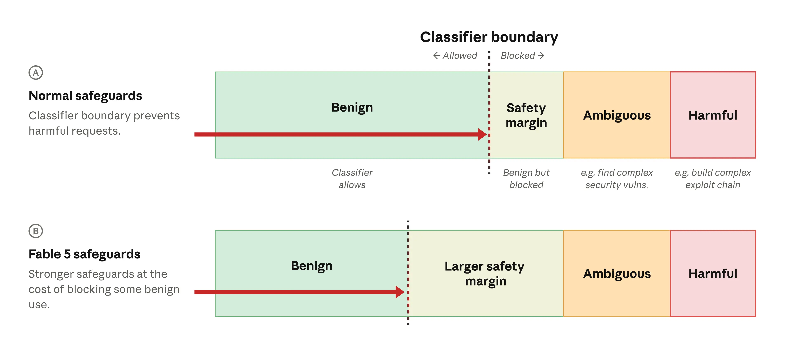
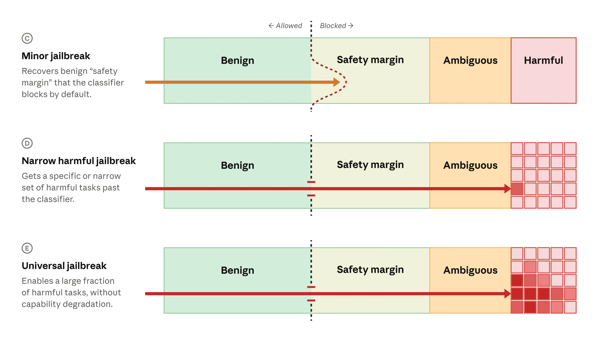

## 最新更新

**更新：Claude Fable 5 和 Mythos 5 已重新部署**（2026 年 7 月 1 日）

对 Claude Fable 5 和 Mythos 5 的访问权限现已恢复。

## 背景与事件

2026 年 6 月 12 日星期五，美国政府对我们最新的模型 Claude Fable 5 和 Claude Mythos 5 实施了出口管制。这要求我们限制对外国国民的访问权限，无论他们是否在美国境内。由于该令立即生效，且我们没有可靠的方法来实时验证国籍，我们暂停了所有用户对这两个模型的访问。

**截至 2026 年 6 月 30 日，对 Fable 5 和 Mythos 5 的出口管制已被解除。**

Fable 5 将从 2026 年 7 月 1 日星期三开始，在 Claude 平台、Claude.ai、Claude Code 和 Claude Cowork 上向全球用户提供。对于 Pro、Max、Team 和部分企业计划，Fable 5 将在 2026 年 7 月 7 日前包含在每周使用限额的最多 50% 中，之后将通过使用配额提供。我们将尽快在 AWS、Google Cloud 和 Microsoft Foundry 上重新启用访问权限。

我们还恢复了 Mythos 5 对一组美国组织的访问权限，根据美国政府在 2026 年 6 月 26 日的批准。我们继续与政府协调，以在 Glasswing 计划中向更广泛的国内和国际合作伙伴扩展访问权限。

在本文的其余部分，我们在四个领域提供进一步的细节和更新：

1. **事件时间表，包括我们对防护措施所做的更新**。我们讨论导致出口管制指令的事件，以及我们如何通过新的防护措施来应对这一指令。

2. **我们对网络安全防护的总体方法**。我们提供了更多背景信息，说明我们如何使用安全分类器来检测我们模型的潜在危险网络安全用途。

3. **一个共享的行业框架**。虽然我们已经达成了建设性的解决方案，但这些事件已经表明，该行业需要一种一致的方法来评估和修复 AI 模型的潜在"越狱"（绕过模型防护措施的技术）。共享的标准来判断给定越狱的严重程度，将帮助 AI 开发者优先处理新发现，更安全地推出高度能力的模型，并与政府和行业合作伙伴一致地传达风险水平。与亚马逊、微软、谷歌和其他 Glasswing 合作伙伴一起，我们已开始开发这样的框架，我们在下面进行了概述。

4. **更深层的政府合作**。我们还在加强我们与美国政府在新的发布前测试、信息共享和研究合作方面的协作水平。我们在最后一节中描述了这种更深层的协作。

## 时间表与防护更新

我们于 2026 年 6 月 9 日星期二发布了 Fable 5 和 Mythos 5。两者都共享相同的底层模型，但 Fable 5 是在具有强大防护措施的情况下发布的，以使其对一般使用更安全。Mythos 5 防护措施较少，仅发布给少数受信任的 Project Glasswing 合作伙伴，用于防御性网络安全。

出口管制指令在 6 月 12 日发出，是在政府意识到亚马逊研究人员发现了一种绕过 Fable 5 防护措施的方法的报告之后。该方法通过提示使其识别出多个软件漏洞。在一个案例中，模型生成了展示如何利用相关漏洞的代码。在过去的两周里，我们与政府和其他合作伙伴（包括亚马逊）密切合作，审查了该报告和证据。

我们的测试确认，许多能力较弱的模型——包括 Claude Opus 4.8、GPT-5.5 和 Kimi K2.7——可以识别与 Fable 5 在报告中识别的相同漏洞。当涉及到展示如何利用单个漏洞时，我们测试的每个模型都可以生成与 Fable 5 相同的演示（包括 Claude Haiku 4.5、Sonnet 4.6、Opus 4.6、Opus 4.7、Opus 4.8、GPT-5.4、GPT-5.5 和 Kimi K2.7）。

重要的是，所报告的技术没有暴露任何独特的 Mythos 级别网络安全能力。这种行为反映了 Fable 5 防护措施的边界案例——正如我们将在下面解释的那样，某些任务不太可能危险，但仍然被防护措施阻止，以谨慎为重。所报告的技术允许访问一种这样的行为，但它仅涉及常规防御性网络安全工作。

尽管如此，我们迅速采取行动解决所报告的绕过问题。与政府密切合作，我们训练了一个改进的安全分类器，该分类器针对并阻止了报告中描述的行为。如果对 Fable 5 的请求被阻止，用户将收到通知，该请求将被改为发送给 Opus 4.8。

新分类器意味着亚马逊报告中描述的特定技术在 99% 以上的情况下被阻止。在非常小的一部分情况下，该模型可能提供的信息不够详细，无法帮助网络攻击者。如我们下面所述，该模型的防护措施并不期望阻止所有低风险常规网络防御能力——仅阻止那些可能有害的能力。来自美国商务部国家标准与技术研究院（CAISI）人工智能标准与创新中心的研究人员已经测试了我们之前和新的防护措施，并同意它们非常强大。

新分类器的代价是在常规编码和调试任务中更频繁地标记良性请求。与我们所有的防护措施一样，我们将继续改进这一点，以更好地区分真实的滥用与合法请求，并减少误报。

## 我们对网络安全防护的方法

Claude Mythos 5 可以比任何其他模型——甚至除最熟练的人类安全专家外的所有人——都更有效地发现和利用软件漏洞。这些杰出的网络安全能力使其对希望滥用它进行网络攻击的恶意行为者特别有吸引力。

然而，Claude Fable 5 没有提供这样的独特攻击能力。这是因为我们以我们曾经应用于模型的最强防护措施推出了它。在推出前的一个月里，我们从 Anthropic 内的各个团队转移了员工，以将从事这一问题的研究人员和工程师数量增加了一倍。

Fable 5 推出时采用了多种安全机制，其中每一个单独都不能提供完美的防御，但当结合使用时，使该模型非常难以滥用（一种被称为"纵深防御"的方法）。一些防御涉及训练模型拒绝协助危险请求；其他防御涉及事后分析滥用模式。

一个特别重要的安全机制涉及**分类器**——较小的自动化 AI 系统，在交互过程中检测模型何时被要求执行潜在有害的网络安全任务（或产生潜在有害输出）。当这种情况发生时，分类器会阻止该模型响应请求。这些分类器的最终目标是防止该模型从事独特的危险行为。

与所有安全机制一样，分类器可能犯错误。它们有时会失败注意潜在危险的内容，在某些情况下，它们可以被故意"越狱"：用户可以以异常的方式提示该模型来欺骗分类器，使该模型生成该系统应该阻止的有害输出。

因此，我们故意将安全分类器设置为在我们知道可能是良性的一组请求上触发。这种"安全边际"方法意味着请求必须看起来非常清楚地安全才能避免触发分类器（见下面的 A 行）。用户将安全边际体验为模型拒绝响应一些合理的、无害的请求。

对于 Fable 5，我们使这个安全边际比任何以前的推出都大得多（B 行），意味着更多良性请求将被阻止。我们意识到这些类型的误报对用户来说会很令人沮丧，但为了使该模型的其他能力广泛可用，我们做出了这种权衡。

**我们网络安全安全分类器的说明。** 当请求发送到该模型时，分类器检测它是良性的（允许）还是可能有害的（被阻止）。分类器阻止模糊请求（那些明确与网络安全有关但可能用于防御目的的请求，如查找安全漏洞）和有害请求（那些明确危险的请求，如请求构建一系列软件漏洞）。如 A 行所示，我们还包括"安全边际"，其中分类器将阻止可能良性但有小概率有害的请求。这增加了我们对所有有害请求都将被阻止的信心。对于 Fable 5（B 行），我们使安全边际更大，意味着更多良性请求将被阻止——但更少真正有害的请求会被遗漏。"漏洞"=安全漏洞。

安全边际也有助于减轻越狱。许多越狱是狭隘的：它们解锁一个非常特定的模型行为，但仅此而已。在某些情况下，假设用户可以以较小的方式越狱该模型，并侵入安全边际（或有时侵入模糊有害行为），但不会进入我们旨在阻止的核心有害行为（下面的 C 行）。我们的观点是，到目前为止为 Fable 5 报告的越狱属于这种次要类别。

更严重的越狱解锁更多有害行为。狭隘有害越狱（D 行）可以引出一些特定的有害行为。这些越狱通常具有低到中等的严重性，因为狭隘性限制了攻击者。最令人担忧的类别是**通用越狱**（E 行），它解锁了一系列广泛的有害行为。

**越狱如何与我们的安全分类器相互作用。** 在次要越狱的情况下（C 行），分类器不会阻止请求，但请求仍在我们的安全边际内（因此非常不太可能有害）。在狭隘有害越狱中（D 行），提示突破分类器并解锁该模型的特定有害行为。在通用越狱中（E 行），提示解锁整个类别的有害行为。

正如我们在推出 Fable 5 时提到的，使任何 AI 模型完全稳健（即防护不可破坏）可能是不可能的。我们预计会发现我们模型的一些越狱，它们的严重程度将有所不同：会有许多次要越狱、一些狭隘有害越狱，虽然到撰写本文时尚未发现 Fable 5 的通用越狱，但专家安全研究人员继续对其进行红队测试。我们试图确保我们和我们的安全合作伙伴将首先发现重大越狱，并在恶意行为者可以使用它们造成伤害之前修复它们。

上述谨慎方法意味着绝大多数越狱不会成功解锁危险行为。我们的分类器使成功的越狱生成成本非常高且需要大量努力，即使**如果**越狱成功，我们的额外防御层还提供了额外的缓解措施。我们将继续在了解更多关于新颖越狱技术时更新我们的分类器。

## 越狱的共识行业框架

目前，AI 行业在如何以客观术语描述 AI 越狱的严重程度方面没有共识。这在发现新的越狱技术时增加了很大的不确定性：开发人员没有对哪些发现最迫切关注的商定标准，政府也没有对何时采取行动的商定标准。

随着越来越多具有强大网络安全（和其他）能力的模型被训练、评估和发布，这个问题将在未来几个月变得更加尖锐。一个用于评估 AI 越狱的共同标准将帮助我们和其他公司安全地推出新模型，以及允许我们的用户充分利用其高级能力。

因此，我们与亚马逊、微软、谷歌和其他 Glasswing 合作伙伴合作，起草一个用于评估 AI 越狱严重程度和 AI 开发人员应如何响应它们的共识框架。我们邀请其他行业合作伙伴和模型提供商加入我们的这一努力。

我们目前的提议是在以下四个不同的标准上对给定的越狱进行评分。前两个描述了越狱为攻击者提供的内容；后两个描述了越狱如何快速成为现实问题：

1. **能力增益**。越狱将用户带到现有工具之外有多远？如果现有广泛可用的工具（包括其他较弱的 AI 模型）可以达到与被越狱模型相同的能力，此处的分数将很低；如果越狱解锁该模型的能力可以显著加速甚至领域专家，分数将很高。

2. **能力增益的广度**。相同的越狱技术适用于多少个不同的攻击任务？案例中越狱仅允许该模型追求狭隘目标的案例将获得低分；相同的越狱技术对多个不同目标或技术有效的案例将获得高分。

3. **武器化的易用性**。需要多少人力来将越狱变成一次攻击？越狱涉及大量熟练的提示和许多重试的地方，分数将很低；越狱在单一提示或第一次或第二次尝试中有效的地方，分数将很高。

4. **可发现性**。获得该技术有多容易？如果需要专业知识，它将获得低分；如果它已广为人知和在线可用，它将获得高分。

我们建议使用这个严重程度框架来校准我们对新发现的越狱的反应。对于最严重的越狱类别（例如，一个越狱在其他特征中已被用于积极对关键电力电网或银行系统造成毁灭性影响），我们将在确认其严重程度后立即开始部署初步缓解措施。我们还在创建一支团队，为关键越狱提交渠道提供 24/7 监控。

任何越狱评分方法都将不完美。尽管如此，能够通过共同框架传达给定发现的大致严重程度是有价值的。这是一项正在进行的工作；随着我们从更多合作伙伴收到反馈，我们预计该框架将随时间推进。

我们预计很快会分享有关该框架的更多详细信息。同时，我们还推出了一个新的 HackerOne 计划，安全研究人员可以在其中提交他们在 Fable 5（一旦可用）中发现的潜在网络越狱，供我们审查。

## 与美国政府在前沿 AI 安全方面的合作

在过去的十周里，Anthropic 与美国政府在开发 2026 年 6 月 2 日关于推进先进人工智能创新和安全的行政命令中反映的方法时密切合作。我们的参与涉及国家网络主任办公室、科学技术政策办公室、财政部、商务部（包括 CAISI）和相关的国家安全机构。

我们致力于继续这项工作，建立在我们与美国政府合作伙伴在发布前测试和评估方面近两年既有合作的基础上。下面的承诺既反映了既有的工作，也反映了我们的新提案，以在上述框架最终定稿时扩大我们的政府合作规模：

1. **发布前政府访问和评估。** 对于在与国家安全相关领域显著推进能力前沿的模型，我们将为指定的政府合作伙伴提供扩展的早期访问权限，同时访问伴随这些模型的防护措施。这些合作伙伴随后可以在广泛发布前运行独立的能力评估和测试我们的防护措施。我们将在这些测试期间专门安排 Anthropic 技术人员与政府评估人员并肩工作。

2. **在防护措施上快速共享信息。** 当发现重大越狱或滥用模式时，我们将快速调查、分类并通知适当的政府对应方。我们将分享我们作为回应构建的新防护措施，以便可以独立测试它们。我们还将向政府合作伙伴提供我们的威胁情报报告，提前于出版物，并参与与国务院网络安全漏洞信息交换所相关的跨机构合作。

3. **为联合研究的专门资源。** 我们正在大幅扩大与政府合作伙伴的联合工作，以解决 AI 安全问题。我们将成立专门的 Anthropic 团队来处理共同的政府优先事项，提供大量计算分配以支持政府测试和研究，并将我们的安全和红队专业知识提供给帮助推进 AI 评估技术现状。

4. **一个共同的行业标准。** 我们将与政府和行业同行合作，建立一个针对前沿模型提供商的共享的、自愿的安全和评估标准。我们将贡献评估、工具和最佳实践，政府可以在整个领域应用。

我们希望这种合作，加上我们提出的共识行业框架，将为整个行业系统性规则的基础——并甚至为有效的全球协调关于 AI 的风险和益处提供开始。

这些规则应该被编入强有力的法规，并在所有前沿模型开发者之间平等应用。政府对 AI 发布的参与需要一个持久的、透明的过程，为网络防御者和其他人提供关于访问强大模型的确定性。

我们期待按照我们上面描述的方式深化我们的政府合作。我们也感谢我们的用户在这种中断中坚持我们，以及与我们并肩工作的研究人员和行业合作伙伴，使 Fable 5 和 Mythos 5 再次可用。

## 脚注

1. 对于标准企业座位，没有包含的 Fable 5 津贴，尽管你可以通过使用配额获得访问权限。如果未启用配额，你的用户将无法访问 Fable 5。对于高级企业座位，到 2026 年 7 月 7 日，Fable 5 包含在你的订阅中。它从每个成员的座位使用量中抽取，无需额外费用。2026 年 7 月 7 日后，你的团队可以通过启用使用配额继续使用 Fable 5。如果未启用配额，你的用户将不再有权访问 Fable 5。

2. 请注意，有时术语"绕过"本身用于代替"越狱"。就当前目的而言，我们认为这些是同义词，但在本文的其余部分，我们使用"越狱"，因为（a）这是一个更常用的术语，（b）它与我们在以前工作中使用的术语一致。

3. 类似地，没有软件完全免于漏洞（虽然一般来说，软件漏洞比 LLM 越狱更直接地被发现和修补）。

4. 在安全研究的其他领域，**有**商定的标准：例如，通用漏洞评分系统（CVSS）是评估给定软件漏洞严重程度的常见方式。
