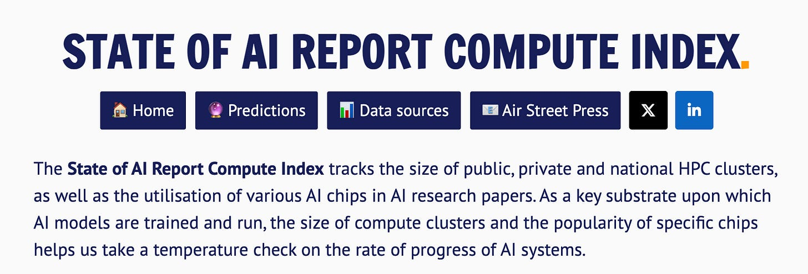
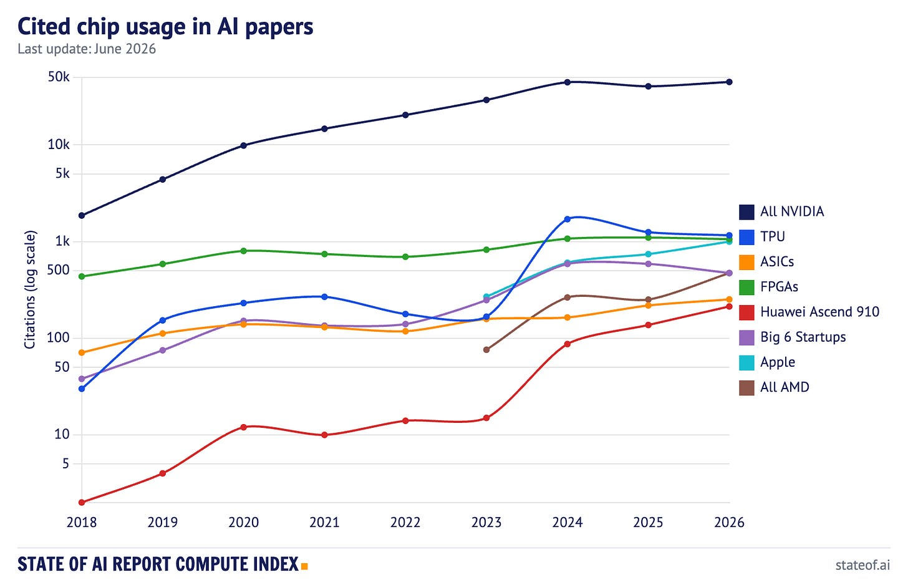
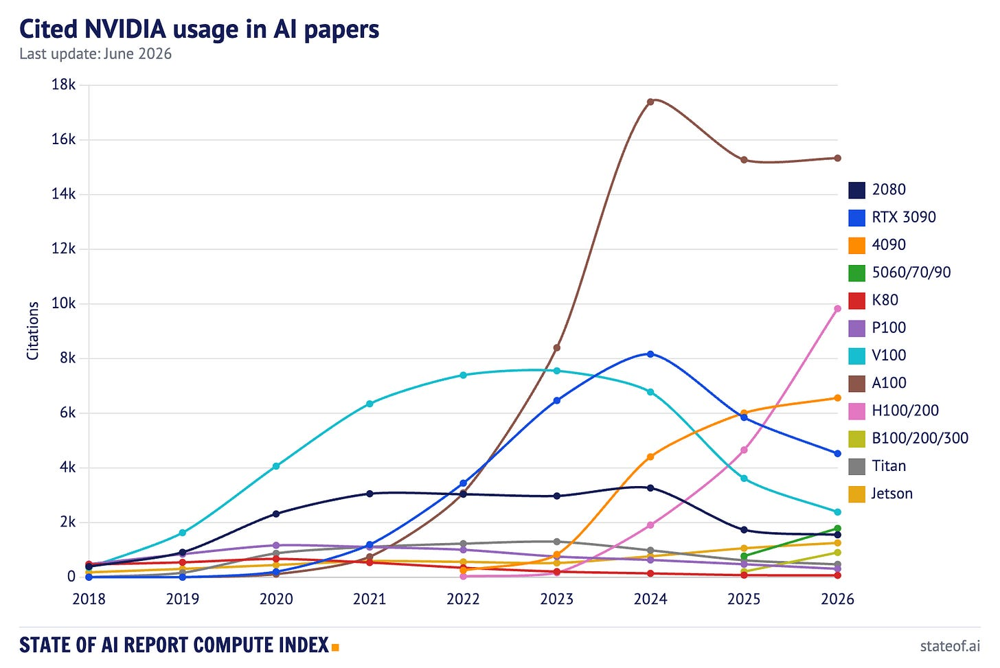
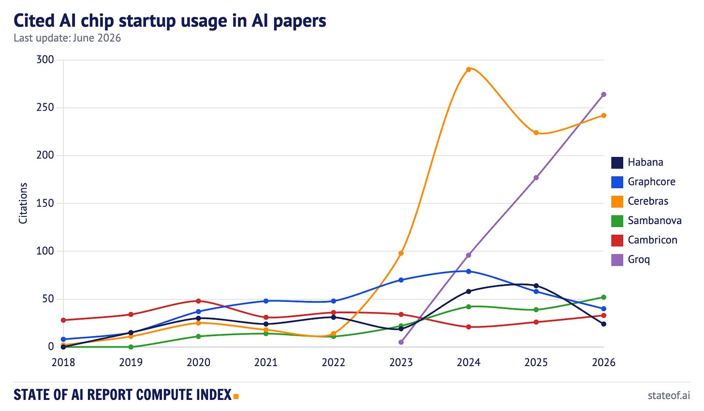
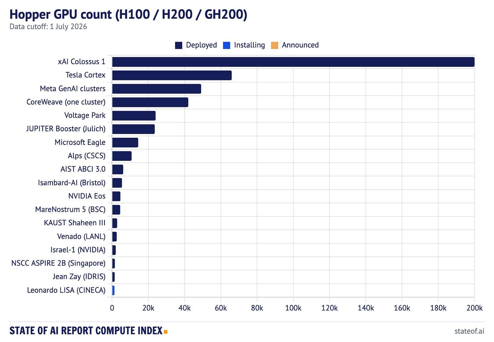
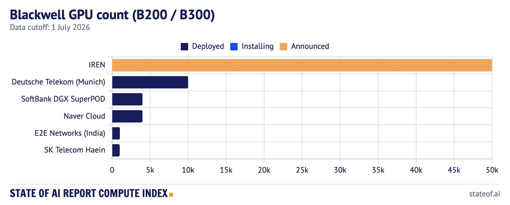
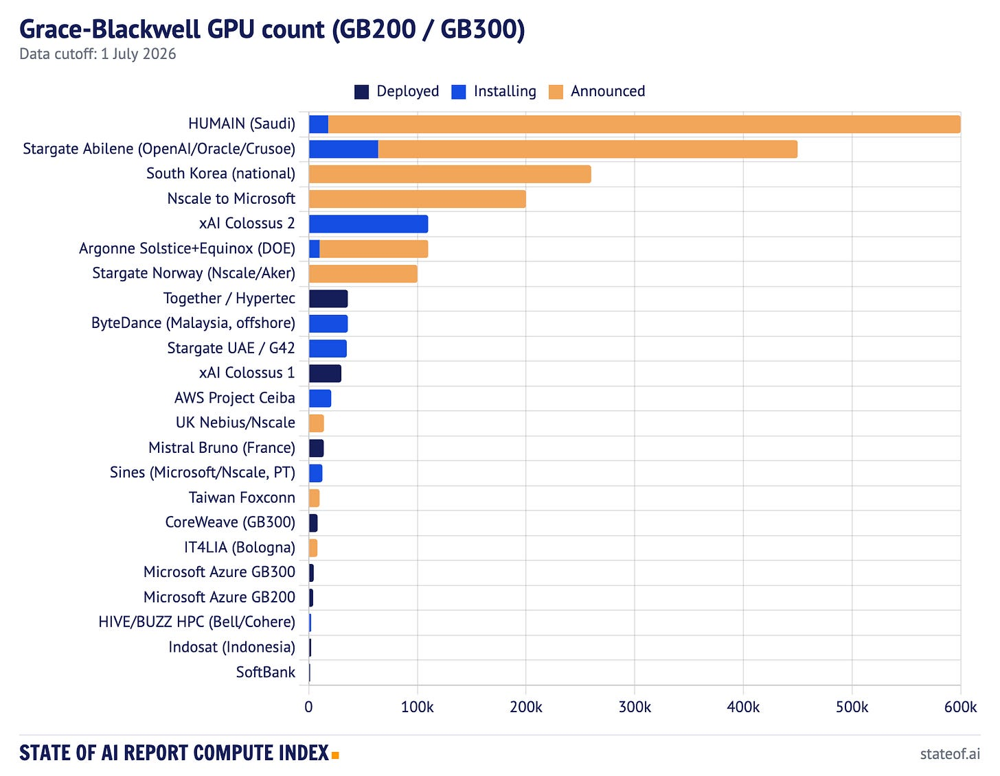
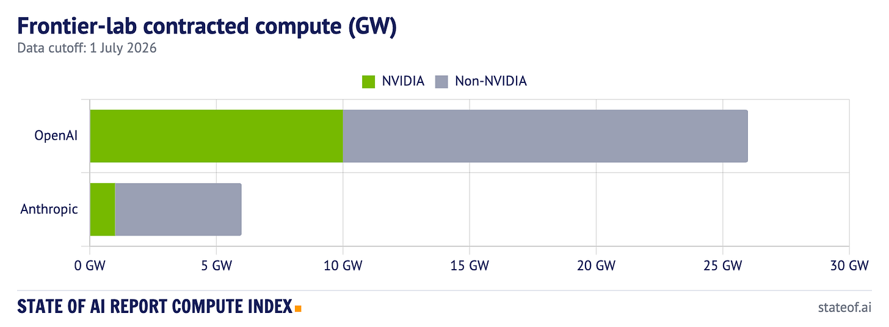

# AI 状态报告：计算指数 2026

> 原文：[State of AI Report Compute Index 2026](https://press.airstreet.com/p/state-of-ai-compute-index-june-2026) · air-street-press · 2026-07-01
> 抓取：2026-07-02T09:13:04+08:00 · 翻译：haiku · 4891 字

## 简介

今天，我们刷新了 [AI 状态报告计算指数](https://www.stateof.ai/compute)，与 [Zeta Alpha](https://www.zeta-alpha.com/) 联合推出。

你现在将找到有关 AI 研究论文中使用 NVIDIA、TPU、Apple、华为、AMD、ASIC、FPGA 和 AI 芯片初创企业的更新数据。我们还将基础设施方面的指数扩展至 2026 年 7 月 1 日：A100、Hopper、独立式 Blackwell、Grace-Blackwell，以及一个新的关于前沿实验室合同计算(以吉瓦为单位)的需求侧视图。每张图表现在都可以下载、分享和嵌入。

前言中的几点注意事项：2026 年的引文数据使用 2026 年 6 月 1 日之前的实际计数，加上全年的容量调整预测。逐年增长率是针对最终归一化的 2025 年计数计算的，而不是去年中期的 2025 年预测。GPU 计数图表按所有者/运营商显示 NVIDIA 数据中心 GPU，分为"已部署"、"安装中"和"已宣布"三个状态。Grace-Hopper 和 Grace-Blackwell 部分按 GPU 芯片计数，所以一个 NVL72 机架等于 72 个 GPU。租户不会重复计算在他们使用的运营商集群中。

## 缓冲期很短

去年的更新提出了一个问题：在经历了六年增长后，2025 年是否是开放 AI 计算引文的第一次真正放缓。现在已有 2025 年最终归一化计数，并从 2026 年 6 月 1 日之前的计数预测 2026 年的数据，答案显得更加清晰：2025 年是一次暂停，而不是衰退。

在所有被追踪的加速器类别中，2026 年的预测达到 49,339 个芯片引文计数，同比增长 10.7%，略高于 2024 年峰值。NVIDIA 仍然是首选：其芯片在这些计数中出现 44,715 次，同比增长 10.9%，约占跟踪总数的 91%。

这并不意味着前沿实验室突然变得更加透明。最大的模型开发者仍然发布较少的最佳工作成果，许多基于托管 API 或共享云服务构建的论文根本没有指定底层硅。但开放文献已停止反映硬件扩散。2025 年的下降看起来更像是发表周期时序、API 抽象和硬件波浪之间的平静年份，而不是计算使用的崩溃。

更有趣的发现是相对缺乏颠覆。许多公司、实验室和政府试图挑战 NVIDIA。在开放研究文献中，他们在很大程度上仍然没有成功。AMD、华为和 Apple 有所举动，但 NVIDIA 仍然是研究人员在描述其计算时使用的语言。

具体来说，AMD 引文几乎翻倍，从 2025 年的 251 增加到 2026 年的 472。华为 Ascend 910 上升 56%，从 137 增加到 213。Apple 从 741 跃升至 998，超过 AMD 成为开放文献中引用最多的非 NVIDIA、非 Google 加速器，这意味着消费者 Mac 现在的引用量超过领先的硅芯片竞争对手。这可能反映了本地推理和开发者工作流的传播，而不是前沿训练。与此同时，TPU 在开放论文数据中下降了 7%，尽管 Google 在前沿 AI 计算中的明显重要性。这种矛盾是一个有用的提醒，论文引文是某些形式采用的领先指标，但对于私有、API 介导或闭源实验室使用来说是一个糟糕的衡量标准。

## NVIDIA 仍然是王者，但王国在改变形态

NVIDIA 图表现在近似其产品周期图表。

A100 引文基本持平，为 15,327，同比增长 0.4%。A100 不再是增长所在。H100/H200 引文已翻倍超过 9,823，同比增长 111%，因为 2024 年和 2025 年的 Hopper 构建最终在论文中得到体现。Blackwell 系列提及，在 Zeta Alpha 数据中被追踪为 B100/B200/B300，仍然很小，为 902，但同比增长了 4.5 倍。

同时，较早的堆栈继续流出：V100 引文下降 34%，RTX 3090 下降 23%，P100 下降 36%，K80 现在几乎看不见。RTX 4090 在学术长尾中仍然有用，增长 9% 至 6,557 引文，而新的 50 系列卡正在从小基数快速出现。

## 初创企业芯片不再是一个单一故事

Groq 现在是引用最多的初创企业芯片，增长 49% 至 264，去年 12 月 NVIDIA 收购了它。削弱 NVIDIA 市场份额最快的方式原来是被 NVIDIA 收购。Cerebras 排名第二，为 242，增长 8%。SambaNova 升至 52，Cambricon 升至 33，而 Graphcore 跌至 40，Habana 跌至 24。

这还不是市场份额故事。初创企业芯片引文在 NVIDIA 旁边仍然微乎其微，使用初创企业硅的论文仍然经常包括来自芯片公司本身的作者。但它确实表明该类别正在分裂成不同的工作。Groq 在低延迟推理周围出现，Cerebras 在大规模晶圆级系统周围，而较早的被收购或被强调不足的平台正在消退。

正确的结论不是"初创企业芯片正在打破 CUDA"。他们没有。而是该类别正在专门从事利基市场——推理延迟和晶圆级——而 NVIDIA 保持通用情况。

## Hopper 是已安装基础

指数的后半部分根本不是引文追踪器。集群图表显示了有多少 AI 构建已经从研究采购转入工业基础设施。

在所有跟踪的 Hopper 系统中，我们计算了 460,904 个已部署的 H100、H200 和 GH200 GPU，加上 1,328 个安装中的。这是跟踪的 A100 总数 41,208 的 11 倍多。A100 图表现在读起来像一个传统舰队图表；Hopper 是现场已安装的基础。

xAI Colossus 1 是最大的跟踪 Hopper 部署，拥有 200,000 个 GPU，单独来看已是整个跟踪 A100 集合的五倍。Tesla Cortex 紧随其后，拥有大约 66,000 个 H100 等效 GPU，然后是 Meta 的 GenAI 集群 49,152 个，CoreWeave H200 集群 42,000 个，Voltage Park 24,000 个，以及德国的 JUPITER Booster 23,536 个 GH200。

一个地缘政治要点隐藏在这个表格中。国家 HPC 系统是精确的、可见的，这使他们容易计数。私有舰队是估计的，更难观察，更大得多。欧洲现在在 JUPITER、Alps、Isambard-AI、Leonardo、MareNostrum 5 和 Jean Zay 中拥有serious 的机器。但最大的私有 AI 集群在国家超级计算程序大多不匹配的规模上运营。

## Blackwell 主要是管道

指数中独立式 B200/B300 部署总计 20,024 个 GPU，由 Deutsche Telekom 的慕尼黑工业 AI 云领导，拥有 10,000 个，其次是 SoftBank 的 DGX SuperPOD 和韩国的 Naver Cloud，各 4,000 个，印度的 E2E Networks 1,024 个，SK Telecom 的 Haein 集群约 1,000 个。IREN 的 50,000 B300 订单处于"已宣布"状态。

Grace-Blackwell 是真正的管道所在。指数追踪 100,128 个已部署的 GB200/GB300 GPU，308,640 个安装中，160 万个已宣布。换句话说，跟踪的 Grace-Blackwell 管道中不到 5% 已部署，约 80% 仍处于宣布状态。本月已部署数字突破 100,000，因为首批大规模 GB300 系统上线，包括 CoreWeave 的 8,192 GPU 集群(在 6 月发布了 MLPerf 训练结果)，以及 Mistral 在法国的 13,800 GPU Bruno 从"安装中"转为"已上线"。这只是管道的一小部分，但这是已部署栏首次因 Grace-Blackwell 而不是 Grace-Hopper 而移动的月份。

最大的已宣布和安装中的程序看起来仍然更像是主权或超级规模工业项目，而不是常规数据中心采购：沙特阿拉伯的 HUMAIN 最高 600,000 个 GB300，Stargate Abilene 450,000 GPU 目标，韩国国家 260,000 Blackwell 程序，Nscale 对 Microsoft 200,000 GB300 承诺，xAI Colossus 2 大约 110,000 个安装中，Argonne Solstice 和 Equinox 合计 110,000，Stargate Norway 100,000 个已宣布。

这就是为什么"GPU 计数"变成了一个不完整的问题。限制已经向外移动到电力、土地、冷却、互联、许可、债务和用电量。GPU 订单不是集群。集群不总是可用的容量。合同容量不等于模型训练运行。

## 需求方现在以吉瓦为单位衡量

前沿实验室合同计算图表关注市场的另一侧：不是谁拥有集群，而是哪些实验室已在披露的吉瓦条款中合同计算能力。

对于吉瓦披露的交易，OpenAI 现在有 26 GW 的合同计算：10 GW NVIDIA 系统和 16 GW 非 NVIDIA，后者分为 6 GW AMD MI450 承诺和 10 GW Broadcom 定制硅。Anthropic 总共 6 GW，分为 1 GW NVIDIA 和 5 GW 非 NVIDIA 容量。

因此，在披露吉瓦数字上，OpenAI 的非 NVIDIA 账簿现在比其 NVIDIA 账簿更大，比 Anthropic 的整个投资组合更大。值得仔细考虑这意味着什么和不意味着什么。NVIDIA 仍然是 OpenAI 最大的单个供应商承诺，也是其最快的扩展路径；非 NVIDIA 数字分散在 AMD 和尚未大规模出货的定制 Broadcom 部件上。Anthropic 的非 NVIDIA 数字在某种程度上被低估，因为其 AWS Trainium 和 Google TPU 承诺只是部分以吉瓦为单位披露的，因此没有完全被绘制。

尽管如此，方向很清楚。前沿实验室不再选择单一芯片供应商。他们正在组建计算投资组合：NVIDIA 用于最广泛的软件生态系统和最快的扩展路径，TPU 和 Trainium 用于战略供应和成本控制，定制硅用于未来杠杆，以及当超级规模容量不足时的新云或主权项目。

"CUDA 仍然是王者"在论文中仍然成立。但在前沿实验室采购中，问题变得更广泛：谁能够将合同吉瓦转化为可靠的、液冷的、联网的、可用的智能基础设施？

## 展望

若干已知的未知数将塑造下一次计算指数更新：

- Grace-Blackwell 已宣布项目转变为已部署集群而不仅仅是新闻稿的速度有多快，现在已部署栏终于开始移动。

- OpenAI 的 Stargate 程序、HUMAIN、韩国的国家 Blackwell 程序和 Nscale 对 Microsoft 的承诺是否会按照发布的时间表进行。

- AMD MI300/MI350、华为 Ascend、TPU 和 Trainium 是否在开放论文元数据中更明显地出现，还是保持隐藏在闭源实验室和云抽象层之后。

- Blackwell 是否在 2026 年后期的文献中出现，就像 Hopper 现在在 2026 年数据中出现的方式一样。

- OpenAI 和 Anthropic 的非 NVIDIA 账簿是否从合同吉瓦转化为已部署、可用的容量，或者保持在纸面上，就像 Grace-Blackwell 管道大部分已做的那样。

- 国家 AI 工厂能否缩小与私有前沿实验室基础设施的任何差距。

v7 版本的标题很简单：开放文献已反弹，NVIDIA 仍然是默认选择；挑战者故事是真实的，但在论文中仍然很小；Hopper 是已安装的基础，而 Grace-Blackwell 才刚开始着陆；从需求侧来看，即使是 OpenAI 已披露的账簿现在也大多是非 NVIDIA，尽管大部分容量仍然是合同而不是集群。

查看实时图表：[www.stateof.ai/compute](https://www.stateof.ai/compute)。

## 一些注意事项

- 我们认为 AI 研究论文中芯片早期采用者的使用是更广泛行业使用的领先指标，但不是闭源实验室或 API 介导计算的完整衡量。

- 论文引文计数从 v6 版本开始保持不变。Zeta Alpha 的开源 AI 论文索引每年刷新；2026 年数据是 2026 年 6 月 1 日之前的真实计数加上量调整全年预测，逐年比较使用最终归一化 2025 年计数作为基准。此更新将基础设施图表刷新至 2026 年 7 月 1 日。

- GPU 计数图表使用公开披露、运营商材料、EuroHPC、Top500、SemiAnalysis、The Next Platform、Data Center Dynamics、公司备案和 NVIDIA 材料。大型私人公司数字是最佳可用估计；国家 HPC 数字在发布时是精确的。

- 已宣布的容量与已部署和安装中的容量分开标记。我们不会在供应商没有披露云实例计数的地方编造云实例计数。
