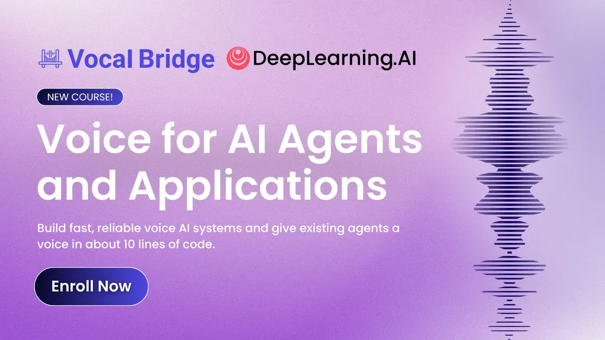
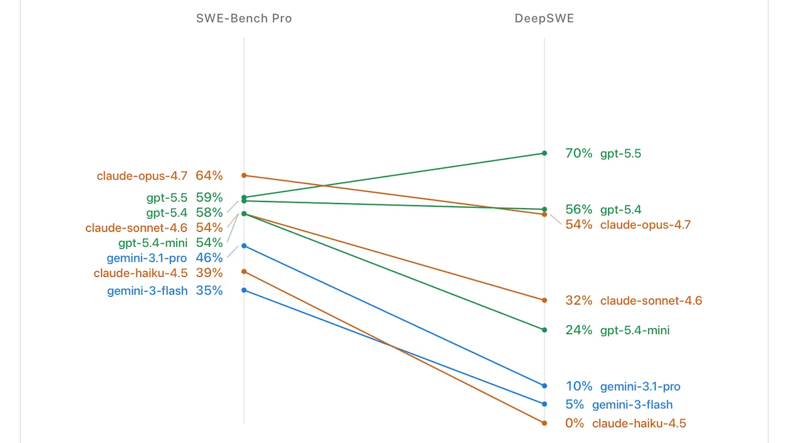
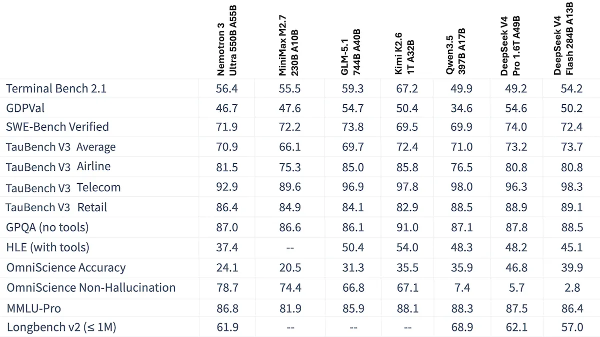
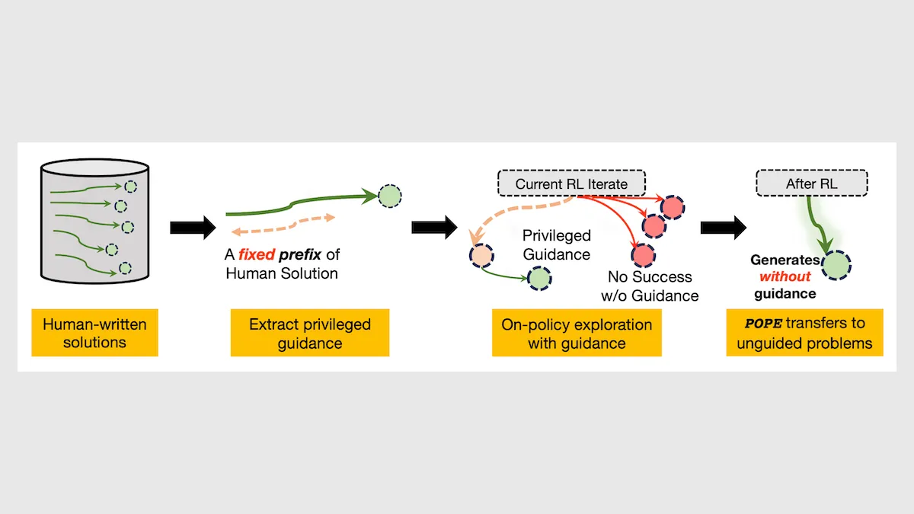

# 测试 Mythos 和 Fable，超越 SWE-Bench，Nvidia 的开源竞争者

> 原文：[Testing Mythos and Fable, Moving Beyond SWE-bench, Nvidia's Open Contender](https://www.deeplearning.ai/the-batch/issue-358) · the-batch · 2026-06-19
> 抓取：2026-07-02T09:11:49+08:00 · 翻译：haiku · 6847 字

## 序言

亲爱的朋友们，

在过去两周里，美国政府和 Anthropic 都采取了重大举措，展示了它们通过限制他人对前沿模型的使用来控制 AI 访问权限的力量。这是一个一旦看清楚就很难再看不清的时刻，并且它正在显著加速许多企业和民族国家确保可靠获得 AI 的努力——即便没有人能够终止这种访问。

Anthropic 首先发布了 Claude Fable 5，这是其 Mythos 模型的一个版本，配备了额外的护栏，包括一些在安全理由下似乎合理的限制（例如限制将其用于黑客攻击、生物武器等）。然而，它也限制了开发人员使用它来构建竞争 LLM 技术的能力。这一举措令人担忧，因为整个 AI 社区，包括 Anthropic，都从开放研究中受益匪浅——事实上，AI 革命是由我的前团队（Google Brain）自由发表 Transformers 论文而启动的！

想象一下，如果微软的使用条款禁止任何人使用其工具构建竞争软件，或者如果谷歌禁止使用其搜索引擎搜索信息来从事竞争搜索引擎的工作。Anthropic 辩称让其他人能够在 AI 方面取得进展是不安全的论点也显得虚弱。最初，Anthropic 通过无形干预来悄悄降低 Claude Fable 5 对被检测到从事 LLM 研究的用户的性能，这些干预削弱了模型的输出而不通知用户。在重大反对之后，公司收回了这个决定，并决定在这样做时保持透明，但 Claude Fable 5 仍然拒绝使用其最新能力来帮助 AI 研究人员。

这一举措代表了 Anthropic 对权力的原始展示。它使用"安全"论证来阻碍潜在竞争对手。当平台被视为稳定可靠的合作伙伴时，平台才能成功——人们可以在其之上构建。Anthropic 的突然规则变化（包括 Claude Fable 5 使用的强制 30 天数据保留政策）让开发人员怀疑在任何单一专有 LLM 提供商之上构建的稳定性，不仅仅是 Anthropic。

随后，美国政府进行了更大规模的权力展示。它利用商务部调节可能构成国家安全威胁的技术的权力来限制 Claude Mythos 5 和 Claude Fable 5 的出口，要求任何外国国民（无论在美国内部还是外部，包括 Anthropic 的员工）使用都需要许可证。这导致 Anthropic 向所有全球用户禁用了对 Claude Fable 5 的访问。

OpenAI 首席执行官 Sam Altman 指出，针对 Anthropic，"说'我们已经制造了一个炸弹，我们将要把它扔在你的头上。我们将以 1 亿美元的价格卖给你一个炸弹庇护所'，这显然是难以置信的营销。"但当一个人采用这种基于恐惧的营销时，它会增加美国政府同意并对你声称已经制造的炸弹实施出口管制的几率。

需要明确的是，我认为 Anthropic 尚未制造任何类似炸弹的东西，我认为对 Claude Fable 5 的出口管制是不适当的。

然而，在美国政府采取这一举措之后，许多国家，包括美国盟国，看到了美国如何突然撤销其对 AI 模型的访问权限。在世界各地许多首都，这激发了关于 AI 主权的讨论，以及其他国家如何确保对这一关键技术的不中断访问。

几十年来，许多国家对供应链的许多部分依赖美国、中国和其他主要生产商感到满意。一旦一个国家发出威胁或采取行动限制其他国家的访问，其他国家将理性地试图确保替代品。几十年来，中国的半导体制造进展缓慢；一旦美国开始限制中国的访问，中国的努力就开始加速。类似地，一旦中国威胁美国获得稀土矿物，美国确保替代品的努力就加速了。现在，私人美国公司和美国政府可以在短期内限制其他国家获得前沿 AI 模型的能力已经水晶般清晰，其他国家投资于开源等替代品的激励大幅增长。当然，训练前沿模型并不容易，所以他们的成功还有待观察，但我们已经跨越了卢比孔河。

微软首席执行官 Satya Nadella 撰写了一篇关于在前沿 AI 技术之上构建健康生态系统重要性的文章。我完全同意他的看法，并希望这周的事件最终将被证明是朝着这个方向的建设性步骤。

我希望我们能够构建一个更加自由、更加开放的世界，在这个世界里研究是自由共享的，法律和社会规范塑造了一个水平的竞争环境，允许每个人都能取得进展。这过去两周事件的一个银衬里是，现在每个人都更好地意识到当前系统的关键不稳定点，我们都可以致力于创建更稳定的基础。

继续构建！

Andrew

## DeepLearning.AI 的一条信息

学习使用三种实用模式为你的 AI 代理和应用程序添加语音：在应用程序中嵌入语音，将其分层到现有代理上，或给予你的代理一个工具来拨出站外电话。免费注册。

## 新闻

### Claude Fable 5 的基准问题

在 Anthropic 将其最新的 Claude 模型下架之前，甚至专业测试人员也很难区分他们是在获得 Mythos 级别的模型还是以相同名称的较低版本。

**新增内容**：多个独立组织报告称他们无法完全评估 Claude Fable 5，即 Anthropic Claude Mythos 5 的保护版本，公开提供。在所有情况下，该模型要么拒绝了一些测试提示，要么将它们路由到能力较弱的 Claude Opus 4.8。一些评估人员因为 Anthropic 的新数据保留政策而保留了专有提示。

**Claude Fable 5 如何工作**：Anthropic 的分类器在每个提示到达 Claude Fable 5 之前对其进行了筛查。被标记的提示要么由其位置的较弱模型回答，要么被直接拒绝。要使用 Claude Fable 5，所有用户必须接受 Anthropic 保留提示和输出 30 天的数据保留实践。

- 分类器筛查每个提示，了解有关网络安全、生物和化学，或 AI 模型工程的问题。被标记的提示永远不会到达 Claude Fable 5。
- 在 Anthropic 自己的应用中，包括某些评估中使用的 Claude Code 工具，被标记的提示自动路由到 Claude Opus 4.8，后者代表 Claude Fable 5 回答。但 Claude Code 记录了交换中的一个单独日志事件，而不是在答案文本中。评估人员不得不搜索日志并将 Claude Opus 4.8 回答的任务分开，如果他们希望在 Claude Opus 4.8 和 Claude Fable 5 的回答之间进行区分。
- 通过 API（大多数评估人员使用模型的方式），相同的标记会产生直接拒绝和无答案。在这种情况下，评估人员可以启用回退以在 Claude Opus 4.8 上重试提示或将任务评为失败。

**评估人员如何给模型评分**：每个人在"纯"评估 Claude Fable 5 之间选择，以尝试在不受 Claude Opus 4.8 影响的情况下测量其能力，以及模型的"实际"评估，包括拒绝和回退。Claude Mythos 5 未公开发布，因此无法独立评估。

- Artificial Analysis，在其发布前评估了 Claude Fable 5，记录了该模型在其智能指数中大约 8% 的任务回退到 Claude Opus 4.8，这是 10 个经济有用任务测试的复合数据。这些回退中的大多数是对科学问题的回答。Artificial Analysis 将所有回退回复作为其评估的一部分，产生混合分数。
- Vals AI，测试经济上有用的 AI 任务的公开和专有基准，为 Claude Fable 5 发布了两组分数，一个包括 Claude Opus 4.8 回退答案，一个计算每次拒绝为失败。Vals AI 还报告了生物学和网络安全问题上拒绝率接近 100%。
- 在 Agent 的最后考试上，对具有可验证结果的长期代理任务的测试，评估人员报告说 Claude Fable 5 拒绝了大约 35% 的任务。该模型将科学问题标记为"网络安全或生物学"，并在任务中切换到 Claude Opus 4.8，在单独的日志事件而不是响应中记录任务。评估人员比较了 Claude Fable 5 在"未触及"任务（仅由 Claude Fable 5 生成答案的所有答案）和复合任务（Claude Opus 4.8 贡献某些或所有响应）的性能。
- ARC Prize Foundation，运行 ARC-AGI 抽象推理测试，表示将拒绝运行其验证的评估，而不是向保留要求暴露其私有测试集，并表示如果可以在不交出问题的情况下进行测试，将发布这些结果。

**结果**：Claude Fable 5 在没有回退响应的问题上排名最高。在 Claude Opus 4.8 回答被拒绝提示的地方，Claude Fable 5 仍排名靠前或接近顶部。在回退被评为失败或两个模型分开测量的地方，其地位大幅下降。

- 在 Artificial Analysis' Intelligence Index 上，Claude Fable 5（包括 Claude Opus 4.8 的回退响应）位列第一，为 64.9，比 Claude Opus 4.8 高 3.5%。尽管在人性最后考试上拒绝了 9% 的测试问题，Claude Fable 5 完成时得分为 53%，是迄今为止录得的最高分数，比 Claude Opus 4.8 高 7% 以上。
- 在 Vals AI 的测试套件上，其运行启用了 Anthropic 的可选回退，以便 Claude Fable 5 的拒绝在 Claude Opus 4.8 上重试，Claude Fable 5 在大多数基准上排名第一，包括 Vals Index 上的 75.14%。仅将这些拒绝计为失败只是将其整体得分降低到 74.92%，但破坏了其标记域中的得分。例如，在 GPQA Diamond（研究生级别科学问题）上，Claude Fable 5 从 93.18% 的准确度（第二位）下降到 55.56%（第 94 位）。
- 在 Agent 的最后考试中，Claude Code/Claude Fable 5 本身回答的任务获得了 22.8% 的通过率，接近 Codex/GPT-5.5（23.8%）并远超 Claude Code/Claude Opus 4.8（15.8%）。在 Claude Fable 5 的保护措施将响应转向 Claude Opus 4.8 的任务上，结果下降到 17.6%。Claude Fable 5 的复合通过率为 22.0%，低于 GPT-5.5 的 24.0%。

**为什么这很重要**：Anthropic 所描述的安全措施使直接测量 Claude Fable 5 能力变得不可能。在不绕过其保护措施的情况下测量该模型不会解决这个问题。没有分类器的分数描述了一个公众无法到达的 Claude Fable 5 版本。任何使用分类器进行的分数都描述了一个移动的目标，因为 Anthropic 可以随时重新调整它们。

**我们的想法**：基准通常询问模型有多能干。Anthropic 的 Claude Fable 5 强制了一个更物质的问题：其用户实际上能获得多少能力？这个差距是评估人员现在必须捕捉的，不仅报告模型的峰值分数，还要报告开发人员在实践中可以依靠什么。（轶事来说，Fable 是一个了不起的编码模型，我们期待何时访问权限被恢复，或其他提供商提供类似能力的模型。）

---

### 超越 Bug 猎杀的代理测试

SWE-bench（一系列专注于 LLM 修复软件 Bug 能力的基准）正在让位给评估代理软件工程性能在更具挑战性方式中的新测试。

**新增内容**：三个最近发布的基准是强大的竞争者，可以取代 SWE-bench 家族（SWE-bench、SWE-Bench Pro、SWE-bench Multilingual 和 SWE-bench Verified）。

- DeepSWE，测量代理的特性实现能力，通过提出需要更具挑战性的诊断和需要更多代码来解决的问题。
- ProgramBench，测量代理能够从以提示形式输入的想法开发新程序的能力。
- ITBench-AA，扩展了测试代理在现代硬件堆栈中诊断问题能力的测试。

**DeepSWE**：由 Datacurve 开发，DeepSWE 在意图上最接近 SWE-bench，自 LLM 开始常规获得完美分数以来已被分叉多次。DeepSWE 呈现了由人类专家验证的示例，并通过从私有代码库中提取示例来最大限度地降低它可能污染训练数据集的风险。它包括 5 种语言中的 113 个问题。独立基准公司 Artificial Analysis 最近将 SWE-Bench Pro 替换为其 Intelligence and Coding Agent 指数的 DeepSWE。

- 给定简短的提示（与 SWE-Bench Pro 中详细提示相反），代理工具 mini-swe-agent 必须使用 LLM 从许多可接受的可能性中设计解决方案。解决方案需要的代码行数约为 SWE-Bench Pro 的 5.5 倍。
- 与 SWE-bench 不同，DeepSWE 使用人工编写的问题和测试来验证潜在的解决方案。这些问题基于真实存储库，但不是取自现有或已解决的代码。例如，一个任务是"扩展索引范围，以便数组和字符串支持第三个切片组件：value[start:end:step]"在 ABS 编程语言 GitHub 存储库中。
- 目前，GPT-5.5 设置为 xhigh 推理在 DeepSWE 中领先，解决了 70% 的问题。次最好的是 Claude Opus 4.8，它解决了 58%。Gemini 3 Flash 实现了 5%，使三个领先模型之间的差异为 65 点。

**ProgramBench**：由 Meta、Stanford 和 Harvard 的研究人员开发，ProgramBench 测试由 SWE-agent 工具控制的模型将 200 个想法转变为函数程序而无需人类监督的能力。该代理可以访问可以执行现有程序的控制台，必须通过生成其输入和输出来重现程序。

- 作者使用代理（mini-SWE-agent 或 SWE-agent）与 Claude Sonnet 4.5 来构建基准，以（i）识别候选存储库，（ii）构建可执行程序，（iii）生成显示程序处理各种输入时发生什么的测试，以及（iv）构建测试环境，包括编译的可执行程序、关于如何使用可执行文件的文档，以及模型可能无法生成的测试资产，例如图像。
- 要复制的程序从简单到困难不等。例如，一个称为 entr 的程序只是在文件更改时运行命令。一个更复杂的程序称为 ffmpeg，编码、解码和以其他方式处理音频和视频。
- 到目前为止，没有一个模型能够创建通过所有测试的程序。降低标准到通过至少 95%，Claude Opus 4.7 复制了 3% 的程序，Claude Opus 4.6 复制了 2.5%，Claude Sonnet 4.6 复制了 1.6%。在出版时，没有其他模型复制过任何程序。

**ITBench-AA**：由 IBM 和独立测试实验室 Artificial Analysis 开发，ITBench-AA 更新了 IBM 早期的 ITBench。它测试由 Artificial Analysis' Stirrup 工具控制的模型诊断导致软件系统出错技术条件的能力，例如内存不足或错误地改变配置文件。

- ITBench-AA 包括 59 个基于真实事件的人工编写的事件。每个事件包括警报、事件、错误痕迹、系统指标、所有涉及应用程序的清单，以及根本原因诊断的地面真相。例如，在一个事件中，程序面临七个不同的警报，这些警报提到了高错误率。诊断是人为错误（服务器被离线维护）。
- ITBench-AA 测量完全回想，正确诊断与所有诊断的比率；如果模型遗漏任何根本原因，它将为该事件实现零。
- 在迄今为止测试的模型中，Claude Opus 4.7 设置为最大推理实现了 46.7% 的最高完全回想。GPT-5.5 设置为 xhigh 推理实现了 45.8%。在列表的底部，Llama 3.3 70B 实现了 0.6%，差异超过 40%。

**为什么这很重要**：多年来，对模型一般代理能力的最佳测量是 SWE-bench 及其变体。它们的主要设计目的是测量模型和后来代理修复 Bug 和解决其他基本软件工程问题的能力。随着时间的推移，模型变得足够能干以实现接近 100%（可能是因为基准问题进入了模型的训练数据）。同时，代理承担了更困难的任务，运行更长的时间，人类指令的具体性和一致性较少。DeepSWE、ProgramBench 和 ITBench-AA，尽管方法不同，都提出了增加复杂性和具体性的问题，并且不太可能在模型的训练集中。

**我们的想法**：看到代理已经走了多远令人欣慰，知道他们还有多少改进空间是谦逊的。

---

### Nvidia 的 Nemotron 大规模发布

Nvidia 迄今为止最大的模型是美国开发者中性能最佳的之一，也是任何人开发的最开放的之一。

**新增内容**：基于混合变换器-mamba 架构构建，Nemotron 3 Ultra 是为长期运行的代理任务构建的大型语言模型。它比竞争对手快得多，但其性能不在顶级。Nvidia 发布了其权重、训练数据和配方，以及强化学习环境。

- **输入/输出**：文本输入（最多 100 万个令牌），文本输出（每秒约 183 个令牌）
- **架构**：Mamba 变换器专家混合物（550 亿个参数总计，每个令牌 55 亿个活跃）
- **特征**：三个推理模式（关闭、常规、中等），推理预算、工具使用、针对开放代理工具（如 Hermes Agent 和 OpenClaw）进行微调、多语言（12 种语言）
- **性能**：Artificial Analysis Intelligence Index 中美国开放权重模型排名最高，在可比智力的开放权重模型中速度最快
- **可用性/价格**：权重和数据以及代码在 OpenMDW-1.1 许可证下自由可用，通过 Perplexity Pro 订阅聊天，通过 Nvidia 和其他供应商通过 API 以每百万输入/输出令牌中位数 $0.60/$2.60。

**它如何工作**：Nemotron 3 Ultra 扩展了较小 Nemotron 3 Super 的设计。它在混合专家结构中交织 mamba 和自注意力层。Nvidia 通过监督微调、跨多个域和环境的强化学习，以及涉及多个教师的蒸馏来细化模型。

- 该团队通过两个阶段预训练了基础模型 20 万亿文本令牌：（i）对广泛知识的 15 万亿令牌训练，以及（ii）对更高质量数据的 5 万亿令牌训练，包括 1730 亿令牌的 GitHub 代码和法律和事实知识的合成数据集。他们使用量化 4 位格式 NVFP4 训练了模型，以减少内存使用并更有效地处理令牌。
- 混合架构使用 mamba 层处理长序列，同时使用比变换器层中的自注意力机制少得多的内存和计算，以及一个较小的注意力层集来实现对长上下文的更精确回想。LatentMoE 混合专家实现在将每个令牌路由到 10 个专家的子集之前压缩它，多令牌预测层一次生成多个令牌。
- 该团队通过监督学习微调了模型，然后在推理、编码、代理、聊天、安全和可用性任务中使用自动可验证奖励的强化学习。另外，他们训练了 10 多个模型，每个专门针对单独的域。这些通过多教师在线政策蒸馏成为模型进行中的教师，每个教师在其专业内对学生模型的输出进行评分，并在每个令牌之后而不是任务结束时奖励学生。Nvidia 进行了两个迭代轮次的蒸馏，在每轮的开始时从改进的学生模型重建教师。

**性能**：Artificial Analysis 独立测试将 Nemotron 3 Ultra 在美国开发者的开放权重模型中评为最高智力排名，但不如 DeepSeek V4 Pro 或新发布的 GLM-5.2 高。Nemotron 3 Ultra 也比可比大小的开放权重竞争对手运行得更快。

- 在 Artificial Analysis' Intelligence Index 上，一个经济上有用的任务的 10 个测试的复合，Nemotron 3 Ultra 设置为一个未指定的推理级别分数 47.7 使用 Nvidia 推荐用于推理的降精 NVFP4 权重，47.2 以满精度。这种性能超过了美国开放权重模型，包括 Google Gemma 4 31B 设置为推理（39.2）和 OpenAI gpt-oss-120b 设置为高推理（33.3）。然而它落后于中国 Moonshot Kimi K2.6（53.9），领先的开放权重模型。
- 在 Artificial Analysis' IFBench 上，测量模型遵循指令的能力，Nemotron 3 Ultra（81.4%）排名第三，仅次于 Grok 4.3 设置为中等推理（83.3%）和 Grok 4.20 0309 和 MiniMax-M3，都设置为推理（均 82.9%）。
- 在 Nvidia 的测试中，Nemotron 3 Ultra 在有 100 万令牌上下文的 Ruler 长上下文回想测试中表现出色（95%）。它在 PinchBench 代理生产力测试中与更大的 Kimi K2.6 相匹配（91%）。但它在 Terminal-Bench 2.0 代理编码测试中落后（54%），低于 Moonshot Kimi K2.6（67%）和 Z.ai GLM 5.1（64%）。
- 在 Artificial Analysis 的测试中，Nemotron 3 Ultra 运行在多个供应商上设置为未指定的推理级别比可比的开放权重模型（如 Moonshot Kimi K2.6 和 DeepSeek V4 Pro）平均快约三倍（约每秒 183 个令牌）。

**幕后新闻**：在推出 Nemotron 3 Ultra 之前不久，Nvidia 发布了许多其他发布，旨在改进代理性能。它交付了 Vera CPU，其第一个为代理工作设计的处理器；推介了 RTX Spark，一个用于设备上代理的 Windows PC 芯片；并发布了 Cosmos 3，一个为机器人、自驾汽车和在世界上行动的其他代理生成训练数据的开放边界基础模型。

**为什么这很重要**：最近，最有能力的用于构建代理的开放权重模型来自中国（Kimi K2.6、Qwen3.5、DeepSeek V4、GLM-5.2）。Nemotron 3 Ultra 将美国开发者重新纳入组合中，并为开发人员提供了一个快速、开放、完全文档化的基础来适应代理工作负载。

**我们的想法**：Nvidia 有充分的理由发布强大的开放权重模型：避免少数专有模型开发者的浓度将加速采用并创建一个更健康的生态系统，这将使 AI 芯片市场领导者受益。此外，开发人员在为 Nvidia 芯片调整的模型上构建代理越多，这些芯片的需求就越大。我们很高兴 Nvidia 有激励因素继续推进边界并发布开放模型！

---

### 带提示的强化学习

强化学习无法训练模型解决困难问题，如果模型没有发现所有正确的步骤。但给模型前几步可以产生全部差异。

**新增内容**：来自卡内基梅隆大学的 Yuxiao Qu、Amrith Setlur、Virginia Smith、Ruslan Salakhutdinov 和 Aviral Kumar 推介了特权在线政策探索（POPE），一种针对大型语言模型的训练方法，将强化学习算法 GRPO 与自定义构建的数据集配对。在对 LLM 经常不解决的问题（例如困难的数学问题）进行训练时，除了给模型问题之外，POPE 还附加了解决方案的开始。

**关键洞察**：在监督微调中，给定问题和解决方案，模型可以学会生成解决方案。但它可能学会该特定解决方案而不是会导致不在训练数据中的解决方案的一般问题解决技能。在强化学习中，解决方案的开始可以充当提示，帮助模型发现解决方案。例如，除了"解决这个几何问题"的指令之外，模型还可能收到前几步，如"画辅助三角形并应用勾股定理…"并从那里继续。在训练期间给定相同问题的有提示和无提示版本，模型也可以找到没有提示的早期步骤。

**它如何工作**：作者使用自定义的数据集通过 GRPO 微调一个预训练的 Qwen3-4B-Instruct-2507。

- 从三个数学数据集开始，涉及已知解决方案的问题，作者选择了预训练模型在 128 次尝试中无法正确解决的例子，在每次尝试中生成最多 32 千个令牌。
- 对于每个例子，作者提取了解决方案的开始或前缀。他们向 Qwen3-4B-Instruct-2507 提供了逐渐更长的前缀，最多达到解决方案长度的四分之一，直到它正确完成了解决方案。
- 他们将这个前缀附加到相应的例子中，以及一个指令，以继续从该点开始解决任务。
- 在 GRPO 中，他们以相等的比率向模型显示每个问题多次，既有其前缀，也没有。如果模型解决了问题，GRPO 调整了模型的权重以增加它将生成相同令牌的概率，使类似的解决方案更有可能。如果它失败了，GRPO 调整了模型的权重以降低概率。

**结果**：作者比较了通过 POPE 与典型 GRPO 和监督微调微调的 Qwen3-4B-Instruct-2507。它一直优于两者，并且大幅优于监督微调。他们评估了一次尝试（pass@1）后的结果和 16 次尝试（pass@16）。

- 在 AIME 2025 竞争数学问题的数据集上，POPE（53.1% pass@1，82.6% pass@16）优于典型 GRPO（49.6% pass@1，81.4% pass@16）。
- 在也由竞争数学问题组成的 HMMT 2025 上，POPE（37.8% pass@1，67.5% pass@16）超过了典型 GRPO（31.0% pass@1，63.8% pass@16）。

**是的，但是**：POPE 需要带有已知解决方案的问题。在这样的解决方案很昂贵的获得的域中，它继承了该成本。

**为什么这很重要**：这项工作攻击了强化学习中最大的瓶颈之一：探索。当前的强化学习方法最适用于模型已经能够部分解决的问题。当问题困难时，强化学习会在探索中消耗大量计算，从算法上归结为"保持尝试并希望偶然发现成功的解决方案。"POPE 将模型引导到正确的轨道，在这之后强化学习可以更有效。

**我们的想法**：这种方法将学习困难问题分为两步：（i）寻找一个好的状态来解决问题和（ii）解决问题。与其同时尝试两者，LLM 从（ii）开始，一旦它学会了，学习如何做（i）就更容易了。
