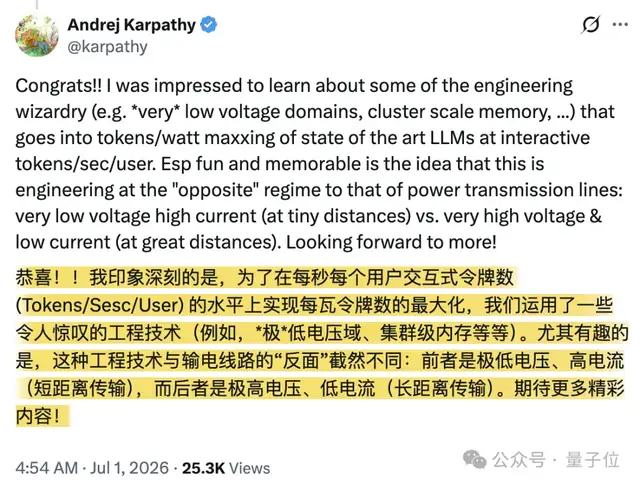
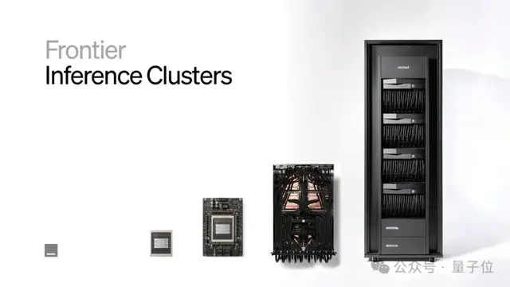
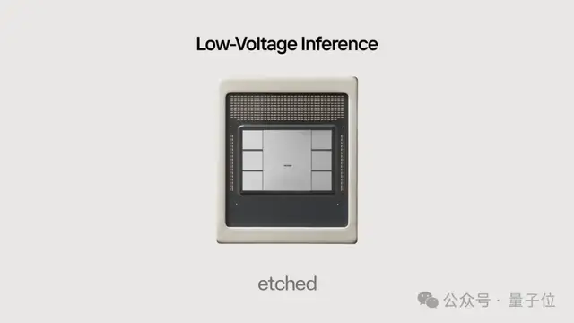
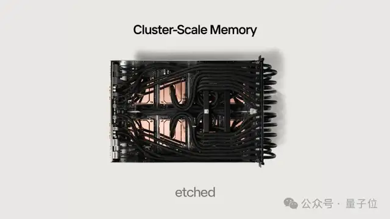

# 卡帕西李飞飞辛顿都投了的Transformer专用芯片，签下10亿美元大单

> 原文：[卡帕西李飞飞辛顿都投了的Transformer专用芯片，签下10亿美元大单](https://www.qbitai.com/2026/07/441183.html) · qbitai · 2026-07-01
> 抓取：2026-07-02T09:12:14+08:00 · 翻译：无（中文原文） · 3247 字

> 衡宇 发自 凹非寺
>
> 量子位 | 公众号 QbitAI

**一家只做Transformer专用芯片的创业公司成功流片**，连带官宣了一串大进展：

不仅筹集到了8亿美元的资金，还喜滋滋获得了10亿美元的客户大单。

卡帕西、李飞飞、辛顿，都是这家公司的投资人。

这家公司就是**Etched**。

它创立于2022年，在别的AI芯片公司强调兼容、通用、生态的时候，Etched从Day 1开始就一心一意扑在Transformer专用芯片上。

中间好长一段时间，Etched没有太多公开动静。

结果六月最后一天突然冒出来，一口气宣布走出隐身状态。

Transformer专用芯片流片了，钱融到了，客户单子也大大的有。

公司官号还在上说，他们**基于现有进展，已经造了第一批机柜**，"早期客户测试表明，我们在推理工作负载方面实现了最先进的吞吐量、延迟和能效"。

古人云一鸣惊人，大概如此。

作为资方爸爸之一的卡帕西老激动了：

## Etched突然"诈尸"搞了波大的

在它家官推突然"诈尸"之前，Etched给人留下的些许印象，都来自于"这是一家只给Transformer做AI芯片的初创公司"。

结果冷不丁梆梆一顿宣布，现在做的已经不只是Transformer专用芯片了。

汇总目前的信息，**他家从芯片、机柜、软件到制造方法一起设计都在着手，搞的是一整套面向前沿模型推理的集群系统。**

**先说芯片和机柜。**

官网信息显示，今年早些时候，Etched的A0版芯片已从台积电N4P工艺流片回片。

现在推出首款机柜产品，主要也是为了满足10亿美元大单的需求。

直言不讳表示第一批机柜计划今年夏天出货，那Etched的商业化节奏也不也就摆上桌面了？

**至于软件和制造方法层面——**

按照官方说法，它的推理系统是为前沿模型准备的，覆盖万亿参数级MoE、长上下文和Agent工作负载。

为了跑这些任务，Etched共同设计了新的芯片、封装、PCB、冷板、互连等组件。

此外，Etched引入了低电压推理（LVI）技术，适用于高吞吐量工作负载。

大家先尝点前情提要。

现在的情况是AI芯片如果不进行热节流，就无法扩展浮点运算能力。

而随着浮点运算能力的提升，AI芯片会消耗更多电力并降低时钟频率。这通常会导致持续的推理吞吐量低于峰值浮点运算能力的一半。

针对这个问题，**Etched设计了一种全新的架构，使芯片的数学模块能够在不到大多数AI芯片一半的电压下运行。**

这使得芯片的浮点运算密度比目前的AI芯片高出数倍。

官推称，这套设计可以**让万亿参数级稀疏MoE在80%以上峰值FLOPs下运行，同时不出现热降频。**

要做到这一点，需要从晶体管到token统筹设计，包括可拆分数学阵列、电路技术、tiling和调度算法、供电网络、VRM架构、高级封装和冷板设计。

与此同时，Etched还推出适用于低延迟工作负载的集群规模内存（CSM）。

当前采用HBM的AI芯片受限于内存子系统和互连瓶颈，难以达到接近SRAM的解码速度；而纯SRAM架构的芯片虽然延迟更低，却往往受限于浮点运算密度和内存容量，难以兼顾吞吐量。

通常咱都不得不在两者之间做取舍：要么以更慢的速度提供服务，要么压低批量规模运行，从而承受更高成本。

在运行巨型MoE模型时，token需要在不同专家之间路由、数据必须穿过多层内存体系和网络交换网络，才能到达目标专家。

每多一层内存，延迟就会增加一分；因此，**从延迟角度看，最好的内存层级，某种意义上就是"少一层是一层"**。

为此，Etched团队设计了一种新架构，在整个scale-up域内构建共享的低延迟内存池。

他们采用了专有的超低延迟、高带宽互连技术，大幅提升跨芯片内存访问速度。

基于HBM/SRAM的混合设计，同时解决了容量和mem2mem延迟问题，让高吞吐与强交互性得以兼得。

"CSM不仅改善了延迟表现，也避免了当前纯SRAM芯片、3D DRAM芯片或光互连方案在成本、可靠性、良率、散热和算力上的种种取舍。"

## 这家公司有啥来头？

公司还表示，现在团队已有超过400名工程师，分别来自英伟达、谷歌TPU、博通、SK海力士、台积电等公司。

说到团队，我们来详细讲讲创始三剑客。

**这个团队的标签就是非常符合刻板印象里"硅谷范儿"的那种。**

毕竟"哈佛辍学生创业团队"是他们身上最醒目的标签。

**CEO叫Gavin Uberti**（下文简称G哥），是"给Transfomer做专用AI芯片"的最早推动者。

本科时期他入学哈佛，一方面继续学数学与计算机相关课程，另一方面开始接触AI编译器优化与系统层问题。

2020年到2022年前后，G哥分别在做端侧AI和低功耗计算的初创公司（后被苹果收购）、做高等教育学术运营管理软件的公司以及做机器学习模型部署和推理基础设施的公司实习过。

干过编译器相关的活，也干过算法和后端。

2022年，Etched有了雏形。

在研究Transformer推理过程中，G哥逐渐有了自己的判断：推理瓶颈其实是底层计算架构不适配transformer workload。

所以他的思路就从"优化模型"转向"重构计算系统"。

G哥后来对外频频回忆，"正是对Transformer未来走向的判断，推动他和团队押注做专用芯片"。

**另外两位联合创始人Chris Zhu和Robert Wachen同样是哈佛校友（辍学版）。**

想创业的G哥，转身就拉上了和自己在校园合作过的Chris一起退学，媒体大多对这个人的评价是"更偏工程实现与系统落地"。

然后2023年，俩人已经明确可能要走向芯片路线之后，拿到了约550万美元的种子轮投资，然后一鼓作气拉了Wachen入伙。

Wachen的背景是计算机相关方向，在学校阶段，他重点关注计算机系统基础、软件与硬件之间的抽象关系理解、工程实现思维三个方向。

创业第二年，兄弟三个**一起入选了2024届Thiel Fellowship。**

Thiel Fellowship是个由彼得·蒂尔（Peter Thiel）创办的奖学金/创业扶持项目，它面向22岁以下的年轻人，鼓励他们暂停或放弃大学，直接去创业、做研究或做项目。

要不说人家是Etched创业核心三剑客呢，一般创始团队所有成员同时入选同一届Thiel Fellowship的概率还挺小的。

**00后、哈佛、哈佛辍学创业、AI、Transformer专用芯片……这么一听，有没有感觉这团队身上的硅谷范儿的标签烙得更深了……**

公开融资记录显示，Etched在2023年完成了种子轮，金额约536万到540万美元区间。

2024年6月，Etched对外宣布完成1.2亿美元A轮融资，并同步推出首款芯片，强调它是首款专为Transformer模型设计的ASIC，主打高吞吐推理。

当时给出的说法是：

> 一台8芯片服务器在Llama 70B场景下，可以达到远高于8卡H100的token吞吐。

但那个时候都只是纸上谈兵嘛，直到今天才宣布流片成功。

同年10月，他们又**和Decart合作，公开发布了称为"the first playable AI-generated game"的Oasis项目**，这是一个"可以用键盘操控、但整个世界由模型逐帧生成"的交互式生成系统。

合作中，Decart负责世界模型本身的训练、架构设计以及"用Transformer做实时视频生成"的核心算法。

Etched负责推理侧和系统优化，重点在如何让扩散Transformer在H100级别GPU上跑到接近实时的帧率，并且把这种能力进一步映射到他们未来的专用芯片上。

这应该算Etched最会讲故事的一次产品演示。

后来，Etched就有点默默潜伏的意思，只在去年年末、今年年初之际，曝出新一轮又融到了5亿美元、投后估值50亿美元。

既然官方已经宣布第一批机柜今年夏天就会对外发售，**到这一步，故事已经很难只靠"天才休学生创业"来撑了。**

客户机房、真实负载、稳定运行和真金白银的验收，是Etched接下来要打的硬仗。

## 参考链接

- [Etched 官方推文](https://x.com/Etched/status/2071972062202343590?s=20)
- [相关评论](https://x.com/patrick_oshag/status/2071972025896489452?s=20)
- [卡帕西评论](https://x.com/karpathy/status/2072061140943921550?s=20)

---

> 📷 **图 9**：Etched团队其他相关配图
> 原图链接：https://i.qbitai.com/wp-content/uploads/2021/07/1_原版-e1625981304533.png
