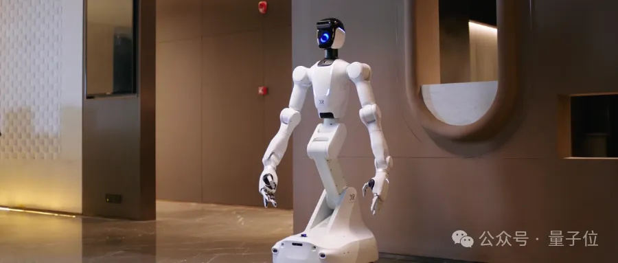
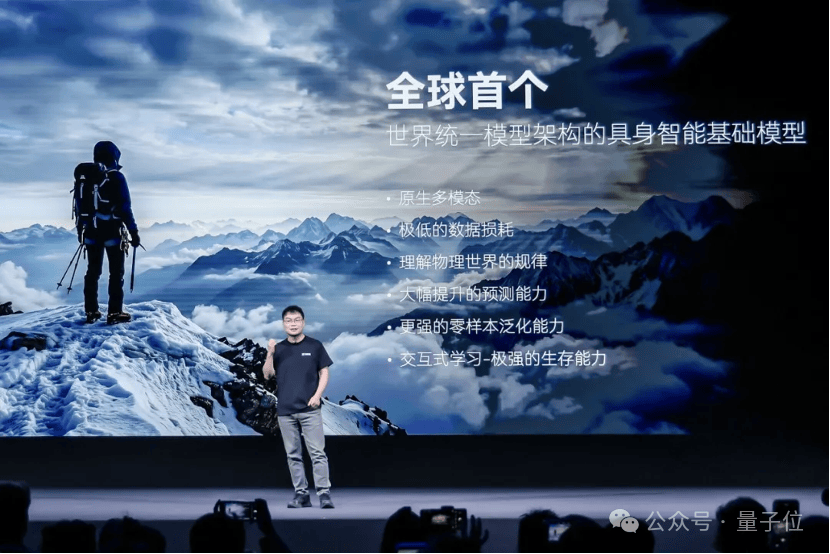
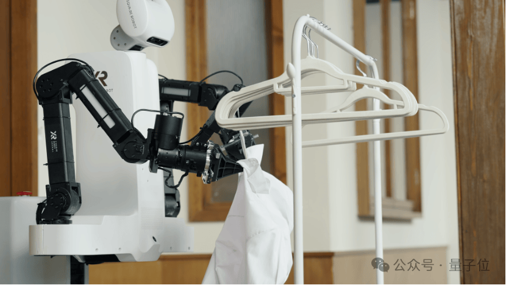
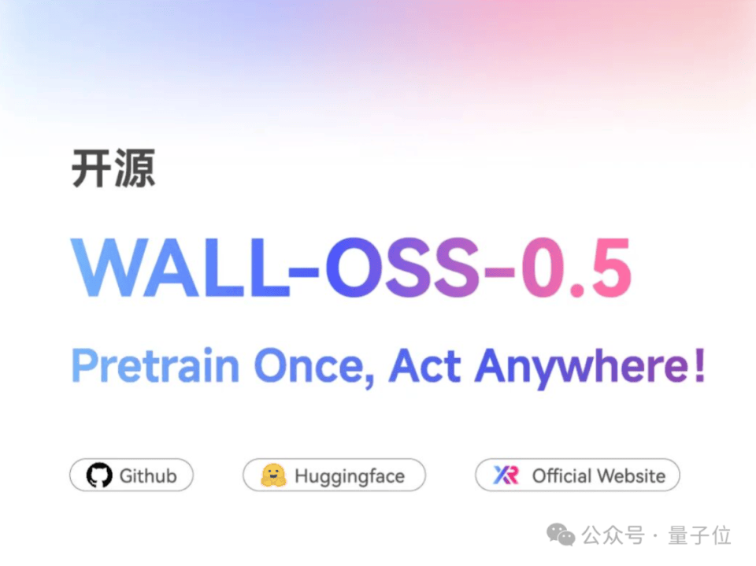
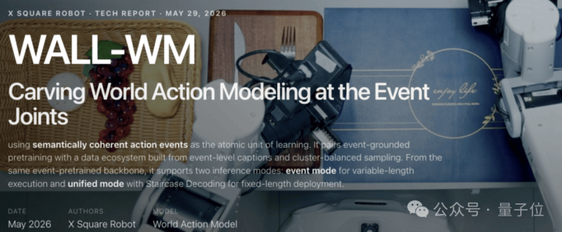
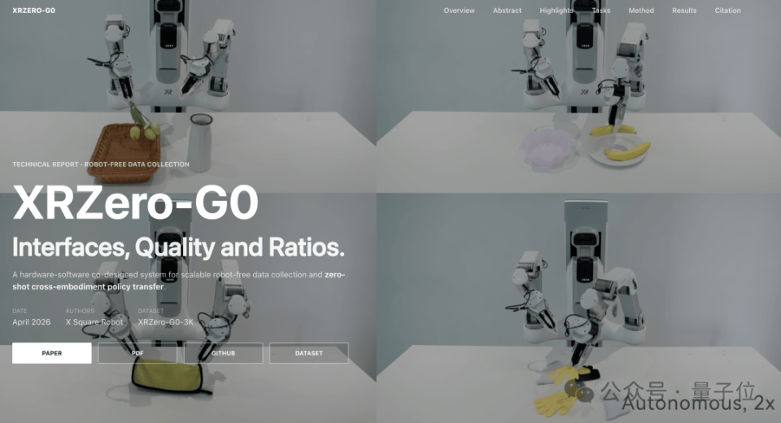
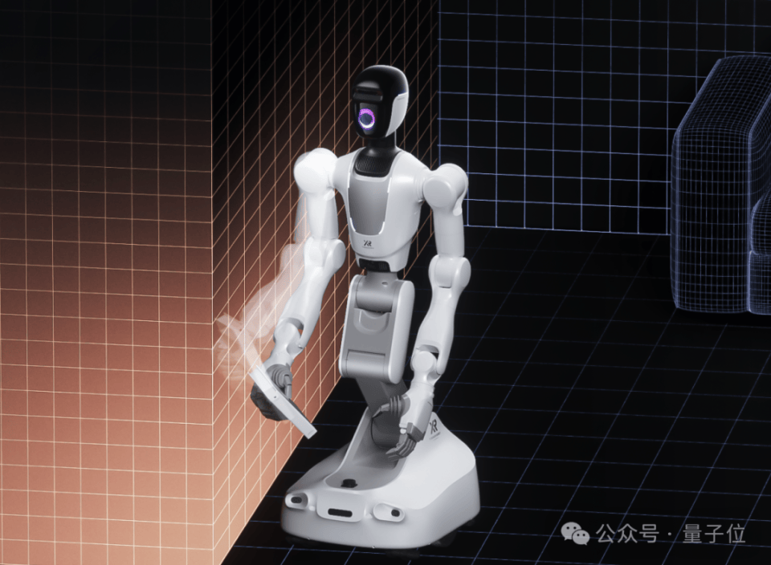
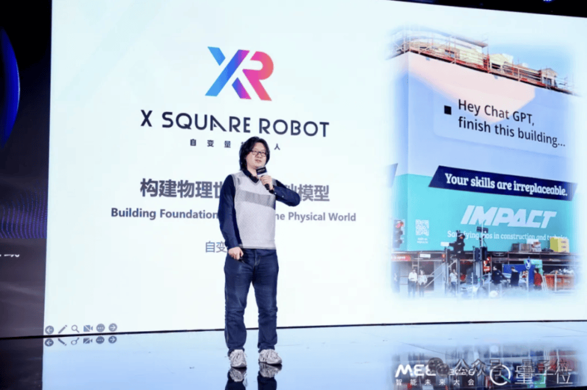

# 大湾区首个200亿具身大脑来了！自变量两个月连融四轮，完成交割

> 原文：[大湾区首个200亿具身大脑来了！自变量两个月连融四轮，完成交割](https://www.qbitai.com/2026/07/441140.html) · qbitai · 2026-07-01
> 抓取：2026-07-02T09:12:25+08:00 · 翻译：无（中文原文） · 2829 字

## 核心要点

四大互联网分别领投。

> henry 发自 凹非寺
> 
> 量子位 | 公众号 QbitAI

**大湾区首个200亿具身大脑来了！**

刚刚，据可靠消息：**自变量**连续完成4轮融资，投后估值突破**200亿元**，并且完成资本交割、融资款全部到账。

这使得自变量，成为大湾区首家、也是唯一一家，估值超过200亿元的具身大脑公司。

自4月下旬发布会上宣布完成由小米战投领投的B轮融资后，仅仅两个多月，自变量又连续完成B+、B++和C轮融资。

客观来说，在具身智能赛道，宣布融资早已不算新闻；真正少见的是，内部人士称，钱这么快、这么确定地全部到账。

两个多月、四轮融资、全部交割，即便放在如今融资最活跃的具身行业，也称得上罕见。

更夸张的是投资方阵容。

已确认的投资机构超过30家，横跨互联网巨头、产业资本、国家队和顶级VC四大阵营。

中国移动、中保投资、红杉中国、IDG资本、源码资本、达晨财智、中金资本悉数在列，小米战投更是连续三轮加注。

30多家机构、上百亿元资本，集体押注、看好的其实都是同一个方向——

**具身大脑**。

## 四大互联网巨头，集体满贯

如果说自变量这波融资最值得关注的信号，那一定是互联网巨头们的集体看好。

在国内具身智能公司里，自变量是目前已知、唯一一家被四大互联网厂商分别领投、并持续加注的企业。

美团领投A轮，阿里领投A+轮，字节跳动领投A++轮，小米战投领投B轮，凑齐"大满贯"。

其中，小米战投更是连续参与B、B+、B++三轮融资，加注几乎没有停过。

产业资本方面，各方也在持续加注。

最近四轮融资中，58集团、沈阳汽车（沈阳汽车产业投资基金）、奇瑞集团（国海创新资本）、荣耀（深圳市人工智能终端基金）等产业方相继入场，覆盖家政服务、汽车制造、消费电子等多个领域。

这些产业资本投的不是概念，而是未来真正能走进自己业务场景的机器人。

58集团对应家政服务，奇瑞和沈阳汽车代表汽车制造，荣耀则代表消费电子。它们看中的，是具身智能能否真正落地，解决真实场景里的问题。

目前，自变量已经进入58到家的家政服务场景，以及某德国豪华汽车品牌的零部件产线，开始从实验室走向家庭服务和工业生产。

与此同时，国家队也在持续加码。

除了国投创新、中保投资、江苏高投、深投控资本、宝安区引导基金等新股东之外，国开科创、国科投资等老股东也再次跟投，中国移动更是连续两轮加注。

背后释放的信号并不难理解。

随着具身智能被写入"十五五"规划未来产业核心赛道，国资、地方基金和国央企的资金正加速向头部具身企业集中。

这些投资带来的不仅是资金，也意味着未来地方产业资源、供应链协同等方面的长期支持。

另一边，市场化VC也没有缺席。

红杉中国、IDG资本、达晨财智、中金资本、源码资本、毅达资本等头部机构纷纷押注。其中，红杉中国更是从去年9月A+轮一路跟投至今，几乎没有缺席过任何一轮。

算上更早期的融资，自变量成立两年半累计完成十余轮融资。

互联网巨头、产业资本、国家队、头部VC四类资本持续重仓同一家公司，这样的融资结构，在国内具身智能赛道几乎找不到第二家。

那么，这么多挑剔的资本，到底在押注什么？

## 集体押注大脑

押的，其实就是具身智能的"大脑"。

自变量创始人王潜很早就提出过一个判断：具身智能模型，并不是语言模型的延伸，而是与之平行的另一类基础模型。

原因也很简单。

机器人想真正进入现实世界，光会执行指令远远不够。它还要理解环境、预测变化，提前知道下一步可能发生什么。

过去一年，这几乎已经成为整个具身智能行业的共识，而承担这一能力的，正是世界模型（World Model）。

简单来说，世界模型就是一个专门预测"接下来会发生什么"的AI。

如果说大语言模型预测的是下一个词，那么世界模型预测的，就是下一帧画面，以及画面中的物理变化。对于机器人而言，它就像一颗能够提前"脑补"未来的大脑。

今年4月，自变量发布了全球首个基于**世界统一模型（World Unified Model，WUM）**架构的具身大模型——WALL-B。

与传统把感知、决策、动作拆成多个模块、再串联起来的方案不同，WALL-B把视觀、语言、动作和物理预测统一放进同一个网络，从零开始联合训练。

模块之间不再需要层层传递信息，模型能够直接学习不同能力之间的关联。

因此，WALL-B同时具备了原生多模态理解、物理世界预测，以及通过与环境交互持续学习这三项核心能力。

不过，比模型本身更受关注的，是自变量为它设定的目标。

发布会上，自变量宣布，希望让搭载WALL-B的机器人长期生活在真实家庭中。

相比实验室，一个普通家庭才是真正复杂的环境：物品摆放每天都在变化，家庭成员行为难以预测，几乎没有两天是完全一样的。

能不能在这样的环境里长期稳定工作，也成为外界检验WALL-B泛化能力最直接、也最严苛的一场考试。

## 具身大脑快速迭代

资本愿意一轮接一轮加注，也离不开自变量几乎没有停下来的技术迭代节奏。

仅是最近一个多月，自变量就连续发布了两款核心模型。

第一款是开源具身基础模型**WALL-OSS-0.5**。它只完成了预训练，没有针对具体任务做后训练，就跑出了接近不少同行成品模型的效果。

在17项真实机器人任务中，有4项自主完成率超过80%，在操作和推理任务上均超过了海外明星公司Physical Intelligence开源的Pi 0.5等主流模型。

另一款则是世界模型**WALL-WM**，也是全球首个具备**事件级预测（Event-level Prediction）**能力的世界模型。

过去，大多数世界模型都是按时间均匀采样，把视频切成一帧一帧来学习；WALL-WM则换了一个思路——

按事件来理解世界，把语言、视觉、动作等不同模态围绕同一件事进行对齐，让模型更容易学到它们之间真正的因果关系，从而更准确地预测物理世界接下来会发生什么。

模型之外，具身行业真正稀缺的，其实是数据。

为此，自变量专门搭建了自己的数据工厂，并自研了一整套数据生产管线，从采集、清洗、标注到质量控制，都实现了自动化和规模化。

基于自研数采设备XR Zero G0，其方案能够将具身训练数据的采集成本降低95%。

再往下，还有机器人本体。

量子一号、量子二号两代机器人，为模型提供了持续迭代和真实验证的平台。

至此，模型、数据、本体三块拼图，自变量都握在了自己手里，也形成了一个能够持续自我迭代的闭环。

## 两个早早押注独立模型的人

把时间拨回起点，自变量从一开始押的，就是一条和大多数公司不太一样的路线。

创始人兼CEO**王潜**，清华本硕，后在美国南加州大学读博，研究方向是Robotics Learning，也是较早把注意力机制引入神经网络体系的研究者之一。

联合创始人兼CTO**王昊**，则是北京大学计算物理博士，曾在IDEA研究院负责大模型团队，主导发布多个开源大模型。

"独立基础模型"这个判断，王潜从公司成立第一天起就没有动摇过。

所谓独立，并不是应用场景不同，而是它面对的是一个完全不同的问题——

真实物理世界里的连续状态、因果关系和动作反馈。因此，它的建模目标、训练方式和评估体系，都不能照搬服务于虚拟世界的语言模型。

基于这一判断，自变量始终坚持自研全端到端通用具身大模型，把模型、数据和机器人本体三件事一起做。

因为通用具身智能走到最后，拼的不只是模型，也不是本体，而是模型、数据和硬件能否形成持续迭代的闭环。任何一块短板，都可能成为最终的天花板。

这意味着，比起站在现成基础设施之上，自变量选择了一条更重、更慢，也更难走的路，从底层开始，把每一块积木都握在自己手里。

过去，具身智能赛道的资金更喜欢广撒网，押注各种机器人本体；如今，越来越多资本开始把筹码集中投向"大脑"。

30多家机构挤进同一家公司，赌的已经不是又一台机器人，而是它脑子里的那套世界模型，能不能真正走进工厂，也走进千家万户。

这个答案，还需要时间验证。

但愿意提前为它下注的资本，已经把答案写到了——

**200亿元。**

> 📷 **图 13**：它石1.png（原文件编码错误，下载失败）
> 原图链接：https://i.qbitai.com/wp-content/uploads/2026/03/它石1.png