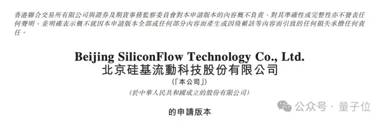
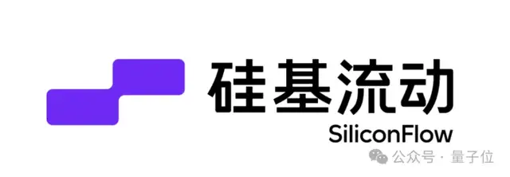
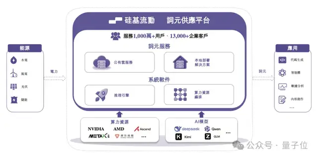

# 卖Token也不是稳赚不赔！硅基流动招股书来了

> 原文：[卖Token也不是稳赚不赔！硅基流动招股书来了](https://www.qbitai.com/2026/07/441127.html) · qbitai · 2026-07-01
> 抓取：2026-07-02T09:12:26+08:00 · 翻译：无（中文原文） · 4280 字

## 招股书：AI推理时代的Token工厂

鱼羊 发自 凹非寺

量子位 | 公众号 QbitAI

大模型公司在港股热度正酣，现在，卖Token的公司也开始冲刺了。

硅基流动已向港交所提交上市申请，剑指港股「AI Token工厂第一股」。

此前，硅基流动已完成7轮融资，估值77.4亿元。阿里、美团、商汤、蔚来、智谱等产业方和明星AI投资机构均有押注。

## 招股书：AI推理时代的Token工厂

简单回顾一下硅基流动的来时路：

班底就是张钹院士高徒袁进辉创办AI Infra公司OneFlow时的原班人马。OneFlow在2023年被王慧文光年之外收购，此后因王慧文病休之故并入美团。而袁进辉本人则选择了再次创业，携团队创立硅基流动。

从招股书来看，硅基流动的叙事核心很明确，不是「模型公司」，而是AI推理时代的「Token工厂」。

就是说，不做模型，也不做应用，重点是要把异构算力、多模型和企业调用需求，封装成可稳定交付、可计量、可收费的Token供应服务。

招股书披露，截至2026年4月30日，硅基流动平台注册用户达**1028.24万**；2026年4月日均词元吞吐量**5785亿**，平台累计支持超过170个模型，服务超过13000家企业客户。

根据沙利文资料，按2025年词元年吞吐量计，硅基流动是中国第四大词元供应平台，市场份额1.5%；在中国所有独立生态词元供应平台中排名第一。

重点来看财务数据。

## 商业增长快，亏损也扩大了

2025年，硅基流动收入为5533.0万元，相比2024年的734.6万元，**同比增长653.2%**。

2025年录得年内亏损3.45亿元，是2024年8191.5万元的**4.2倍**。经调整净亏损为1.87亿元，经营现金流出1.72亿元，月均现金消耗率1480万元。

从毛利率来看，2024年，硅基流动的毛利率是39.4%，2025年则转负为**-24.0%**，其中公有云服务毛利率为**-119.0%**。

背后业务模式的变化是，在硅基流动公有云+本地部署的业务构成中，公有云开始反超本地部署成为收入占比最高的业务。

2025年，硅基流动公有云服务收入2926.1万元，**占总收入52.9%**；本地部署解决方案收入2606.9万元，占47.1%。

与此同时，硅基流动注册用户从2024年底的12.7万，增至2026年4月底的1028万。

用户规模和Token吞吐量的放大，也直接推高了后端算力消耗：销售成本从2024年的445.2万元增长到2025年的6863.2万元。招股书解释，成本的增长主要来自公有云服务扩张导致的算力资源成本增加，以及技术服务费、员工福利开支增加。

也就是说，公有云业务带来了更多的收入和更大的业务规模，但现阶段成本压力也很明显。

## Token生意，等待市场验收

如此看来，Token工厂的模式，硅基流动已经跑了起来。

并且随着招股书的提交，硅基流动想要讲给市场的故事更加明晰：

**AI应用越多，Agent越复杂，Token消耗越大；Token消耗越大，谁能稳定、便宜、大规模供应Token，谁就站在新的基础设施层。**

接下来，需要被继续验证的就是实际的盈利能力了。

而从此前硅基流动的投资方来看，有意思的是，其阵容本身就像是一张围绕「Token生产」展开的产业链地图。

7轮融资，投资方阵容大致分成几类：

- 平台型和应用型产业方，包括阿里、美团、携程、金蝶、软通、万兴等；
- 算力和基础设施生态方，包括华为旗下哈勃科技、壁仞、云天励飞、联通、360等；
- AI模型和AI公司：智谱、商汤；
- 专业投资机构：创新工场、耀途、普华、纪源、华控等；
- 多地国资和产业基金。

随着硅基流动的IPO进程，这么一个Token生意到底能跑成什么样，正在迎来更公开的检验。

招股书：  
https://www1.hkexnews.hk/app/sehk/2026/108701/documents/sehk26063002927_c.pdf
