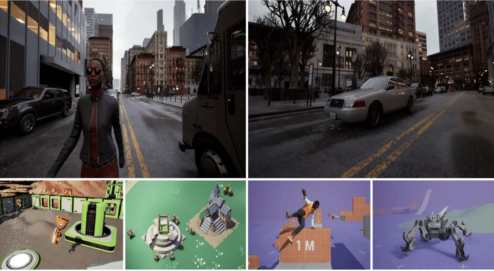

# 群核科技三项成果入选ECCV 2026，联手英伟达等探索物理AI仿真平台

> 原文：[群核科技三项成果入选ECCV 2026，联手英伟达等探索物理AI仿真平台](https://www.qbitai.com/2026/07/441237.html) · qbitai · 2026-07-01
> 抓取：2026-07-02T09:11:28+08:00 · 翻译：无（中文原文） · 1909 字

共同推进物理AI前沿技术探索。

欧洲计算机视觉顶级会议ECCV 2026正式公布论文录用结果。群核科技共有三篇论文入选，涵盖空间感知与推理、强化学习数据生成、高保真物理仿真等物理AI关键领域。ECCV与CVPR、ICCV并称计算机视觉领域三大国际顶级会议，聚焦空间感知、具身智能、物理仿真等领域学术成果。

当前，随着人工智能从数字世界走向物理世界，行业关注点正在从"大模型能否理解语言"转向"智能体能否理解空间并在真实世界中行动"。空间理解、仿真训练和持续学习能力，正成为物理AI发展的核心基础设施。群核科技此次入选ECCV的三篇论文，恰好对应物理AI从感知、学习到行动训练的关键环节，系统性展示其在物理 AI「数据 — 仿真 — 测评」的全链路成果。

## 群核科技与英伟达、Adobe等探索下一代物理AI仿真平台

"如果说大模型时代最重要的基础设施是算力，那么物理AI时代最重要的基础设施正在变成仿真与数据。机器人无法像语言模型一样从互联网学习，而是需要在符合真实物理规律的环境中不断感知、试错和交互。因此，高保真仿真平台已经成为物理 AI 不可或缺的数据生产与训练支撑体系。"群核科技首席科学家唐睿提到。

针对现有仿真工具可编程性不足、数据传输效率低、缺少大规模结构化场景资产等问题，群核科技联合Adobe、NVIDIA、Apple、Intel等机构提出SPEAR，探索下一代面向物理AI的高保真仿真平台。

SPEAR融合了NVIDIA在机器人训练生态的积累，群核科技的空间数据和结构化场景能力，Apple、Adobe的内容资产领域等优势，打通了"空间数据—数字世界—机器人训练"的关键链路。相比同类仿真器，SPEAR开放超过14000个原生Python接口，实现高度可编程控制；同时可同步输出深度图、表面法线、实例分割、语义分割、材质ID等丰富物理属性数据，为机器人提供更完整的环境感知能力。更重要的是，SPEAR可无缝接入群核科技开源的InteriorAgent、InteriorGS等结构化三维数据集，资产天然具备尺寸、碰撞体、关节等SimReady标准化物理属性，实现从真实空间到训练环境的快速转换。

图源：SPEAR论文

这意味着SPEAR不仅是一套仿真工具，更是一套面向物理AI的数据生产基础设施，让物理世界能够被数字化、被模拟、被训练，并持续转化为机器人学习和进化所需的数据资产。

## 打造"数据 — 仿真 — 测评"全链路数据飞轮

物理AI的规模化落地，面临一个根本性的供给瓶颈：三维空间数据的规模化供给能力，远落后于模型训练需求的增长速度。

群核科技另一篇论文提出的Syn-GRPO提出面向强化学习的数据自进化框架，能在训练过程中自动生成全新训练图片，从根源解决训练数据匮乏、模型收敛死板的问题。这套框架分两大模块协同工作：一边是多样化图像生成，保留画面里目标物体不变，只更换背景生成全新样本，保证标注信息完全准确；另一边改造原生 GRPO 强化学习流程，新增多样性奖励机制，引导 AI 写出能催生多元答案的画面描述，不断产出难度越来越高的训练素材。

不过，数据价值要想被充分验证和利用，还需要有与之配套的评测基准。

群核科技本次还提出了全球首个基于真实街景的交互式空间智能评测基准WalkerBench。WalkerBench是面向"空间感知"环节的核心评测工具，覆盖世界六大洲 161 座城市的真实街景，没有地图、没有GPS，只给AI第一视角 RGB 画面，纯靠视觉自主认路。评测结果显示，当前最强AI模型只有完成率只有24.5%，而AI走的步数越多，性能下降越明显，这说明一个本质矛盾：现有大模型的"线性文本记忆方式"，无法真正表达三维空间结构。

为此，研究团队提出Spatial-IDE框架，给AI单独开辟全局空间记忆模块，解决线性上下文和三维空间不匹配的底层缺陷。目前这套框架直接在宇树G1人形机器人上完成了零样本部署，实现真实城市街道的公里级自主导航——从评测基准到物理世界，迁移直接成立。

## 一个正在成形的物理AI数据基础设施

当AI开始走出屏幕，进入现实世界，新的基础设施正在被重新定义。物理AI的竞争正从算法层，转向基础设施层，而三维数据供给断层已然成为行业掣肘。

基于多年沉淀的海量结构化三维数据和自研空间智能大模型，群核科技于2024年正式推出空间智能训练平台SpatialVerse。平台通过3DGS实景重建、AI 三维生成双技术路线为核心，依托高保真渲染、空间数据结构化处理与实时仿真推演等能力，可规模化、高效率、高质量地将物理世界数字化为可训练的数据，从而系统性应对物理AI所面临的数据稀缺、试错成本高昂等行业痛点。

从本次 ECCV 三大成果可以看到，在持续建设"仿真数据生产线"的基础上，SpatialVerse当前正加速打通"数据-仿真-评测"的产业全链路，致力于为物理AI的规模化落地打造"全流程模拟训练场"。

在产业端，SpatialVerse已与字节跳动、智元机器人、银河通用、禾赛科技、穹彻智能、智平方、松应科技等头部企业达成深度合作；在学术层面，SpatialVerse携手谷歌、英伟达、Adobe、Apple等全球科技企业，共同推进物理AI前沿技术探索。

面向物理AI时代，群核科技立足海量三维可交互数据和物理世界数字化的底层能力，以结构化三维数据集和真实世界驱动的世界模型为核心，为物理AI应用提供可训练、可交互、可测评的底层空间智能基础设施，驱动物理 AI 从虚拟算法快速落地真实场景落地。

*本文由群核科技提供，量子位获授权转载，观点归原作者所有。
